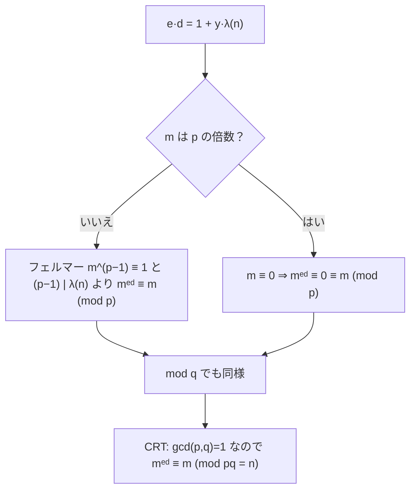

# 03. RSA 正しさの証明

> 親: [README](./README.md) ｜ 前: [02 暗号化・復号](./02_encryption-decryption.md) ｜ 次: [04 パディングと攻撃](./04_padding-and-attacks.md) ｜ 層: 基礎(Layer 1)

**この1ページで分かること**

- `mᵉᵈ ≡ m (mod n)` の完全な証明（フェルマー小定理＋CRT。`m` が `p` の倍数の場合も含む）
- 秘密指数 `d` が必ず存在する理由（ベズーの等式）
- 「正しく動く」証明と「安全である」ことは別問題という区別

「暗号化して復号すると必ず元に戻る」は当たり前ではなく、証明が要る。道具は 3 つ: ベズーの等式（gcd を整数の一次結合で書ける）・フェルマーの小定理（`m^(p−1) ≡ 1`）・中国剰余定理 CRT（法 `p` と `q` で成り立てば法 `pq` でも成り立つ）。

---

## まず最小の例で確かめる

`n=55=5·11, e=3, d=7`（`ed=21`）で、`m=5`（`p=5` の倍数）を選ぶと 2 つの場合が両方見える。

```
mod 5 :  5 ≡ 0 なので 5²¹ ≡ 0 ≡ 5          ← m が p の倍数のとき
mod 11:  gcd(5,11)=1。フェルマー: 5¹⁰ ≡ 1
         5²¹ = 5²⁰·5 = (5¹⁰)²·5 ≡ 1·5 = 5   ← m が q の倍数でないとき
CRT   :  mod 5 と mod 11 の両方で 5 に戻る → mod 55 でも 5²¹ ≡ 5 ✓
```

証明はこの計算を一般の `p, q, e, d` で書き直すだけ。

---

## 何を証明するか

```
n = p·q（p, q は異なる素数）,   e·d ≡ 1 (mod λ(n)),   λ(n) = lcm(p−1, q−1)
主張: 任意の 0 ≤ m < n に対して  mᵉᵈ ≡ m (mod n)
```

これが成り立てば `Dec(sk, Enc(pk, m)) = (mᵉ)ᵈ mod n = m` が保証される。

---

## Step 1: d は存在するか

鍵生成では `gcd(e, (p−1)(q−1)) = 1` を満たす `e` を選ぶ。`λ(n) | (p−1)(q−1)` なので、もし `gcd(e, λ(n)) > 1` なら共通素因数 `r` が `(p−1)(q−1)` も割り、前提に矛盾。ゆえに **gcd(e, λ(n)) = 1**。

ベズーの等式（拡張ユークリッド、[`05_extended-euclidean.md`](../../../01_prerequisites/01_math-for-crypto/01_modular-arithmetic/05_extended-euclidean.md)）より `e·x + λ(n)·y = 1` を満たす整数 `x, y` がある。`x` が負なら `λ(n)` を足し続ければよい（`e·(x+λk) + λ·(y−ek) = 1` は保たれる）。よって**正の `d` が必ず得られる**。∎

---

## Step 2: mᵉᵈ ≡ m (mod n)

`e·d ≡ 1 (mod λ(n))` より `e·d = 1 + y·λ(n)` とおける。



CRT（[`07_crt-intro.md`](../../../01_prerequisites/01_math-for-crypto/01_modular-arithmetic/07_crt-intro.md)、証明は [`04_crt.md`](../../../01_prerequisites/01_math-for-crypto/03_number-theory/04_crt.md)）により `mod p` と `mod q` を別々に示せばよい。

| 場合 | 論拠 | 結果（mod p） |
|---|---|---|
| `p ∤ m` | フェルマーの小定理（[`02_fermat-little-theorem.md`](../../../01_prerequisites/01_math-for-crypto/03_number-theory/02_fermat-little-theorem.md)）`m^(p−1) ≡ 1`、かつ `(p−1) | λ(n)` | `mᵉᵈ = m·(m^λ(n))^y ≡ m·1 = m` |
| `p | m` | `m ≡ 0` | `mᵉᵈ ≡ 0 ≡ m` |

`mod q` も同じ。両方成り立つので CRT より **mᵉᵈ ≡ m (mod n)**。∎

---

## 演習（解答つき）

1. `n=55=5×11`, `e=3`, `d=7` で `m=5` のとき、`m^ed mod 5` と `m^ed mod 11` をそれぞれ場合分けの議論で説明せよ。
2. なぜ `λ(n)` の代わりに `φ(n)=(p−1)(q−1)` を使っても証明が成り立つのか一言で述べよ。

<details><summary>解答</summary>

1. `m=5` は `p=5` の倍数なので mod 5 では Case 2: `5^ed ≡ 0 ≡ 5`。`gcd(5,11)=1` なので mod 11 では Case 1: `5^10 ≡ 1`、`λ(n)=20` は 10 の倍数なので `5^ed ≡ 5`。CRT で `5^ed ≡ 5 (mod 55)`。
2. 証明で使う唯一の性質は「`(p−1)` が法を割り切ること」。`φ(n)=(p−1)(q−1)` も `p−1` の倍数なので同じ議論が通る。

</details>

---

## 暗号の堅牢さとの関係

この証明は「正しく動く」ことだけを示す。**安全性**は「`n` の素因数分解が困難」という未証明の仮定に依存する（[`05_hard-problems.md`](../../../01_prerequisites/01_math-for-crypto/03_number-theory/05_hard-problems.md)）。量子計算機の Shor アルゴリズムは多項式時間で分解するため、RSA は将来危殆化する → 耐量子暗号（[`../../06_advanced-topics-map.md`](../../06_advanced-topics-map.md)）。

さらに、示したのは「教科書 RSA」（パディングなしの `mᵉ mod n`）の正しさだけ。そのままでは決定論的・展性（暗号文をいじって復号結果を操作できる性質）があり脆弱 → [04](./04_padding-and-attacks.md)。

---

## 次への接続

数学的に正しく動くことは分かった。しかし「教科書 RSA」をそのまま使うと複数の実用上の脆弱性がある。
→ [04 パディングと攻撃](./04_padding-and-attacks.md)
