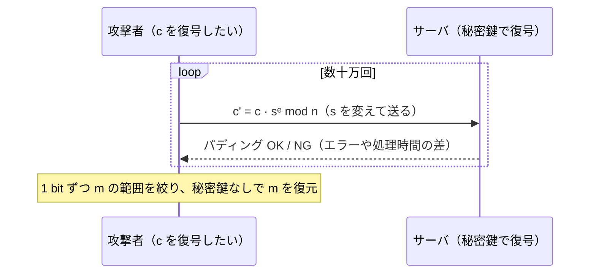

# 04. 教科書 RSA の脆弱性とパディング

> 親: [README](./README.md) ｜ 前: [03 正しさ証明](./03_correctness-proof.md) ｜ 層: 基礎(Layer 1)

**この1ページで分かること**

- 教科書 RSA の 4 つの弱点（決定論性・展性・ブロードキャスト攻撃・パディングオラクル）
- 「パディングが正しいか」という 1 ビットの漏洩だけで暗号文全体が復号される攻撃の構図
- 暗号化には OAEP・署名には PSS というランダム化パディングが必須である理由

数学的に正しく動く暗号でも、そのまま使うと破れる。パディング（平文に乱数などを詰めて整形する前処理）なしの **教科書 RSA** は、暗号文を「いじれる」「比べられる」ことが致命傷になる。

---

## まず最小の例：暗号文を 3 倍にする

[01](./01_key-generation.md) の鍵 `n=55, e=3, d=7`、[02](./02_encryption-decryption.md) の `m=2 → c=8` を使う。

```
攻撃者は c=8 の中身 m を知らない。それでも s=3 を選び
   c' = c · sᵉ mod n = 8 · 27 mod 55 = 216 mod 55 = 51   を Bob に送る
Bob が復号:  51⁷ mod 55 = 6 = 2·3 = m·s    ← 中身を知らないまま 3 倍にされた
```

金額なら勝手に書き換えられる。これが**展性（malleability）**。なぜ成立するかは下の弱点 2。

---

## 4 つの弱点

### 弱点 1: 決定論的（同じ平文 → 同じ暗号文）

`c = mᵉ mod n` は乱数を使わない。平文の候補が少ないとき（"はい"/"いいえ"、給与額）、攻撃者は候補を全部暗号化して `c` と比べるだけで特定できる。意味論的安全性（IND-CPA＝暗号文から平文の 1 bit も学べないこと）を満たさない。

### 弱点 2: 展性 — 準同型性の悪用

準同型（暗号文同士の演算が平文の演算に対応する性質）が乗法について成り立つ。

```
Enc(m₁) · Enc(m₂) = m₁ᵉ · m₂ᵉ = (m₁·m₂)ᵉ = Enc(m₁·m₂)   (mod n)
```

だから `c' = c · sᵉ` で復号結果を `s` 倍にできる（上の例）。

### 弱点 3: Håstad のブロードキャスト攻撃（小さい e）

同じ平文 `m` を同じ小さい `e=3` で、異なる法 `n₁, n₂, n₃` の 3 人にパディングなしで送るケース。

```
c₁ = m³ mod n₁,  c₂ = m³ mod n₂,  c₃ = m³ mod n₃
n₁, n₂, n₃ は互いに素 → CRT で m³ mod (n₁n₂n₃) を合成
m < min(nᵢ) なら m³ < n₁n₂n₃ なので、合成値は整数 m³ そのもの → 実数で 3 乗根を取れば m
```

RSA-CRT（[`04_crt.md`](../../../01_prerequisites/01_math-for-crypto/03_number-theory/04_crt.md)）が復号を速くした同じ CRT が、ここでは攻撃の道具になる。

### 弱点 4: Bleichenbacher のパディングオラクル（PKCS#1 v1.5）

1998 年、標準パディング **PKCS#1 v1.5** への適応的選択暗号文攻撃（サーバの応答を見ながら暗号文を選び直す攻撃）。通称 "million message attack"。



同種の欠陥は **ROBOT**（2018）、**Marvin Attack**（2023）として再発見され続けている。実装で塞ぎ切るのが難しい典型例。

---

## 解決策: ランダム化パディング

| 用途 | 方式 | 標準 | 効果 |
|---|---|---|---|
| 暗号化 | **OAEP**（Bellare–Rogaway 1994） | PKCS#1 v2.0（1998）〜 v2.2 = RFC 8017（2016） | 乱数とハッシュで撹拌。同じ `m` でも毎回違う `c` → 弱点 1〜3 を同時に防ぐ |
| 署名 | **PSS** | PKCS#1 v2.1 以降 `RSASSA-PSS` | 署名は「本人しか作れない値」が目的で暗号化と違うため専用方式が要る |

新規実装で v1.5 を使ってはいけない。後方互換のためだけに残っている。

| 弱点 | 原因 | 対策 |
|---|---|---|
| 決定論的 | 乱数を使わない | OAEP |
| 展性 | 乗法準同型 | OAEP |
| ブロードキャスト攻撃 | 小さい `e` + 同一平文 + CRT | OAEP |
| パディングオラクル | v1.5 の検証結果が漏れる | OAEP・定数時間実装 |
| 署名偽造 | 暗号化用パディングの誤用 | PSS |

---

## 演習（解答つき）

1. `Enc(m₁)·Enc(m₂) ≡ Enc(m₁·m₂) (mod n)` となる理由を、べき乗の指数法則で一行で示せ。
2. Håstad のブロードキャスト攻撃で `k ≥ e` が条件になる理由を一言で述べよ。
3. OAEP がなぜ「決定論的」「展性」「ブロードキャスト攻撃」の 3 つ全てを同時に防げるのか。

<details><summary>解答</summary>

1. `m₁ᵉ · m₂ᵉ = (m₁·m₂)ᵉ (mod n)`（指数法則 `aᵉbᵉ=(ab)ᵉ` は mod n でも成立）。
2. CRT で `mᵉ` を整数として復元するには `mᵉ < n₁⋯n_k` が必要。`nᵢ ≈ m` 程度なら `n₁⋯n_k ≈ m^k ≥ m^e` に `k ≥ e` が要る。
3. 毎回新しい乱数を混ぜるので同じ `m` でも `c` が変わる（決定論性を解消）。乱数とハッシュの非線形な混ぜ込みで `c` を操作しても `m` を予測可能に変えられない（展性を解消）。受信者ごとに乱数が違うので CRT で合成しても意味のある式にならない（ブロードキャスト攻撃を無効化）。

</details>

---

## 次への接続

RSA（鍵生成・暗号化復号・正しさ証明・安全な運用）が一通り揃った。次は全く異なる仕組みで鍵を共有する Diffie–Hellman。
→ [`../02_dh.md`](../02_dh.md)

---

## 参考

- Bleichenbacher, D. (1998). *Chosen Ciphertext Attacks Against Protocols Based on the RSA Encryption Standard PKCS #1*. CRYPTO 1998.
- Bellare, M., Rogaway, P. (1994). *Optimal Asymmetric Encryption: How to Encrypt with RSA*. EUROCRYPT 1994.
- RFC 8017 — PKCS #1: RSA Cryptography Specifications Version 2.2 (2016): https://www.rfc-editor.org/rfc/rfc8017.html
- Håstad, J. (1988). *Solving Simultaneous Modular Equations of Low Degree*.
- 講義ノート: [`../../../../courses/coursera-crypto1/12_public-key-encryption/04_pkcs1-and-oaep.md`](../../../../courses/coursera-crypto1/12_public-key-encryption/04_pkcs1-and-oaep.md)（Bleichenbacher の baby 版と OAEP の構造）
