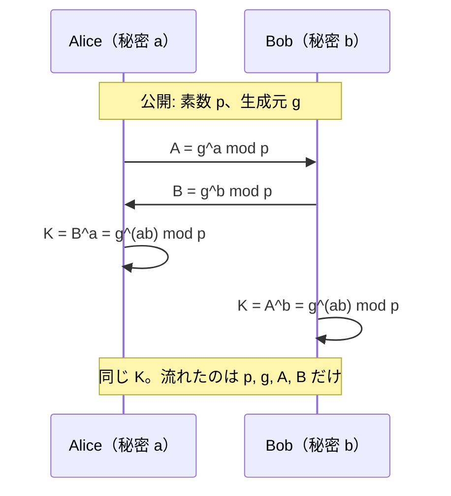

# 02. Diffie–Hellman 鍵共有

> 前: [01 RSA](./01_rsa/README.md) ｜ 次: [03 楕円曲線暗号](./03_ecc.md) ｜ 層: 基礎(Layer 1)
> 親: [README](./README.md)

**この1ページで分かること**

- 盗聴されている通信路の上で共有鍵を作る DH の仕組みと、指数法則だけで鍵が一致する理由
- DH 単体では中間者攻撃を防げないこと、DHE が持つ前方秘匿性と TLS 1.3 が RSA 鍵輸送を廃止した理由
- 安全性の根拠（CDH/DDH）と実装事故（Logjam）、楕円曲線への一般化

DH は「盗聴者の目の前で、2 人が同じ秘密の数を作る」手順。1976 年、Diffie と Hellman が発表した世界初の公開鍵暗号アイデアで、RSA と違ってメッセージは運ばず**鍵だけを合意**する。

---

## まず最小の例（p=23, g=5）

```
公開: p=23, g=5             ← 盗聴者も知っている
Alice: 秘密 a=6 → A = 5⁶ mod 23 = 8    を送る
Bob:   秘密 b=15 → B = 5¹⁵ mod 23 = 19  を送る

Alice: K = B^a = 19⁶ mod 23     19≡−4, 19²≡16, 19³≡5, 19⁶≡5²=25≡2  → K=2
Bob:   K = A^b = 8¹⁵ mod 23     （2乗繰り返し法）                      → K=2  ✓
```

盗聴者は `23, 5, 8, 19` を見ているが、`a=6` や `b=15` を求めるには**離散対数**（`g^x ≡ A` の `x` を求める問題）を解く必要がある。この例は小さいので総当たりで解けるが、実用は `p` が 2048 bit 以上。

---

## プロトコル（一般形）



生成元 `g`（べき乗 `g, g², g³, …` が群全体を巡る元）と素数 `p` は事前に合意し公開する。

**なぜ一致するか**: 指数法則 `(g^b)^a = g^(ab) = (g^a)^b` が `mod p` でも成り立つ。掛け算の順序を入れ替えられる、それだけ。

---

## 安全性の根拠：CDH と DDH

離散対数問題（DLP、[`05_hard-problems.md`](../../01_prerequisites/01_math-for-crypto/03_number-theory/05_hard-problems.md)）の困難性を前提に、2 つの仮定がある。

| 仮定 | 内容 | 強さ |
|---|---|---|
| **CDH**（計算量的 DH） | `(g, g^a, g^b)` から `g^(ab)` を計算できない | DH の鍵共有はこれで守られる |
| **DDH**（決定的 DH） | `(g, g^a, g^b, g^(ab))` と `(g, g^a, g^b, g^z)`（z は乱数）を**区別**できない | より強い。ElGamal 等の証明に使う |

DDH が破れれば CDH も破れるが、逆は必ずしも成り立たない。

---

## 弱点：認証がない（中間者攻撃）

DH は盗聴者（受動的攻撃者）には強いが、改ざんできる攻撃者（能動的攻撃者）には無力。`A, B` が本当に相手のものかを確認する手段がない。

```
Alice ──A──→ [Mallory が横取り] ──A'──→ Bob
Alice ←──B'── [Mallory]         ←──B── Bob
```

Mallory は Alice と `K1`、Bob と `K2` を別々に確立し、全通信を中継しながら盗聴・改ざんできる。

**対策**: `A, B` にデジタル署名を付け、相手の公開鍵証明書で検証する。TLS の `DHE-RSA` / `ECDHE-RSA` は DH の値をサーバの秘密鍵で署名してこの弱点を補う（[`01_goals-and-primitives.md`](../01_goals-and-primitives.md) の「認証」）。

---

## 前方秘匿性と RSA 鍵輸送の対比

| 方式 | 仕組み | 長期鍵が将来漏れたら |
|---|---|---|
| RSA 鍵輸送 | 共通鍵 K を Bob の公開鍵で暗号化して送る | 過去の全通信が遡って復号される |
| DHE（使い捨て DH） | セッションごとに一時的な `a, b` で DH を実行し廃棄 | 過去のセッション鍵は再現できない＝**前方秘匿性** |

この利点のため TLS 1.3 は RSA 鍵輸送を廃止し、**DHE / ECDHE のみ**を残した。

---

## 実装事故：Logjam（2015、CVE-2015-4000）

多くのサーバが**共通の小さい `p`**（512 bit の輸出グレード）を使い回していた。攻撃者は特定の `p` に対する事前計算（数千コア×1 週間）を 1 回行えば、以降その `p` を使うどの接続の離散対数も数分で解けた。中間者が TLS を `DHE_EXPORT` にダウングレードさせて悪用。

**教訓**: `p` は 2048 bit 以上、かつ使い回さない（または広く検証された標準パラメータを使う）。

---

## 群の一般化：楕円曲線へ

DH は `Z_p^*` に限らず、**離散対数が定義できる巡回群なら何でも使える**。楕円曲線上の点の群を使う ECDH は、同じ安全性をずっと短い鍵長で達成する（ECDLP は DLP より難しい）。
→ [03 楕円曲線暗号](./03_ecc.md)

---

## 演習（解答つき）

1. `p=23, g=5` で Alice が `a=3`、Bob が `b=7` を選んだとき、`A, B` と共有鍵 `K` を求めよ。
2. なぜ DH は「暗号化方式」ではなく「鍵共有プロトコル」と呼ばれるのか、RSA と対比して一言で述べよ。
3. DHE（毎回使い捨て）と静的 DH（固定の `a, b` を使い回す）で、前方秘匿性がある方はどちらか。

<details><summary>解答</summary>

1. `A = 5³ mod 23 = 125 mod 23 = 10`。`B = 5⁷ = 5⁶·5 = 8·5 = 40 ≡ 17`。`K = B^a = 17³`: `17≡−6`, `17²≡36≡13`, `17³≡17·13=221≡14` → **K=14**。検算 `K = A^b = 10⁷`: `10²≡8`, `10⁴≡64≡18`, `10⁷=18·8·10=1440≡14` ✓。
2. RSA はメッセージそのものを暗号化・復号する。DH はメッセージを運ばず、両者が独立に同じ値を**計算して合意する**だけで暗号化操作を含まない。
3. **DHE**。静的 DH は `a, b` が固定なので、一方が漏れれば前後すべてのセッション鍵が再計算できる。

</details>

---

## 次への接続

DH の群を `Z_p^*` から楕円曲線上の点の群に置き換えると、同じ安全性をずっと短い鍵長で達成できる。
→ [03 楕円曲線暗号](./03_ecc.md)

---

## 参考

- Diffie, W., Hellman, M. (1976). *New Directions in Cryptography*. IEEE Transactions on Information Theory.
- Adrian, D. et al. (2015). *Imperfect Forward Secrecy: How Diffie-Hellman Fails in Practice*（Logjam）: https://weakdh.org/imperfect-forward-secrecy-ccs15.pdf
- 講義ノート: [`../../../courses/coursera-crypto1/10_basic-key-exchange/03_diffie-hellman.md`](../../../courses/coursera-crypto1/10_basic-key-exchange/03_diffie-hellman.md)（鍵長の表・非対話性・4 人以上の未解決問題）
