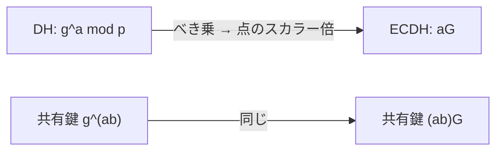

# 03. 楕円曲線暗号（ECC）

> 前: [02 Diffie–Hellman](./02_dh.md) ｜ 次: [04 デジタル署名](./04_digital-signatures.md) ｜ 層: 基礎(Layer 1)
> 親: [README](./README.md)

**この1ページで分かること**

- 楕円曲線上の点の「加算」がどう定義され、それが暗号に使える群になる仕組み
- ECDH ＝ DH の `g^a` を `aG` に置き換えるだけ、という載せ替えの実際（玩具曲線で計算）
- 同じ安全性に必要な鍵長の RSA/DH との比較と、実用曲線（P-256 / Curve25519）の信頼性の論点

楕円曲線暗号は「数の掛け算」の代わりに「曲線上の点の足し算」で DH や署名を作る。点の足し算は逆算（何回足したか）が非常に難しいので、短い鍵で高い安全性が得られる。1985 年に Koblitz と Miller が独立に提案。

---

## まず最小の例：`y² = x³ + 2x + 2 (mod 17)` の点を 2 つ足す

`a=2, b=2, p=17`。点 `G=(5,1)` は曲線上にある（`1² = 1`、`5³+2·5+2 = 137 ≡ 1 (mod 17)` ✓）。

```
2G（G を自分に足す = 倍加）:
  λ = (3·5²+2)/(2·1) = 77·inv(2,17) = 9·9 = 81 ≡ 13 (mod 17)
  x₃ = 13² − 5 − 5 = 159 ≡ 6,   y₃ = 13·(5−6) − 1 = −14 ≡ 3       → 2G = (6, 3)

3G = G + 2G（異なる 2 点の加算）:
  λ = (3−1)/(6−5) = 2
  x₃ = 2² − 5 − 6 = −7 ≡ 10,    y₃ = 2·(5−10) − 1 = −11 ≡ 6        → 3G = (10, 6)
```

以下 `4G=(3,1)`, `5G=(9,16)`, … と続き、`G` の位数（何回足すと単位元に戻るか）は 19。この「`n` 回足す」が RSA/DH の「`n` 乗」に対応する。

---

## 楕円曲線と群の定義

```
楕円曲線（短ワイエルシュトラス形、有限体 GF(p) 上, p>3）:
  E: y² = x³ + ax + b   （4a³+27b² ≠ 0 で特異点なし）

群の要素: 曲線上の点 (x,y) の全体 + 無限遠点 O（単位元。P + O = P）
逆元:    −P = (x, −y mod p)   （P + (−P) = O）
```

この「+」は結合律・可換律を満たす**アーベル群**（順序を入れ替えられる群）になる。証明は Silverman *The Arithmetic of Elliptic Curves* 等。

### 点の加算・倍加の公式

```
P=(x1,y1), Q=(x2,y2),  R = P+Q = (x3,y3)
P≠Q（加算）: λ = (y2−y1)/(x2−x1) mod p
P=Q（倍加）: λ = (3x1²+a)/(2y1) mod p
x3 = λ² − x1 − x2,   y3 = λ(x1−x3) − y1   (mod p)
```

幾何的には「2 点を通る直線が曲線と交わる 3 点目を x 軸で折り返す」（倍加は接線）。計算は上の公式だけで足りる。`nG` は RSA の 2 乗繰り返し法と同じ発想の **double-and-add** で `O(log n)` 回の加算。

---

## ECDH：DH をそのまま載せ替える



```
公開: 曲線 E、位数が大きい素数の生成点 G
Alice: 秘密 a → 公開 A = aG        Bob: 秘密 b → 公開 B = bG
共有鍵: Alice は a·B = (ab)G、Bob は b·A = (ab)G   ← 一致

玩具曲線（n=19）で a=6, b=11:
  A = 6G = (16,13),  B = 11G = (13,10)
  Alice: 6·(13,10) = (7,6)    Bob: 11·(16,13) = (7,6)  ✓
```

盗聴者が `G, A, B` から `a, b` を求めるには **ECDLP**（`Q=nG` から `n` を求める問題）を解く必要がある。

---

## なぜ鍵長が短くて済むか

| 安全性（対称鍵換算） | ECC 鍵長 | RSA/DH 鍵長 |
|---|---|---|
| 128 bit | 256 bit | 3072 bit |
| 192 bit | 384 bit | 7680 bit |
| 256 bit | 512 bit（実用は P-521） | 15360 bit |

有限体 DLP や素因数分解には準指数時間の攻撃（GNFS 等）があるが、一般の楕円曲線には Pollard ρ 法（位数の平方根程度）しか知られていない（[`05_hard-problems.md`](../../01_prerequisites/01_math-for-crypto/03_number-theory/05_hard-problems.md)）。出典 NIST SP 800-57。

---

## 実用の曲線：NIST P-256 と Curve25519

| 曲線 | 形 | 信頼性の論点 | 採用 |
|---|---|---|---|
| **NIST P-256**（secp256r1） | 短ワイエルシュトラス | 係数の生成過程が不透明。Dual_EC_DRBG（同じく楕円曲線を使う乱数生成器）に NSA のバックドア疑惑（2013 Snowden、2014 撤回） | TLS 証明書で主流 |
| **Curve25519 / X25519**（RFC 7748） | モンゴメリ形 | 生成過程が完全公開・再現可能（nothing up my sleeve）。定数時間演算・無効曲線攻撃への耐性を設計に組み込む | TLS 1.3・Signal・SSH |

**実装上の注意**: 受け取った点が本当に曲線上・正しい部分群上にあるか検証しないと、**無効曲線攻撃**（偽の点を送って秘密鍵を漏らす）が成立する。RSA のパディング（[`01_rsa/04`](./01_rsa/04_padding-and-attacks.md)）と同じく、正しい数学だけでは安全でない。署名版 Ed25519 は [04](./04_digital-signatures.md)。

---

## 演習（解答つき）

1. 玩具曲線（`p=17, a=2, b=2, G=(5,1)`）で `4G` を「`2G+2G`」として計算し、`4G=(3,1)` と一致することを確認せよ（`2G=(6,3)`）。
2. Curve25519 が NIST P-256 より「信頼性の観点で」優れているとされる理由を一言で述べよ。
3. なぜ 256 bit の楕円曲線鍵が 3072 bit の RSA 鍵と同程度の安全性を持つと言えるのか。

<details><summary>解答</summary>

1. 倍加公式で `λ = (3·6²+2)/(2·3) = 110·inv(6,17)`。`110≡8`、`inv(6,17)=3`（`6·3=18≡1`）→ `λ=24≡7`。`x3=49−12=37≡3`、`y3=7·(6−3)−3=18≡1`。`4G=(3,1)` ✓。
2. パラメータ生成過程が公開・再現可能で作為の余地がない。P-256 の定数は生成が不透明で疑念が生じた。
3. 楕円曲線群には準指数時間の攻撃が知られておらず、最良でも位数の平方根程度の計算量。素因数分解・有限体 DLP は準指数時間で解けるため、同等の安全性に RSA/DH は遥かに長い鍵が要る。

</details>

---

## 次への接続

ECC は鍵共有（ECDH）だけでなく**署名**（ECDSA・EdDSA）にも使われる。
→ [04 デジタル署名](./04_digital-signatures.md)

---

## 参考

- Koblitz, N. (1987). *Elliptic Curve Cryptosystems*. Mathematics of Computation.
- Miller, V. (1985). *Use of Elliptic Curves in Cryptography*. CRYPTO '85.
- RFC 7748 — Elliptic Curves for Security (Curve25519/X25519, 2016): https://datatracker.ietf.org/doc/html/rfc7748
- NIST SP 800-186 / SP 800-57 Part 1（曲線パラメータ・等価安全性の鍵長対応表）
- Dual_EC_DRBG — Wikipedia: https://en.wikipedia.org/wiki/Dual_EC_DRBG
