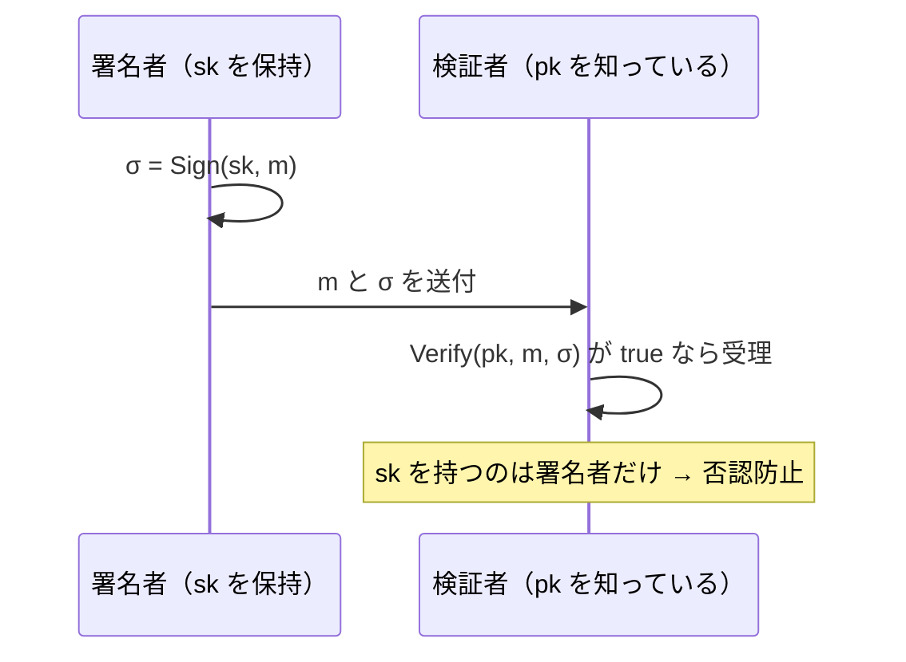

# 04. デジタル署名（RSA-PSS・ECDSA・EdDSA）

> 前: [03 楕円曲線暗号](./03_ecc.md) ｜ 次: [05 安全性の定義と KEM](./05_security-definitions-and-kem.md) ｜ 層: 基礎(Layer 1)
> 親: [README](./README.md)

**この1ページで分かること**

- 署名スキームの構造（KeyGen / Sign / Verify）と安全性目標 EUF-CMA
- 教科書 RSA 署名が計算だけで偽造できる理由と、RSA-PSS がその代数関係を壊す仕組み
- ECDSA の nonce 再利用で秘密鍵が漏れる導出と実例（PS3・Bitcoin）、EdDSA がそれを構造的に防ぐ理由

デジタル署名は「本人しか作れず、誰でも検証できるハンコ」。MAC（共通鍵の認証コード）と違い秘密鍵は署名者だけが持つので、「私は署名していない」と後で否認できない（[`01_goals-and-primitives.md`](../01_goals-and-primitives.md)）。

---

## まず最小の例：ECDSA で 1 メッセージに署名→検証

[03](./03_ecc.md) の玩具曲線 `y²=x³+2x+2 (mod 17)`、`G=(5,1)`（位数 `n=19`）。秘密鍵 `d=7`、公開鍵 `Q=dG=(0,6)`。

```
署名（メッセージのハッシュ h=10、使い捨て乱数 k=4）:
  R = kG = 4G = (3,1)  →  r = R.x mod n = 3
  s = k⁻¹(h + r·d) mod n = 4⁻¹·(10 + 21) = 4⁻¹·31 ≡ 4⁻¹·12
  4⁻¹ mod 19 = 5（4·5=20≡1） → s = 5·12 = 60 ≡ 3
  署名 (r, s) = (3, 3)

検証（公開鍵 Q だけで）:
  w = s⁻¹ = 3⁻¹ = 13,  u1 = h·w = 130 ≡ 16,  u2 = r·w = 39 ≡ 1
  X = u1·G + u2·Q = 16G + Q → X.x ≡ 3 = r  ✓ 受理
```

`k` は**署名ごとに新しい秘密の乱数**（nonce）。これを使い回すと下で見るとおり `d` が漏れる。

---

## 署名スキームの構造と安全性目標

```
KeyGen()         → (公開鍵 pk, 秘密鍵 sk)
Sign(sk, m)      → 署名 σ
Verify(pk, m, σ) → true / false
```



**安全性目標 EUF-CMA**（存在的偽造不可能性）: 攻撃者が好きなメッセージに署名させられても、署名させていない新しいメッセージの有効な署名を 1 つも作れないこと。

---

## RSA 署名：「秘密鍵で復号するだけ」では危険

教科書 RSA 署名は `σ = m^d mod n`、検証は `m =? σ^e mod n`。[`01_rsa/04`](./01_rsa/04_padding-and-attacks.md) の乗法準同型性がそのまま偽造に使える。

```
σ(m1)·σ(m2) = m1^d · m2^d = (m1·m2)^d = σ(m1·m2)   (mod n)
```

`m1, m2` に署名させれば、`m1·m2 mod n` の有効な署名を**掛け算だけで**作れる。

**RSA-PSS**（Bellare–Rogaway 1996、PKCS#1 v2.1 / RFC 8017）: 署名前にメッセージのハッシュ＋ランダムな salt を混ぜてから RSA 演算する。同じメッセージでも署名が毎回変わり、上の代数関係が壊れる。安全性を RSA 問題に帰着できる証明つき。新規実装は `RSASSA-PKCS1-v1_5` ではなく **PSS**。

---

## ECDSA（一般形）

```
Sign(d, h):                                Verify(Q, h, r, s):
  乱数 k（毎回ユニークかつ秘密）             w = s⁻¹ mod n
  R = kG,  r = R.x mod n                    u1 = h·w,  u2 = r·w  (mod n)
  s = k⁻¹(h + r·d) mod n                    X = u1·G + u2·Q
  署名 (r, s)                               r ≡ X.x (mod n) なら受理
```

`h` はメッセージのハッシュ値を整数化したもの。

---

## nonce 再利用は秘密鍵が漏れる

同じ `k`（＝同じ `r`）で 2 つのメッセージに署名すると、署名 2 つだけから `d` が求まる。

```
s1 = k⁻¹(h1 + r·d),  s2 = k⁻¹(h2 + r·d)
s1 − s2 = k⁻¹(h1 − h2)  →  k = (h1−h2)/(s1−s2) mod n
d = (s1·k − h1)/r mod n

数値例（上の (r,s1)=(3,3), h1=10 に加え、同じ k=4 で h2=15 に署名）:
  s2 = 5·(15+21) = 5·36 ≡ 5·17 = 85 ≡ 9  → 署名2 = (3, 9)   ← r が同じ！
  k = (10−15)/(3−9) = (−5)/(−6) = 5·inv(6,19) = 5·16 = 80 ≡ 4   ✓ k 復元
  d = (3·4 − 10)/3 = 2·inv(3,19) = 2·13 = 26 ≡ 7                ✓ d 復元
```

| 事故 | 何が起きたか |
|---|---|
| **Sony PS3（2010）** | 全署名に**定数**の `k`。公開された 2 署名から fail0verflow が署名鍵を復元。コード署名モデルが崩壊 |
| **Android Bitcoin ウォレット（2013）** | `SecureRandom` の不備で `k` が再利用。`r` が重複したウォレットから残高が盗まれた |

**対策 EdDSA（Ed25519、RFC 8032）**: `k` を乱数ではなく**秘密鍵とメッセージのハッシュから決定論的に導出**する。乱数生成器が壊れていても nonce が再利用される余地が構造的に消える。

---

## まとめ比較表

| 方式 | 基盤 | 乱数への依存 | 標準 | 代表用途 |
|---|---|---|---|---|
| RSASSA-PSS | RSA 問題 | salt（漏れても致命的でない） | RFC 8017 | TLS 証明書 |
| ECDSA | ECDLP | **秘密 nonce k が命綱** | FIPS 186-5 | TLS, Bitcoin |
| EdDSA (Ed25519) | ECDLP | 決定論的（乱数不要） | RFC 8032 | SSH, Signal |

---

## 演習（解答つき）

1. RSA 署名で `σ(m1)·σ(m2)=σ(m1·m2)` が成り立つ理由を指数法則で一行で示せ。
2. ECDSA で `r1=r2` の署名を 2 つ見つけたら、まず何を疑うべきか。
3. EdDSA が「nonce 再利用」という攻撃クラスを構造的に防げる理由を一言で述べよ。

<details><summary>解答</summary>

1. `σ(m1)·σ(m2) = m1^d·m2^d = (m1·m2)^d = σ(m1·m2) (mod n)`（`a^d b^d=(ab)^d`）。
2. **同じ nonce `k` が 2 回使われた**こと（乱数生成器の不備・定数 nonce）。`r=kG` の x 座標なので、`r` の一致はほぼ確実に同じ `k` の証拠で、2 署名から `d` が復元できる。
3. nonce を乱数でなく**秘密鍵とメッセージから決定論的に計算**するため、乱数生成器が壊れても意図しない再利用や推測可能な漏れが起きない。

</details>

---

## 次への接続

公開鍵暗号（RSA・DH・ECC・署名）が揃った。次はこれらが内部で使うハッシュ関数と MAC。
→ [`../04_hash-and-mac.md`](../04_hash-and-mac.md)

---

## 参考

- Bellare, M., Rogaway, P. (1996). *The Exact Security of Digital Signatures — How to Sign with RSA and Rabin*. EUROCRYPT '96.
- FIPS 186-5 — Digital Signature Standard (DSS)
- RFC 8032 — EdDSA (2017): https://www.rfc-editor.org/rfc/rfc8032.html
- fail0verflow (2010). *Console Hacking 2010: PS3 Epic Fail*
