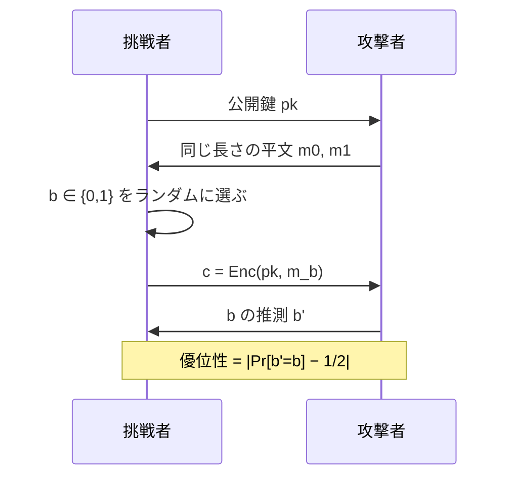

# 05. 安全性の定義と KEM

> 前: [04 デジタル署名](./04_digital-signatures.md) ｜ 層: 基礎(Layer 1)
> 親: [README](./README.md)

**この1ページで分かること**

- 安全性が「ゲーム」と「優位性」で定義される理由
- IND-CPA から IND-CCA2 までの階層と、なぜ CCA2 が目標になるのか
- 実務では公開鍵で**メッセージを暗号化しない**（KEM/DEM）こと

「安全」を「絶対に破れない」では定義できない。現代暗号は「攻撃者に何を許し、何を当てられたら負けか」をゲームとして書き、**当て推量よりどれだけ上手いか**を測る。

---

## まず最小の例：教科書 RSA が 1 手で破れる

鍵 `(n=55, e=3)`。攻撃者は公開鍵を持っているので自分でも暗号化できる。

```
1. 攻撃者が m0=2, m1=4 を提出
2. 挑戦者がコインを投げ、片方を暗号化して c を返す（例: c=9）
3. 攻撃者が自分で計算:  2³ mod 55 = 8,  4³ mod 55 = 9
   c=9 は 4³ と一致 → 「m1 だ」と 100% 当てる
```

同じ平文が同じ暗号文になる（決定論的）だけで、公開鍵暗号は即座に破れる。パディングが要る理由（[`01_rsa/04`](./01_rsa/04_padding-and-attacks.md)）。

---

## 3 つのアルゴリズムという定式化

```
KeyGen(λ) → (pk, sk)   λ はセキュリティパラメータ（例: 128 bit 安全を要求）
Enc(pk, m) → c
Dec(sk, c) → m
```

`λ` を入力に取ることで「何 bit の安全性に鍵長をどう選ぶか」という問いになる（[`04_key-length-security.md`](../../01_prerequisites/01_math-for-crypto/05_info-theory/04_key-length-security.md)）。

---

## 安全性はゲームで定義する



正答率そのものは指標にならない（コインを投げれば 1/2 当たる）。**1/2 からのずれ＝優位性**が無視できるほど小さいことが安全性の定義。対称鍵の意味論的安全性（`courses/coursera-crypto1/03_stream-ciphers/`）と同じ形。

---

## IND-CPA から IND-CCA2 へ

攻撃者に**何を許すか**で階層ができる（Bellare–Desai–Pointcheval–Rogaway, CRYPTO'98）。

| モデル | 攻撃者に許すもの | 由来 |
|---|---|---|
| **IND-CPA** | 公開鍵で自分で暗号化できる | Chosen-Plaintext Attack |
| **IND-CCA1** | ＋挑戦暗号文を受け取る**前**に復号オラクル（暗号文を渡すと復号してくれる装置） | 非適応的 CCA |
| **IND-CCA2** | ＋挑戦暗号文を受け取った**後**も復号オラクル（挑戦暗号文自身は禁止） | 適応的 CCA |

IND-CPA は公開鍵暗号では自動的に要求される（上の例）。

### なぜ CCA2 が目標なのか

「復号オラクル」は不自然に強く見えるが、**現実のシステムは意図せず復号オラクルを提供してしまう**。

| 実例 | どう復号オラクルになったか |
|---|---|
| RSA の Bleichenbacher 攻撃 | サーバがパディングの妥当性で異なる応答を返した |
| CBC のパディングオラクル（POODLE 等） | 復号後のパディング検証の成否が観測できた |

エラーメッセージの違い・応答時間の差がそのまま復号オラクルになる。CCA2 は「理論的に厳しすぎる想定」ではなく**実装が現実に晒される状況**。事例は [`01_rsa/04`](./01_rsa/04_padding-and-attacks.md)、[`../02_symmetric-crypto/README.md`](../02_symmetric-crypto/README.md)。

---

## KEM：公開鍵でメッセージを暗号化しない

公開鍵演算は重く、扱えるデータ長も法のサイズに制限される。実務は **KEM/DEM**。

```
KEM（鍵カプセル化）: Encap(pk) → (c, k)   乱数鍵 k を作り、その「封筒」c を公開鍵で作る
                     Decap(sk, c) → k      秘密鍵で封筒を開く
DEM（データカプセル化）: k を対称鍵として本体を AEAD（認証付き暗号）で暗号化
```

要点は「メッセージを選んで暗号化する」のではなく**「鍵を運ぶ」**こと。パディングにまつわる問題も避けやすい。[`../02_symmetric-crypto/README.md`](../02_symmetric-crypto/README.md) のハイブリッド暗号を公開鍵側から見たもの。

> 耐量子暗号 ML-KEM（FIPS 203）が「KEM」と名乗るのもこのため——実務で必要なのは鍵を運ぶ方式（[`../06_advanced-topics-map.md`](../06_advanced-topics-map.md)）。

---

## 署名側の対応する定義：EUF-CMA

```
攻撃者は好きなメッセージの署名を要求できる（署名オラクル）
一度も署名を求めていないメッセージの有効な署名を 1 つでも作れたら「破れた」
```

「意味のあるメッセージ」ではなく「何か 1 つでも」という厳しい基準。攻撃者に都合のよいメッセージを事前に決めつけないため。方式は [`04_digital-signatures.md`](./04_digital-signatures.md)。

---

## 演習（解答つき）

1. 安全性を「攻撃者の正答率」ではなく「1/2 からのずれ（優位性）」で測るのはなぜか。
2. パディングを施さない教科書 RSA が IND-CPA すら満たさない理由を、ゲームの手順に沿って説明せよ。
3. KEM を使うと、公開鍵で直接メッセージを暗号化する場合と比べて何が改善するか。2 つ挙げよ。

<details><summary>解答</summary>

1. 何もせずコインを投げても 1/2 当たるので正答率は指標にならない。意味があるのは当て推量より**どれだけ**上手いかで、それが優位性。無視できるほど小さければ攻撃者は本質的に何も学べていない。
2. 決定論的なので、攻撃者は公開鍵で自分で `Enc(pk, m0)` を計算し `c` と比べれば `b` を確実に判定できる。優位性 1/2 で IND-CPA を満たさない。
3. ①公開鍵演算の対象が短い鍵だけになり、長いデータも高速に扱える。②メッセージを公開鍵演算に通さないため、パディング関連の攻撃面が減る。「データ長が法のサイズに制限されない」も可。

</details>

---

## 次への接続

公開鍵暗号のフォルダは「個別の方式（`01`〜`04`）＋評価の枠組み（本ファイル）」で揃った。次はハッシュ関数と MAC。
→ [`../04_hash-and-mac.md`](../04_hash-and-mac.md)

---

## 参考

- Bellare, M., Desai, A., Pointcheval, D., Rogaway, P. (1998). *Relations Among Notions of Security for Public-Key Encryption Schemes*. CRYPTO'98: https://www.di.ens.fr/~pointche/Documents/Papers/1998_crypto.pdf
- Cramer, R., Shoup, V. (2003). *Design and Analysis of Practical Public-Key Encryption Schemes Secure against Adaptive Chosen Ciphertext Attack*. SIAM J. Computing.（KEM/DEM）
- Boneh, D., Shoup, V. *A Graduate Course in Applied Cryptography*: https://toc.cryptobook.us/
- 講義ノート: [`../../../courses/coursera-crypto1/12_public-key-encryption/01_pke-definitions.md`](../../../courses/coursera-crypto1/12_public-key-encryption/01_pke-definitions.md)
- 本ファイルの構成は COSIC Course 2026 の公開鍵暗号セッション（Krijn Reijnders, 2026年6月）の整理に基づく。
