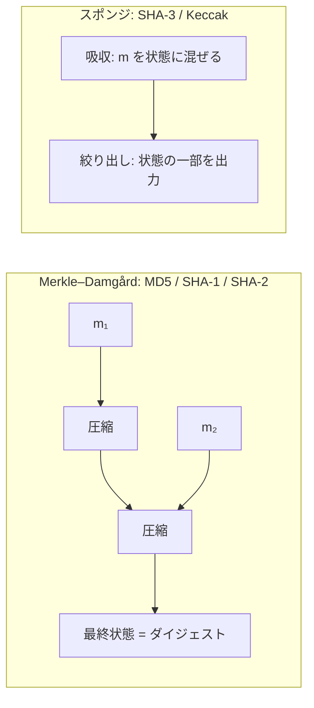

# 04. ハッシュ関数と MAC

> 前: [03 公開鍵暗号](./03_public-key-crypto/README.md) ｜ 層: 基礎(Layer 1)

**この1ページで分かること**

- ハッシュ関数に求められる3つの安全性と、出力長が原像耐性の2倍必要な理由（バースデー攻撃）
- 自作 MAC `H(secret‖message)` が長さ拡張攻撃で破れる仕組みと、HMAC が安全な理由
- MD5・SHA-1 が実際の衝突実証によって廃止されるまでの経緯

ハッシュ関数は「どんな長さの文書からも同じ長さの指紋を作る機械」。署名（[ECDSA](./03_public-key-crypto/04_digital-signatures.md)）も RSA のパディング（[OAEP/PSS](./03_public-key-crypto/01_rsa/04_padding-and-attacks.md)）もこの指紋の上に乗る。鍵付きにしたものが **MAC**（メッセージ認証コード: 共有鍵を知る者だけが作れる改ざん検知タグ）。

## 最小の例: 1 文字変えると指紋が総入れ替え

```
SHA-256("a") = ca978112ca1b…   （64 桁の 16 進、先頭だけ表示）
SHA-256("b") = 3e23e8160039…   ← 1 文字の差で全桁が変わる
```

| 使い方 | 送るもの | 受信側の検査 | 守れること |
|---|---|---|---|
| ハッシュ単体 | `m, H(m)` | `H(m)` を再計算して比較 | 事故による破損 |
| MAC | `m, MAC(k, m)` | 鍵 `k` で再計算して比較 | 鍵を持たない者の改ざん |

鍵なしの指紋は誰でも作り直せるので「改ざんされていない」とは言えない。鍵付き（MAC）にして初めて言える。

---

## ハッシュ関数の3つの安全性

```
任意長の入力 m を固定長の出力 H(m)（ダイジェスト）に写す関数。鍵は使わない。

原像計算困難性 (preimage resistance):
  h が与えられたとき、H(m)=h となる m を見つけるのが困難
第2原像計算困難性 (2nd-preimage resistance):
  m1 が与えられたとき、H(m1)=H(m2) となる別の m2 を見つけるのが困難
衝突困難性 (collision resistance):
  H(m1)=H(m2) となる任意の m1≠m2 の組を見つけるのが困難
```

**衝突困難性が最も強い**——衝突困難なら他 2 つも従う（両方の入力を選べる衝突探索の方が、片方固定の原像探索より易しいため）。

### バースデー攻撃と出力長の関係

`n` bit の出力を持つハッシュ関数について:

```
原像を見つける総当たり: 2^n 回
衝突を見つける総当たり: 2^(n/2) 回だけで済む（バースデーパラドックスにより）
```

64 bit 出力なら `2^32` 回で衝突が見つかる。だから衝突耐性には出力長を目標強度の**2 倍**取る。SHA-256 が標準なのは衝突耐性 `2^128` を確保するため。

---

## 構成方式：Merkle–Damgård と スポンジ構造



| 構成 | 代表 | 出力 | 長さ拡張攻撃 |
|---|---|---|---|
| Merkle–Damgård | MD5・SHA-1・SHA-256/512 | 最終状態そのまま | 受ける |
| スポンジ | SHA-3（FIPS 202, 2015） | 状態の一部。任意長可（SHAKE） | 受けない |

SHA-3 は SHA-2 の後継ではなく**設計の多様化**（MD に構造的弱点が出た場合の保険として NIST が公募）。

> Merkle–Damgård の圧縮関数をブロック暗号から作る方法（Davies–Meyer 等）は
> [`02_symmetric-crypto/05_hashing-from-block-ciphers.md`](./02_symmetric-crypto/05_hashing-from-block-ciphers.md)、
> スポンジ構成の内部（duplex・Keccak の3D状態）は
> [`02_symmetric-crypto/06_permutation-based-and-challenges.md`](./02_symmetric-crypto/06_permutation-based-and-challenges.md) が本体。

---

## 長さ拡張攻撃（Length Extension Attack）

MD 構成は**最終状態をそのまま公開する**ので、`H(m)` と `m` の長さだけから `H(m ‖ padding ‖ m₂)` を計算できる（続きから再開できる）。

| 受ける | 受けない |
|---|---|
| MD5・SHA-1・SHA-256・SHA-512 | SHA-384・SHA-512/256（状態を切り捨てて出力）・SHA-3 全般 |

**典型的な誤用**: `MAC = H(secret ‖ message)` を自作すると、`secret` を知らずに `message‖padding‖extra` の偽タグが作れる。**この誤りを塞ぐ標準が HMAC。**

---

## HMAC（RFC 2104）

```
HMAC(k, m) = H( (k ⊕ opad) ‖ H( (k ⊕ ipad) ‖ m ) )
```

鍵を単純結合せず**ハッシュを 2 回・入れ子**に適用する。内側の出力を外側で再ハッシュするので、内部が MD 構成でも長さ拡張攻撃を受けない。任意のハッシュと組める（`HMAC-SHA256`）。

---

## MAC のもう一つの作り方：普遍ハッシュ族ベース

**普遍ハッシュ族**（鍵で選ぶ多項式評価。1 回限りなら衝突確率が証明できる）を使う高速 MAC もある。**GMAC**（GCM の認証部）と **Poly1305**（ChaCha20-Poly1305）がこの系統で、AEAD（認証付き暗号）の中で使う。詳細は [`02_symmetric-crypto/README.md`](./02_symmetric-crypto/README.md)。

---

## MD5・SHA-1 はなぜ廃止されたか

| | MD5 | SHA-1 |
|---|---|---|
| 設計 / 出力 | 1992 年 / 128 bit | 1995 年 / 160 bit |
| 理論的弱点 | — | 2005 年頃から。NIST が 2011 年に非推奨 |
| 実用的衝突 | 2004 年 8 月 Wang らが約 1 時間で（約 `2^39`） | 2017 年 2 月 23 日 SHAttered（Google・CWI）。PDF 2 通が同一値、`2^63.1`、約 10 万ドル |
| 結果 | 証明書署名等で禁止 | 同年中にブラウザ・CA・Git が停止 |

**教訓**: 理論的可能性から実証までは長いが、実証されると業界は急速に移行する。新規実装は SHA-256（または SHA-3）。

---

## 目標 → 道具の対応（まとめ）

| 目標 | 道具 | 鍵 |
|---|---|---|
| データの完全性（改ざん検知、送信者は問わない） | ハッシュ関数単体（例: ダウンロードファイルの検証） | 不要 |
| 完全性 + 認証（共有鍵を持つ2者間） | MAC（HMAC・GMAC・Poly1305） | 対称鍵 |
| 完全性 + 認証 + 否認防止 | デジタル署名（内部でハッシュを使用） | 公開鍵ペア |

---

## 演習（解答つき）

1. 128bit 出力のハッシュ関数について、衝突を総当たりで見つけるにはおよそ何回の計算が必要か。
2. `MAC = H(secret‖message)` という自作MACのどこが危険か、一言で述べよ。
3. HMAC が「鍵とメッセージを単純結合するだけ」の方式より安全な理由を一言で述べよ。

<details><summary>解答</summary>

1. バースデーパラドックスにより衝突は `2^(128/2) = 2^64` 回程度の試行で見つかる
   （原像を見つける `2^128` 回よりずっと少ない）。
2. Merkle–Damgård構成のハッシュ関数（MD5, SHA-1, SHA-256等）は長さ拡張攻撃に弱く、
   `secret` を知らなくても `H(secret‖message‖padding‖extra)` を計算できてしまうため、
   `message‖padding‖extra` に対する偽の認証コードを作られてしまう。
3. HMAC は鍵を2回・入れ子構造でハッシュに混ぜ込むため、内部で使うハッシュ関数が
   長さ拡張攻撃に弱い Merkle–Damgård構成であっても、HMAC自体はその弱点を継承しない。

</details>

---

## 次への接続

道具（対称鍵・公開鍵・ハッシュ/MAC）が揃った。次はこれらを組み合わせた実際の
プロトコル（TLS・SSH・Signal等）を地図として見る。
→ [05 プロトコルの地図](./05_protocols/README.md)

---

## 参考

- FIPS 180-4 — Secure Hash Standard (SHA-2 family)
- FIPS 202 — SHA-3 Standard: Permutation-Based Hash and Extendable-Output Functions (2015): https://csrc.nist.gov/pubs/fips/202/final
- RFC 2104 — HMAC: Keyed-Hashing for Message Authentication
- Wang, X. et al. (2004). *Collisions for Hash Functions MD4, MD5, HAVAL-128 and RIPEMD*.
- Stevens, M. et al. (2017). *The First Collision for Full SHA-1*（SHAttered）: https://shattered.io/
