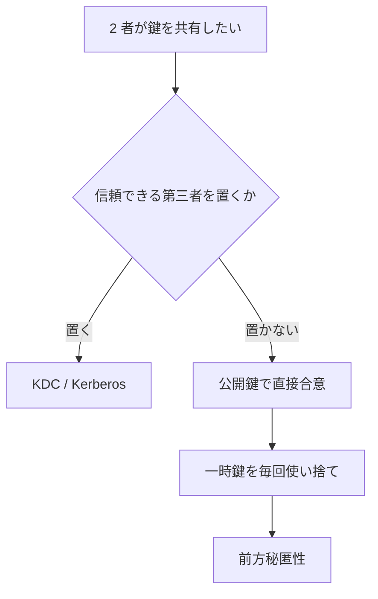

# 02. 鍵管理

> 親: [README](./README.md) ｜ 前: [01 エンティティ認証](./01_entity-authentication.md) ｜ 次: [03 TLS・IPsec・SSH](./03_tls-ipsec-ssh.md) ｜ 層: 基礎(Layer 1)

暗号は「データを守る問題」を「**鍵を守る問題**」に変換する道具。その変換先——鍵をどう配り、更新し、捨てるか——を扱う。

**この1ページで分かること**

- 事前共有鍵が n 者でスケールしない理由と、それを解く2つの方向
- 鍵階層が「被害を1つに閉じ込める」仕組みと、Kerberos のチケットが解決したこと
- 前方秘匿性が標準になったのは技術的進歩ではなく脅威認識の変化だったこと

---

### 最小の例: 鍵 1 本の一生

| 段階 | やること | ここを間違えると |
|---|---|---|
| 生成 | 乱数から鍵を作る | 予測可能 |
| 配布 | 相手に安全に渡す | 盗聴 |
| 使用 | 暗号化・復号に使う | 目的外流用 |
| 更新 | 期限が来たら替える | 蓄積被害 |
| 破棄 | 完全に消す | 後日復元 |

鍵管理とはこの 5 段階すべてを設計することであり、1 つでも抜けると暗号は無意味になる。以下その一般論。

---



## 鍵配送の3方式

n 者が互いに安全に通信したいとき、方式によって必要な鍵の本数が変わる。

| 方式 | 鍵の本数 | 前提 |
|---|---|---|
| 全ペアで事前共有 | **O(n²)** — n=1000 なら約50万本 | 事前に安全な経路で配れること |
| KDC（鍵配送センター）経由 | **O(n)** — 各自が中央と1本ずつ | 中央を信頼すること |
| 公開鍵暗号 | **O(n)** — 各自が鍵ペア1組 | 公開鍵の真正性を確認できること |

**事前共有は数が増えると成立しない。** 1人増えるたびに既存の全員と鍵交換が要る。
残る2つは「O(n) に落とす」代償として**新しい前提**を導入している。

---

## KDC モデル：中央に集める

```
各利用者は KDC とだけ長期鍵を共有する
        ↓
A が B と話したいとき、A は KDC に依頼する
        ↓
KDC が A と B が使うセッション鍵を発行する
```

移動体通信の認証センターがこの構造で、加入者ごとの鍵を中央が保持する。

**代償は明確**である。

| 得るもの | 失うもの |
|---|---|
| 鍵の本数が O(n) に減る | **KDC が単一障害点になる**——ここが破られると全利用者の通信が読める |
| 利用者の追加が容易 | KDC を常に信頼しなければならない |

> 「信頼を1点に集めてコストを下げる」構図は [`../../06_systems-security/07_pki-and-identity.md`](../../06_systems-security/07_pki-and-identity.md)
> の CA と同じ。**問題を消すのではなく、信頼を移動させている。**

---

## 鍵階層：被害を閉じ込める

長期鍵を直接データの暗号化に使ってはいけない。階層にする。

```
マスター鍵（長期・厳重に保護）
    ↓ 導出
セッション鍵（1回の通信・接続ごと）
    ↓ 導出
取引鍵・レコード鍵（1つの取引・1つのメッセージごと）
```

**目的は「1つの鍵が漏れたときの被害範囲を限定する」ことである。**

| 漏れた鍵 | 影響範囲 |
|---|---|
| 取引鍵 | その取引1件だけ |
| セッション鍵 | そのセッションだけ |
| マスター鍵 | **すべて**（だから最も厳重に守る） |

金融分野では取引ごとに鍵を変える。鍵の本数は膨大になるが、**1件の漏洩が1件の被害で止まる**性質を買っている。
Wi-Fi も同じ構造（PMK → PTK。[`../../06_systems-security/06_wireless-security.md`](../../06_systems-security/06_wireless-security.md)）。

---

## Kerberos：チケットという発明

KDC モデルを実用化した代表例。**利用者が毎回パスワードを送らずに済む**ようにする。

```
チケット = 相手（B）の鍵で暗号化された「A と B のセッション鍵 + 有効期限」
```

A はチケットを受け取るが**中身は読めない**（B の鍵で暗号化）。転送するだけでよく、B は自分の鍵で開ける。

**何が解決されたのか**:

| 素朴な方式 | Kerberos |
|---|---|
| 通信するたびに認証が必要 | 一度チケットを得れば有効期限内は再利用できる |
| B が全利用者の鍵を持つ必要がある | B は自分の鍵だけを持てばよい |

有効期限があるのでチケットが漏れても影響は期限内に限られる——**鍵階層の応用**。企業のディレクトリ認証基盤で広く使われる。

---

## TOFU：信頼を諦めるという選択

SSH が採る方式（[03](./03_tls-ipsec-ssh.md) で詳述）。初回に相手のホスト鍵を記憶し、
2回目以降は「前回と同じ鍵か」だけを見る＝**初回に攻撃者がいないことに賭けている**。

CA のような第三者基盤が要らないのが利点。弱点は「初回」が本当に初回か確認できないことと、
鍵の変更警告が読み飛ばされること。

---

## 前方秘匿性が標準になった経緯

**技術ではなく脅威認識が変わった**例として重要である。

| | 2013年以前（RSA 鍵輸送） | 現在（ephemeral DH） |
|---|---|---|
| セッション鍵 | クライアントが作りサーバ公開鍵で暗号化 | 毎回その場で一時鍵ペアから合意 |
| 長期秘密鍵が漏れたら | 記録済みの過去の全通信が読める | 過去のセッション鍵は復元できない |

**通信を記録し後から鍵を入手して読む**攻撃が現実の脅威と認識され、TLS 1.3 は RSA 鍵輸送を**削除**した。

DH の仕組みと前方秘匿性の定義は [`../03_public-key-crypto/02_dh.md`](../03_public-key-crypto/02_dh.md) が本体。

> **「今は解読できないから安全」ではない。** 記録して後で読む攻撃を前提にすると、
> 前方秘匿性は必須になる。同じ論理が耐量子暗号への移行の緊急度を決めている
> （[`../06_advanced-topics-map.md`](../06_advanced-topics-map.md)）。

前方秘匿性は「**過去**を守る」性質。Signal はさらに「奪われても回復する」性質（post-compromise security）を持つ
——詳細は [04](./04_signal-emv-blockchain.md)。

---

## プロトコル解析の入口

鍵管理プロトコルは「一見正しく見えて実は穴がある」典型例で、
解析の第一歩は**何を明文化するか**にある。

| 明文化するもの | なぜ必要か |
|---|---|
| メッセージの形式と順序 | 曖昧なら実装がばらつき、想定外の状態遷移が生まれる |
| 達成したい**目的** | 「認証する」だけでは不十分（誰が誰を、どのセッションについて） |
| 置いている**仮定** | 抜けると [01](./01_entity-authentication.md) のリレー攻撃のような穴になる |

古典的なプロトコル（Needham–Schroeder 等）でも公表後に欠陥が見つかっている。**人間のレビューでは見落とすため形式手法**が使われる
（[`../../05_software-security/05_secure-by-design.md`](../../05_software-security/05_secure-by-design.md)）。

---

## 演習（解答つき）

1. 100人が全ペアで事前共有鍵を持つ場合の鍵の本数を求めよ。KDC 方式なら何本か。
2. 鍵階層を使う目的を、マスター鍵が漏れた場合とセッション鍵が漏れた場合の対比で述べよ。
3. TLS 1.3 が RSA 鍵輸送を削除した理由を、「記録して後で読む」攻撃の観点から述べよ。

<details><summary>解答</summary>

1. 全ペア方式は `100 × 99 ÷ 2 = 4,950` 本。KDC 方式は各利用者が KDC と1本ずつ持つので
   **100本**。前者は人数の2乗で増えるため、1人増えるごとに既存の全員と鍵交換が必要になり
   運用が破綻する。
2. 目的は**被害範囲の限定**。セッション鍵が漏れてもそのセッションだけだが、
   マスター鍵が漏れれば導出される全鍵が危険になる。階層にして「使う鍵」と「守る鍵」を分け、
   日常的に使う鍵の漏洩が全体に波及しない構造を作る。
3. RSA 鍵輸送はセッション鍵をサーバの公開鍵で暗号化して送るため、
   **秘密鍵を後から入手すれば記録済みの過去の全通信を復号できる**。
   この攻撃が現実的な脅威と認識され、一時鍵を使う (EC)DHE のみに限定して前方秘匿性を必須にした。

</details>

---

## 次への接続

認証と鍵管理という土台が揃った。次はこれらを実際に組み合わせた
主要プロトコル——TLS・IPsec・SSH——を、**層と信頼モデルの違い**という観点で見る。
→ [03 TLS・IPsec・SSH](./03_tls-ipsec-ssh.md)
