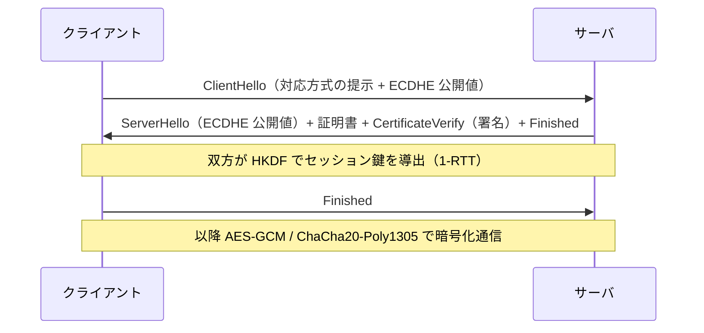

# 03. TLS・IPsec・SSH

> 親: [README](./README.md) ｜ 前: [02 鍵管理](./02_key-management.md) ｜ 次: [04 Signal・EMV・Blockchain](./04_signal-emv-blockchain.md) ｜ 層: 基礎(Layer 1)

[01](./01_entity-authentication.md)・[02](./02_key-management.md) の認証と鍵管理を、
実際のプロトコルがどう組み合わせているかを見る。3つを並べると、
**同じ道具を使いながら設計判断が違う**ことが分かる。

**この1ページで分かること**

- TLS 1.3 が RSA 鍵輸送を削除して 1-RTT にした構成
- 保護する「層」の違い（アプリケーション層 vs IP 層）が設計をどう変えるか
- TLS の CA モデルと SSH の TOFU という信頼モデルの対比

---

## TLS 1.3（RFC 8446）— 安全なウェブ通信

```
目的:   HTTPS 等のクライアント・サーバ間通信を保護
鍵交換: ECDHE のみ（静的 RSA 鍵輸送は廃止）→ 前方秘匿性が必須に
        1-RTT ハンドシェイク、HKDF（RFC 5869）による鍵スケジュール
認証:   サーバ証明書 + RSA-PSS/ECDSA 署名でサーバの身元を検証
本体:   AES-GCM または ChaCha20-Poly1305 でレコード層を暗号化
```



**設計の要点**: 鍵交換に ECDHE、認証に署名という**役割の分離**がある。
[02](./02_key-management.md) で見たとおり、RSA 鍵輸送では
「鍵交換」と「認証」を同じ長期鍵が兼ねていたため前方秘匿性がなかった。
分離することで、長期鍵が漏れても過去のセッションは守られる。

これは [`../02_symmetric-crypto.md`](../02_symmetric-crypto.md) の**ハイブリッド暗号**の
パターンそのものであり、[`../03_public-key-crypto/02_dh.md`](../03_public-key-crypto/02_dh.md) が
予告した「TLS 1.3 は DHE/ECDHE のみにした」という内容が実際に標準化されたものである。

> 証明書を誰が発行し、どう失効させるかという運用側の問題は
> [`../../06_systems-security/07_pki-and-identity.md`](../../06_systems-security/07_pki-and-identity.md) が本体。

---

## IPsec（RFC 4301/4303/7296）— ネットワーク層の VPN

```
目的: IP パケット単位で機密性・完全性を提供（VPN）
ESP（RFC 4303）: 暗号化 + 認証を提供（現在の主流）
AH:              認証のみ（暗号化なし。ほぼ使われない）
IKEv2（RFC 7296）: DH ベースの鍵交換で自動的に鍵を確立・更新
モード: トランスポート（ペイロードのみ保護）／トンネル（IP パケット全体を新しいヘッダで包む）
```

### 層の違いが設計を変える

| | TLS | IPsec |
|---|---|---|
| 保護する層 | アプリケーション層（特定の通信） | **IP 層（すべての通信）** |
| 適用単位 | アプリケーションが明示的に使う | OS/ネットワーク設定で透過的にかかる |
| アプリの改修 | 必要（TLS を使うコードを書く） | **不要**（アプリは何も知らない） |
| 粒度 | 通信ごとに方式を選べる | まとめて保護される |

**「透過的に全部を守る」ことは利点でもあり制約でもある。**
アプリケーションを変更せずに保護をかけられるが、
通信ごとに細かく方針を変えることはできない。
どちらが適切かは「何を守りたいか」で決まる。

---

## SSH（RFC 4251〜4253）— 安全なリモートログイン

```
3層構造:
  トランスポート層（RFC 4253）: DH ベースの鍵交換 + サーバのホスト鍵で認証、暗号化を確立
  認証層（RFC 4252）:          パスワード・公開鍵などでクライアントを認証
  接続層:                      複数チャネル（シェル・ポートフォワード等）を多重化
```

**双方向の認証が明確に分かれている**点が特徴である。
トランスポート層でサーバを認証し、認証層でクライアントを認証する。
[01](./01_entity-authentication.md) の「片方向認証を2回やっても相互認証にならない」問題は、
両者を同一のセッションに束縛することで回避されている。

### 信頼モデルの対比：CA と TOFU

これが3つのプロトコルを並べる最大の理由である。

| | TLS | SSH |
|---|---|---|
| 信頼の起点 | **CA の証明書**（OS/ブラウザに焼き込まれている） | **初回接続時のホスト鍵**（TOFU） |
| 前提 | 第三者機関（CA）を信頼できる | 初回接続時に攻撃者がいない |
| 規模 | 世界中の未知のサーバに接続できる | 既知のサーバに繰り返し接続する用途向け |
| 失敗モード | CA が1つ破られると広範囲に影響 | 初回が攻撃されると気づけない |

**どちらが優れているという話ではない。** 用途が違う。
不特定多数のサーバへ接続する Web では CA モデルが必要であり、
管理者が自分のサーバに繰り返し接続する SSH では TOFU で足りる。

TOFU の詳細と評価は [02](./02_key-management.md) を参照。

---

## 演習（解答つき）

1. TLS 1.3 で「鍵交換は ECDHE、認証は署名」と役割を分離したことの利点を述べよ。
2. アプリケーションのコードを一切変更せずに通信を暗号化したい。
   TLS と IPsec のどちらが適しているか、理由とともに述べよ。
3. TLS の CA モデルと SSH の TOFU について、それぞれの失敗モードを述べよ。

<details><summary>解答</summary>

1. **前方秘匿性が得られる。** RSA 鍵輸送では長期鍵が「鍵交換」と「認証」を兼ねていたため、
   その鍵が漏れると記録されていた過去の全通信が復号できた。
   役割を分離し、鍵交換には毎回異なる一時鍵（ephemeral）を使うことで、
   長期鍵の漏洩が過去のセッションに波及しなくなる。
2. **IPsec。** IP 層で透過的に動作するため、アプリケーションは暗号化の存在を
   知る必要がない。TLS はアプリケーションが明示的にライブラリを呼ぶ必要があるので、
   コードの変更が避けられない。
   ただし IPsec はまとめて保護するので、通信ごとに方針を変える細かさは失われる。
3. **CA モデル**: ブラウザは数百の CA を等しく信頼するため、
   そのうち1つが不正発行すれば任意のサイトを偽装できる（最も弱い CA が全体の強度を決める）。
   **TOFU**: 初回接続時に攻撃者が介入していた場合、その攻撃者の鍵を「正規のもの」として
   記憶してしまい、以降ずっと気づけない。また鍵の変更警告を利用者が読み飛ばす問題もある。

</details>

---

## 次への接続

ここまでは「オンラインで、対話的に」通信するプロトコルだった。
次は制約が違う3つ——オフラインでも動く必要がある決済、
相手がオフラインでも鍵を確立するメッセージング、中央機関を持たない分散台帳を見る。
→ [04 Signal・EMV・Blockchain](./04_signal-emv-blockchain.md)

---

## 参考

- RFC 8446 — The Transport Layer Security (TLS) Protocol Version 1.3
- RFC 4301, 4303, 7296 — IPsec Architecture, ESP, IKEv2
- RFC 4251–4253 — SSH Protocol Architecture / Authentication / Transport Layer
- RFC 5869 — HMAC-based Extract-and-Expand Key Derivation Function (HKDF)
