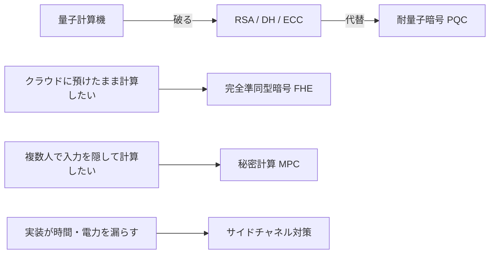

# 06. 上級トピックの地図（耐量子・FHE・MPC・サイドチャネル）

> 対応科目: Applied Cryptography and Cryptanalysis ｜ 前: [05 プロトコルの地図](./05_protocols/README.md) ｜ 層: 基礎(Layer 1)

**この1ページで分かること**

- 量子コンピュータで RSA/DH/ECC が破れる問題への NIST 標準（ML-KEM・ML-DSA・SLH-DSA）
- FHE（暗号化したまま計算）と MPC（入力を明かさず共同計算）の役割分担
- サイドチャネル攻撃（＝実装が漏らす時間・電力などの付随情報から鍵を盗む攻撃）が数学的安全性と別次元である理由

基礎（RSA・DH・ECC・AES・署名・プロトコル）の先にある 4 つの研究領域の地図。「動機・代表方式・どこに繋がるか」だけを示す。

## 最小の例: 今日の暗号文が明日読まれる

```
2025 年: TLS（RSA/ECDH）で送った暗号文を攻撃者が保存だけしておく
20xx 年: 量子計算機が Shor のアルゴリズムで秘密鍵を復元 → 保存分をまとめて復号
```

これが **harvest now, decrypt later**。長期に秘密にすべきデータは「量子計算機が来る前」に耐量子方式へ移す必要がある、というのが以下 4 領域の最初の動機になる。



---

## 耐量子暗号（Post-Quantum Cryptography, PQC）

```
動機: Shor のアルゴリズムが量子コンピュータ上で素因数分解・DLP・ECDLPを多項式時間で解く
      （RSA・DH・ECC が実用規模の量子コンピュータで全滅する。詳細は既出↓）
根拠: ../01_prerequisites/01_math-for-crypto/03_number-theory/05_hard-problems.md
```

NIST が8年がかりの公募を経て **2024年8月**に最初の3標準を確定:

| 標準 | 旧名 | 種別 | 困難性の根拠 |
|---|---|---|---|
| FIPS 203 ML-KEM | CRYSTALS-Kyber | 鍵カプセル化（鍵共有の代替） | 格子（Module-LWE） |
| FIPS 204 ML-DSA | CRYSTALS-Dilithium | デジタル署名（主力） | 格子（Module-LWE） |
| FIPS 205 SLH-DSA | SPHINCS+ | デジタル署名（予備） | ハッシュ関数の安全性のみに依存 |

SLH-DSA は ML-DSA が破られた場合の**保険**。格子暗号は歴史が浅いが、ハッシュベース署名はハッシュの安全性（[`04_hash-and-mac.md`](./04_hash-and-mac.md)）だけに依存し手堅い。
格子暗号の核心は **LWE 問題**（ノイズを乗せた連立一次方程式を解くのが困難という仮定）。詳細は [`06_lattices/`](../01_prerequisites/01_math-for-crypto/06_lattices/README.md)。

### 標準ができたことと、移行が終わることは別問題

機器は数百億台規模。**標準の完成は移行の始点**にすぎない。

| 移行対象 | 難しさ | 理由 |
|---|---|---|
| 通信の鍵共有（TLS） | 低 | 端点だけ変えればよい |
| 署名と PKI | 高 | 証明書チェーン全体・組込機器の検証コスト・更新機構自身が署名依存 |
| プラットフォーム / HW | 最高 | 交換サイクルが長い |

harvest-now-decrypt-later の危険が高いデータから優先して移す。自組織の暗号方式の棚卸しだけで年単位かかることも多い。
**crypto agility**（後から方式を差し替えられる設計）は 1990 年代からの目標だが、方式ごとに鍵長・署名長・往復回数が違い、想定外の差し替えは難しい。規制の文脈は [`../07_legal/03_regulatory-tsunami.md`](../07_legal/03_regulatory-tsunami.md)、HW コストは [`../04_hardware-security/index.md`](../04_hardware-security/index.md)。

> 移行の実務で支配的なボトルネックは**署名と証明書のサイズ**であり、鍵合意ではない。
> TLS ハンドシェイクでの具体的な機序は
> [`../06_systems-security/07_pki-and-identity.md`](../06_systems-security/07_pki-and-identity.md) に置いた。

---

## 完全準同型暗号（Fully Homomorphic Encryption, FHE）

```
目的: 暗号化したデータに対して、復号せずに任意の計算（加算・乗算の組み合わせ）を行える
      → 平文を一切見せずにクラウド側で計算を委託できる
```

2009年、Craig Gentry が**初めて実現可能な構成**を示した（イデアル格子ベース）:

```
1. Somewhat Homomorphic: 加算・乗算はできるが、演算を重ねるたびに「ノイズ」が蓄積し、
   一定回数を超えると復号不能になる（制限つき）
2. Bootstrappable: この方式が「自分自身の復号回路」を評価できるよう調整する
3. 再帰的自己適用: 復号→ノイズ除去を繰り返すことで、ノイズが蓄積し続けない
   「完全」準同型暗号に変換する
```

医療・金融データをクラウドで処理する用途で研究が進む。**プライバシー領域との交差点**（[`02_five-pillars-map.md`](../00_overview/02_five-pillars-map.md)）でもあり `03_privacy/` と接続する。

---

## 秘密計算（Secure Multi-Party Computation, MPC）

```
目的: 複数の参加者が、互いの入力を明かさずに、入力全体に対する関数の出力だけを得る
      （例: 給与を明かさず「誰が一番高いか」だけ知りたい — Yaoの「百万長者問題」）
```

2つの主要アプローチ:

- **ガーブルド回路（Yao, 1982年）**: 計算したい関数を論理回路に変換し、一方が「難読化」した
  回路を渡し、もう一方が自分の入力に対応する部分だけを復号しながら評価する。
- **秘密分散ベース（Shamir, 1979年）**: 秘密を `n` 個の分け前に分割し、`k` 個以上集めないと
  復元できない（`k-1` 個以下では情報が一切漏れない）**閾値法**。分け前同士を演算することで、
  元の秘密を復元せずに計算結果の分け前を得られる。

FHE は「1 人が暗号化データを計算」、MPC は「**複数人が協調して**計算」。医療機関同士が患者データを共有せず統計を取る用途などで実用化が進む。

> FHE/MPC の内部で対称鍵暗号を評価すると乗算コストが支配的になるため、
> 乗法深度を最小化した専用暗号の研究が進む。
> [`02_symmetric-crypto/06_permutation-based-and-challenges.md`](./02_symmetric-crypto/06_permutation-based-and-challenges.md) を参照。

---

## サイドチャネル攻撃

```
テーマ: アルゴリズムが数学的に完璧に安全でも、実装が「余計な情報」を漏らせば鍵は盗まれる
```

| 攻撃 | 発表 | 観測するもの |
|---|---|---|
| タイミング攻撃 | Kocher, 1996 | RSA・DH・DSS の演算時間が鍵のビットで変わる |
| 差分電力解析 DPA | Kocher・Jaffe・Jun, 1999 | スマートカードの消費電力の統計 |

「数学的に正しくても実装が危険」の物理層版。定数時間実装の必要性は [`04_gcd-euclidean.md`](../01_prerequisites/01_math-for-crypto/01_modular-arithmetic/04_gcd-euclidean.md) で予告済み。ECDSA の nonce 漏洩（[署名](./03_public-key-crypto/04_digital-signatures.md)）は「誤用」だが、サイドチャネルは**正しく実装したつもりでも**漏れる一段違う脅威モデル。

サイドチャネルの本体（回路・ハードウェア側の対策）は
[`../04_hardware-security/04_side-channels/README.md`](../04_hardware-security/04_side-channels/README.md)
で扱う。ここでは「暗号側から見た入口」だけを示した。

---

## まとめ表

| 領域 | 解決したい問題 | 代表方式 | 標準化・実現状況 |
|---|---|---|---|
| PQC | 量子計算機によるRSA/DH/ECC崩壊 | ML-KEM, ML-DSA, SLH-DSA | NIST標準化済み（2024年） |
| FHE | 暗号化データのまま計算したい | Gentry方式（格子ベース） | 実用化研究段階（重い） |
| MPC | 入力を明かさず共同計算したい | ガーブルド回路・秘密分散 | 一部実用化（金融・医療） |
| サイドチャネル対策 | 実装からの物理的情報漏洩 | 定数時間実装・マスキング | HW設計・実装の必修事項 |

---

## 演習（解答つき）

1. NIST が ML-DSA（格子ベース）と SLH-DSA（ハッシュベース）の**両方**を標準化した理由を述べよ。
2. FHE と MPC の違いを「誰が計算するか」という観点で一言で説明せよ。
3. サイドチャネル攻撃が「アルゴリズムの数学的な正しさ」の議論と別次元の脅威である理由を述べよ。

<details><summary>解答</summary>

1. 格子暗号（ML-DSA）は歴史が浅く未知の弱点が見つかるリスクがあるため、
   ハッシュ関数の安全性だけに依存する SLH-DSA を**保険**として並行標準化することで、
   仮に格子暗号が破られても暗号スイート全体が崩壊しないようにするため。
2. FHE は**1人**（例: クラウド事業者）が暗号化されたデータをそのまま計算する。
   MPC は**複数人**が、互いの入力を明かさずに協調して計算する。
3. サイドチャネル攻撃は暗号アルゴリズムの数式そのものは全く攻撃しない。代わりに
   実行時間・消費電力・電磁波といった**実装が漏らす付随情報**を観測することで秘密鍵を
   推定するため、数学的な証明可能安全性とは独立した、実装レベルの脅威モデル。

</details>

---

## 暗号での出口

これで `02_cryptography/` の基礎パート（目標・対称鍵・公開鍵・ハッシュ/MAC・プロトコル・
上級トピック）が一通り揃った。FHE/MPC は `03_privacy/` の暗号応用パート、
サイドチャネルは `04_hardware-security/` の実装セキュリティパートへそれぞれ接続していく。

---

## 参考

- FIPS 203, 204, 205 — NIST Post-Quantum Cryptography Standards (2024): https://www.nist.gov/news-events/news/2024/08/nist-releases-first-3-finalized-post-quantum-encryption-standards
- Gentry, C. (2009). *Fully Homomorphic Encryption Using Ideal Lattices*. STOC 2009.
- Yao, A. (1982). *Protocols for Secure Computations*. FOCS 1982.
- Shamir, A. (1979). *How to Share a Secret*. Communications of the ACM.
- Kocher, P. (1996). *Timing Attacks on Implementations of Diffie-Hellman, RSA, DSS, and Other Systems*. CRYPTO '96.
- Kocher, P., Jaffe, J., Jun, B. (1999). *Differential Power Analysis*. CRYPTO '99.
