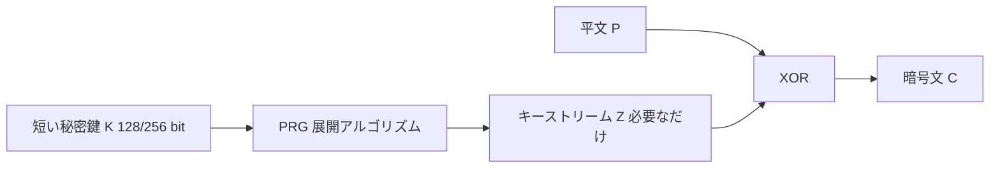

# 03. PRG とキーストリーム

> 親: [README](./README.md) ｜ 前: [02 鍵長の問題](./02_key-length-problem.md) ｜ 次: [04 FSM として見る](./04_fsm-view.md) ｜ 層: 深掘り(Layer 2)

**この1ページで分かること**

- PRG（擬似乱数生成器）は短い鍵を長いキーストリーム `Z` に伸ばす装置で、OTP との差はそこだけ
- LFSR を回すと 8 bit のシードが何百 bit にも伸びる。ただし LFSR も `rand()` も暗号には使えない
- 暗号用 PRG の条件は「見た目がランダム」ではなく**次が予測できない**こと

## 動機

短い合鍵から、必要なだけ長い「乱数のような列」を作る機械が **PRG（Pseudo-Random Generator, 擬似乱数生成器）**。最小の例として 3 bit の LFSR（線形帰還シフトレジスタ。ビットを 1 つずらして端に XOR を入れる箱）を 3 歩回す。

| 歩 | 状態 `s₂s₁s₀` | 出力 = `s₀` | 次の左端 = `s₂ ⊕ s₀` |
|---|---|---|---|
| 0 | `1 0 1` | 1 | 0 |
| 1 | `0 1 0` | 0 | 0 |
| 2 | `0 0 1` | 1 | 1 |

3 bit の種から出力 `1 0 1 …` が伸びていく。以下で 8 bit 版を動かし、「なぜこれでは暗号に足りないか」まで進む。

## 全体の流れ

OTP との違いは **1 箇所だけ**: `Z` が真乱数ではなく `K` から決定論的に計算される。XOR の部分は [01](./01_vernam-and-otp.md) と同じ。この `Z` が **キーストリーム（keystream）**。

> 秘密鍵から生成したキーストリームと平文を XOR する

## 動かして確かめる

中身が見える最小の PRG として **LFSR（線形帰還シフトレジスタ）** を回す。
8 ビットの内部状態を持ち、1 ステップごとに

1. 右端のビットを**出力**として取り出す
2. 決められた位置のビットを XOR して**フィードバック**を作る
3. 全体を1つ右へシフトし、左端にフィードバックを入れる

を繰り返すだけ。

「自動再生」を押しっぱなしにすると、8 ビットのシードからキーストリームが
いくらでも伸びていくのが分かる。これが「1 GB の鍵を運ぶ代わりに 32 バイトを運ぶ」の中身。

### 試してほしい操作

- シードを `00000000` にしてみる → **エラーになる**。全 0 は LFSR の固定点で、
  出力が永久に 0、つまり `C = P` になり暗号として機能しない。「鍵が悪いと PRG が死ぬ」実例。
- シードを 1 ビットだけ変えてみる（`10110101` → `10110100`）→ 出力列が最初から全く別物になる。

## 「普通の乱数生成器」ではダメな理由

PRG に要るのは「見た目がランダム」ではなく**出力から次を予測できないこと**。一般の乱数ライブラリとの決定的な差。

| 種類 | 例 | ストリーム暗号に使えるか |
|---|---|---|
| 線形合同法・メルセンヌツイスタ | `rand()`, `Math.random()`, MT19937 | ❌ 出力を少し観測すれば内部状態が復元できる |
| LFSR（このページの玩具） | — | ❌ Berlekamp–Massey 法で出力 2n ビットから完全復元される |
| 暗号学的に安全な PRG | ChaCha20, AES-CTR, HMAC-DRBG | ✅ |

**このページの LFSR も安全ではない**。出力 16 bit で内部状態が解け、以降の `Z` が全部計算される。教材と割り切る。
`Math.random()` も予測可能なので鍵・nonce（一度きりの値。同じ鍵で毎回違う暗号文を作るための番号）には使わない。ブラウザなら `crypto.getRandomValues()`。

## 実在のストリーム暗号

| 暗号 | 状況 |
|---|---|
| **ChaCha20** | D. J. Bernstein 設計。RFC 8439 で標準化。TLS・WireGuard・SSH で広く使用。現在の第一候補 |
| **RC4** | かつて WEP/TLS で広く使われたが出力に統計的偏りがあり、RFC 7465（2015年）で TLS での使用が禁止された |
| **A5/1** | GSM 通信用。LFSR ベースで、実時間で破られることが示されている |
| **AES-CTR** | ブロック暗号をストリーム的に使うモード。厳密にはストリーム暗号ではないが用途は同じ |

## 演習

1. 8 ビットの LFSR が取りうる内部状態は何通りか。そのうち使ってはいけない状態はどれか。
   結果として出力の周期は最大いくつになるか。
2. 「メルセンヌツイスタは統計的検定を全部通るからキーストリームに使える」という主張の
   どこが誤っているか。
3. ストリーム暗号は OTP の3条件のうち1つを緩めた。どれを緩め、どれは緩めていないか。

解答

1. 状態は 2⁸ = **256 通り**。うち**全 0 の状態は使えない**（次の状態も全 0 で自己ループするため）。
   したがって最大周期は **255**。このページの LFSR は原始多項式
   `x⁸ + x⁶ + x⁵ + x⁴ + 1` を使っているので、この最大周期を達成する。
2. 統計的検定が見るのは「出力が偏っていないか」だけで、**予測不可能性**は見ていない。
   MT19937 は連続する 624 個の出力を観測すれば内部状態が完全に復元でき、
   以降の出力をすべて計算できる。暗号に必要なのは後者の性質。
3. 緩めたのは「**鍵が平文と同じ長さで真にランダム**」の部分（短い鍵 + 決定論的展開に置き換えた）。
   緩めて**いない**のは「**同じキーストリームを二度使わない**」。
   だからこそ実運用では鍵に加えて nonce / IV を混ぜ、毎回違う `Z` を作る必要がある。

## 次への接続

演習3で出た「毎回違う `Z` を作るには nonce / IV が要る」という話が、
次ページの図に直接つながる。`K` と `IV` から内部状態を初期化し、
状態を更新しながら `Z` を吐き続ける —— これを**状態機械（FSM）**として描くと、
講義スライドのブロック図がそのまま読めるようになる。

→ [04 FSM として見るストリーム暗号](./04_fsm-view.md)
