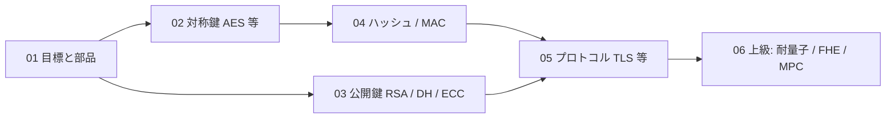

# 02. 暗号

> 層: 地図 (Layer 0)

暗号は「合鍵を持つ人だけが読める・書ける」仕組みを数学で作る道具箱。道具（数学）は [`01_math-for-crypto/`](../01_prerequisites/01_math-for-crypto/index.md)、その適用がここ。

## 読む順

| # | ページ | 内容（1行） |
|---|---|---|
| 01 | [目標とプリミティブ](01_goals-and-primitives.md) | CIA・認証/否認防止・プリミティブ分類・Kerckhoffsの原理・攻撃者モデル |
| 02 | [対称鍵暗号](02_symmetric-crypto/README.md) | 概念フォルダ（全6ファイル）— ストリーム暗号/LFSR・Feistel/SPN・AES内部・モードとAEAD・ハッシュへの応用・置換ベース暗号 |
| 03 | [公開鍵暗号](03_public-key-crypto/README.md) | RSA・Diffie–Hellman・楕円曲線・デジタル署名・安全性の定義とKEM（概念フォルダ） |
| 04 | [ハッシュとMAC](04_hash-and-mac.md) | ハッシュ性質・Merkle-Damgård/スポンジ・長さ拡張攻撃・HMAC・MD5/SHA-1廃止 |
| 05 | [プロトコル](05_protocols/README.md) | 概念フォルダ（全4ファイル）— エンティティ認証・鍵管理・TLS/IPsec/SSH・Signal/EMV/Blockchain |
| 06 | [上級トピック地図](06_advanced-topics-map.md) | 耐量子(NIST 2024標準)・FHE(Gentry)・MPC(Yao/Shamir)・サイドチャネル |

## 深掘り（Layer 2）

| ページ | 内容（1行） |
|---|---|
| [ストリーム暗号](deep/stream-ciphers/README.md) | Vernam/OTP → 鍵長の問題 → PRG → FSM を、動かせるウィジェットで追う |

進捗チェックリスト

- [x] `01_goals-and-primitives.md` — CIA・認証/否認防止・プリミティブ分類・Kerckhoffsの原理・攻撃者モデル
- [x] `02_symmetric-crypto/` — 対称鍵暗号（概念フォルダ、全6ファイル完成）
  - [ ] `01_stream-ciphers-and-lfsr.md` — ストリーム暗号のFSM・IVの必要性・LFSR・A5/1・E0・RC4・ChaCha20
  - [ ] `02_block-cipher-architecture.md` — 換字→コードブック・Shannonの交互適用・Feistel vs SPN・DES/3DES廃止
  - [ ] `03_aes-internals.md` — 4×4状態・SubBytes/ShiftRows/MixColumns・MDS行列と分岐数
  - [ ] `04_modes-and-aead.md` — ECB/CBC/CTR・バースデー境界の導出・AEAD・CCM/OCB/GCM
  - [ ] `05_hashing-from-block-ciphers.md` — MDパディング・Davies–Meyer系・MD4の系譜
  - [ ] `06_permutation-based-and-challenges.md` — 置換ベース暗号・Keccak/duplex・軽量暗号・MPC/FHE向け
- [x] `03_public-key-crypto/` — 公開鍵暗号（概念フォルダ、全5ファイル完成）
  - [x] `01_rsa/` — RSA（鍵生成・暗号化復号・正しさ証明・パディング/攻撃）
  - [x] `02_dh.md` — Diffie–Hellman 鍵共有・CDH/DDH・前方秘匿性・Logjam
  - [x] `03_ecc.md` — 楕円曲線暗号（群構造・ECDH・NIST P-256 vs Curve25519・Dual_EC_DRBG）
  - [x] `04_digital-signatures.md` — デジタル署名（RSA-PSS・ECDSA・nonce再利用事故・EdDSA）
  - [ ] `05_security-definitions-and-kem.md` — 安全性の定義（ゲームと優位性・IND-CPA/CCA1/CCA2・EUF-CMA）と KEM/DEM
- [x] `04_hash-and-mac.md` — ハッシュ性質・Merkle-Damgård/スポンジ・長さ拡張攻撃・HMAC・MD5/SHA-1廃止
- [x] `05_protocols/` — プロトコル（概念フォルダ、全4ファイル完成）
  - [ ] `01_entity-authentication.md` — liveness・パスワード保存・オフライン/オンライン攻撃・リレー攻撃・FIDO
  - [ ] `02_key-management.md` — 鍵配送の3方式・KDC・鍵階層・Kerberos・TOFU・前方秘匿性の経緯
  - [ ] `03_tls-ipsec-ssh.md` — TLS 1.3 の 1-RTT・層の違い・CA と TOFU の対比
  - [ ] `04_signal-emv-blockchain.md` — X3DH と Double Ratchet・EMV のオフライン制約・分散台帳
- [x] `06_advanced-topics-map.md` — 耐量子(NIST 2024標準)・FHE(Gentry)・MPC(Yao/Shamir)・サイドチャネル（上級地図）

科目対応・深掘りキュー・関連領域

### 科目対応マップ

| トピック |
|---|
| 対称鍵・AES |
| RSA・DH・ECC |
| デジタル署名・プロトコル |
| 計算量・代数 |
| 耐量子（格子・コード） |

### 深掘りキュー（Layer 2 候補）

- [x] ストリーム暗号（Vernam/OTP・PRG・FSM）→ `deep/stream-ciphers/` に作成済み
- [ ] 差分・線形解読の実際の計算（AES S-boxがなぜ「ほぼ最適」か数値的裏付け）→ `02_symmetric-crypto/03_aes-internals.md` 経由
- [ ] LFSRの周期理論（原始多項式と最大周期）→ `02_symmetric-crypto/01_stream-ciphers-and-lfsr.md` 経由
- [ ] （読み進めながら追記）

## 参考（サブ領域全体）

- 講義ノート: [Coursera Crypto I（Dan Boneh）](../courses/coursera-crypto1/README.md) — 本サブ領域を講義に沿って詳しく追う副読ノート
