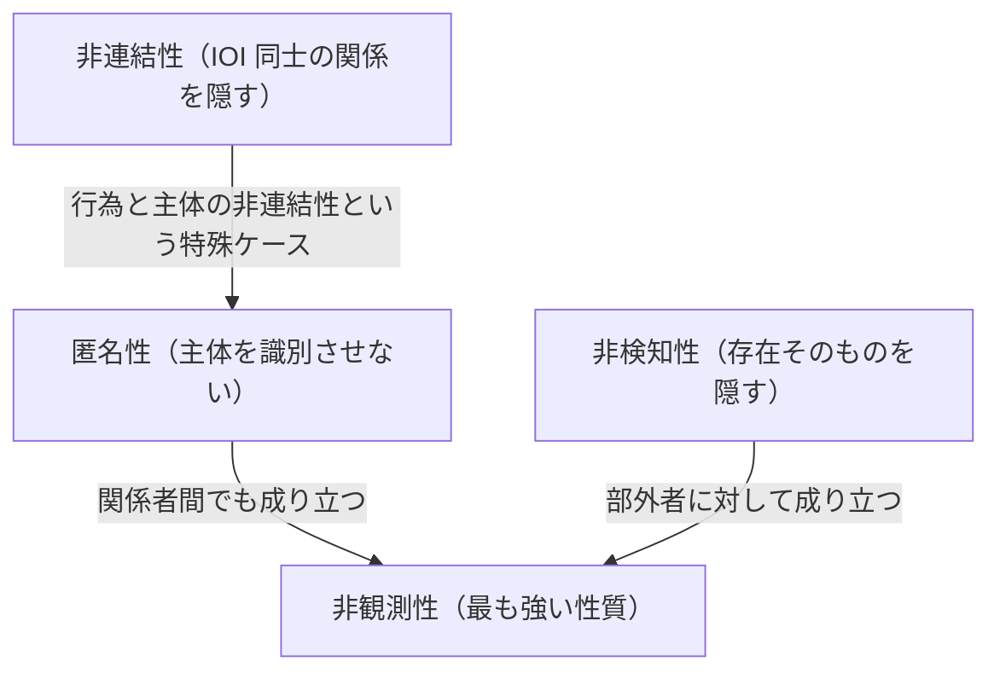

# 01. プライバシーの基本概念（匿名性・非連結性・PII）

> 次: [02 匿名化と差分プライバシー](./02_anonymization-and-dp.md) ｜ 層: 基礎(Layer 1)

**この1ページで分かること**

- 「匿名」を工学的に扱う 4 つの性質（匿名性・非連結性・非検知性・非観測性）と仮名性の違い
- 匿名性の強さを「紛れられる候補の数（匿名性集合）」で測るという発想
- 米国流の PII と GDPR の「個人データ」の範囲の違い

「匿名」は日常語では 1 つの意味だが、工学では「誰がやったか」「関係があるか」「そもそも起きたか」を別々に隠す。Pfitzmann–Hansen の用語体系（IETF 草稿。脅威モデリング手法 LINDDUN でも標準）を土台にする。

---

## まず最小の例：投票用紙

```
選挙で 100 人が投票し、用紙に名前は書かない。

・「誰が投票したか」   → 名簿で分かる（隠していない）
・「誰が何に投票したか」→ 100 枚のどれが誰のものか分からない
                          = 候補が 100 人いる中に紛れている
```

この「紛れられる候補の集まり」が**匿名性集合**で、100 人なら「100 分の 1 に紛れている」。候補が 2 人なら匿名性はほぼない。プライバシーの議論は、この集合を**誰が（攻撃者）どこまで狭められるか**で進む。

---

## 前提：攻撃者モデルと IOI

[`../02_cryptography/01_goals-and-primitives.md`](../02_cryptography/01_goals-and-primitives.md) と同じく、すべての定義は**「ある攻撃者の視点から見て」**という条件付き。

```
IOI（Item of Interest）: 主体・メッセージ・行為など、保護したい「関心の対象」
匿名性集合: ある主体が区別できない主体の集合全体。攻撃者の知識に依存し、時間とともに変化しうる
```

集合が大きいほど匿名性は強い。エントロピー（不確かさを bit で測る尺度、[`01_entropy.md`](../01_prerequisites/01_math-for-crypto/05_info-theory/01_entropy.md)）で定量化する方法もある（一様なら `log₂(集合の大きさ)` bit）。

---

## 4 つの基本性質

| 性質 | 定義（攻撃者視点） | 隠すもの |
|---|---|---|
| **匿名性** (Anonymity) | 主体が匿名性集合の中で識別できない | 「誰がやったか」 |
| **非連結性** (Unlinkability) | 2 つ以上の IOI が互いに関係しているかを区別できない | 「IOI 同士が関係しているか」 |
| **非検知性** (Undetectability) | IOI が**存在するかどうか自体**を区別できない | 「そもそも存在するか」 |
| **非観測性** (Unobservability) | 部外者には非検知性 **かつ** 関係者同士でさえ匿名性 | 存在＋関係者間の身元 |

匿名性は非連結性の特殊ケース（「行為」と「主体」を連結できない）。非観測性が最も強い。



### 別の分類軸：どんな行為が害になるか（Solove 2006）

上の 4 性質は「システムが満たすべき技術的性質」。法学側には「どんな行為が害か」という軸があり、Solove は情報のライフサイクルに沿って 4 群（細分すると 16 類型）に整理した。

| 群 | 何が起きるか | 技術側の対応 |
|---|---|---|
| 情報収集 | 監視・尋問 | データ最小化、[`04_anonymous-comms.md`](./04_anonymous-comms.md) |
| 情報処理 | 集約・二次利用・排除 | [`02_anonymization-and-dp.md`](./02_anonymization-and-dp.md)、[`03_ppt-cryptographic/README.md`](./03_ppt-cryptographic/README.md) |
| 情報拡散 | 暴露・開示・恐喝・歪曲 | アクセス制御、[`06_law-and-dpia.md`](./06_law-and-dpia.md) |
| 侵入 | 私生活への侵入・意思決定への干渉 | **技術だけでは解けない** |

4 群目に技術がほぼ効かない点が重要。**技術で解ける範囲の外側がある**ことを示すのがこの枠組みの実務上の価値。

---

## 仮名性 ── 匿名性とは違う中間状態

仮名（pseudonym）は本名以外の識別子。匿名性と違い、**文脈によって実名と結びつく余地が残る**。同じ仮名を使い続けると行動履歴が蓄積し、書き方の癖などから本人特定に至ることがある（SNS の「捨てアカウント」）。仮名性は匿名性と識別可能性の間の連続的なグラデーション。

---

## PII と GDPR の「個人データ」

| 用語 | 出典 | 範囲 |
|---|---|---|
| **PII**（個人識別情報） | 米国、NIST SP 800-122 | 個人を特定・追跡できる情報（氏名・社会保障番号等）＋個人に紐づく情報（医療・金融等） |
| **個人データ** | GDPR 第 4 条 | 識別された、または**識別され得る**自然人に関するあらゆる情報（位置情報・オンライン識別子を含む） |

**GDPR の方が広い**。Cookie やデバイス ID は単体で「誰か」を特定できなくても「識別され得る」なら個人データ。PII は EU の個人データの**部分集合**と考えるとよい。詳細は [06](./06_law-and-dpia.md)。

---

## 具体例で確認

| シナリオ | 該当する性質 |
|---|---|
| 投票用紙に名前を書かない | 匿名性（内容と主体の非連結性） |
| 同じユーザーの複数回のログインが同一人物か分からない | 非連結性 |
| 暗号化通信の存在自体を検閲者が検出できない（ステガノグラフィ＝別のデータに埋め込んで存在を隠す技術） | 非検知性 |
| Tor が「誰が誰と通信しているか」を関係者間でも隠そうとする | 非観測性（理想としての目標） |
| ハンドルネームで継続投稿するが実名は明かさない | 仮名性 |

Tor の設計は [04](./04_anonymous-comms.md)、匿名性集合を実データでどう作るかは [02](./02_anonymization-and-dp.md)。

---

## 演習（解答つき）

1. 「メッセージの送信者は分かるが、宛先は分からない」状況はどの性質に該当するか。
2. 仮名性が匿名性より弱いとされる理由を一言で述べよ。
3. Cookie は米国的な PII には当てはまらないことがあるが、GDPR 上は個人データとして扱われることが多い。この違いが生まれる理由を一言で述べよ。

<details><summary>解答</summary>

1. **非連結性**（送信者という IOI と宛先という IOI の関係を攻撃者が区別できない）。匿名性そのものではなく「送信者と宛先の組み合わせ」が連結できない形。
2. 仮名は識別子として機能し続けるため、行動が蓄積すると実名特定に至るリスクが残る。匿名性は主体を集合の中で識別不能にするのでこの蓄積リスクがない。
3. PII は「単体で特定・追跡できる情報」に着目し、GDPR は「間接的にでも識別され得る」情報まで含む。Cookie は他の情報と組み合わせて個人を識別できるため GDPR 上は個人データ。

</details>

---

## 次への接続

「匿名性集合」を**実データ**でどう作るか（k-匿名化）、統計的問い合わせに数学的保証を与える差分プライバシーへ。
→ [02 匿名化と差分プライバシー](./02_anonymization-and-dp.md)

---

## 参考

- Pfitzmann, A., Hansen, M. *A terminology for talking about privacy by data minimization* (IETF 草稿): https://www.ietf.org/archive/id/draft-hansen-privacy-terminology-01.html
- NIST — PII 定義: https://csrc.nist.rip/glossary/term/personally_identifiable_information
- GDPR 第 4 条（定義）: https://gdpr-info.eu/art-4-gdpr/
- Solove, D. J. (2006). "A Taxonomy of Privacy." University of Pennsylvania Law Review, 154(3), 477-560.
