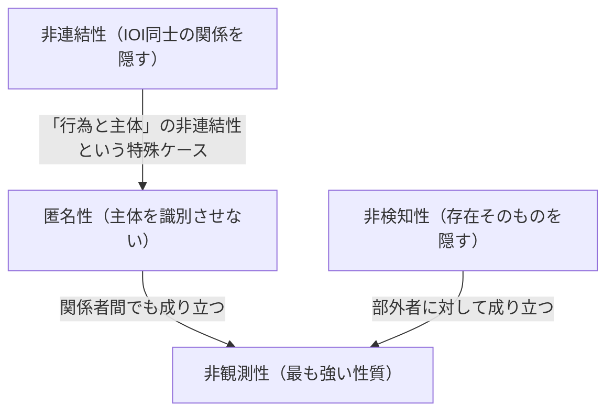

# 01. プライバシーの基本概念（匿名性・非連結性・PII）

> 次: [02 匿名化と差分プライバシー](./02_anonymization-and-dp.md) ｜ 層: 基礎(Layer 1)

**この1ページで分かること**

- 「匿名」を工学的に扱う4つの性質（匿名性・非連結性・非検知性・非観測性）と仮名性の違い
- 匿名性の強さを「紛れられる候補の数（匿名性集合）」で測るという発想
- 米国流の PII と GDPR の「個人データ」の範囲の違い

「プライバシー」は日常語では曖昧だが、工学として扱うには厳密な語彙が要る。
Pfitzmann と Hansen が提案した用語体系（IETF草稿＝インターネット標準の下書き文書として公開。
プライバシー脅威を体系的に洗い出す脅威モデリング手法 LINDDUN でも標準的に使われる）を土台にする。

---

## 前提：攻撃者モデルと「関心のある事柄（IOI）」

[`../02_cryptography/01_goals-and-primitives.md`](../02_cryptography/01_goals-and-primitives.md)
で見た「安全性は攻撃者が何を知っているかに対して定義する」という考え方は、プライバシーでも
そのまま通用する。すべての定義は **「ある攻撃者の視点から見て」** という条件付きで書かれる。

```
IOI（Item of Interest）: 主体（subject）・メッセージ・行為など、保護したい「関心の対象」
```

---

## 匿名性集合（Anonymity Set）

```
ある主体が区別できない「主体の集合全体」。攻撃者の知識に依存し、時間とともに変化しうる。
```

すべての定義の土台になる概念。集合が大きいほど（＝候補が多いほど）匿名性は強い。
「候補が何人いるか」を確率分布のエントロピー（＝不確かさの量を bit 単位で測る尺度）で定量化する方法もある
（[`../01_prerequisites/01_math-for-crypto/05_info-theory/01_entropy.md`](../01_prerequisites/01_math-for-crypto/05_info-theory/01_entropy.md)
のエントロピーと同じ発想——候補が一様分布なら `log2(集合の大きさ)` bit の不確かさ）。

---

## 4つの基本性質（原文の定義を直訳）

### 匿名性 (Anonymity)

> 「ある主体の匿名性とは、その主体が主体の集合（匿名性集合）の中で識別できないこと」
> （攻撃者視点で言い換えると）「攻撃者がその主体を十分に識別できないこと」

### 非連結性 (Unlinkability)

> 「2つ以上のIOI（主体・メッセージ・行為など）の非連結性とは、システム内でそれらのIOIが
> 互いに関係しているかどうかを攻撃者が十分に区別できないこと」

匿名性は「非連結性の特殊ケース」と見なせる——「ある行為」と「ある主体」が
連結できない、という関係の非連結性が匿名性そのもの。

### 非検知性 (Undetectability)

> 「あるIOIの非検知性とは、それが**存在するかどうか自体**を攻撃者が十分に区別できないこと」

匿名性・非連結性は「誰が・何と関係するか」を隠すのに対し、非検知性は
**IOIの存在そのもの**を隠す、一段階強い（別種の）保護。

### 非観測性 (Unobservability)

> 「あるIOIの非観測性とは、そのIOIに関与しない全ての主体に対する非検知性 **かつ**
> そのIOIに関与する主体同士の間でさえ成り立つ匿名性のこと」

4つの中で最も強い性質——部外者には「そもそも何も起きていない」ように見え（非検知性）、
かつ関係者同士でさえ相手が誰かを完全には識別できない（匿名性）状態。

### 4性質の対比と関係

| 性質 | 隠すもの | 直感 |
|---|---|---|
| 匿名性 | 「誰がやったか」 | 匿名性集合の中に紛れて識別されない |
| 非連結性 | 「IOI同士が関係しているか」 | 行為同士・行為と主体を結びつけられない |
| 非検知性 | 「そもそも存在するか」 | 起きたこと自体が見えない |
| 非観測性 | 存在＋関係者間の身元 | 部外者には何も見えず、関係者同士でも匿名 |



---

## 仮名性 (Pseudonymity) ── 匿名性とは違う中間状態

```
仮名 (pseudonym): 主体の「本名」以外の識別子
仮名性: 仮名を識別子として使うこと
```

匿名性とは異なり、仮名は**文脈によって実名と結びつけられる余地が残る**。
同じ仮名を使い続ければ、その仮名に紐づく行動履歴が蓄積し、やがて非連結性が
崩れて実名特定に至ることもある（例: SNSの「捨てアカウント」が投稿の書き方の癖から
本人特定される）。仮名性は匿名性と識別可能性の間の**連続的なグラデーション**として捉える。

---

## PII（個人識別情報）と GDPR の「個人データ」

PII（Personally Identifiable Information）は米国で広く使われる用語（代表的な定義は NIST SP 800-122）。

```
NIST の定義:
  個人を特定・追跡できる情報（氏名・社会保障番号・生年月日等）
  + 個人に紐づく／紐づけ得るその他の情報（医療・教育・金融・雇用情報等）

GDPR 第4条の「個人データ」:
  識別された、または識別され得る自然人に関するあらゆる情報
  （氏名・識別番号・位置情報・オンライン識別子・身体的/生理的/遺伝的/精神的/
    経済的/文化的/社会的アイデンティティを特定しうる一つ以上の要素を含む）
```

**GDPR の「個人データ」は PII より広い**——Cookie やデバイスIDのように、単体では
「誰か」を直接特定できなくても「識別され得る」なら GDPR上は個人データに含まれる。
米国的な PII 概念は EU の個人データ概念の**部分集合**と考えるとよい。
GDPR の詳細は [06 GDPR概観・DPIA](./06_law-and-dpia.md) で扱う。

---

## 具体例で確認

| シナリオ | 該当する性質 |
|---|---|
| 投票用紙に名前を書かない（誰が投票したかは分かるが、何に投票したかは分からない） | 匿名性（内容と主体の非連結性） |
| 同じユーザーの複数回のログインが同一人物によるものか分からない | 非連結性 |
| 暗号化通信の存在自体を検閲者が検出できない（ステガノグラフィ＝データを別のデータの中に埋め込んで存在自体を隠す技術） | 非検知性 |
| Tor が「誰が・誰と通信しているか」を関係者間でも隠す設計を目指す | 非観測性（理想としての目標） |
| ハンドルネームで継続的に投稿するが実名は明かさない | 仮名性 |

Tor の実際の設計は [04 匿名通信](./04_anonymous-comms.md) で、匿名性集合を実データで
どう構成するかは [02 匿名化と差分プライバシー](./02_anonymization-and-dp.md) で扱う。

---

## 演習（解答つき）

1. 「メッセージの送信者は分かるが、宛先は分からない」状況はどの性質に該当するか。
2. 仮名性が匿名性より弱いとされる理由を一言で述べよ。
3. Cookie は米国的な PII の定義には当てはまらないことがあるが、GDPR上は個人データとして
   扱われることが多い。この違いが生まれる理由を一言で述べよ。

<details><summary>解答</summary>

1. **非連結性**（送信者というIOIと宛先というIOIの間の関係を攻撃者が区別できない状態）。
   匿名性そのものではなく「送信者と宛先の組み合わせ」が連結できない、という形。
2. 仮名は主体の識別子として機能し続けるため、同じ仮名の下での行動が蓄積されると
   行動パターンから実名特定に至るリスクが残る。匿名性は主体をそもそも
   匿名性集合の中で識別不能にするため、この蓄積リスクがない。
3. PII は「それ単体で個人を特定・追跡できる情報」に着目するのに対し、GDPRの個人データは
   「間接的にでも識別され得る」情報まで含む広い定義。Cookie は単体では実名を明かさないが、
   他の情報と組み合わせて個人を識別できる可能性があるため、GDPR上は個人データとみなされる。

</details>

---

## 次への接続

「匿名性集合」を抽象概念ではなく**実データ**でどう作るか（k-匿名化）、
そして統計的な問い合わせに対して数学的に保証された匿名性（差分プライバシー）を見る。
→ [02 匿名化と差分プライバシー](./02_anonymization-and-dp.md)

---

## 参考

- Pfitzmann, A., Hansen, M. *A terminology for talking about privacy by data minimization*
  (IETF草稿): https://www.ietf.org/archive/id/draft-hansen-privacy-terminology-01.html
- NIST — Personally Identifiable Information (PII) 定義: https://csrc.nist.rip/glossary/term/personally_identifiable_information
- GDPR 第4条（定義）: https://gdpr-info.eu/art-4-gdpr/
