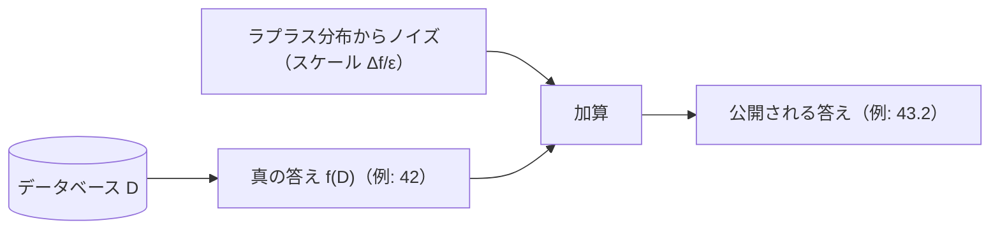

# 02. 匿名化と差分プライバシー

> 前: [01 プライバシーの基本概念](./01_privacy-concepts.md) ｜ 次: [03 暗号的PET](./03_ppt-cryptographic/README.md) ｜ 層: 基礎(Layer 1)

**この1ページで分かること**

- 「属性の組み合わせ」で個人が特定される問題と、それを粗くして防ぐ k-匿名化とその発展形
- 匿名化済みデータが外部データとの突き合わせで破られた実例（AOL・Netflix）
- 攻撃者の背景知識に依存しない数学的保証＝差分プライバシーの考え方

名前を消しただけの表は匿名ではない。郵便番号・性別・生年月日の組み合わせだけで米国人の 87% が一意に特定できる（Sweeney）。「どこまで粗くすれば安全か」を扱うのがこのページ。

---

## まず最小の例：4 行の表を k=2 にする

| 元データ（年齢, 郵便番号） | k=2 に一般化後 |
|---|---|
| (23, 12345) | (20-29, 1234*) |
| (27, 12349) | (20-29, 1234*) |
| (45, 54321) | (40-49, 5432*) |
| (48, 54329) | (40-49, 5432*) |

年齢を区間化し（**一般化**）、郵便番号の末尾を伏せる（**抑制**）。各グループが 2 件ずつになり、「準識別子の組」からはどちらの行か区別できない。これが **k-匿名化**（k=2）。

---

## 準識別子と k-匿名化

```
準識別子 (quasi-identifier): 単体では個人を特定できないが、組み合わせると特定できる属性
  例: 郵便番号・性別・生年月日
k-匿名化 (Sweeney, 2002): 各レコードが準識別子に関して他 k−1 件と区別できないようにする
```

---

## k-匿名化の弱点と発展形

k-匿名化は準識別子しか見ていないため、**機微な属性**（病名など）は守れない（Machanavajjhala et al., 2007）。

| 攻撃 | 何が起きるか |
|---|---|
| 等質性攻撃 | グループの k 件全員が同じ病名なら、k-匿名でも病名は漏れる |
| 背景知識攻撃 | 「日本人は心臓病が少ない」等の外部知識で候補を絞れる |

| 発展形 | 制約 | 残る弱点 |
|---|---|---|
| **l-多様性**（2007） | 各グループ内で同じ機微値のレコードが全体の 1/l 以下 | 分布の偏り（大半が軽症・少数が重症）は守れない |
| **t-近接性**（Li et al., 2007） | 各グループの機微値の分布が全体の分布と距離 t 以内 | 実装・パラメータ選定が複雑 |

---

## それでも破られる：再識別事件

構文的な匿名化は、攻撃者の**外部データとの突き合わせ**に原理的に弱い。

| 事件 | 何が起きたか |
|---|---|
| **AOL 検索ログ（2006）** | ID を乱数に置き換えて 2000 万件公開。検索内容（自分の名前・住所を検索する癖）から NYT が「ユーザー #4417749」を 62 歳女性と特定。CTO 辞任 |
| **Netflix Prize（2008）** | 匿名化した 50 万人の映画評価を IMDb の公開レビューと突き合わせて再識別（Narayanan & Shmatikov） |

**教訓**: 攻撃者がどんな外部知識を持つかは事前に想定しきれない。

---

## 差分プライバシー（Dwork et al., 2006）

発想を変える。「1 人分のデータがあってもなくても、集計結果はほぼ変わらない」ことを**数学的に保証**する。

```
最小の例: 「病気 X の患者数」を答える
  D  = 全員のデータ           → 真の答え 42
  D' = A さんを抜いたデータ   → 真の答え 41
  出力にノイズを足す:  D → 43.2,  D' → 42.7   ← どちらの出力か見分けにくい
  → 出力から「A さんが含まれているか」を推定できない
```

```
ランダム化アルゴリズム M が ε-差分プライバシーを満たす ⟺
  1 件だけ異なる任意の D, D' と任意の出力集合 S について
      Pr[M(D)∈S] ≤ e^ε · Pr[M(D')∈S]
```

攻撃者がどんな背景知識を持っていても成り立つ。`ε`（プライバシー予算）が小さいほど保証は強く、ノイズが増えて有用性は下がる——トレードオフを 1 つのパラメータで制御できる。

### ラプラスメカニズム



`Δf`（感度）は 1 件の増減で `f` が最大どれだけ変わるか。人数を数えるなら `Δf=1`。`ε` を小さくするほどノイズが大きくなる。

### 予算の合成

クエリに答えるたびに漏洩が積み重なり、`ε` の合計が実効的な保証になる。実運用では「予算をどう配分するか」の設計が要る。

---

## まとめ表

| 手法 | 何を守るか | 弱点 |
|---|---|---|
| k-匿名化 | 準識別子からの再識別 | 等質性攻撃・背景知識攻撃 |
| l-多様性 | 機微属性の偏り | 分布の類似性攻撃 |
| t-近接性 | 機微属性の分布の歪み | 実装が複雑 |
| 差分プライバシー | 個人の存在有無そのもの | ノイズによる有用性低下、予算管理 |

---

## 演習（解答つき）

1. k-匿名化を満たすデータで等質性攻撃が成立する条件を一言で述べよ。
2. AOL 事件で ID の置き換えが失敗した根本原因を述べよ。
3. `ε` を大きくすると差分プライバシーの保証と有用性はそれぞれどうなるか。

<details><summary>解答</summary>

1. 準識別子で作られたグループ（k 件）内の全レコードが同じ機微な属性値を持つ場合。どの行が本人か分からなくても機微な値は一意に定まる。
2. 準識別子に相当する情報（検索クエリの内容）が平文のまま残り、外部の公開情報と突き合わせれば再識別できた。体系的な一般化を全く行っていなかった。
3. 隣接データセット間で許容される出力分布の差が大きくなるため**保証は弱くなる**が、必要なノイズが減るので**有用性は上がる**。

</details>

---

## 次への接続

匿名化・差分プライバシーは「公開するデータをどう加工するか」だった。次は**問い合わせや計算そのものを暗号的に隠す**道具（PIR・秘密計算）。
→ [03 暗号的PET](./03_ppt-cryptographic/README.md)

---

## 参考

- Sweeney, L. (2002). *k-Anonymity: A Model for Protecting Privacy*. IJUFKS.
- Machanavajjhala, A. et al. (2007). *l-Diversity: Privacy Beyond k-Anonymity*. ICDE.
- Li, N., Li, T., Venkatasubramanian, S. (2007). *t-Closeness*. ICDE.
- Dwork, C., McSherry, F., Nissim, K., Smith, A. (2006). *Calibrating Noise to Sensitivity in Private Data Analysis*. TCC.
- Narayanan, A., Shmatikov, V. (2008). *Robust De-anonymization of Large Sparse Datasets*. IEEE S&P.
