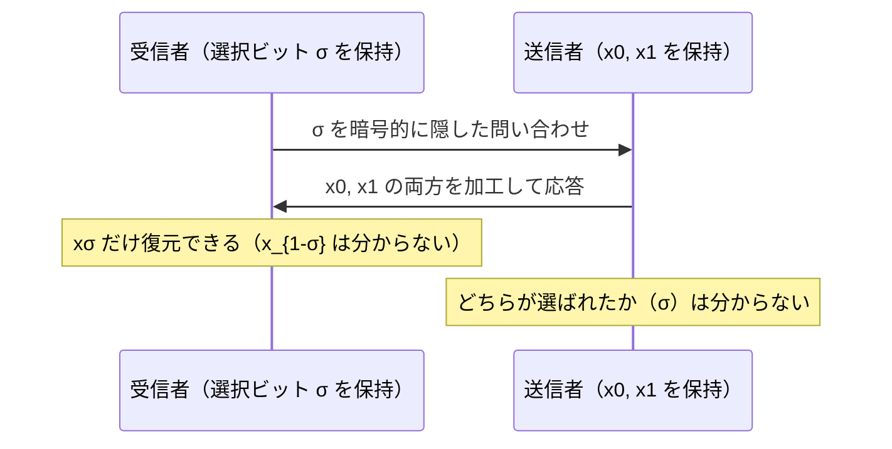

# 03. 暗号的プライバシー強化技術（PIR・OT・MPC/FHE応用）

> 前: [02 匿名化と差分プライバシー](./02_anonymization-and-dp.md) ｜ 次: [04 匿名通信](./04_anonymous-comms.md) ｜ 層: 基礎(Layer 1)

**この1ページで分かること**

- 「何を問い合わせたか」自体を隠す PIR と、「どれを選んだか」を隠す OT の問題設定
- OT が秘密計算（MPC）を支える基礎部品になっている理由
- MPC・FHE がプライバシー保護に実際どう使われているか（Password Checkup・連絡先発見・医療データ解析）

[02](./02_anonymization-and-dp.md) は「公開するデータをどう加工するか」だった。ここでは逆に、
**問い合わせ・計算そのものを暗号的に隠す**道具を見る。
[`../00_overview/02_five-pillars-map.md`](../00_overview/02_five-pillars-map.md) で
「暗号⇄プライバシー」の交差点として挙げた MPC（複数者が互いの入力を秘密にしたまま共同計算する秘密計算）・
FHE（暗号化したまま計算できる完全準同型暗号）の応用がここに当たる
（MPC・FHE 自体の仕組みは
[`../02_cryptography/06_advanced-topics-map.md`](../02_cryptography/06_advanced-topics-map.md)
で扱った。ここでは重複させず、プライバシー用途の視点だけ補う）。

---

## PIR（Private Information Retrieval）

```
問題: データベースから項目 i を取得したいが、「どの項目を見たか」をサーバに知られたくない
自明な解: データベース全体をダウンロードする
  → 情報理論的に完全なプライバシーだが、通信量が O(n)（データベース全件分）で非現実的
```

Chor, Goldreich, Kushilevitz, Sudan（1995年）が理論的な枠組みを確立。
「自明な全件ダウンロードより効率的に、それでもどの項目を見たか隠す」ことが研究課題になる。

```
複数サーバPIR: 同じデータベースを複製した複数のサーバに問い合わせを分散
  （サーバ同士が結託しないという前提のもとで情報理論的に安全）
単一サーバPIR: 1台のサーバに対して、準同型暗号（＝暗号化したまま計算できる暗号。FHEやその軽量版）で暗号化した
  問い合わせを送る（計算量的安全性。02_cryptography/06のFHEがそのまま道具になる）
```

**用途例**: 特定の遺伝子疾患についてのデータベースに問い合わせたいが、
「どの疾患を調べたか」自体がその人の健康状態を推測させてしまうため、
問い合わせ内容を隠したまま結果だけを得たい、といった医療データベース検索。

---

## Oblivious Transfer（OT）

```
問題: 送信者が持つ複数のメッセージのうち、受信者が選んだ1つだけを渡したい。
  送信者は「どれが選ばれたか」を知ってはいけない。
  受信者は「選ばなかった方の中身」を知ってはいけない。
```

- **Rabin の OT（1981年）**: RSAベース。送信者の1つのメッセージが確率1/2で届く
  「オール・オア・ナッシング」型。
- **1-out-of-2 OT（Even, Goldreich, Lempel, 1985年）**: 送信者が `(x0, x1)` を持ち、
  受信者がビット `σ` を選ぶと `xσ` だけを受け取れる。送信者は `σ` を知らず、
  受信者は `x_{1-σ}` を知らない。



### なぜ重要か：MPC の内部部品

[`02_cryptography/06_advanced-topics-map.md`](../02_cryptography/06_advanced-topics-map.md)
で扱った **Yao のガーブルド回路**は、受信者が「自分の入力ビットに対応する配線ラベルだけ」を
送信者に入力を明かさずに受け取る必要がある——これがまさに 1-out-of-2 OT の出番。
OT は MPC 全体を支える基礎部品の1つ。

---

## MPC・FHE のプライバシー応用

仕組み自体は [`../02_cryptography/06_advanced-topics-map.md`](../02_cryptography/06_advanced-topics-map.md)
参照。ここでは実際にどう使われているかだけ挙げる。

### Private Set Intersection（PSI）— MPCの実用例

```
2者がそれぞれ集合を持ち、「共通の要素は何か」だけを知りたい（それ以外の要素は互いに秘密）
```

- **Google Password Checkup**: 自分のパスワードのハッシュ（＝データを固定長の値に変換する一方向関数の出力）を
  「盲化」（ランダムな値でマスク）した値をサーバに送り、
  サーバは中身を知らないままその値に処理を施して返す（OPRF＝入力を明かさずに関数値を計算してもらう技術）。
  最終的にユーザー側だけが「自分のパスワードが40億件の漏洩済み認証情報リストに
  含まれるか」を判定でき、サーバはパスワードそのものを一切知らない。
- **連絡先発見機能**: メッセージアプリが「電話帳の連絡先のうち誰がこのアプリを
  使っているか」を、電話帳全体をサーバにアップロードせずに判定する。

### FHE のプライバシー応用

暗号化した医療・ゲノムデータをクラウドで解析し、結果だけを復号する
——[02_cryptography/06](../02_cryptography/06_advanced-topics-map.md) で見た
Gentry方式の完全準同型暗号がそのまま「データを見せずに計算を委託する」プライバシー技術になる。

---

## まとめ表

| 技術 | 隠すもの | 代表方式 |
|---|---|---|
| PIR | どの項目に問い合わせたか | 複数サーバ型／FHEベース単一サーバ型 |
| OT | 選ばれた項目・選ばなかった項目の中身 | Rabin OT／1-out-of-2 OT |
| PSI（MPC応用） | 集合の共通部分以外の要素 | ガーブルド回路・OTベースのプロトコル |
| FHE応用 | 計算対象のデータそのもの | Gentry方式（[02_cryptography/06](../02_cryptography/06_advanced-topics-map.md)） |

---

## 演習（解答つき）

1. PIRの「自明な解」（全件ダウンロード）がなぜ実用上問題になるのか述べよ。
2. 1-out-of-2 OT で、送信者・受信者それぞれが知ってはいけない情報は何か。
3. Google Password Checkup が「サーバがパスワードを知らないまま」漏洩判定できる理由を一言で述べよ。

<details><summary>解答</summary>

1. 通信量がデータベースの全サイズに比例する（`O(n)`）ため、データベースが巨大になるほど
   現実的な通信コストで問い合わせられなくなる。
2. 送信者は受信者がどちらのビット `σ` を選んだかを知ってはいけない。
   受信者は選ばなかった方のメッセージ `x_{1-σ}` の中身を知ってはいけない。
3. パスワードのハッシュを盲化（ランダム化）した値だけをサーバに送るため、
   サーバは受け取った値から元のパスワードを復元できず、それでも盲化を除去した後の
   結果がユーザー側で「漏洩リストに含まれるか」の判定に使える構造になっているため。

</details>

---

## 次への接続

問い合わせや計算の**内容**を隠す道具を見た。次は「誰が誰と通信しているか」という
**通信路そのもの**を隠す技術（匿名通信）に進む。
→ [04 匿名通信](./04_anonymous-comms.md)

---

## 参考

- Chor, B., Goldreich, O., Kushilevitz, E., Sudan, M. (1995). *Private Information Retrieval*. FOCS.
- Rabin, M. (1981). *How to Exchange Secrets by Oblivious Transfer*.
- Even, S., Goldreich, O., Lempel, A. (1985). *A Randomized Protocol for Signing Contracts*. CACM（1-out-of-2 OTの初出）。
- NIST — Privacy-Enhancing Cryptography: PSI/PSO: https://csrc.nist.gov/Projects/pec/psi
