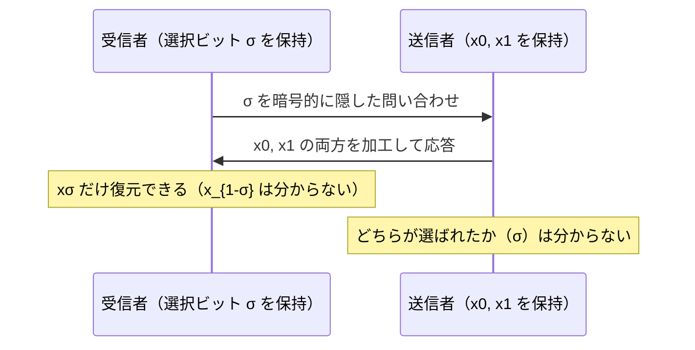

# 01. PIR と Oblivious Transfer

> 親: [README](./README.md) ｜ 次: [02 ゼロ知識証明](./02_zero-knowledge-proofs.md) ｜ 層: 基礎(Layer 1)

暗号は「通信を盗聴から守る」道具として始まったが、
**問い合わせの内容そのものを相手に隠す**こともできる。
サーバにデータを渡さずに答えだけを得る、という一見矛盾した要求を扱う2つの原始的な部品を見る。

---

## PIR（Private Information Retrieval）

```
問題: データベースから項目 i を取得したいが、「どの項目を見たか」をサーバに知られたくない
自明な解: データベース全体をダウンロードする
  → 情報理論的に完全なプライバシーだが、通信量が O(n)（全件分）で非現実的
```

Chor, Goldreich, Kushilevitz, Sudan（1995年）が理論的な枠組みを確立した。
研究課題は「**自明な全件ダウンロードより効率的に、それでもどの項目を見たか隠す**」ことになる。

```
複数サーバPIR: 同じデータベースを複製した複数のサーバに問い合わせを分散する
  （サーバ同士が結託しないという前提のもとで情報理論的に安全）
単一サーバPIR: 1台のサーバに、準同型暗号で暗号化した問い合わせを送る
  （計算量的安全性。FHE がそのまま道具になる → ./03_mpc-and-fhe.md）
```

**用途例**: 特定の遺伝子疾患についてデータベースに問い合わせたいが、
「どの疾患を調べたか」自体がその人の健康状態を推測させてしまう。
問い合わせ内容を隠したまま結果だけを得たい——医療データベース検索がこれにあたる。

> **なぜ「見た項目」を隠す必要があるのか**は、[`../01_privacy-concepts.md`](../01_privacy-concepts.md)
> の議論と繋がる。問い合わせの履歴はメタデータであり、内容を暗号化しても残る種類の情報である。

---

## Oblivious Transfer（OT）

```
問題: 送信者が持つ複数のメッセージのうち、受信者が選んだ1つだけを渡したい。
  送信者は「どれが選ばれたか」を知ってはいけない。
  受信者は「選ばなかった方の中身」を知ってはいけない。
```

**両方向に秘密がある**点が特徴。片方だけを隠すのは簡単だが、双方を同時に満たすのが難しい。

- **Rabin の OT（1981年）**: RSA ベース。送信者の1つのメッセージが確率 1/2 で届く
  「オール・オア・ナッシング」型
- **1-out-of-2 OT（Even, Goldreich, Lempel, 1985年）**: 送信者が `(x0, x1)` を持ち、
  受信者がビット `σ` を選ぶと `xσ` だけを受け取れる。送信者は `σ` を知らず、
  受信者は `x_{1-σ}` を知らない



### なぜ重要か：MPC の内部部品

[`../../02_cryptography/06_advanced-topics-map.md`](../../02_cryptography/06_advanced-topics-map.md)
で扱った **Yao のガーブルド回路**では、受信者が
「自分の入力ビットに対応する配線ラベルだけ」を、
送信者に自分の入力を明かさずに受け取る必要がある——これがまさに 1-out-of-2 OT の出番。

**OT は MPC 全体を支える基礎部品の1つ**であり、
単独の応用技術というより「秘密計算の部品」として理解するのが正しい。
MPC の使い方は [03](./03_mpc-and-fhe.md) で扱う。

---

## 演習（解答つき）

1. PIR の「自明な解」（全件ダウンロード）がなぜ実用上問題になるのか述べよ。
2. 1-out-of-2 OT で、送信者・受信者それぞれが知ってはいけない情報は何か。
3. 複数サーバ PIR が「情報理論的に安全」とされるのに、単一サーバ PIR が
   「計算量的安全」にとどまる理由を述べよ。

<details><summary>解答</summary>

1. 通信量がデータベースの全サイズに比例する（`O(n)`）ため、
   データベースが巨大になるほど現実的な通信コストで問い合わせられなくなる。
   プライバシーは完全だが、実用性が失われる。
2. **送信者**は受信者がどちらのビット `σ` を選んだかを知ってはいけない。
   **受信者**は選ばなかった方のメッセージ `x_{1-σ}` の中身を知ってはいけない。
   両方向の秘密を同時に満たす必要がある点が OT の難しさである。
3. 複数サーバ PIR は「サーバ同士が結託しない」という**前提**の下で、
   各サーバが受け取る問い合わせが本当の問い合わせについて情報を持たないよう構成できる。
   計算能力に関わらず安全なので情報理論的である。
   一方、単一サーバ PIR は準同型暗号で問い合わせを暗号化するため、
   安全性は**その暗号が破られないこと**（計算量的な仮定）に依存する。

</details>

---

## 次への接続

ここまでは「データを見せずに答えを得る」道具だった。次は逆向きの問題——
**秘密を明かさずに、自分がそれを知っていることを相手に納得させる**技術を見る。
→ [02 ゼロ知識証明](./02_zero-knowledge-proofs.md)

---

## 参考

- Chor, B., Goldreich, O., Kushilevitz, E., Sudan, M. (1995). *Private Information Retrieval*. FOCS.
- Rabin, M. (1981). *How to Exchange Secrets by Oblivious Transfer*.
- Even, S., Goldreich, O., Lempel, A. (1985). *A Randomized Protocol for Signing Contracts*. CACM（1-out-of-2 OT の初出）。
- NIST — Privacy-Enhancing Cryptography: PSI/PSO: https://csrc.nist.gov/Projects/pec/psi
