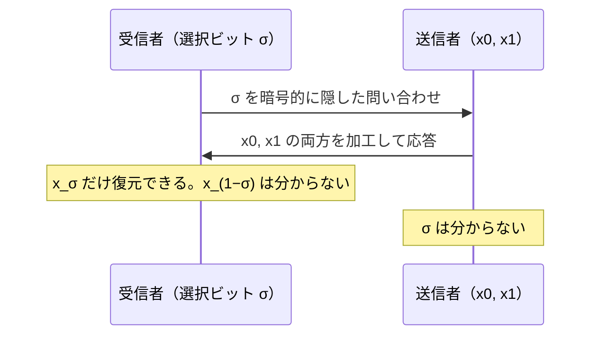

# 01. PIR と Oblivious Transfer

> 親: [README](./README.md) ｜ 次: [02 ゼロ知識証明](./02_zero-knowledge-proofs.md) ｜ 層: 基礎(Layer 1)

**この1ページで分かること**

- PIR＝「データベースのどの項目を見たか」をサーバに隠して取得する技術と、自明解（全件取得）との対比
- OT＝「送信者は何が選ばれたか知らず、受信者は選ばなかった方を知らない」という双方向の秘密
- OT が MPC（秘密計算）の基礎部品であること

「図書館でどの本を借りたかを司書に知られずに借りたい」。暗号は通信の中身だけでなく、**問い合わせの内容そのもの**を相手に隠すこともできる。その最小部品が PIR と OT。

---

## まず最小の例：2 要素のデータベース

```
サーバ: x₀ = "はい",  x₁ = "いいえ"  の 2 項目を持つ
受信者: 項目 1 が欲しいが、「1 を選んだ」ことをサーバに知られたくない

自明な解: 両方ダウンロードする → プライバシーは完全。でも項目が 100 万件なら 100 万件全部
PIR/OT:  暗号的に加工した問い合わせを送り、x₁ だけを復元。サーバは 0 か 1 か分からない
```

OT ではさらに「受信者は x₀ を知ってはいけない」という条件が加わる（下で区別する）。

---

## PIR（Private Information Retrieval）

```
問題: 項目 i を取得したいが「どの i か」をサーバに知られたくない
自明な解: 全件ダウンロード → 通信量 O(n) で非現実的
```

Chor, Goldreich, Kushilevitz, Sudan（1995）が枠組みを確立。課題は「全件取得より効率的に、それでも `i` を隠す」。

| 方式 | 仕組み | 安全性の種類 |
|---|---|---|
| 複数サーバ PIR | 同じ DB を持つ複数サーバに問い合わせを分散 | **情報理論的**（サーバ同士が結託しない前提。計算能力に依らない） |
| 単一サーバ PIR | 準同型暗号（暗号化したまま計算できる暗号）で問い合わせを暗号化 | **計算量的**（暗号が破られない仮定。FHE が道具 → [03](./03_mpc-and-fhe.md)） |

**用途例**: 遺伝子疾患のデータベース検索。「どの疾患を調べたか」自体が健康状態を漏らす。問い合わせ履歴はメタデータであり、中身を暗号化しても残る（[`../01_privacy-concepts.md`](../01_privacy-concepts.md)）。

---

## Oblivious Transfer（OT）

```
問題: 送信者が複数のメッセージを持ち、受信者が選んだ 1 つだけを渡す
  送信者は「どれが選ばれたか」を知ってはいけない
  受信者は「選ばなかった方の中身」を知ってはいけない
```

**両方向に秘密がある**点が PIR との違い。片方だけなら簡単だが、同時に満たすのが難しい。

| 方式 | 内容 |
|---|---|
| Rabin の OT（1981） | RSA ベース。1 つのメッセージが確率 1/2 で届く「オール・オア・ナッシング」型 |
| **1-out-of-2 OT**（Even, Goldreich, Lempel, 1985） | 送信者 `(x₀, x₁)`、受信者がビット `σ` を選ぶと `x_σ` だけ受け取る |



### なぜ重要か：MPC の内部部品

[`06_advanced-topics-map.md`](../../02_cryptography/06_advanced-topics-map.md) の **Yao のガーブルド回路**では、受信者が「自分の入力ビットに対応する配線ラベルだけ」を、入力を明かさずに受け取る必要がある——これが 1-out-of-2 OT の出番。OT は単独の応用技術ではなく**秘密計算の部品**。使い方は [03](./03_mpc-and-fhe.md)。

---

## 演習（解答つき）

1. PIR の「自明な解」（全件ダウンロード）がなぜ実用上問題になるのか述べよ。
2. 1-out-of-2 OT で、送信者・受信者それぞれが知ってはいけない情報は何か。
3. 複数サーバ PIR が「情報理論的に安全」とされるのに、単一サーバ PIR が「計算量的安全」にとどまる理由を述べよ。

<details><summary>解答</summary>

1. 通信量が DB の全サイズに比例する（`O(n)`）ため、DB が巨大になるほど現実的なコストで問い合わせられない。プライバシーは完全だが実用性が失われる。
2. **送信者**は受信者が選んだビット `σ`。**受信者**は選ばなかった `x_(1−σ)` の中身。両方向の秘密を同時に満たす点が難しさ。
3. 複数サーバ PIR は「サーバ同士が結託しない」前提の下、各サーバが受け取る問い合わせが本当の `i` について情報を持たないよう構成できる。計算能力に依らないので情報理論的。単一サーバ PIR は準同型暗号に依存するため、安全性は**その暗号が破られないこと**（計算量的仮定）に依存する。

</details>

---

## 次への接続

ここまでは「データを見せずに答えを得る」道具。次は逆向き——**秘密を明かさずに、それを知っていることを相手に納得させる**技術。
→ [02 ゼロ知識証明](./02_zero-knowledge-proofs.md)

---

## 参考

- Chor, B., Goldreich, O., Kushilevitz, E., Sudan, M. (1995). *Private Information Retrieval*. FOCS.
- Rabin, M. (1981). *How to Exchange Secrets by Oblivious Transfer*.
- Even, S., Goldreich, O., Lempel, A. (1985). *A Randomized Protocol for Signing Contracts*. CACM.
- NIST — Privacy-Enhancing Cryptography: PSI/PSO: https://csrc.nist.gov/Projects/pec/psi
