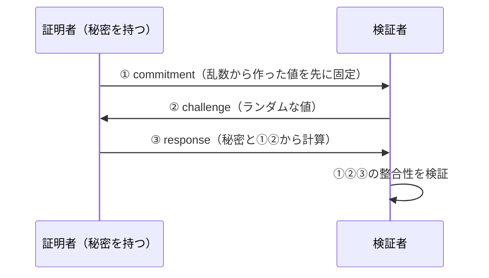

# 02. ゼロ知識証明

> 親: [README](./README.md) ｜ 前: [01 PIR と OT](./01_pir-and-ot.md) ｜ 次: [03 MPC と FHE](./03_mpc-and-fhe.md) ｜ 層: 基礎(Layer 1)

**この1ページで分かること**

- ゼロ知識証明の 3 性質が「それぞれ誰を守るか」
- 健全性に 2 段階あり、認証に使うなら強い方（knowledge soundness）が必要なこと
- Σプロトコルの 3 ステップが**なぜ 3 つ必要か**、任意の計算には制約への変換が要ること

「パスワードを言わずに、パスワードを知っていると証明する」。語義矛盾に見えるが実現できる（Goldwasser–Micali–Rackoff, 1985）。

---

## まず最小の例：色の区別を証明する

```
主張: 「私は赤と緑を見分けられる」（相手は色覚がなく、2 つの玉は同じに見える）

1. 相手が玉を 1 つ選んで見せる           ← commitment
2. 相手が背中で玉を入れ替えるか、そのままにするか、コインで決める  ← challenge
3. 私が「入れ替えた／入れ替えていない」と答える                  ← response

嘘なら正解率 1/2。20 回繰り返して全部当てれば、嘘の確率は 1/2²⁰ ≈ 100 万分の 1。
相手は「私が見分けられる」ことだけ知り、どちらが赤かは学ばない。
```

これがゼロ知識証明の骨格。暗号版はこの「玉」を数学的な値に置き換える。

---

## 3 つの性質

| 性質 | 主張 | **誰を守るか** |
|---|---|---|
| **完全性** (completeness) | 主張が真で証明者が正直なら、検証者は必ず受理 | 正直な証明者（正しいのに拒否されない） |
| **健全性** (soundness) | 主張が偽なら、検証者は（高確率で）拒否 | 検証者（嘘を通されない） |
| **ゼロ知識性** (zero-knowledge) | 検証者は「主張が真」以外に何も学べない | 証明者の秘密 |

3 つが別々の主体を守る。1 つ外すと誰かが損をする。

---

## 健全性の 2 段階

| 段階 | 保証すること | 足りない場面 |
|---|---|---|
| 通常の健全性 | その主張は真である | 「秘密鍵が**存在する**」しか言えない |
| **knowledge soundness** | 証明者は実際にその秘密を**知っている** | 認証にはこれが要る |

秘密鍵は誰かが持っていれば存在する。だから認証（「私は秘密鍵を知っている」）では通常の健全性は本人確認にならない。認証用途は knowledge soundness（proof of knowledge）が必要（[`05_protocols/README.md`](../../02_cryptography/05_protocols/README.md)）。

---

## Σプロトコル：3 ステップの構造

最も基本的な形。Schnorr（1989）は「離散対数を知っている」ことを値を明かさず証明する。



### なぜ 3 ステップ必要なのか

| 省くと | 何が壊れるか |
|---|---|
| ① commitment | チャレンジを見てから都合のよい値を後付けできる → **健全性が崩れる** |
| ② challenge をランダムにしない | 事前に答えを用意できる → **健全性が崩れる** |
| ③ response | 何も証明されない |

**①で逃げ道を封じ、②で予測を封じ、③で知識を示す**。チャレンジレスポンス認証と同じ構造。

---

## Fiat–Shamir 変換：対話を消す

Σプロトコルは対話が要るので、署名のように「一方的に送る」用途に使えない。

```
検証者が選ぶはずのチャレンジを、ハッシュ関数で自分で作る
    challenge = H(commitment ‖ メッセージ)
→ 非対話型になる
```

証明者が自分でチャレンジを作っても健全性が崩れないのは、ハッシュ出力を制御できないから。ただし**ランダムオラクル仮定**（ハッシュが完全にランダムな関数として振る舞う）が要る。

**この変換の産物が Schnorr 署名で、その系統に EdDSA がある。** 「秘密鍵を知っていることのゼロ知識証明」にメッセージをチャレンジに含めると署名になる。デジタル署名はゼロ知識証明の応用（[`04_digital-signatures.md`](../../02_cryptography/03_public-key-crypto/04_digital-signatures.md)）。

---

## 任意の計算を証明する：算術回路と R1CS

Σプロトコルが扱えるのは特定の代数的主張だけ。「このプログラムを正しく実行した」を証明するには変換が要る。

```
証明したい計算 → 算術回路（加算と乗算のゲート）→ R1CS（変数間の双線形制約の集合）→ 証明系
```

**この変換が実務の主要コスト**。ハッシュ・比較・分岐を含む処理は制約数が爆発し、証明生成が重くなる。通常のプログラミングで軽い処理が算術回路では高コスト——実装の難しさは暗号ではなく変換にある。

| 系統 | 証明サイズ | 検証時間 | 信頼できるセットアップ |
|---|---|---|---|
| zk-SNARK | 小さい | 速い | **必要な方式が多い** |
| zk-STARK | 大きめ | 速い | 不要 |

**信頼できるセットアップ**（trusted setup）: 初期化時の秘密パラメータを「誰も保持していない」前提にする仕組み。漏れると偽の証明が作れるため運用リスクになる。

---

## プライバシー応用：選択的開示

```
「私は 18 歳以上である」だけを証明し、生年月日は明かさない
```

証明書に生年月日が入っていても、その値を開示せず述語だけを証明する。匿名 credential の基礎。EU デジタル ID の議論は [`07_pki-and-identity.md`](../../06_systems-security/07_pki-and-identity.md)——技術的には可能だが制度がそれを要求するとは限らない。他の応用は暗号通貨（[`05_distributed-systems-security.md`](../../06_systems-security/05_distributed-systems-security.md)）。

---

## 演習（解答つき）

1. Σプロトコルの 3 ステップのうち、① commitment を省くと何が壊れるか。
2. 認証用途で「通常の健全性」では不十分な理由を述べよ。
3. 「年齢が 18 歳以上」だけを証明する方式が、生年月日を開示する方式より優れている理由を [`../01_privacy-concepts.md`](../01_privacy-concepts.md) の語彙で述べよ。

<details><summary>解答</summary>

1. **健全性が崩れる。** commitment は「チャレンジを見る前に値を固定した」ことを保証する。これがないと証明者はチャレンジを受け取ってから都合のよい値を逆算でき、秘密を知らなくても検証を通せる。
2. 通常の健全性は「主張が真」しか保証しない。「秘密鍵を知っている」を証明したいのに、秘密鍵は誰かが持っていれば存在するので本人確認にならない。証明者自身が知っていることを保証する knowledge soundness が要る。
3. 生年月日は**識別子として機能しうる**——他の情報と組み合わせて個人特定や複数サービスの**連結**に使える。「18 歳以上」という述語だけなら、条件を満たす人全体が匿名性集合になり非連結性も保たれる。データ最小化の技術的実現。

</details>

---

## 次への接続

ここまでは「1 者が自分の秘密について証明する」話。次は複数の参加者が**互いの入力を見せずに共同で計算する**技術（MPC）と、暗号化したまま計算する技術（FHE）。
→ [03 MPC と FHE](./03_mpc-and-fhe.md)

---

## 参考

- Goldwasser, S., Micali, S., Rackoff, C. (1985). *The Knowledge Complexity of Interactive Proof Systems*. STOC.
- Schnorr, C.P. (1991). *Efficient Signature Generation by Smart Cards*. Journal of Cryptology.
- Fiat, A., Shamir, A. (1986). *How to Prove Yourself*. CRYPTO'86.
- COSIC — Introduction to Zero-Knowledge Proofs: https://www.esat.kuleuven.be/cosic/blog/co6gc-introduction-to-zero-knowledge-proofs-1/
