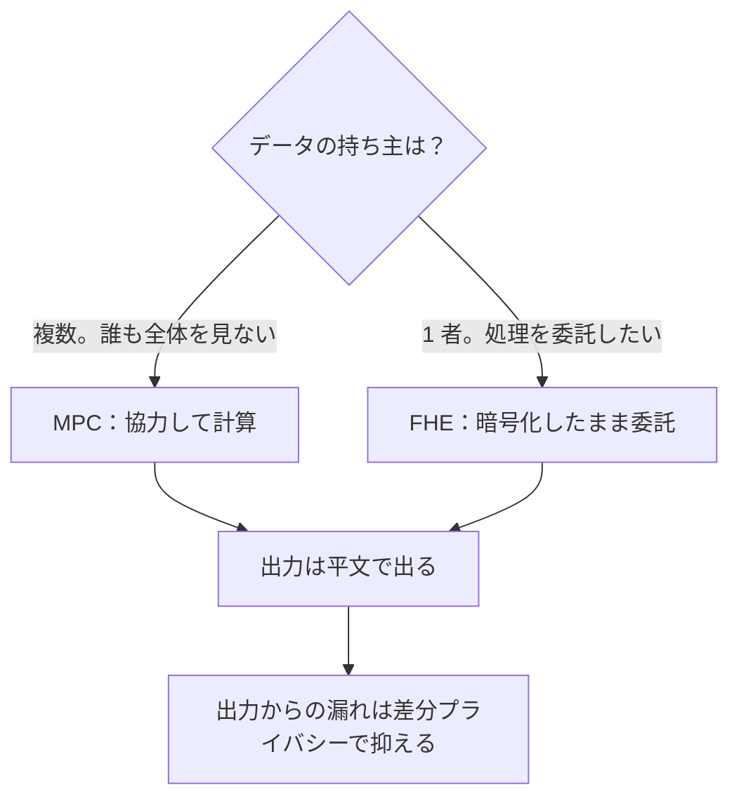

# 03. MPC と FHE（使い分けと限界）

> 親: [README](./README.md) ｜ 前: [02 ゼロ知識証明](./02_zero-knowledge-proofs.md) ｜ 層: 基礎(Layer 1)

**この1ページで分かること**

- MPC（複数者が協力して計算）と FHE（1 者が暗号化データを単独で計算）の使い分け
- FHE は 1 つの方式ではなく、データ型と得意な演算が違う（BGV/BFV・CKKS・TFHE）
- 入力を隠しても**出力からは漏れる**——差分プライバシーという別の層が要ること

「給料を誰にも見せずに、部署の平均給与だけ知りたい」。MPC と FHE はどちらも「データを見せずに計算する」道具だが、前提が違う。仕組み自体は [`06_advanced-topics-map.md`](../../02_cryptography/06_advanced-topics-map.md) が本体。

---

## まず最小の例：2 人の合計を秘匿計算する

```
Alice の給料 a = 30、Bob の給料 b = 50。合計だけ知りたく、相手の値は見たくない。

1. Alice は乱数 r = 17 を選び、a + r = 47 を Bob に送る       （Bob は 47 から a を知れない）
2. Bob は 47 + b = 97 を Alice に送る
3. Alice は 97 − r = 80 = a + b を得て Bob にも伝える
```

Bob が見たのは `47`、Alice が見たのは `97`。どちらも相手の値は分からないが合計 80 は正しい。**MPC の最小形**（加法的秘密分散）。参加者が正直に手順に従うことが前提。

---

## MPC と FHE：どちらを選ぶか

| 軸 | MPC | FHE |
|---|---|---|
| 誰が計算するか | 参加者が**協力して** | **1 者（クラウド等）が単独で** |
| 前提 | 参加者の一定割合が結託しない | 計算する側は鍵を持たない（結託の仮定が不要） |
| 支配的コスト | **通信量**（ラウンド数） | **計算量**（ノイズ管理） |
| 参加者が増えると | 通信が急増 | 影響を受けにくい |
| 向く状況 | 複数組織がデータを持ち寄る | データを預けて処理を委託する |

**判断の目安**: 持ち主が複数で誰も全体を見てはいけないなら MPC。持ち主は 1 者で、計算資源を持つ相手に見せたくないだけなら FHE。実務では組み合わせる（前処理を FHE、集計を MPC）。



### FHE は 1 つの方式ではない

| 方式 | 扱うデータ | 得意な演算 | 用途 |
|---|---|---|---|
| BGV / BFV | 整数（正確） | 加算・乗算のバッチ処理 | 集計・統計 |
| CKKS | 実数・複素数（**近似**） | ベクトルの加算・乗算 | **機械学習の推論** |
| TFHE | ビット | 比較・非線形関数 | 条件分岐を含む処理 |

CKKS は誤差が乗るので金額計算には使えないが、機械学習の推論には十分で、そこが主戦場。FHE が遅い理由（ノイズとブートストラップ）は [`01_digital-platform-design.md`](../../04_hardware-security/01_digital-platform-design.md)。

---

## MPC の実用例：Private Set Intersection

```
2 者がそれぞれ集合を持ち、「共通の要素は何か」だけを知りたい（それ以外は互いに秘密）
```

| 例 | 仕組み |
|---|---|
| 漏洩パスワードの照合 | パスワードのハッシュを乱数で**盲化**して送る。サーバは中身を知らずに処理して返す（OPRF＝入力を明かさず関数値を計算してもらう技術）。利用者だけが「漏洩リストに含まれるか」を判定できる |
| 連絡先発見 | メッセージアプリが「電話帳の誰がこのアプリを使っているか」を、電話帳全体をアップロードせずに判定 |

どちらも [01](./01_pir-and-ot.md) の OT が内部で使われる。

---

## 入力を隠しても、出力からは漏れる

**このフォルダで最も実務的に重要な論点。** MPC も FHE も入力の秘匿を提供するが、**出力は平文で出る**。

```
守れる:   計算の過程で入力が見えること
守れない: 結果が入力について語ってしまうこと

例: 「この病院の患者の平均年齢」を秘密計算 → 患者が 1 人なら結果はその人の年齢そのもの
```

どれだけ強力な暗号でもこの漏洩は防げない。出力側は差分プライバシー（[`../02_anonymization-and-dp.md`](../02_anonymization-and-dp.md)）という**別の層**。

| 層 | 何をするか | 技術 |
|---|---|---|
| ① 入力を隠す | 計算過程で入力を見せない | MPC・FHE（本ファイル） |
| ② 出力からの漏れを抑える | 結果が語りすぎないようにする | 差分プライバシー |
| ③ 正しさを保証する | 相手が正直に計算したことを検証 | ゼロ知識証明（[02](./02_zero-knowledge-proofs.md)） |

**1 つの技術で全部は解けない。** ③が要るのは、悪意ある参加者が誤った結果を出させうるため。

---

## 演習（解答つき）

1. 3 つの病院が「自院のデータは見せずに、全体の統計だけを得たい」と考えている。MPC と FHE のどちらが適しているか、理由とともに述べよ。
2. 秘密計算で平均を求めたのに、プライバシーが守られなかった例を挙げよ。どの層の技術が足りなかったか。
3. CKKS が金額の計算に使えない理由を述べよ。

<details><summary>解答</summary>

1. **MPC。** 持ち主が 3 者いて、いずれも自分のデータを他者に見せたくない。FHE は「1 者が預けて委託する」構図で誰かが全データを保持する形になり合わない。MPC なら各病院がデータを保持したまま協調して統計を計算できる。ただし通信量がコスト。
2. 患者が 1 人の集団の「平均年齢」は、その 1 人の年齢そのもの。入力は暗号化されていたが**出力から入力が復元できた**。足りなかったのは**②出力からの漏れを抑える層**（差分プライバシー）。ノイズを加えるか、集団サイズに下限を設ける必要があった。
3. CKKS は**近似**計算で誤差が乗る。1 円の誤差も許容されない金額計算には、正確な整数演算の BGV / BFV を使う。

</details>

---

## 次への接続

暗号によるプライバシー技術（PIR・OT・ゼロ知識証明・MPC・FHE）が揃った。次は「誰が誰と通信しているか」という通信路そのものを隠す技術。
→ [`../04_anonymous-comms.md`](../04_anonymous-comms.md)

---

## 参考

- Gentry, C. (2009). *Fully Homomorphic Encryption Using Ideal Lattices*. STOC.
- Cheon, J.H. et al. (2017). *Homomorphic Encryption for Arithmetic of Approximate Numbers* (CKKS). ASIACRYPT.
- NIST — Privacy-Enhancing Cryptography: PSI/PSO: https://csrc.nist.gov/Projects/pec/psi
