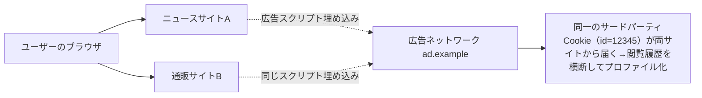

# 05. Web上のプライバシー（Cookie・フィンガープリンティング・トラッキング）

> 前: [04 匿名通信](./04_anonymous-comms.md) ｜ 次: [06 GDPR概観・DPIA](./06_law-and-dpia.md) ｜ 層: 基礎(Layer 1)

Tor（[04](./04_anonymous-comms.md)）でネットワーク層の「誰が誰と通信したか」を隠せても、
**アプリケーション層**（ブラウザ）に別の追跡経路が残っていれば元も子もない。
ここではその Web トラッキング技術と対策を見る。

**この1ページで分かること**

- サードパーティCookieによるサイト横断トラッキングの仕組みと、その「廃止計画」の顛末
- Cookieを消しても復活する追跡（Evercookie）と、状態を一切使わない追跡（フィンガープリンティング）
- 「強制力のない技術的合図（Do Not Track）は無視される」という法規制への接続

---

### 最小の例: 埋め込みが 2 つあれば横断追跡は成立する

サイト A と B に同じ広告配信元 `ad.example` が埋まっているだけでよい。ブラウザが送る 3 行を追う。

```
① サイトA を訪問 → ad.example が識別子を配る
   Set-Cookie: id=12345

② サイトA の別ページ → ブラウザが自動で返す
   Cookie: id=12345      Referer: https://news.example/article

③ 後日サイトB を訪問 → 同じ Cookie が別サイトから届く
   Cookie: id=12345      Referer: https://shop.example/cart
```

`ad.example` は A も B も運営していないが、**②と③が同一人物**だと分かる。
`Referer`（どのページから来たか）が閲覧先まで教えるので、閲覧履歴が横断的に積み上がる。
以下はこの仕組みの一般論と、その回避・対抗策。

---

## Cookie ベースのトラッキング

Cookie はサイトがブラウザに保存させる小さなデータで、次回以降、その発行元ドメインへのアクセス時に自動送信される。

```
ファーストパーティCookie: 訪問中のサイト自身が発行（ログイン状態の保持等、本来の用途）
サードパーティCookie: 訪問中のサイトに埋め込まれた広告・分析用スクリプトが発行
  → 同じ広告ネットワークを埋め込む複数サイトを横断して同一ユーザーを追跡できる
```



[01](./01_privacy-concepts.md) で「Cookie は単体では実名を明かさないが、GDPR上は
個人データとして扱われる」と述べた理由がここで具体化する——横断追跡による
プロファイリングが個人の識別・行動推定につながるため。

### Cookieの終焉、のはずが（現実は複雑）

Google は2020年に「Chromeでサードパーティ Cookie を段階的に廃止する」と発表し、
代替の Privacy Sandbox（Topics API等）の開発を進めていた。しかし延期を繰り返した末、
**2024年7月に方針転換**——結局サードパーティ Cookie を廃止しないと発表し、
**2025年10月には Privacy Sandbox 自体を正式に終了**した（低い採用率と規制当局の
反競争性への懸念が理由）。**「技術的な対策が発表される」ことと「実際に業界標準として
定着する」ことの間には大きな距離がある**、という良い教訓。

---

## スーパークッキー・Evercookie：Cookieを消しても復活する追跡

```
Evercookie（Samy Kamkar が実証）: 同じ識別子を Cookie・localStorage・IndexedDB
  （いずれもブラウザ内のデータ保存領域）・ETag・HSTS（HTTPSを強制させるブラウザ側の記録）
  など10種類以上の保存場所に**同時に**書き込む
  → 1つを消してもユーザーが気づかない場所から識別子を読み出し、消された分を「復活」させる
```

**ETagベースの追跡**は特に巧妙: 本来「リソースが変更されたか」を確認するための
HTTPキャッシュヘッダに、ユーザー固有の値を仕込むことでキャッシュ経由の追跡ができる。

**対策**: Firefox 85（2021年）は訪問先サイトごとにキャッシュを分離する
「ネットワークパーティション化」を導入し、サイトをまたいだキャッシュ共有そのものを
断つことでこの種の追跡を無効化した。

---

## ブラウザフィンガープリンティング：状態を一切使わない追跡

```
Cookie等の「保存された状態」を一切使わず、ブラウザがJavaScript API経由で
漏らす設定情報（Canvas・WebGLという描画APIの出力結果・音声処理特性・フォント一覧・
User-Agent＝ブラウザ名やバージョンを伝えるHTTPヘッダ、等）の組み合わせから、
端末をほぼ一意に特定する
```

EFF（電子フロンティア財団、米国のデジタル権利擁護団体）の計測ツール（Panopticlick、現 *Cover Your Tracks*）による大規模調査では、
測定したブラウザの**8割以上**が他と区別できるユニークな指紋を持つという結果が
繰り返し得られている。

**[01](./01_privacy-concepts.md) の言葉で言い換えると**: フィンガープリンティングは
「匿名性集合」を極端に縮小させる攻撃そのもの——候補が数百万人いたはずの匿名性集合が、
指紋1つで実質**1人にまで絞り込まれる**。Cookie を全て消去・拒否しても、この攻撃は
無力化できない（Cookie という「状態」に依存しないため）。

---

## Do Not Track の失敗：強制力のない仕組みの限界

ブラウザから「追跡してほしくない」という意思表示をHTTPヘッダで送る **Do Not Track (DNT)**
という仕組みが試みられたが、これに従うかどうかはサイト・広告事業者の**任意**であり、
法的な強制力がなかったため広く無視され、実効性を失った。
「技術的な仕組みだけでは不十分で、法規制との組み合わせが必要」という教訓は
次の[06 GDPR概観](./06_law-and-dpia.md)に直結する。

---

## 対策：Enhanced Tracking Protection

Safari の **Intelligent Tracking Prevention (ITP)** や Firefox の
**Enhanced Tracking Protection (ETP)** は、既知のトラッカーをブロックし、
ストレージをサイトごとに分離することで、Cookie・スーパークッキー双方への対策を
ブラウザ側の既定機能として組み込んでいる。フィンガープリンティング対策としても
「取得できる情報自体を均質化する」（例: Canvas APIの出力にノイズを加える）
アプローチが採用されつつある。

---

## まとめ表

| 手法 | 状態（保存領域）に依存 | Cookie削除で防げるか | 代表対策 |
|---|---|---|---|
| サードパーティCookie | する | 防げる | ブロック・サードパーティCookie制限 |
| スーパークッキー/Evercookie | する（複数箇所） | 防げないことが多い | ネットワークパーティション化 |
| ブラウザフィンガープリンティング | しない | 防げない | API出力のノイズ化・均質化 |

---

## 演習（解答つき）

1. サードパーティCookieがなぜ「横断追跡」を可能にするか一言で述べよ。
2. フィンガープリンティングが「Cookieをすべて消しても効果がある」理由を述べよ。
3. Do Not Track が実効性を持たなかった根本的な理由を述べよ。

<details><summary>解答</summary>

1. 同じ広告ネットワークのスクリプトが複数の異なるサイトに埋め込まれていると、
   そのスクリプトが発行するサードパーティCookieは訪問したサイトが変わっても
   同じ広告ネットワークのドメインに送られ続けるため、複数サイトの閲覧履歴を
   同一のCookie識別子に紐づけて収集できる。
2. フィンガープリンティングはCookieのような「ブラウザに保存された状態」を一切使わず、
   ブラウザ自体の設定情報（Canvas描画結果等）から都度指紋を再構成するため、
   保存領域を消去する対策が原理的に効かない。
3. サイトや広告事業者がDNTヘッダに従うかどうかは完全に任意で、従わなくても
   法的な罰則等の強制力が一切なかったため、多くの事業者が無視した。

</details>

---

## 次への接続

技術的対策だけでは不十分（Do Not Track の失敗が象徴的）だった。次は
**法制度の側**からプライバシーをどう保護するか、GDPRの枠組みを見る。
→ [06 GDPR概観・DPIA](./06_law-and-dpia.md)

---

## 参考

- EFF — Cover Your Tracks（旧Panopticlick）: https://coveryourtracks.eff.org/
- Mozilla Security Blog (2021). *Supercookie Protections*: https://blog.mozilla.org/security/2021/01/26/supercookie-protections/
- Kamkar, S. — *evercookie*: https://github.com/samyk/evercookie
- Google — Privacy Sandbox の終了に関する公式発表（2025年）
