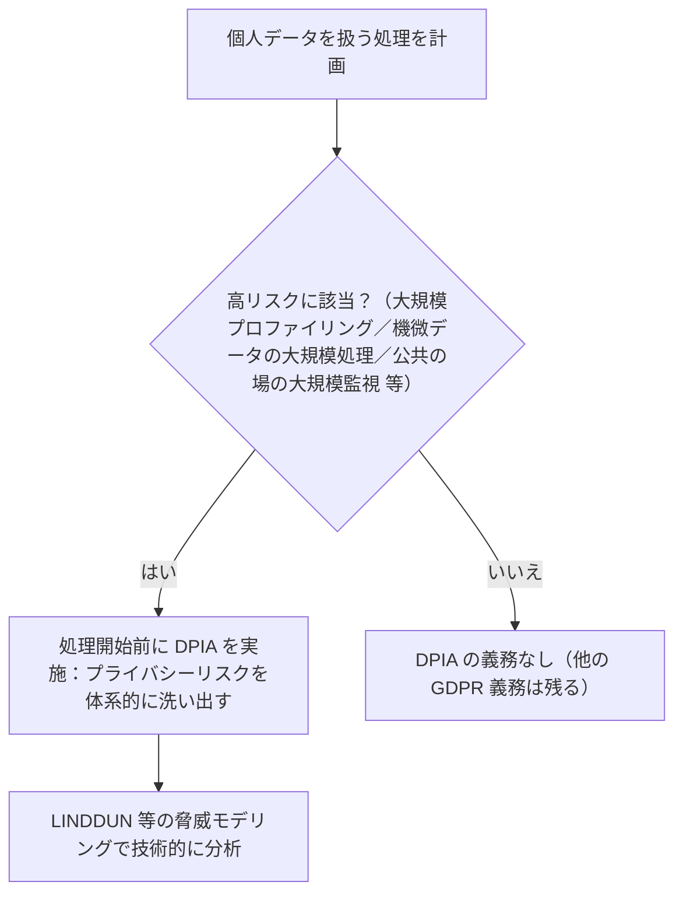

# 06. GDPR概観とDPIA

> 前: [05 Web上のプライバシー](./05_web-privacy-tracking.md) ｜ 層: 基礎(Layer 1)

[05](./05_web-privacy-tracking.md) で見た Do Not Track の失敗（法的強制力のない技術的意思表示は
無視される）が象徴する通り、**技術だけでは不十分**。GDPR（EU一般データ保護規則）は
これまでの技術的概念（匿名性・データ最小化・完全性）に**法的な強制力**を与える枠組み。
本ファイルは概観のみ——法務の詳細（NIS2・Cybersecurity Act・ePrivacy指令との関係、
国際データ移転）は [`../07_legal/01_legal-landscape.md`](../07_legal/01_legal-landscape.md) で扱う。

**この1ページで分かること**

- GDPR の骨格：域外適用・7つの原則・適法根拠・データ主体の権利・2段階の制裁金
- 高リスクな処理の前に義務付けられる DPIA（データ保護影響評価）の位置づけ
- ここまで見てきた技術（匿名化・PET・匿名通信）が GDPR のどの原則に対応するか

---

## 適用範囲：域外適用

GDPR第3条は、**処理者がEU域内にあるかどうかを問わず**、EU居住者の個人データを
扱う処理に適用される（域外適用）。日本企業がEU向けにサービスを提供していれば
対象になりうる、という点が実務上の広がりを持つ理由。

「個人データ」の定義（PIIより広い、第4条）は
[`01_privacy-concepts.md`](./01_privacy-concepts.md) で既出のため重複させない。

---

## 7つの原則（第5条）

| 原則 | 内容 | これまでの技術との接続 |
|---|---|---|
| 適法性・公正性・透明性 | 適法な根拠に基づき、公正かつ利用者に分かる形で処理する | — |
| 目的制限 | 収集時に特定した目的以外に使わない | — |
| **データ最小化** | 目的に必要な範囲に限定して収集・保持する | [02](./02_anonymization-and-dp.md) の匿名化・差分プライバシーが技術的に実現する目標そのもの |
| 正確性 | データを正確・最新に保つ | — |
| 保存期間制限 | 必要な期間を超えて保持しない | — |
| **完全性・機密性** | 適切な技術的措置でデータを保護する | [`../02_cryptography/`](../02_cryptography/index.md) 全体が「技術的措置」の具体策 |
| アカウンタビリティ | 上記全てを遵守している**ことを証明できる**責任を管理者（＝処理の目的と手段を決める主体）が負う | 本ファイルのDPIAがその手段の1つ |

---

## 適法根拠（第6条）

処理には次のいずれかの法的根拠が必要:

```
同意（最も知られる根拠。「自由意思による、特定的・情報に基づく・明確な意思表示」と厳密に定義される）
契約の履行、法的義務の遵守、生命に関わる利益の保護、公共の利益、正当な利益
```

「同意さえ取れば何でもよい」わけではなく、同意の定義自体が厳格（曖昧な包括同意やデフォルト
オンのチェックボックスは無効）。

---

## データ主体の権利（第3章、第15〜20条）

```
アクセス権:      自分のデータの開示・写しを要求できる
訂正権:          不正確なデータの訂正を要求できる
消去権（忘れられる権利）: 一定の条件下でデータの削除を要求できる
処理制限権:      一定の条件下で処理の一時停止を要求できる
データポータビリティ権: 機械可読な形式での他社への移管を要求できる
```

「忘れられる権利」が最も有名だが、無条件ではなく他の法的義務等との比較衡量が必要。

---

## DPIA（データ保護影響評価、第35条）

DPIA（Data Protection Impact Assessment）は、リスクの高いデータ処理を**始める前に**
その影響を評価する手続き。

```
以下のいずれかに該当する処理を行う前に、DPIAの実施が義務付けられる:
  1. 個人に法的・重大な影響を与える体系的・広範な自動評価
     （プロファイリング＝行動・嗜好などの自動分析、等）
  2. 機微な特別カテゴリデータ・犯罪歴データの大規模処理
  3. 公共の場の体系的・大規模な監視
  一般に「高いリスクをもたらす可能性がある」処理全般が対象
```



DPIAは「この処理はどんなプライバシーリスクを持つか」を体系的に洗い出すプロセスで、
技術設計の観点からは **STRIDE/LINDDUN 脅威モデリング**（＝システムへの脅威を型に沿って体系的に列挙する手法）
（[`../00_overview/02_five-pillars-map.md`](../00_overview/02_five-pillars-map.md) の
「SW⇄プライバシー」交差点、詳細は
[`../05_software-security/02_threat-modeling.md`](../05_software-security/02_threat-modeling.md)
で扱う）と組み合わせて実施されることが多い——DPIAが「何を評価すべきか」の法的要求、
LINDDUNが「どう技術的に分析するか」の方法論、という役割分担。

---

## 違反時の制裁（第83条）：2段階の制裁金

```
上位区分: 最大 2000万ユーロ または 全世界年間売上高の4%（いずれか高い方）
  → 適法根拠の欠如、データ主体の権利侵害等の中核的違反
下位区分: 最大 1000万ユーロ または 全世界年間売上高の2%（いずれか高い方）
  → 必要なDPIAの未実施等、手続き的な違反
```

DPIAを怠ること自体が（実際に情報漏洩が起きていなくても）独立した制裁対象になる点は、
「事前にリスクを評価するプロセスそのもの」が法的義務であることを示す。

---

## このドメインの技術とGDPRの対応（まとめ）

| ファイル | 技術 | GDPR上の役割 |
|---|---|---|
| [01](./01_privacy-concepts.md) | 匿名性・非連結性・PII | 「個人データ」該当性の判断基準 |
| [02](./02_anonymization-and-dp.md) | k-匿名化・差分プライバシー | データ最小化原則の技術的実現 |
| [03](./03_ppt-cryptographic.md) | PIR・MPC・FHE | 完全性・機密性原則の技術的措置 |
| [04](./04_anonymous-comms.md) | Tor・Mixネットワーク | 通信の秘匿という技術的保護措置 |
| [05](./05_web-privacy-tracking.md) | Cookie対策・DNTの失敗 | 「技術だけでは不十分」という教訓、同意管理の必要性 |

---

## 演習（解答つき）

1. 日本企業がEU居住者向けにサービスを提供する場合、GDPRの対象になりうる理由を述べよ。
2. データ最小化原則と、[02](./02_anonymization-and-dp.md)の差分プライバシーの関係を一言で述べよ。
3. DPIAを実施しなかったこと自体が制裁対象になるのはなぜか。

<details><summary>解答</summary>

1. GDPR第3条は域外適用を定めており、処理者の所在地に関わらず**EU居住者の個人データ**を
   扱っていれば適用対象になるため。
2. データ最小化は「目的に必要な範囲にデータを限定する」という法的原則であり、
   差分プライバシーは「個人が特定できないようノイズを加えて統計情報だけを提供する」
   技術的手法——後者は前者を数学的に保証する形で実現する具体策。
3. DPIAの実施義務は「実際にリスクが顕在化したか」とは独立した**手続き的義務**であり、
   事前のリスク評価を怠ったこと自体が説明責任（アカウンタビリティ原則）の欠如とみなされ、
   独立した制裁対象（第83条の下位区分）になるため。

</details>

---

## 次への接続

これで `03_privacy/` の基礎パート（概念・匿名化・暗号的PET・匿名通信・Webトラッキング・
法制度）が一通り揃った。法務の詳細（NIS2・Cybersecurity Act・ePrivacy指令・国際データ移転・
サイバー犯罪・知財等）は [`../07_legal/`](../07_legal/index.md)、DPIA実施時の
技術的脅威分析（LINDDUN）は
[`../05_software-security/02_threat-modeling.md`](../05_software-security/02_threat-modeling.md)
へ接続していく。

---

## 参考

- GDPR 第5条（原則）: https://gdpr-info.eu/art-5-gdpr/
- GDPR 第6条（適法根拠）、第3章（データ主体の権利、第15〜20条）: https://gdpr-info.eu/chapter-3/
- GDPR 第35条（DPIA）: https://gdpr-info.eu/art-35-gdpr/
- ICO — When do we need to do a DPIA?: https://ico.org.uk/for-organisations/uk-gdpr-guidance-and-resources/accountability-and-governance/data-protection-impact-assessments-dpias/when-do-we-need-to-do-a-dpia/
