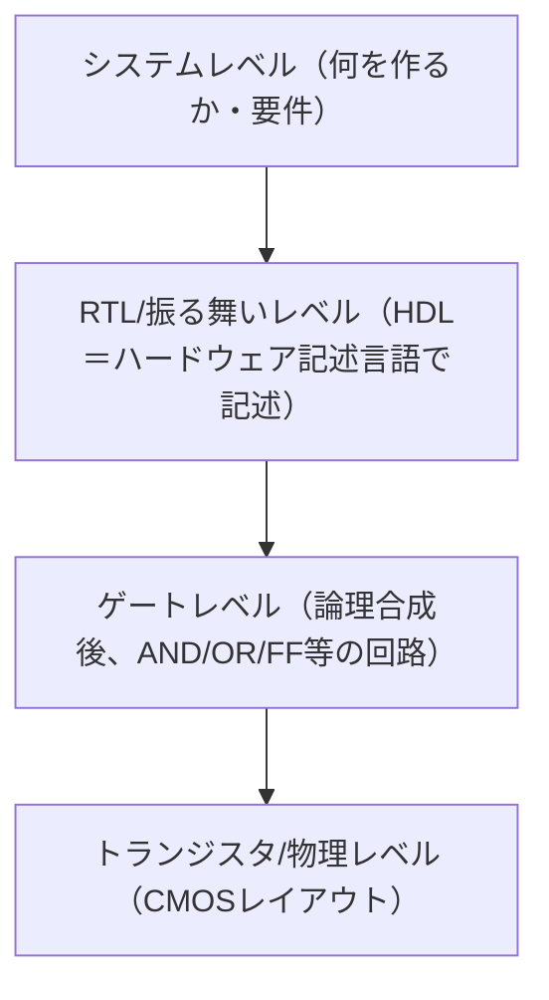

# 01. ディジタルプラットフォーム設計とセキュリティ

> 対応科目: Design of Digital Platforms: Concepts, Design Seminar ｜ 次: [02 ハードウェア攻撃](./02_hardware-attacks.md) ｜ 層: 基礎(Layer 1)

**この1ページで分かること**

- 設計抽象レベル（システム→RTL→ゲート→物理）と、弱点が「上位で作り込まれ、下位で悪用される」構図
- 設計指標 PPA（Power・Performance・Area）に Security を加えた 4 軸トレードオフ
- 「何を信頼するか」を明示的に選ぶ TCB（Trusted Computing Base＝信頼の基盤）

家を建てるとき「広さ・光熱費・建築費」と一緒に「鍵をどこに置くか」も図面で決める——それがハードウェア設計におけるセキュリティ。[部品の基礎](../01_prerequisites/03_hardware-digital-logic/index.md)（CMOS・HDL・パイプライン・メモリ階層）を前提にする。

---

## 最小の例: 鍵を 1 つ、どこに置くか

| 置き場所 | Power | Perf | Area | Security |
|---|---|---|---|---|
| 汎用 CPU のメモリ | 追加なし | 追加なし | 追加なし | 他プロセスとキャッシュを共有＝漏れうる |
| 専用の小回路 | 少し増 | 少し増 | 増 | ソフトから見えない。ただし焼いたら直せない |

たった 1 つの鍵の置き場所でも、4 つの軸が同時に動く。以下、この判断を支える枕組みを見る。

---

## 設計抽象レベル



HDL・CMOS の中身は
[`../01_prerequisites/03_hardware-digital-logic/`](../01_prerequisites/03_hardware-digital-logic/index.md)
で既習（`01_cmos-logic.md`, `03_hdl-and-architecture/01_hdl-basics.md`）。

下位ほど詳細だが変更コストが高い。**弱点は上位で作り込まれ、下位（物理）で悪用される**——「鍵をどこに置くか」というシステムレベルの決定が、サイドチャネル（[04](./04_side-channels/README.md)）耐性を左右する。

---

## PPA から PPAS へ：セキュリティという第4の軸

古典的な指標は **PPA（電力・性能・面積）**。[CMOS](../01_prerequisites/03_hardware-digital-logic/01_cmos-logic.md) の `P_dynamic ≈ α · C_L · V_DD² · f` が Power 軸の根拠（`α` のデータ依存が電力サイドチャネルの根本原因）。現代はここに **Security** を第 4 軸として加える。

| 設計判断（PPAの改善） | セキュリティへの副作用 |
|---|---|
| 性能を上げる（並列化・投機実行＝分岐の結果を待たず命令を先読み実行する高速化） | Spectre/Meltdown のような新しい攻撃面を生む（[02](./02_hardware-attacks.md)） |
| 電力を下げる（電圧を絞る） | フォールト注入（意図的に計算ミスを起こさせる攻撃）への耐性が変わる（[02](./02_hardware-attacks.md)） |
| 面積を減らす（回路を削る） | マスキング等の対策回路を削らざるを得なくなる（[04](./04_side-channels/README.md)） |

**具体例**: マスキング（秘密値をランダムな断片に分けて計算、[04](./04_side-channels/README.md)）は面積・電力・遅延を増やす。その追加コストを払うかは **4 軸**で判断する意思決定。

---

## HW/SW 協調設計にセキュリティを組み込む

[`../01_prerequisites/03_hardware-digital-logic/03_hdl-and-architecture/03_memory-hierarchy-and-codesign.md`](../01_prerequisites/03_hardware-digital-logic/03_hdl-and-architecture/03_memory-hierarchy-and-codesign.md)
の協調設計フロー（プロファイリング→HW 化判断→FPGA 検証→PPA 計測）に「どこに秘密を置き、何を信頼するか」を組み込む。

```
暗号処理を専用ハードウェアブロックにする場合:
  + ソフトウェアからは見えない専用回路 → キャッシュサイドチャネル（04）から隔離できる
  − 物理的にチップにアクセスされればフォールト注入（02）の標的になりうる
  − 一度チップに焼き込むと脆弱性が見つかっても後から直せない（SWならパッチ可能）

ソフトウェアで実装する場合:
  + バグが見つかれば更新できる
  − CPUの共有キャッシュ・分岐予測器を経由するサイドチャネルに晒される
```

正解はなく、**何を TCB（信頼の基盤＝壊れると全体が崩れる部分）に含めるか**を明示的に選ぶのが核心。TCB は小さいほど検証しやすく攻撃面が狭い。これを物理的に固定する仕組みが root of trust（[03](./03_security-building-blocks.md)）。

---

## 事例：FHE はなぜ遅く、どこを速くするのか

FHE（完全準同型暗号＝暗号化したまま計算できる方式、[map](../02_cryptography/06_advanced-topics-map.md)）は理論上は十年以上前に実現したが、実用化を阻むのは**性能**。専用ハードウェアが何を解くかの好例。

### 遅さの正体はノイズ

FHE の暗号文には安全性のため**ノイズ**が乗せてあり、**演算のたびに増える**（乗算で急増）。閾値を超えると復号不能。

```
暗号文 = 平文 + ノイズ
  加算 → ノイズは緩やかに増える
  乗算 → ノイズが急激に増える
  閾値を超える → 復号不能
```

**ブートストラップ**はノイズを減らす操作だが極めて重く、**FHE の実行時間の大半を占める**。

### 高速化は1つの層では解けない

| 層 | 何を最適化するか |
|---|---|
| 専用ハードウェア | 多項式演算（NTT＝数論変換、多項式乗算の高速化）と巨大係数の並列処理、メモリ帯域 |
| ライブラリ | パラメータ選択、演算の実装 |
| **コンパイラ** | 平文プログラムを FHE 演算列に変換し、**どこでブートストラップを挟むか**を決める |

**コンパイラ層の判断が性能を左右する**のが特徴。乗算の順序を変えるだけでブートストラップ回数が変わり、**書き方そのものが性能問題**になる。FHE を選ぶ場面は
[`../03_privacy/03_ppt-cryptographic/03_mpc-and-fhe.md`](../03_privacy/03_ppt-cryptographic/03_mpc-and-fhe.md) を参照。

---

## 演習（解答つき）

1. PPAにSecurityを加えた4軸で考えるとき、マスキング対策の追加が悪化させる軸を全て挙げよ。
2. 暗号処理をソフトウェアではなく専用ハードウェアブロックにする利点を一言で述べよ。
3. TCB（信頼の基盤）を小さくすることがセキュリティ上望ましい理由を述べよ。
4. FHE で `a * b * c * d` を計算する。`((a*b)*(c*d))` と `(((a*b)*c)*d)` では
   必要なブートストラップ回数が変わりうる。理由を述べよ。

<details><summary>解答</summary>

1. 回路面積（断片を複数保持・演算するため）、電力（演算回数が増える）、性能（遅延が増える）
   の3つ。Securityは向上する代わりにPower・Performance・Areaが悪化するトレードオフ。
2. ソフトウェアが実行される汎用CPUのキャッシュ・分岐予測器を経由するサイドチャネル
   （[04](./04_side-channels/README.md)）から、専用回路として隔離できる点。
3. TCBが小さいほど「検証すべきコード・回路の量」が減り、形式検証や監査が現実的になる。
   また攻撃者が付け入る隙（攻撃対象領域）も、信頼している部分が少ないほど狭くなる。
4. ノイズは乗算のたびに急激に増える。`((a*b)*(c*d))` は深さ2の木で最大乗算深度が2だが、
   `(((a*b)*c)*d)` は深さ3の直列計算で最大乗算深度が3になる。乗算深度が深いほど
   閾値到達までの余裕が減り、ブートストラップを挟む頻度（回数）が増える——
   同じ計算でも**演算をどう並べるかでコストが変わる**。

</details>

---

## 次への接続

「何を信頼するか」を決める前に、**攻撃者が実際に何をできるか**を物理アクセスのレベル別に分類する。
→ [02 ハードウェア攻撃](./02_hardware-attacks.md)

---

## 参考

- Rushby, J. (1981). *Design and Verification of Secure Systems*（TCBの概念の古典）。
- Gentry, C. (2009). *Fully Homomorphic Encryption Using Ideal Lattices*. STOC 2009（最初の FHE 構成とブートストラップの定式化）。
- 本節は COSIC Course 2026 の FHE 高速化セッション（Wouter Legiest, 2026年6月）の整理に基づく。
