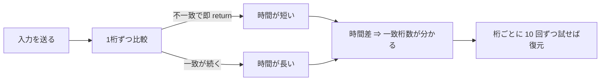

# 01. タイミング攻撃と定数時間実装

> 親: [README](./README.md) ｜ 次: [02 電力解析](./02_power-analysis.md) ｜ 層: 基礎(Layer 1)

**この1ページで分かること**

- 「処理に何秒かかったか」だけで 4 桁 PIN が 40 回以内に破れる理由
- 総当たり `10ⁿ` が `10n` に落ちる＝桁数を増やす対策が効かない
- 対策＝定数時間実装。ただし必要条件であって十分条件ではない

サイドチャネル（金庫の中身ではなく「ダイヤルを回す音」から番号を当てるような、副産物からの漏洩）の中で最も身近なのが**実行時間**。測定器も接触も不要で、時間を測るだけで成立する。

---

## 最小の例: 2 桁の比較

```
verify(input[2], secret[2]):        # secret = "73"
    if input[0] != secret[0]: return FALSE   ← "0?" はここで終わる（1 手）
    if input[1] != secret[1]: return FALSE   ← "7?" はここまで来る（2 手）
    return TRUE
```

`0x` と `7x` で**かかる時間が違う**。この差だけで 1 桁目が 7 だと分かる。以下、4 桁に一般化する。

## 脆弱な実装

PIN を 1 桁ずつ比較し、不一致で即座に戻る——ごく自然な書き方。

```
verify(input[4], secret[4]):
    for i in 0..3:
        if input[i] != secret[i]:
            return FALSE      ← ここで即座に戻る
    return TRUE
```

**問題**: 正解の桁が多いほどループが長く回る。**実行時間が「先頭から何桁一致したか」を漏らす**。



```
入力 0000 で secret=7391 を検証 → 1桁目で不一致 → ループ1回で終了（速い）
入力 7000 で secret=7391 を検証 → 2桁目で不一致 → ループ2回で終了（少し遅い）
```

---

## 手で破る

1 桁目を 0〜9 まで試し、**最も遅かった候補**が正解。確定したら次の桁へ進む。

```
1桁目: 0〜9 を試す → 7 のとき最も遅い → 1桁目 = 7 と確定
2桁目: 70〜79 を試す → 73 のとき最も遅い → 2桁目 = 3 と確定
3桁目: 730〜739 を試す → …
4桁目: 7390〜7399 を試す → …
```

### 計算量の比較

```
総当たり:         10 × 10 × 10 × 10 = 10⁴ = 10,000 通り
タイミング攻撃:   10 + 10 + 10 + 10 = 10 × 4 = 40 通り（上限）
```

**指数から線形に落ちる**のが本質。桁数 `n` で `10ⁿ` → `10n`。6 桁にしても 100 万通りが 60 通りにしかならず、**桁数を増やす対策は効かない**。

> 実際は測定ノイズがあるため各候補を複数回測って平均する。試行回数は桁数に比例したまま。ネットワーク越しでも回数を稼げば成立する。

---

## 対策：定数時間実装

```
原則: 秘密データの値によって「実行時間・アクセスするメモリアドレス・分岐の方向」が
      変わってはいけない
```

PIN 検証なら**早期 return をやめて必ず全桁を比較する**。

```
verify_ct(input[4], secret[4]):
    diff = 0
    for i in 0..3:
        diff = diff | (input[i] XOR secret[i])   ← 差分を累積するだけ
    return (diff == 0)                            ← 最後に一度だけ判定
```

結果にかかわらず必ず 4 回ループするので、時間が秘密に依存しない。

### 気をつける3点

| 避けるもの | なぜ危険か |
|---|---|
| **秘密依存の分岐** | `if (secret_bit)` は分岐予測（CPU が分岐先を先読みする仕組み）の当たり外れが時間差になる。分岐なしの算術で書く |
| **秘密依存のテーブル参照** | `table[secret_byte]` は**どのキャッシュライン**（キャッシュの最小単位、64 バイト程度）を読んだかで漏れる（→ [03](./03_cache-side-channels.md)） |
| **秘密依存の反復回数** | ループ回数が秘密で変わると、そのまま時間差 |

### 暗号ライブラリでの実例

通常のユークリッド互除法（最大公約数を求める手順）は入力で反復回数と分岐が変わる。秘密値（RSA の鍵生成・ECDSA の逆元計算）に使うと漏れる。

対策は**常に同じ回数・同じ分岐で動く**アルゴリズム（二進 GCD、Bernstein–Yang の safegcd）への置き換え。背景は
[`../../01_prerequisites/01_math-for-crypto/01_modular-arithmetic/04_gcd-euclidean.md`](../../01_prerequisites/01_math-for-crypto/01_modular-arithmetic/04_gcd-euclidean.md) を参照。

> ⚠️ **定数時間で書けば安全、とは言えない。** 投機的実行（CPU が結果を先回りして計算する高速化）を悪用すると定数時間コードでも漏れる（2018 年以降、[Spectre](../02_hardware-attacks.md)）。定数時間実装は**必要条件であって十分条件ではない**。

---

## 演習（解答つき）

1. 4桁 PIN のタイミング攻撃で試行回数が `10⁴` ではなく `10×4` になる理由を一言で述べよ。
   また PIN を8桁に延ばした場合の試行回数の上限を求めよ。
2. 早期 return を削除して全桁を比較するようにした。これだけで定数時間になるか。
   ならない場合、他に何を確認すべきか。
3. `table[secret_byte]` のようなテーブル参照が、実行時間を一定にしても危険なのはなぜか。

<details><summary>解答</summary>

1. **各桁を独立に決定できるため**。実行時間が「先頭から何桁一致したか」を教えるので、
   1桁目を確定してから2桁目に進む、という逐次的な絞り込みが可能になる。
   全体を1つの塊として当てる必要がないので、桁ごとの試行を足し算すればよい。
   8桁なら `10 × 8 = 80` 通り（総当たりは `10⁸ = 1億` 通り）。
2. **ならない。** ループ回数は一定になるが、他に次を確認する必要がある。
   ①ループ内に秘密依存の分岐が残っていないか
   ②秘密依存のメモリアクセス（テーブル参照）がないか
   ③コンパイラが最適化で早期終了を復活させていないか
   （`diff` を使わずに済むと判断して分岐を再導入することがある）。
   ③は実際に起こるため、定数時間性を意図するコードには専用の記述方法が必要になる。
3. 実行される**命令の数と時間**が同じでも、**どのメモリアドレスに触れたか**が
   キャッシュの状態として残る。攻撃者はキャッシュのヒット/ミスの時間差を測ることで
   「どのキャッシュラインが読まれたか」を知り、そこから `secret_byte` の上位ビットを
   推定できる。時間を一定にするだけでは不十分で、**アクセス先も秘密に依存させない**必要がある。

</details>

---

## 次への接続

次はより細かく漏れる**消費電力**。波形 1 本で鍵が読める場合から大量波形の統計処理まで。
→ [02 電力解析](./02_power-analysis.md)
