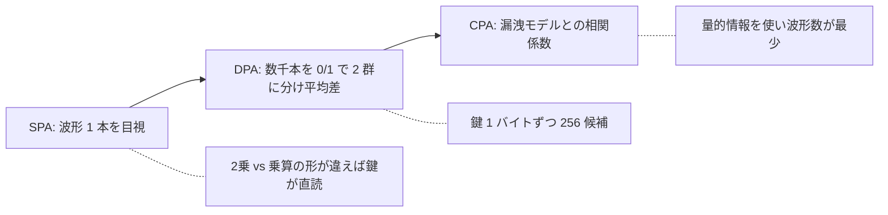

# 02. 電力解析（SPA・DPA・CPA）

> 親: [README](./README.md) ｜ 前: [01 タイミング攻撃](./01_timing-attacks.md) ｜ 次: [03 キャッシュサイドチャネル](./03_cache-side-channels.md) ｜ 層: 基礎(Layer 1)

**この1ページで分かること**

- ビットが変化するたびに電流が流れる＝消費電力の波形はデータの関数
- SPA（目視）→ DPA（統計）→ CPA（相関）と、使う情報が増えるほど少ない波形で鍵が割れる
- 鍵は 1 バイトずつ独立に決められる＝ここでも「指数から線形へ」

チップに流れる電流を測るのは、家の電気メーターの針から「今どの家電を使っているか」を当てるのに似ている。[01](./01_timing-attacks.md) は処理全体の時間だけを見たが、電力波形は**処理の途中の出来事**を時間軸で見せる。

---

## 最小の例: 鍵 1 ビットで波形が 2 本

```
鍵ビット = 0 → 2乗のみ      電力: ▁▂▃▂▁
鍵ビット = 1 → 2乗 + 乗算   電力: ▁▂▃▂▁▂▄▂▁   ← 山が 1 つ多い
```

波形を見比べれば鍵ビットが読める。鍵が 2048 ビットなら山の数を数えるだけ。以下、なぜ電力がデータで変わるのかを物理から追う。

## なぜ電力が情報を漏らすのか

[`../../01_prerequisites/03_hardware-digital-logic/01_cmos-logic.md`](../../01_prerequisites/03_hardware-digital-logic/01_cmos-logic.md)
の動的消費電力の式を思い出す。

```
P_dynamic ≈ α · C_L · V_DD² · f
```

`α`（ビットが 0↔1 に変わる割合）が**処理データに依存**する。変わるビットが多いほど電力を使い、変わらなければ使わない。**波形そのものがデータの関数**である。

### 最小の例

インバータ（NOT ゲート）1 個。入力が 0→1 に変わると出力が 1→0 になり、容量の充放電で電流が流れる。入力が変わらなければ流れない。

```
入力の遷移あり → 充放電イベントが波形に現れる
入力の遷移なし → 何も現れない
```

入出力を知らなくても、**充放電の有無を波形から読めば「そこで値が変わった」と分かる**。この事実がチップ全体で積み上がる。



---

## 段階1：SPA（単純電力解析）

波形を**目視**し、実行された命令の違いを直接読む。

### RSA への SPA

`m^d mod n` を計算する2乗繰り返し法（[`../../02_cryptography/03_public-key-crypto/01_rsa/02_encryption-decryption.md`](../../02_cryptography/03_public-key-crypto/01_rsa/02_encryption-decryption.md)）は、
指数 `d` のビットを上位から見て次を繰り返す。

```
d のビットが 0 → 2乗のみ
d のビットが 1 → 2乗してから乗算
```

**2 乗と乗算の電力が違えば**（2 乗の方が軽い実装が多い）波形の形で両者を区別でき、**指数のビット列＝秘密鍵が 1 本の波形から直読できる**。

### 波形からアルゴリズム構造が見える

前段として「今どのアルゴリズムのどこか」を特定する工程がある。波形の**繰り返しパターン**を数えればラウンド（暗号処理の反復単位）構造が見える。

```
繰り返しの塊が 10 個 → AES-128（10ラウンド）
繰り返しの塊が 14 個 → AES-256（14ラウンド）
```

ラウンド数から鍵長が分かり、1 ラウンド内の段（SubBytes 等）まで識別できることもある。**波形が実装を教えてくれる。**

---

## 段階2：DPA（差分電力解析）

波形 1 本では見えない微差を、**大量の波形と統計処理**で暴く（Kocher–Jaffe–Jun, 1999）。

```
1. 鍵の一部（例: 1バイト）について全候補（256通り）を仮定する
2. 各仮定のもとで「ある中間値のビットが 0 か 1 か」を予測し、波形群を2グループに分ける
3. 2グループの平均波形の差を計算する
4. 正しい鍵の仮定のときだけ、その中間値を計算する瞬間に
   はっきりした差（スパイク）が現れる
```

**要点は鍵の分割統治**。鍵全体（`2¹²⁸`）ではなく**1 バイトずつ独立に**決めるので `256 × 16` 回で済む。[01](./01_timing-attacks.md) と同じ「指数から線形へ」。

---

## 段階3：CPA（相関電力解析）

DPA の「差」の代わりに、**漏洩モデル**（電力がデータからどう決まるかの近似式）と実測値の**相関係数**（2 つの量が連動する度合い、−1〜1）を計算する（Brier–Clavier–Olivier, 2004）。

```
漏洩モデルの仮定:
  消費電力 ∝ ハミング重み（値のビット中の 1 の個数）
         または ハミング距離（遷移したビット数）
```

各鍵候補の「予測電力」と実測波形の相関を取り、最も高い候補が正解。

| | DPA | CPA |
|---|---|---|
| 使う情報 | ビットが 0 か 1 か（2 値） | 電力の大きさそのもの |
| 検出力 | 低め | 高い＝**少ない波形で復元** |

> ハミング重み/距離は `α` の近似。物理式 → 統計モデル → 攻撃、と一本の筋が通っている。

---

## その他の手法

| 手法 | 考え方 |
|---|---|
| **テンプレート攻撃** | 同型デバイスで既知鍵の波形モデルを**事前学習**。本番は少数（理想 1 本）で特定 |
| **内部衝突攻撃** | 計算**途中**で同じ値が現れる（衝突）ことを利用。出力には出ないが波形には出る |
| **電磁波解析 (EMA)** | 電力の代わりに放射電磁波を測る。チップの**特定位置**に当てられ局所情報が取れる |

---

## 演習（解答つき）

1. RSA の2乗繰り返し法に対する SPA が成立するために、実装側に必要な性質は何か。
2. DPA で鍵を1バイトずつ独立に決められる理由を述べよ。また AES-128 の鍵全体を
   総当たりする場合と比べて検定回数がどう変わるか。
3. CPA が DPA より少ない波形数で成功する理由を、使っている情報の違いから説明せよ。

<details><summary>解答</summary>

1. **2乗と乗算の消費電力（または実行時間）に観測可能な差があること**。
   指数のビットが 0 のときは2乗のみ、1 のときは2乗+乗算が実行されるため、
   両者が波形上で区別できれば指数のビット列が読める。
   逆に言えば、ビットの値によらず常に同じ演算列を実行する実装
   （モンゴメリ・ラダー等）にすればこの攻撃は成立しない。
2. 攻撃者は**特定の中間値**（例: AES の1ラウンド目の SubBytes 出力の1バイト）を狙う。
   この中間値は**鍵の対応する1バイトだけ**に依存し、他のバイトには依存しない。
   したがって1バイト分（256通り）の仮定を立てれば、その中間値の予測が確定する。
   検定回数は `256 × 16 = 4,096` 回程度で、鍵全体の総当たり `2¹²⁸` とは比較にならない。
3. DPA は中間値のビットが 0 か 1 かで波形を2グループに分け、その**平均の差**を見るだけ。
   一方 CPA はハミング重み等の漏洩モデルから**消費電力の大きさそのものを予測**し、
   実測値との相関係数を計算する。後者は「どのくらい電力を使うか」という
   量的な情報まで活用しているため、同じノイズ環境でも信号を検出しやすく、
   必要な波形数が少なくなる。

</details>

---

## 次への接続

電力測定には物理アクセスが要る。次は**同じ CPU 上のソフトウェアだけ**で秘密を取る手法。
→ [03 キャッシュサイドチャネル](./03_cache-side-channels.md)
