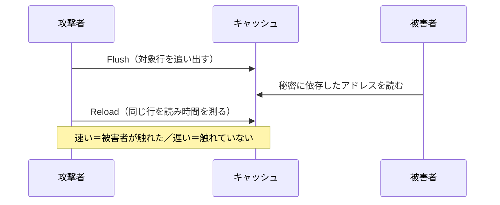

# 03. キャッシュサイドチャネル

> 親: [README](./README.md) ｜ 前: [02 電力解析](./02_power-analysis.md) ｜ 次: [04 対策](./04_countermeasures.md) ｜ 層: 基礎(Layer 1)

**この1ページで分かること**

- キャッシュ（CPU 直近の高速メモリ）のヒット/ミスの時間差が「誰がどこに触れたか」を漏らす
- Prime+Probe と Flush+Reload の違いは「何を共有している前提か」と分解能
- 漏れるのは値ではなく**アドレス**。秘密がアドレスを決める実装が危ない

[02](./02_power-analysis.md) はオシロスコープと物理アクセスが要った。キャッシュサイドチャネルは**同じ CPU 上のプログラムだけ**で成立し、攻撃の敷居が決定的に下がる。

---

## 最小の例: 2 行のキャッシュ

```
キャッシュ（2 行）: [ A ][ B ]          A, B は読み込み済み
  read A → ヒット   1 ns
  read C → ミス   100 ns   → C が A を追い出す: [ C ][ B ]
  read A → ミス   100 ns   ← 「誰かが C を読んだ」と A の遅さから分かる
```

自分のデータ A が遅くなった＝他人がキャッシュを使った、という推理が攻撃の全て。

## 悪用する物理現象

[`../../01_prerequisites/03_hardware-digital-logic/03_hdl-and-architecture/03_memory-hierarchy-and-codesign.md`](../../01_prerequisites/03_hardware-digital-logic/03_hdl-and-architecture/03_memory-hierarchy-and-codesign.md)
で見たメモリ階層のレイテンシ（読み出しにかかる遅延）差がそのまま情報チャネルになる。

```
L1 キャッシュにヒット   → 約 1 ns
DRAM まで行く（ミス）  → 約 100 ns
```

**2 桁の差**があるので、時間を測れば「キャッシュに載っていたか」が分かる。キャッシュは**プロセス間で共有**なので、他のプロセスがどこに触れたかを観測できてしまう。



---

## 2つの代表的な手法

```
Prime+Probe（Osvik, Shamir, Tromer, 2006年）:
  1. 攻撃者が自分のデータでキャッシュセットを埋め尽くす（Prime）
  2. 被害者の処理を待つ
  3. 自分のデータに再アクセスし、時間を測る（Probe）
  → 遅ければ、被害者が同じセットにアクセスして自分のデータを追い出したと分かる

Flush+Reload（Yarom, Falkner, 2014年）:
  1. 対象アドレス（共有メモリ上）をキャッシュから明示的に追い出す（Flush）
  2. 被害者の処理を待つ
  3. 同じアドレスに再アクセスし、時間を測る（Reload）
  → 速ければ、被害者がその間にそのアドレスに触れてキャッシュに載せた証拠
```

| | Prime+Probe | Flush+Reload |
|---|---|---|
| 必要な前提 | キャッシュセット（複数行をまとめた区画）を共有 | **同じ物理メモリ**を共有 |
| 分解能 | キャッシュセット単位（粗い） | キャッシュライン単位（細かい） |
| 適用範囲 | 共有メモリがなくても成立（クロス VM も） | 共有メモリが必須だが精度が高い |

---

## 「共有メモリ」という前提は自然に満たされる

Flush+Reload は同じ物理メモリに触れられることを要求する。特殊に見えるが、**現代 OS の既定動作が満たす**。

```
共有ライブラリ（libc、暗号ライブラリ等）は
メモリ節約のため複数プロセスに同じ物理ページを写像する
        ↓
攻撃者と被害者が同じライブラリを使っていれば、
そのコードとテーブルは物理的に同一のページ上にある
        ↓
攻撃者は被害者が触ったキャッシュラインを観測できる
```

**攻撃者が状況を作る必要はない。** OS の効率化がそのまま前提を用意している。

> クロス VM（別の仮想マシン同士）では共有メモリを前提にできず難度が上がるが、Prime+Probe は成立しうる。クラウドの同居インスタンスが問題になるのはこのため
> （[`../../06_systems-security/05_distributed-systems-security.md`](../../06_systems-security/05_distributed-systems-security.md) の
> マルチテナント分離）。

---

## 何が漏れるのか

漏れるのは「**どのアドレスに触れたか**」で、値そのものではない。だが秘密がアドレスを決めていれば秘密が漏れる。

```
table[secret_byte] のようなテーブル参照
        ↓
どのキャッシュラインを読んだかが観測される
        ↓
secret_byte の上位ビット（ライン内オフセットを除いた部分）が判明する
```

これが [01](./01_timing-attacks.md) の「**秘密依存のテーブル参照を避けよ**」の理由。時間を一定にしてもアクセス先が秘密依存なら漏れる。

### Spectre / Meltdown の最終段

[Spectre / Meltdown](../02_hardware-attacks.md) は投機実行で読んだ**値そのもの**を取り出せない（「なかったこと」にされる）。そこで**値に依存したアドレスを参照させ**、Flush+Reload で「載ったか」を観測し 1 ビットずつ復元する。

**キャッシュサイドチャネルは投機実行攻撃の「出力チャネル」**。2 つの高速化が組み合わさって漏洩を作る。

---

## 演習（解答つき）

1. Flush+Reload が成立するために必要な前提条件を述べよ。また、その前提が
   「攻撃者が特殊な状況を作らなくても満たされる」のはなぜか。
2. Prime+Probe と Flush+Reload の分解能の違いはどこから来るか。
3. 実行時間を完全に一定にした暗号実装でも、キャッシュサイドチャネルで漏れうる。
   どのような実装だと漏れるか、具体的に述べよ。

<details><summary>解答</summary>

1. **攻撃者と被害者が同じ物理メモリ（共有ページ）にアクセスできること。**
   現代 OS は共有ライブラリをメモリ節約のため複数プロセスに同じ物理ページとして
   写像するので、両者が同じ暗号ライブラリを使っていれば、そのコードとテーブルは
   物理的に同一のページ上に存在する。つまり OS の通常の最適化が前提を満たしている。
2. **観測している対象の粒度が違う。** Prime+Probe は「キャッシュセットが埋まったか」を
   自分のデータの追い出しから間接的に見るので、セット単位の粗い情報しか得られない。
   Flush+Reload は特定のアドレスを直接 flush して reload するので、
   キャッシュライン単位で「そのラインに触れたか」が分かる。
3. **秘密依存のテーブル参照を含む実装**。例えば AES の S-box をテーブル参照で
   実装している場合、`table[secret ⊕ key]` のようなアクセスが発生する。
   命令数と実行時間を一定にしても、**どのキャッシュラインを読んだか**が観測されるため、
   インデックスの上位ビット（ライン内オフセットを除いた部分）が漏れる。
   対策はテーブル参照をやめてビットスライス実装にする、
   あるいはアクセスパターンを秘密に依存させない構成にすること。

</details>

---

## 次への接続

3 種類の漏洩経路を見た。最後は対策側——**マスキング**と、耐量子暗号で難しくなる理由。
→ [04 対策](./04_countermeasures.md)
