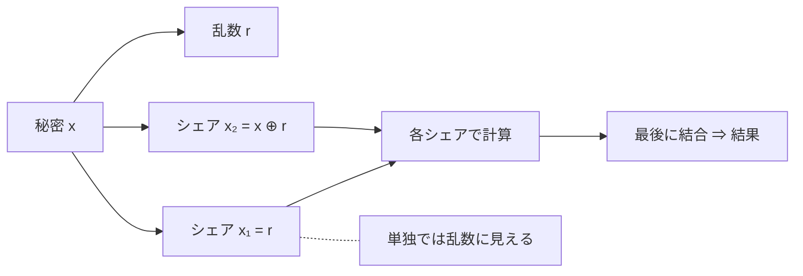

# 04. 対策（マスキングと実装コスト）

> 親: [README](./README.md) ｜ 前: [03 キャッシュサイドチャネル](./03_cache-side-channels.md) ｜ 層: 基礎(Layer 1)

**この1ページで分かること**

- マスキング＝秘密をランダムな断片（シェア）に割ってから計算し、電力との相関を消す
- `d` 次マスキングは `d` 個までの同時観測に安全。次数を上げるとコストが急増
- 耐量子暗号は Boolean と算術の 2 種のマスキングを行き来する変換が重い

定数時間実装（[01](./01_timing-attacks.md)）は時間とアクセス先を守るが、電力（[02](./02_power-analysis.md)）はデータそのものが決めるので漏れる。ここではその対策とコストの理由。

---

## 最小の例: 1 ビットを 2 つに割る

```
秘密 x = 1 を、乱数 r で 2 つのシェアに分ける
  r = 0 → (x₁, x₂) = (0, 1)
  r = 1 → (x₁, x₂) = (1, 0)
```

x₁ だけ見ても 0 と 1 が半々＝**何も分からない**。x₁ ⊕ x₂ を取れば必ず 1 に戻る。これを全ビット・全演算で行うのがマスキング。

## マスキング：秘密を分割して計算する

```
原則: 秘密値 x を、複数のランダムな断片（シェア）に分割してから計算する
  x = x₁ ⊕ x₂ ⊕ ... ⊕ x_{d+1}     （Boolean マスキングの場合）
```

シェア（分割した断片）は**単独ではランダム**。電力波形はどのシェアとも相関せず、DPA/CPA の拠り所「中間値と電力の相関」が消える。**全シェアを同時に観測しない限り復元できない。**



### 安全性の形式化：probing model

「同時にいくつ観測されても安全か」を定式化したのが **probing model**（Ishai–Sahai–Wagner, 2003）。攻撃者が回路内部の中間変数を `t` 個までのぞける設定。

```
d 次マスキング（シェア d+1 個）は、d 個までの probe に対して安全
        ↓
攻撃者は d+1 個以上を同時に観測しなければ何も学べない
```

**次数を上げれば安全だがコストが急増**——演算量はシェア数に比例し、シェア間の相互作用も安全に処理せねばならない。

---

## 秘密分散と同じ道具

**[`../../03_privacy/03_ppt-cryptographic/README.md`](../../03_privacy/03_ppt-cryptographic/README.md)
で見た Shamir の秘密分散と発想は同じ**——断片単体からは元の値が分からないように分ける。

| | MPC / 秘密分散 | マスキング |
|---|---|---|
| 断片の置き場所 | **複数の当事者**に分散する | **同じチップの中**に置く |
| 守る相手 | 他の参加者 | 電力波形を観測する攻撃者 |
| 目的 | 協調して計算しつつ入力を隠す | 物理的な漏洩を断つ |

**道具は同じで目的だけが違う。** 両分野の技術は相互に流用できる（閾値実装は秘密分散の理論をハードウェアに持ち込んだもの）。

### 閾値実装 (Threshold Implementation)

ハードウェア実装では**グリッチ**（信号が確定する前の一時的な遷移）が漏洩源になる。閾値実装はグリッチがあっても漏れない構成を与え、「マスキングしたのに漏れる」失敗を防ぐ。

---

## 耐量子暗号のマスキングはなぜ難しいか

**標準化されても実装が漏れれば安全ではない。** 耐量子暗号は標準（FIPS 203/204/205）が揃い、**実装の安全化がこれからの課題**。格子ベース方式（ML-KEM 等）には対称鍵暗号に無い困難がある。

| | 対称鍵暗号（AES 等） | 格子ベース（ML-KEM 等） |
|---|---|---|
| 主な演算 | ビット演算・S-box | 多項式の**剰余算術**と、ハッシュ・符号化の**ビット演算** |
| マスキングの型 | Boolean マスキング（XOR で分割）でほぼ統一できる | **Boolean と算術の両方**が要る |
| 追加コスト | 次数に応じて増える | 上記に加え**Boolean ⇄ 算術の変換**が随所で必要 |

### 変換が高コストである

```
Boolean マスキング: x = x₁ ⊕ x₂        （XOR で分割）
算術マスキング:     x = x₁ + x₂ mod q  （加算で分割）
```

**同じ秘密を演算の種類ごとに違う分け方で持つ**必要がある。剰余算術（mod q の足し引き掛け）は算術マスキング、ハッシュ・符号化は Boolean が自然で、方式内で両者を行き来する**変換自体がボトルネック**。変換の効率化は活発な研究対象。

> 実装コストは方式・次数・プラットフォームで大きく変わる。
> 具体的な倍率を引用する場合は、必ず出典と条件（次数・対象・測定環境）を併記すること。

---

## まとめ表

| 攻撃 | 観測対象 | 悪用する物理現象 | 主な対策 |
|---|---|---|---|
| タイミング攻撃 | 実行時間 | 分岐・反復回数のデータ依存性 | 定数時間実装（[01](./01_timing-attacks.md)） |
| SPA / DPA / CPA | 消費電力波形 | `P_dynamic` のデータ依存性 | マスキング、閾値実装 |
| Prime+Probe / Flush+Reload | キャッシュアクセス時間 | メモリ階層のレイテンシ差 | 秘密依存のメモリアクセスを排除、キャッシュ分割 |

**どの対策も性能を犠牲にする。** 定数時間は常に最悪ケースの時間を、マスキングはシェア数比例のコストを払う。安全性と性能のトレードオフが常態。

---

## 演習（解答つき）

1. 定数時間実装だけでは電力解析を防げない理由を述べよ。
2. `d` 次マスキングが probing model において何を保証するか述べよ。
   また次数を上げることのコストは何か。
3. 格子ベース暗号のマスキングが AES のマスキングより難しい理由を、
   演算の種類の観点から述べよ。

<details><summary>解答</summary>

1. 定数時間実装が保証するのは「**実行時間とアクセス先**が秘密に依存しない」ことだけである。
   一方、消費電力は**処理しているデータそのもの**（ビット遷移の数）に依存するため、
   実行する命令列が完全に同じでも、扱う値が違えば電力波形が変わる。
   したがって時間を一定にしても DPA/CPA は成立しうる。
2. **`d` 個までの中間変数を同時に観測されても、秘密について何も学べない**ことを保証する
   （シェアは `d+1` 個）。攻撃者は `d+1` 個以上を同時に probe しなければならない。
   コストはシェア数に比例した演算量の増加に加え、シェア間の相互作用（特に非線形演算）を
   安全に処理する必要があるため、次数を上げると急激に重くなる。
3. AES はビット演算と S-box が主で、**Boolean マスキング（XOR による分割）で統一**できる。
   一方、格子ベース方式は多項式の**剰余算術**（加算・乗算 mod q）と、
   ハッシュや符号化の**ビット演算**の両方を含む。
   算術部分には算術マスキング（加算による分割）、ビット演算部分には Boolean マスキングが
   自然なので、**1つの方式の中で両者を行き来する変換が必要**になり、
   その変換自体が高コストなボトルネックになる。

</details>

---

## 暗号での出口

同じ CPU 上のソフトウェアだけで秘密を取る攻撃と、それに抗するはずだった TEE（信頼実行環境）は次のファイルで扱う。
→ [`../05_microarchitecture-and-tee.md`](../05_microarchitecture-and-tee.md)

Spectre/Meltdown への**ソフトウェア側**の緩和策（Retpoline・KPTI 等）は
[`../../05_software-security/03_security-patterns.md`](../../05_software-security/03_security-patterns.md)、
耐量子アルゴリズム自体は
[`../../02_cryptography/06_advanced-topics-map.md`](../../02_cryptography/06_advanced-topics-map.md) で扱う。

---

## 参考

- Ishai, Y., Sahai, A., Wagner, D. (2003). *Private Circuits: Securing Hardware against Probing Attacks*. CRYPTO.
- Nikova, S., Rechberger, C., Rijmen, V. (2006). *Threshold Implementations Against Side-Channel Attacks and Glitches*. ICICS.
- Bos, J. et al. *Masking Kyber: First- and Higher-Order Implementations*: https://eprint.iacr.org/2021/483.pdf
