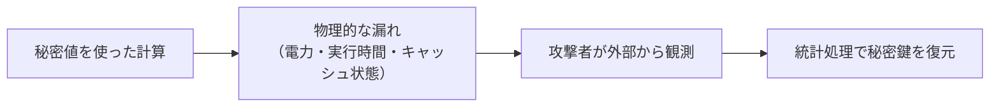

# サイドチャネル（Side Channels）

> 対応科目: Hardware Security ｜ 層: 基礎(Layer 1)
> 親: [../index.md](../index.md)

## 一言で

暗号アルゴリズムが数学的に安全でも、**それを実行する物理現象が情報を漏らす**。
計算にかかった時間・消費した電力・触ったキャッシュ——本来の入出力ではない「副次的な経路」から
秘密鍵が復元できる。

このフォルダの前提は「**システムは十分よく設計されている**」こと。
自作暗号でも設定ミスでもなく、標準アルゴリズムを正しく実装していても物理層から漏れる——
だからサイドチャネルは独立した領域になっている。

---

## 概念ファイル（番号順に読む）

| # | ファイル | 内容 | 備考 |
|---|---|---|---|
| 01 | [01_timing-attacks.md](./01_timing-attacks.md) | 実行時間からの漏洩・PIN 検証を手で破る例・定数時間実装 | 総当たりが指数から線形に落ちる過程を追う |
| 02 | [02_power-analysis.md](./02_power-analysis.md) | SPA → DPA → CPA・RSA への SPA・内部衝突・テンプレート攻撃 | ハミング重みモデルと物理式の対応 |
| 03 | [03_cache-side-channels.md](./03_cache-side-channels.md) | Prime+Probe / Flush+Reload・共有メモリという前提 | Spectre/Meltdown の最終段 |
| 04 | [04_countermeasures.md](./04_countermeasures.md) | マスキング・秘密分散との関係・耐量子実装での難しさ | 対策のコストがなぜ高いか |

---

## 受動的な観測と能動的な妨害

サイドチャネルは**受動**（観測するだけ）である。同じ物理アクセスを使って
**能動的に妨害する**のがフォールト注入で、そちらは
[`../02_hardware-attacks.md`](../02_hardware-attacks.md) が本体。

| | 受動（本フォルダ） | 能動（`02` が本体） |
|---|---|---|
| 攻撃者の行為 | 漏れを**観測**する | 計算を**妨害**する |
| 代表例 | タイミング・電力・電磁波・キャッシュ | 電圧/クロックグリッチ・レーザー照射 |
| 崩れる保証 | 秘密の機密性 | 計算結果の正しさ |

侵襲性による3分類（非侵襲的・半侵襲的・侵襲的）も
[`../02_hardware-attacks.md`](../02_hardware-attacks.md) が本体。
本フォルダで扱うのは主に**非侵襲的**な手法である——分解せず、外部から観測するだけで成立する。

---

## なぜ重要か / コースでの位置づけ

- **暗号の安全性証明が守らない範囲**を扱う。証明は入出力の関係についてのもので、
  実行時間や消費電力は数学モデルに含まれていない
  （[`../../02_cryptography/06_advanced-topics-map.md`](../../02_cryptography/06_advanced-topics-map.md) が動機づけ）
- **実装が攻撃対象になる**という視点は、暗号を「使う」側にとって必須。
  ライブラリの選定基準（定数時間実装であるか）に直結する
- 耐量子暗号の実装ではこの問題が再燃している（→ [`04_countermeasures.md`](./04_countermeasures.md)）

---

## このフォルダで「本体」を置かないもの（DRY）

- **侵襲性による攻撃者分類・フォールト注入・Spectre/Meltdown の仕組み** →
  [`../02_hardware-attacks.md`](../02_hardware-attacks.md)
- **CMOS の消費電力式・メモリ階層のレイテンシ** →
  [`../../01_prerequisites/03_hardware-digital-logic/`](../../01_prerequisites/03_hardware-digital-logic/index.md)
- **秘密分散・MPC の一般論** →
  [`../../03_privacy/03_ppt-cryptographic/README.md`](../../03_privacy/03_ppt-cryptographic/README.md)
- **Spectre/Meltdown へのソフトウェア側の緩和策** →
  [`../../05_software-security/03_security-patterns.md`](../../05_software-security/03_security-patterns.md)

---

## つまずき / 深掘り候補（Layer 2）

- [ ] safegcd 等の定数時間アルゴリズムの実装詳細 → `deep/constant-time-algorithms/`
- [ ] マスキングの次数（1次/高次）と各次数を破る攻撃 → `deep/higher-order-masking/`
- [ ] ブール ⇄ 算術マスキング変換を小さな例で手で追う → `deep/boolean-arithmetic-masking/`

---

## 参考

- Kocher, P. (1996). *Timing Attacks on Implementations of Diffie-Hellman, RSA, DSS, and Other Systems*. CRYPTO.
- Kocher, P., Jaffe, J., Jun, B. (1999). *Differential Power Analysis*. CRYPTO.
- Brier, E., Clavier, C., Olivier, F. (2004). *Correlation Power Analysis with a Leakage Model*. CHES.
- Mangard, S., Oswald, E., Popp, T. *Power Analysis Attacks: Revealing the Secrets of Smart Cards*.
- 本フォルダの構成は COSIC Course 2026 のサイドチャネルセッション（Benedikt Gierlichs, 2026年6月）の整理に基づく。
