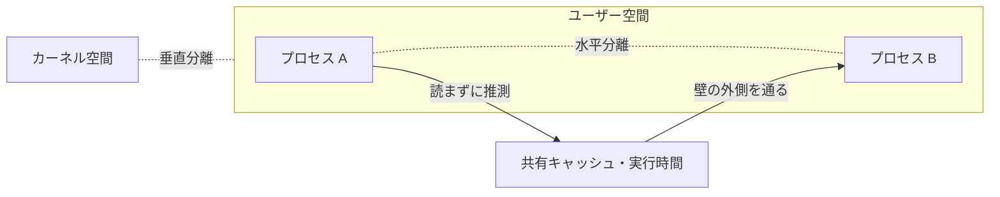

# 05. マイクロアーキテクチャ攻撃と TEE

> 前: [04 サイドチャネル](./04_side-channels/README.md) ｜ 層: 基礎(Layer 1)

**この1ページで分かること**

- ISA という「契約」が実行時間を規定していないことが構造的な漏洩を生む
- メモリ保護の壁を「越えず迂回する」攻撃には、メモリ安全な言語も ASLR も効かない
- TEE（SGX 等）が守ると主張した範囲と、破られた範囲の違い

[04](./04_side-channels/README.md) は電力や時間を測定器で観測した。ここでは**同じ CPU 上のソフトウェアだけ**で秘密を取る攻撃と、それに抗するはずだった TEE（信頼実行環境）を見る。

---

## 最小の例: 秘密を 1 つ隔離する箱

```
┌─ CPU ────────────────────────────────┐
│  OS（乗っ取られているかも）           │
│  ┌─ 箱（TEE） ─┐                     │
│  │ 秘密の鍵   │ ← OS からも読めない  │
│  └────────────┘                      │
│  共有キャッシュ ← 箱の中の処理の痕跡が残る │
└──────────────────────────────────────┘
```

箱は「直接読む」ことを防ぐ。だが箱の中の計算が共有キャッシュに残す痕跡は防いでいない——この 1 枚の絵がこのページの全て。

---

## 抽象化が規定していないもの

命令セットアーキテクチャ（ISA。x86 / ARM / RISC-V 等）は、ソフトウェアとハードウェアの間の**契約**。

| ISA が定義するもの | ISA が定義しないもの |
|---|---|
| 命令の種類と意味 | **各命令の実行時間** |
| 命令のエンコーディング | **消費電力** |
| レジスタの数と幅 | キャッシュの状態変化 |
| メモリモデル | 分岐予測器の内部状態 |

**コンパイラはこの契約を信じて最適化する。** だが実物は電気で動く回路で、契約外の性質（時間・電力・キャッシュ）は最適化の副産物として変化し、漏れる。**「速くする」と「観測可能な差を作らない」は原理的に両立しない**——最適化とは状態を共有し履歴で振る舞いを変えることだから。

---

## 分離の2軸：水平と垂直



**サイドチャネルは壁を壊さず迂回する。** メモリ保護は「読ませない」ことを保証するが、**読まずに推測すること**は禁じていない。

---

## メモリ安全性を破らない攻撃

従来の脆弱性との違いを押さえておく。

| | バッファオーバーフロー等 | マイクロアーキテクチャ攻撃 |
|---|---|---|
| 何をするか | 境界を**越える** | 境界を**越えない** |
| 破る保証 | メモリ安全性 | （何も破らない。副次的な観測のみ） |
| 効く対策 | メモリ安全な言語・ASLR・スタック保護 | **上記はすべて効かない** |

**Rust に書き換えても ASLR（メモリ配置のランダム化）を入れても防げない。** 攻撃者は許可された操作しかしておらず、観測しているだけ。「不正アクセスを止める」枠組みでは扱えない。バッファオーバーフローの本体は
[`../06_systems-security/02_software-vulnerabilities.md`](../06_systems-security/02_software-vulnerabilities.md)。

---

## TEE：OS を信頼しないという発想

通常アプリは OS を信頼する（OS が壊れたら終わり）。TEE はその前提を外し、**OS が乗っ取られても中のデータを守る**——CPU が OS からもメモリを隠す。[Root of Trust](./03_security-building-blocks.md) を**実行中のプログラム**へ拡張したもの。

### 現在の位置づけ

先駆けの Intel SGX は **2021 年にクライアント向けが非推奨**になりサーバ系に限られた。現在は VM 単位の保護が主流。

| 技術 | 保護の単位 |
|---|---|
| Intel SGX | プロセス内の一部（エンクレーブ＝隔離された実行領域） |
| Intel TDX | 仮想マシン全体 |
| AMD SEV-SNP | 仮想マシン全体 |
| ARM CCA (Realms) | 仮想マシン相当（ARMv9） |

この領域を **機密計算 (confidential computing)** と呼ぶ。GPU にも広がり、「クラウド事業者にもデータを見せない」要求に応える（[デジタル主権](../07_legal/03_regulatory-tsunami.md)と接続）。

### 破られた意味

SGX はサイドチャネルで複数回破られた（Foreshadow, 2018 等）。**「TEE は無意味」ではなく、脅威モデルの境界を知ること**が重要。

| TEE が守ると主張 | 守らなかった |
|---|---|
| 悪意ある OS からのメモリ直読 | キャッシュ・投機実行経由の間接観測 |

---

## 投機的実行が定数時間コードを破る

[04](./04_side-channels/01_timing-attacks.md) の「定数時間実装が対策」に、2018 年以降但し書きが付いた。

```
定数時間コード（秘密依存の分岐なし）
  → CPU は「実行されないはずの経路」を投機的に実行する
  → その経路が秘密依存のメモリアクセスをすればキャッシュに痕跡
  → ソース上は定数時間でも実行では漏れる
```

**定数時間性は「書いたコード」でなく「実際の実行」への要求になった。** コンパイラと CPU の両方を疑う必要がある。

分岐予測と投機実行の動作原理は
[`../01_prerequisites/03_hardware-digital-logic/03_hdl-and-architecture/02_pipelining-and-hazards.md`](../01_prerequisites/03_hardware-digital-logic/03_hdl-and-architecture/02_pipelining-and-hazards.md)、
Spectre / Meltdown 自体は [`02_hardware-attacks.md`](./02_hardware-attacks.md) が本体。

---

## 暗号コード以外への影響

**秘密依存の制御フローやメモリアクセスはあらゆるプログラムにある。** controlled-channel attack（Xu–Cui–Peinado, 2015）は、悪意ある OS がページフォルト（メモリページ読み込みの割り込み）を観測し、エンクレーブ内の**画像を粗く復元**しうることを示した。

```
暗号ライブラリ  → 鍵が漏れる
画像処理        → 処理中の画像が漏れる
データベース検索 → 検索条件やヒットしたレコードが漏れる
```

**「暗号を使っていないから関係ない」とは言えない。** プライバシー影響は [`../03_privacy/`](../03_privacy/index.md) に接続する。

---

## 演習（解答つき）

1. マイクロアーキテクチャ攻撃が、メモリ安全な言語への書き換えでは防げない理由を述べよ。
2. Flush+Reload が前提とする「共有メモリ」が、攻撃者の特殊な工作なしに
   満たされてしまうのはなぜか（[04](./04_side-channels/03_cache-side-channels.md) の復習）。
3. TEE が「破られた」と報じられたとき、脅威モデルの観点では何が起きたと理解すべきか。

<details><summary>解答</summary>

1. これらの攻撃は**メモリ安全性を破っていない**ため。攻撃者は許可された範囲しか
   アクセスせず境界を越えない。ただキャッシュの状態や実行時間という
   **副次的な情報を観測している**だけである。メモリ安全な言語・ASLR・スタック保護は
   いずれも「境界を越えるアクセス」を防ぐ仕組みなので、越えない攻撃には効かない。
2. 現代 OS はメモリ節約のため**共有ライブラリを複数プロセスに同じ物理ページとして写像する**。
   攻撃者と被害者が同じ暗号ライブラリを使っていれば、そのコードやテーブルは
   物理的に同一ページ上にある。OS の通常の最適化が攻撃の前提条件を用意している。
3. **脅威モデルの境界が想定より狭かった**と理解する。TEE は「悪意ある OS からの
   メモリの直接読み出し」を防ぐという主張自体は満たしており、
   破られたのは新しい脅威モデルの中で**サイドチャネル経由の間接的な観測**を
   閉じきれていなかった部分である。「TEE は無意味」ではなく
   「守る範囲と守らない範囲を区別して使う」のが正しい理解になる。

</details>

---

## 次への接続

`04_hardware-security/` は「設計 → 攻撃者能力 → 信頼の起点 → サイドチャネル → マイクロアーキと TEE」で揃った。ソフトウェア側の緩和策は
[`../05_software-security/03_security-patterns.md`](../05_software-security/03_security-patterns.md)、
クラウドのマルチテナント分離は
[`../06_systems-security/05_distributed-systems-security.md`](../06_systems-security/05_distributed-systems-security.md) へ接続する。

---

## 参考

- Xu, Y., Cui, W., Peinado, M. (2015). *Controlled-Channel Attacks: Deterministic Side Channels for Untrusted Operating Systems*. IEEE S&P.
- Van Bulck, J. et al. (2018). *Foreshadow: Extracting the Keys to the Intel SGX Kingdom with Transient Out-of-Order Execution*. USENIX Security.
- Canella, C. et al. (2019). *A Systematic Evaluation of Transient Execution Attacks and Defenses*. USENIX Security.
- Confidential Computing Consortium: https://confidentialcomputing.io/
- 本ファイルの構成は COSIC Course 2026 のマイクロアーキテクチャ攻撃セッション（Jo Van Bulck, 2026年6月）の整理に基づく。
