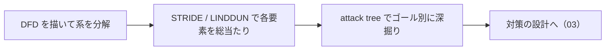

# 02. 脅威モデリング：STRIDE・attack tree・LINDDUN

> 前: [01 Secure SDLC](./01_secure-sdlc.md) ｜ 次: [03 セキュリティパターン](./03_security-patterns.md) ｜ 層: 基礎(Layer 1)

**この1ページで分かること**

- 土台となるデータフロー図（DFD）の描き方と信頼境界の意味
- STRIDE（セキュリティ脅威 6 分類）・attack tree（ゴール起点の経路分解）・LINDDUN（プライバシー脅威 7 分類）の使い分け
- STRIDE の Repudiation と LINDDUN の Non-repudiation が正反対の脅威を指す落とし穴

家を建てる前に「誰が・どこから・何を盗みに来るか」を書き出す作業。思いつきではなく **DFD** を土台に体系的に洗い出す。プライバシー側の LINDDUN は [`../03_privacy/`](../03_privacy/index.md) が予告した本体。

### 最小の例: ログインフォーム 1 個に S と T を当てる

```
[ブラウザ] --ID/パスワード--> (ログイン処理)
  S なりすまし: 他人の ID/パスワードを入力する         → 対策: 多要素認証
  T 改ざん:     送信途中でパスワード欄を書き換える      → 対策: TLS
```

要素 1 つに脅威分類を順に当てるだけ。これを図の全要素・全分類で繰り返すのが脅威モデリング。



---

## 土台：データフロー図（DFD）で系を分解する

```
記法: プロセス(丸) ／ データストア(2本線) ／ 外部エンティティ(四角) ／ データフロー(矢印)
     信頼境界(trust boundary＝信用の度合いが変わる線、点線)を跨ぐ矢印ほど攻撃者が届きやすい
```

### サンプル系：ログイン付きオンライン注文システム

```
[ブラウザ] --(1)ID/パスワード--> ‖信頼境界‖ --> (Webサーバ) --(2)SQLクエリ--> [ユーザDB]
                                                    |
                                              (3)セッション発行
                                                    v
                                              [ブラウザ]（Cookie保持）
```

以降はこのサンプル系（3 本のフロー・1 つの信頼境界）に対して行う。

---

## STRIDE（Kohnfelder & Garg, Microsoft, 1999年）

1999 年に Microsoft 社内誌で初出、2002 年までに Microsoft SDL の標準プロセスに。DFD の各要素を 6 分類の脅威で総当たりする。

| 頭文字 | 脅威 | サンプル系での具体例 | 対策 |
|---|---|---|---|
| S | Spoofing（なりすまし） | セッションCookieを盗み、他人になりすましてログインする | 強固なセッション管理・多要素認証 |
| T | Tampering（改ざん） | (2)のSQLクエリのパラメータを操作し価格を書き換える | サーバ側入力検証・パラメータ化クエリ |
| R | Repudiation（否認） | 注文したユーザが「注文していない」と主張する | 監査ログ・デジタル署名付き取引記録 |
| I | Information Disclosure（情報漏洩） | [ユーザDB]の平文パスワードが流出する | ハッシュ化（bcrypt等）・保存時暗号化 |
| D | Denial of Service（サービス拒否） | ログインエンドポイントに大量リクエストを送る | レート制限・WAF |
| E | Elevation of Privilege（権限昇格） | 一般ユーザが管理者用エンドポイントに直接アクセスする | 認可チェックの徹底（[`../06_systems-security/03_authn-authz-access-control.md`](../06_systems-security/03_authn-authz-access-control.md)で詳述） |

価値は、経験に依存しがちな脅威発見を「6 分類を機械的に問う」再現可能なプロセスに変えること。

---

## Attack Tree（Schneier, 1999年）

Schneier が 1999 年に発表（形式自体は Weiss 1991 が先行）。STRIDE が各要素を横断的に問うのに対し、attack tree は**1 つの攻撃者ゴール**を根に置き、達成経路を AND/OR で縦に分解する。

```
ゴール: [ユーザDB]の内容を盗む
  OR
  ├─ SQLインジェクションで(2)のクエリを乗っ取る
  │    AND: 入力検証の欠如を見つける + ペイロードを注入する
  ├─ セッションを乗っ取り管理者としてエクスポート機能を呼ぶ（Eの発展形）
  │    AND: セッションCookieを盗む + 管理者権限のエクスポートAPIを見つける
  └─ DB管理者の認証情報をフィッシングで盗む
       AND: フィッシングメールを送る + 管理者が認証情報を入力する
```

STRIDE の個々の脅威が、attack tree では**1 つのゴールへの複数経路**として再構成される。STRIDE＝網羅性、attack tree＝深掘りと優先順位、の補完関係。

---

## LINDDUN（Deng, Wuyts, Scandariato, Preneel, Joosen; 2011年）

STRIDE をプライバシー版に翻案した方法論（*Requirements Engineering* 誌）。同じく DFD 上で総当たりするが、対象が「プライバシー特性の破れ」になる。

### 7カテゴリと`../03_privacy/01_privacy-concepts.md`との対応

[01_privacy-concepts](../03_privacy/01_privacy-concepts.md) の 4 性質（匿名性・非連結性・非検知性・非観測性）のうち 3 つが脅威名にそのまま現れる。LINDDUN の役割は「その性質が破られる具体的シナリオ」を与えること。

| LINDDUN頭文字 | 脅威 | 定義（何が破られるか） | 対応するプライバシー特性 |
|---|---|---|---|
| L | Linkability | 複数の IOI（Item of Interest＝守りたい対象：データ・行為）を結びつけて追加情報を得られる | **非連結性**（[01](../03_privacy/01_privacy-concepts.md)）の破れ |
| I | Identifiability | 意図せず個人の身元が漏洩・推測される | **匿名性**の破れ |
| N | Non-repudiation | ある主張・行為を特定個人に帰属させる証拠が残る | 匿名性・非連結性の「否認可能性」を伴う破れ（証拠付きで断定できてしまう点がSTRIDEのRepudiationと極性が逆） |
| D | Detectability | データが「存在すること自体」を第三者が推測できる | **非検知性**の破れ |
| D | Disclosure of information | 個人データそのものが漏洩する | 機密性（[`../02_cryptography/01_goals-and-primitives.md`](../02_cryptography/01_goals-and-primitives.md)のConfidentiality）の破れ |
| U | Unawareness | データ主体が自分のデータの扱われ方を十分に知らされていない | GDPR透明性原則（[`../03_privacy/06_law-and-dpia.md`](../03_privacy/06_law-and-dpia.md)）の破れ |
| N | Non-compliance | システムがデータ保護原則・法規制に準拠していない | GDPR全体（同上）への違反 |

**Unobservability**（非検知性＋匿名性の合成特性）は単独カテゴリにない——D と I/L の組み合わせで表現できるため。

| | STRIDE の Repudiation | LINDDUN の Non-repudiation |
|---|---|---|
| 何が脅威か | 「やった」ことを否認**できる** | 「やった」ことを否認**できなくなる** |
| 誰に不利か | 守る側（攻撃者に有利） | データ主体 |

同じ語幹で正反対を指す、最も混同しやすい落とし穴。

### サンプル系へのLINDDUN適用（一部）

```
(1) ID/パスワード送信フロー:
  I (Identifiability): パスワードリセット機能の応答時間差から、
    登録済みメールアドレスかどうかが外部から推測できる（ユーザ列挙）
(3) セッションCookie発行:
  L (Linkability): 同一Cookieが複数セッションで使い回されると、
    別ログインが同一ユーザによるものと結びつけられる
```

---

## 演習（解答つき）

1. STRIDEとattack treeは何を単位に脅威を整理する点が異なるか、一言で対比せよ。
2. LINDDUNの Non-repudiation が「データ主体にとって不利」とされる理由を、
   STRIDEの Repudiation と対比して述べよ。
3. サンプル系の(2) SQLクエリのフローに対してLINDDUNのDisclosure of informationを
   適用すると、どのような脅威シナリオが考えられるか1つ挙げよ。

<details><summary>解答</summary>

1. STRIDEはDFDの**各要素**（プロセス・データフロー等）を単位に6分類を総当たりする横断的な
   網羅性重視の手法。attack treeは**1つの攻撃者ゴール**を根に置き、そこに至る経路を
   AND/ORで縦に分解する深掘り重視の手法。
2. STRIDEのRepudiationは「攻撃者が自分の行為を否認できてしまう」ことが脅威（否認防止の
   欠如＝攻撃者に有利）。LINDDUNのNon-repudiationは逆に「データ主体の行為が証拠付きで
   特定人物に帰属してしまう」ことが脅威（否認**できなくなる**こと＝プライバシー上不利）。
   同じ語幹だが守りたい対象の立場が逆転している。
3. 例: SQLインジェクションでユーザDBの内容（氏名・住所等の個人データ）がそのまま
   外部に漏洩するシナリオ。STRIDEのInformation Disclosureと現象としては重なるが、
   LINDDUNの文脈では「漏洩した個人データがデータ主体にどんな不利益を与えるか」という
   プライバシー影響の観点で評価する。

</details>

---

## 次への接続

洗い出した脅威への**設計レベルの防御**を体系化する。→ [03 セキュリティパターン](./03_security-patterns.md)

---

## 参考

- Deng, M., Wuyts, K., Scandariato, R., Preneel, B., Joosen, W. (2011). *A privacy threat analysis framework: supporting the elicitation and fulfillment of privacy requirements*. Requirements Engineering, 16(1), 3-32.
- linddun.org, *Threat types*: https://linddun.org/threat-types/
- Kohnfelder, L., Garg, P. (1999). *The Threats to Our Products*. Microsoft Interface (社内誌).
- Schneier, B. (1999). *Attack Trees: Modeling Security Threats*. Dr. Dobb's Journal, 24(12), 21-29.
