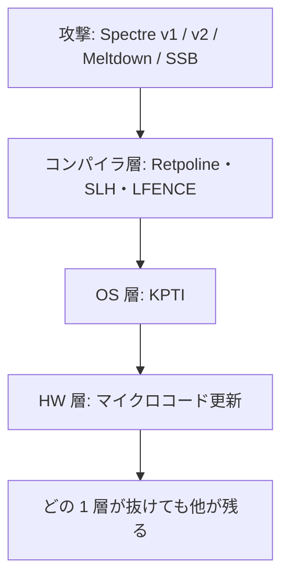

# 03. セキュリティ設計パターンとアーキテクチャ

> 対応科目: Advanced Methods for Security and Privacy by Design ｜ 前: [02 脅威モデリング](./02_threat-modeling.md) ｜ 次: [04 セキュリティテスト](./04_security-testing.md) ｜ 層: 基礎(Layer 1)

**この1ページで分かること**

- セキュリティ機構の 4 つの柱（分離→認証→認可→実装の正しさ）と、その順番に意味がある理由
- 「よくある脅威への実証済みの構造的解決策」＝設計パターン代表 5 つと対応する STRIDE 脅威
- 単一対策では防げない Spectre/Meltdown に、コンパイラ・OS・HW の各層で緩和策を重ねる Defense in Depth

料理のレシピのように、よくある脅威には「型」で対処する。[02](./02_threat-modeling.md) の脅威に毎回ゼロから対策を考えず、**セキュリティ設計パターン**として蓄積する。個々の原則は [05](./05_secure-by-design.md)。

### 最小の例: ログイン API 1 本に 4 つの柱

| 柱 | ログイン API では |
|---|---|
| 分離 | API は HTTP 経由でしか呼べない（DB を直接触れない） |
| 認証 | 送り主が誰かをパスワードで確認 |
| 認可 | 「一般ユーザ」に管理者操作を許さない |
| 実装の正しさ | パスワード比較のコードが意図どおりに動く |

上の 3 つが揃っても、4 つ目（例: 比較コードが SQL インジェクションを許す）で全てが崩れる。

---

## 押さえる概念

### セキュリティ機構の4つの柱

パターンの前に、**何を保証しようとしているか**の全体像。**順番に意味がある。**

| # | 柱 | 保証すること | 破れたときに起きること |
|---|---|---|---|
| 1 | **分離 (isolation)** | 保護対象は「リクエストを受けレスポンスを返す箱」としてのみ相互作用する | **以降の3つが全て無意味になる** |
| 2 | **認証** | リクエストの送り主が誰か分かる | なりすまし |
| 3 | **認可** | その主体にその操作を許すかを判定できる | 権限昇格・IDOR（ID を書き換えて他人のデータに届く） |
| 4 | **リクエスト実装の正しさ** | 認可された操作が意図した通りのことだけをする | **ソフトウェア脆弱性のほぼ全て** |

1 が土台なのは、**箱の外から中身を直接触れるなら、誰が呼んだかの検査に意味がない**から。分離の実現手段は
[`../06_systems-security/05_distributed-systems-security.md`](../06_systems-security/05_distributed-systems-security.md) と
[`../04_hardware-security/index.md`](../04_hardware-security/index.md)、
2と3は [`../06_systems-security/03_authn-authz-access-control.md`](../06_systems-security/03_authn-authz-access-control.md) が本体。

#### 柱4がなぜ難しいか

「意図どおりのことだけをする」は、**入力を敵が選ぶ**条件下では驚くほど難しい。別技術に見える脆弱性が同じ型の失敗であることが多い。

| 事例 | 何が起きたか |
|---|---|
| バッファの境界を超える読み出し | クライアントが**申告した長さ**を検証せず、実際のデータより大きい値を信じてメモリを読み出してしまう |
| SQL インジェクション | 入力を文字列連結でクエリに埋め込むと、入力が**データではなくコード**として解釈される |

**共通の型は「敵が選んだ入力で実装の意味が変わる」**——どちらも入力を**信用した**結果。入力検証・パラメータ化クエリ・境界での正規化が効く理由は「入力を信用しない」の一点。AI を組み込んだ系でも同じ（→ [AI とセキュリティ](../00_overview/05_ai-and-security.md)）。

### 代表的なアーキテクチャパターン

Schumacher et al. (2006) *Security Patterns* から頻出のものを抜粋。

| パターン | 何を解決するか | 対応するSTRIDE脅威 |
|---|---|---|
| Single Access Point / Authentication Enforcer | 認証の入口を1箇所に集約し、迂回経路を作らない | Spoofing |
| Check Point（完全な仲介） | 全アクセスを 1 つの参照モニタ（必ず通過する検査点）で検査（[アクセス制御](../06_systems-security/03_authn-authz-access-control.md)） | Elevation of Privilege |
| Fail Securely（フェイルセキュア） | エラー時に「開いて」しまうのではなく「閉じて」安全側に倒す | Elevation of Privilege, Information Disclosure |
| Defense in Depth（多層防御） | 単一の防御層が破られても他の層が残るよう、独立した複数の対策を重ねる | 全般 |
| Secure by Default（安全なデフォルト設定） | 設定を変えなければ最も安全な状態で動く | 全般（設定ミスに起因する漏洩の予防） |

排他的ではなく組み合わせて使う。次節はまさに多層防御の実例。

### ケーススタディ：Spectre/Meltdownへのソフトウェア側多層防御

[Spectre/Meltdown](../04_hardware-security/02_hardware-attacks.md)（2018）は投機実行（予測に基づき先回りで命令を実行する高速化）がキャッシュに残す痕跡を悪用する。HW 側（マイクロコード更新＝CPU 内部ソフトの修正）だけでは全変種を防げず、**層ごとに独立した緩和策**を重ねる。

| 緩和策 | 対応する変種 | 実装される層 | 仕組み |
|---|---|---|---|
| Retpoline（Google, 2018） | Spectre v2（分岐標的注入） | コンパイラ | 間接分岐（飛び先が実行時に決まる分岐）をリターン命令のトランポリンに置換し、予測不能な先へ飛ぶこと自体を防ぐ |
| Speculative Load Hardening（LLVM, 2018） | Spectre v1（境界チェックバイパス） | コンパイラ | 誤った投機パスに入った「汚染フラグ」を追跡し、危険なロード結果をマスク |
| KPTI／KAISER（2017→2018 Linux） | Meltdown | OS | ユーザ空間実行中はカーネルのページテーブルを見せず、投機実行でも触れなくする |
| LFENCE 挿入 | Speculative Store Bypass（CVE-2018-3639） | コンパイラ／手動 | ストアとロードの間に順序保証命令を挿入 |

**どれも単独では全変種を防げない**——[02](./02_threat-modeling.md) で「1 つの脆弱性クラスに複数の経路」と分かったとき、Defense in Depth が要る典型例。

---

## なぜ重要か / コースでの位置づけ

ワークショップ形式の科目で、「原則から構造への落とし込み」が実践部分。Spectre/Meltdown は [HW 側の機構](../04_hardware-security/index.md)と本領域（SW 側の応答）の橋渡し。

---

## 演習（解答つき）

1. Retpoline と KPTI はそれぞれ Spectre と Meltdown のどちらに対する対策か、
   実装される層（コンパイラ/OS）とあわせて述べよ。
2. 「フェイルセキュア」と「フェイルセーフ」が字面は似ているが要求が異なりうる理由を、
   認証システムの例で説明せよ。
3. Defense in Depth が「単一の完璧な対策」より優れているとされる理由を一言で述べよ。
4. 「境界を超えるメモリ読み出し」と「SQL インジェクション」は技術的には全く異なるが、
   4つの柱のどれが破れた事例か。共通する失敗の型を1文で述べよ。

解答

1. Retpolineはコンパイラレベルの対策でSpectre（v2、分岐標的注入）に対応する。
   KPTIはOS（カーネル）レベルの対策でMeltdownに対応する。両者は異なる脆弱性・異なる層を
   カバーするため、どちらか一方だけでは不十分。
2. フェイルセーフは「人の安全」を優先し、エラー時にドアを開ける（火災時に鍵を開放する等）。
   フェイルセキュアは「情報の機密性」を優先し、エラー時にドアを閉める（認証システムが
   故障したらデフォルトでアクセス拒否にする）。認証システムでは誤って「開いて」しまうと
   なりすましを許すため、通常フェイルセキュアが優先される。
3. 単一の対策は必ずどこかに想定外の抜け穴や新しい攻撃手法で破られうる。独立した複数の層を
   重ねておけば、1つの層が破られても他の層が被害を食い止められるため、システム全体としての
   耐性が個々の対策の総和より高くなる。
4. どちらも**柱4（リクエスト実装の正しさ）**が破れた事例。分離・認証・認可はいずれも
   機能しており、攻撃者は正規に許可された操作を呼んでいるが、その操作の実装が
   意図しない動作をしている。共通する型は
   **「実装が入力を信用したために、敵が選んだ入力で処理の意味が変わった」**こと
   （前者は申告された長さを、後者はデータとコードの境界を信用した）。

---

## 次への接続

パターンを適用しても実装に欠陥は残りうる。コードを検証する手法（静的解析・ファジング・ペネトレーションテスト）を見る。
→ [04 セキュリティテスト](./04_security-testing.md)

---

## つまずき / 深掘り候補

- [ ] Zero Trust Architecture（NIST SP 800-207）とCheck Pointパターンの関係 → `deep/zero-trust/`
- [ ] Speculative Store Bypass以降のSpectre亜種（Spectre-NG群）の分類

---

## 参考

- Schumacher, M., Fernandez-Buglioni, E., Hybertson, D., Buschmann, F., Sommerlad, P. (2006). *Security Patterns: Integrating Security and Systems Engineering*. Wiley.
- Turner, P. (2018). *Retpoline: a software construct for preventing branch-target-injection*. Google Security Blog / LWN.net: https://lwn.net/Articles/742980/
- LLVM Project, *Speculative Load Hardening*: https://llvm.org/docs/SpeculativeLoadHardening.html
- Gruss, D. et al. (2017). *KASLR is Dead: Long Live KASLR*（KAISERの前身研究）; Linux kernel PTI documentation: https://www.kernel.org/doc/html/v5.11/x86/pti.html
- Intel, *Speculative Store Bypass / CVE-2018-3639*: https://www.intel.com/content/www/us/en/developer/articles/technical/software-security-guidance/advisory-guidance/speculative-store-bypass.html
