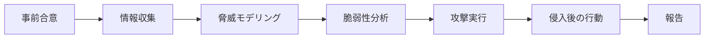

# 04. セキュリティテスト：静的解析・ファジング・ペネトレーションテスト

> 前: [03 セキュリティパターン](./03_security-patterns.md) ｜ 次: [05 Secure/Privacy by Design](./05_secure-by-design.md) ｜ 層: 基礎(Layer 1)

設計にパターンを適用しても（[03](./03_security-patterns.md)）、実装した**コードそのもの**に
欠陥が紛れ込んでいないかは別途検証が要る。「いつ・何を・どう壊すか」の違いで
大きく3手法に分かれ、[01](./01_secure-sdlc.md)のCI/CDパイプラインで役割分担して使われる。

**この1ページで分かること**

- SAST（実行せず解析）・ファジング（大量の変異入力で壊す）・DAST/ペネトレーションテスト（動作中システムへの疑似攻撃）の3手法の違い
- カバレッジガイド付きファジング（AFL/OSS-Fuzz）がなぜ効率的か
- ペネトレーションテストの標準 PTES と OWASP Testing Guide の役割分担

---

## 押さえる概念

### 静的解析（SAST：Static Application Security Testing）

```
特徴: コードを実行せずソースコード／バイナリを解析する
検出例: SQLインジェクションになりうる文字列結合、バッファオーバーフローになりうる
       固定長バッファへのコピー、ハードコードされた認証情報
限界: 「実行しないと分からない」動的な条件分岐や外部入力の実際の値は検出しにくく、
      誤検知（false positive）が多くなりがち
```

CI/CDパイプライン（[01](./01_secure-sdlc.md)）では、コミットのたびに自動実行して
「明らかにまずいパターン」を早期に弾くゲートとして使う。

### ファジング（Fuzzing）

```
アイデア: プログラムにランダム・変異させた入力を大量に投入し、クラッシュや
  異常動作（メモリ破壊、アサーション違反等）を機械的に見つける
カバレッジガイド付きファジング: 実行時にどのコードパスを通ったかを計測し、
  「新しいパスを通った」入力を優先的に変異させることで探索効率を上げる
```

**AFL（American Fuzzy Lop）**（Michal Zalewski, 2013年公開）はカバレッジガイド付き
ファジングを普及させた代表的ツールで、X.Org Server・PHP・OpenSSL・bash・Firefox・BIND・
Qt・SQLiteなど多数の主要OSSで重大なバグを発見した実績を持つ。2019年末にGoogleへ保守が
移管され、後継のAFL++がGoogleの**OSS-Fuzz**（継続的ファジング基盤、多数のOSSプロジェクトを
対象に24時間稼働）でも採用されている。SASTと違い**実際にプログラムを動かす**ため、
静的解析では見えない実行時の異常を検出できる一方、到達に特定の複雑な条件が必要なコード
パスは見つけにくい。

### 動的解析（DAST）とペネトレーションテスト

```
DAST: 動作中のアプリケーション（多くはWebアプリ）に外部から疑似攻撃リクエストを送り、
      応答から脆弱性を推測する（ブラックボックス的アプローチ）
ペネトレーションテスト: 人間の攻撃者が実際の攻撃者視点でシステム全体を能動的に攻略する
      （自動ツールに加え、業務ロジックの悪用など自動化しにくい脅威も対象にする）
```

**PTES（Penetration Testing Execution Standard）**は、次の7段階でペネトレーションテスト
**全体の進め方**を標準化する。



| 標準 | 範囲 | 提供するもの |
|---|---|---|
| PTES | ペネトレーションテスト案件全体 | 事前合意から報告までの「骨格」（案件マネジメントの型） |
| OWASP Testing Guide | Webアプリ・API層に特化 | 認証・セッション管理・入力検証等の具体的なテスト項目・手順 |

実務ではこの役割分担で組み合わせて使うことが多い。

### 3手法の比較

| 手法 | 対象 | 実行タイミング | 見つけやすい欠陥 |
|---|---|---|---|
| SAST | ソースコード/バイナリ | コミット時（早い） | コーディングパターンの欠陥 |
| ファジング | 実行中のプログラム | ビルド後〜継続的 | メモリ破壊・クラッシュ・想定外入力での異常系 |
| DAST/ペネトレーションテスト | 動作中のシステム全体 | リリース前後（遅い） | 認証・認可・業務ロジックの悪用、複数コンポーネント間の連携不備 |

Equifaxの事例（[01](./01_secure-sdlc.md)）に当てはめると、Apache Strutsの脆弱性自体は
Apache側のセキュリティ研究で発見されたものだが、**自社が使っている依存ライブラリに
既知のCVE（＝公知の脆弱性を一意に識別する番号）が含まれていないか**を継続的に照合する仕組み（SCA＝ソフトウェア構成分析、[01](./01_secure-sdlc.md)）が
機能していれば、パッチ未適用の期間をもっと早く検知できた可能性が高い。

---

## なぜ重要か / コースでの位置づけ

ライフサイクル全体の中で、本ファイルは「検証(Verification)」フェーズの中身。
複数の手法が互いの弱点を補い合う構造は、[03](./03_security-patterns.md)のDefense in Depth
と同じ発想——単一のテスト手法だけに頼らないことが実務上の標準。

---

## 演習（解答つき）

1. SASTとファジングの根本的な違いを「プログラムを実行するかどうか」の観点で述べよ。
2. カバレッジガイド付きファジングが単純なランダムファジングより効率的とされる理由を述べよ。
3. PTESとOWASP Testing Guideの役割分担を一言で述べよ。

<details><summary>解答</summary>

1. SASTはプログラムを実行せずソースコード/バイナリを静的に解析する。ファジングは
   実際にプログラムを実行し、変異させた入力を投入して実行時の異常（クラッシュ等）を
   動的に観測する。
2. 単純なランダムファジングは同じコードパスを何度も試して非効率になりがちだが、
   カバレッジガイド付きファジングは実行時にどのコードパスを通ったかを計測し、
   「新しいパスに到達した」入力を優先的に変異元として選ぶため、より広いコードパスを
   短時間で探索できる。
3. PTESはペネトレーションテスト全体の進め方（事前合意から報告まで7段階）を標準化する
   骨格を提供し、OWASP Testing Guideはその中のWebアプリ/API層のテストで使う具体的な
   項目・手順を提供する。前者が案件マネジメントの型、後者が技術的な実施内容という分担。

</details>

---

## 次への接続

技術的な検証手法が揃ったところで、そもそも「設計の出発点」でセキュリティ・プライバシーを
どう組み込むか（by design）という原則論に戻る。→ [05 Secure/Privacy by Design](./05_secure-by-design.md)

---

## つまずき / 深掘り候補

- [ ] libFuzzer/AFL++のカバレッジ計測の内部実装（エッジカバレッジのハッシュ化） → `deep/coverage-guided-fuzzing/`
- [ ] OWASP ASVS（Application Security Verification Standard）のレベル分けとの関係

---

## 参考

- OWASP, *Penetration Testing Methodologies*: https://owasp.org/www-project-web-security-testing-guide/latest/3-The_OWASP_Testing_Framework/1-Penetration_Testing_Methodologies
- Wikipedia, *American Fuzzy Lop (software)*: https://en.wikipedia.org/wiki/American_Fuzzy_Lop_(software)
- google/AFL, GitHub: https://github.com/google/AFL
- NIST SP 800-218, *SSDF Version 1.1*（PW.7: コード/ビルドのレビュー・テスト実践）: https://csrc.nist.gov/pubs/sp/800/218/final
