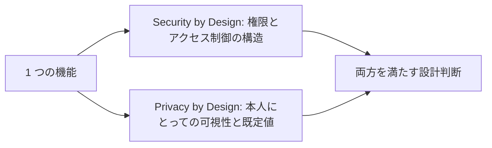

# 05. Secure by Design / Privacy by Design

> 対応科目: Advanced Methods for Security and Privacy by Design ｜ 前: [04 セキュリティテスト](./04_security-testing.md) ｜ 層: 基礎(Layer 1)

**この1ページで分かること**

- Saltzer & Schroeder の 8 原則（1975 年）——最小権限・フェイルセーフ等、今も現役の設計語彙
- Cavoukian の Privacy by Design 7 原則と、GDPR・Secure SDLC との対応関係
- 同じ機能に両原則群を同時に適用する設計判断の例

「鍵は必要な人にだけ、扉は迷ったら閉める」——50 年前から変わらない設計の常識を言葉にしたもの。[01](./01_secure-sdlc.md)〜[04](./04_security-testing.md) より手前、**設計の出発点**に組み込む 2 つの原則論。GDPR 条文は [`../03_privacy/06_law-and-dpia.md`](../03_privacy/06_law-and-dpia.md)。

### 最小の例: ファイル共有リンク 1 本

| 原則 | 共有リンクでは |
|---|---|
| 最小権限（Security） | 「閲覧のみ」を既定にし、編集権は明示的に付ける |
| フェイルセーフ（Security） | 権限の判定に失敗したら「見せない」 |
| デフォルトでプライバシー（Privacy） | 新規リンクは「リンクを知る人のみ」、公開は選択制 |

1 つの機能に両方の原則群が同時にかかる。以下、それぞれの原則の全体。



---

## Security by Design：Saltzer & Schroeder の8原則（1975年）

*The Protection of Information in Computer Systems*（1975）の古典的原則。今も現役の設計語彙。

| 原則 | 内容 | [03](./03_security-patterns.md)との対応 |
|---|---|---|
| 最小権限 (Least Privilege) | 各主体には課題遂行に必要な最小限の権限だけを与える | Check Pointパターンの前提 |
| フェイルセーフなデフォルト (Fail-safe Defaults) | 「許可リストにあるものだけ許可」を基本にする（拒否リスト方式は漏れやすい） | Secure by Default |
| 完全な仲介 (Complete Mediation) | すべてのアクセスを毎回チェックする（キャッシュした許可を使い回さない） | Check Pointパターン |
| オープンな設計 (Open Design) | 設計を秘密にすることに頼らない | [`../02_cryptography/01_goals-and-primitives.md`](../02_cryptography/01_goals-and-primitives.md)のKerckhoffsの原理と同じ発想 |
| 権限の分離 (Separation of Privilege) | 1つの条件だけで許可を出さず、複数の独立した条件の合致を要求する | 多要素認証・複数承認者制 |
| 最小共通メカニズム (Least Common Mechanism) | 複数主体で共有する仕組みを最小化する（共有資源はサイドチャネルにもなりうる——[`../04_hardware-security/04_side-channels/README.md`](../04_hardware-security/04_side-channels/README.md)のキャッシュ共有攻撃はこの原則違反の実例） | — |
| 心理的受容性 (Psychological Acceptability) | ユーザが使いにくい保護機構は回避される（付箋にパスワードを書く等） | — |
| 経済性 (Economy of Mechanism) | 設計は可能な限り単純・小さく保つ（複雑さはバグと脆弱性の温床） | — |

**最小共通メカニズムとサイドチャネル**はつながりが見えやすい例——同居インスタンスのキャッシュ共有（共有メカニズムを最小化していない）が Flush+Reload（キャッシュの追い出しと再読込の時間差から他者のアクセスを推測する攻撃）を可能にした。

---

## Privacy by Design：Cavoukian の7つの基本原則（1990年代提唱、2010年に国際的承認）

Cavoukian（オンタリオ州情報プライバシー・コミッショナー）が提唱、2010 年の国際会議で承認された設計原則。

| # | 原則 | 内容 |
|---|---|---|
| 1 | 事後対応でなく事前予防（Proactive not Reactive） | 問題が起きてから対処するのではなく、起きる前に防ぐ設計にする |
| 2 | プライバシーをデフォルト設定に（Privacy as the Default Setting） | ユーザが何もしなくても最大限のプライバシーが保たれる → GDPRのデータ最小化原則（[../03_privacy/06_law-and-dpia.md](../03_privacy/06_law-and-dpia.md)）の設計原則版 |
| 3 | 設計に埋め込む（Privacy Embedded into Design） | 後付けの追加機能ではなく、アーキテクチャ自体に組み込む |
| 4 | ゼロサムでなく積極的総和（Full Functionality: Positive-Sum, not Zero-Sum） | 「プライバシー vs 機能性」の二者択一ではなく両立を目指す |
| 5 | 全ライフサイクルの保護（End-to-End Security: Full Lifecycle Protection） | 収集から廃棄まで一貫して保護する（[01_secure-sdlc.md](./01_secure-sdlc.md)のライフサイクル思考と同型） |
| 6 | 可視性と透明性（Visibility and Transparency） | 何が・なぜ行われているかを関係者に開示する |
| 7 | 利用者のプライバシーを尊重（Respect for User Privacy） | 利用者の利益を最優先に、強いデフォルト・適切な通知・使いやすい選択肢を提供する |

原則 5 は Secure SDLC（[01](./01_secure-sdlc.md)）と同型、原則 2 は GDPR のデータ最小化の設計側からの言い換え——既習概念の再定式化と見ると覚えやすい。

---

## 2つの原則群を1つの設計判断に適用する例

```
題材: SNSの「近くのユーザ」を表示するレコメンド機能

Security by Design視点:
  最小権限 → 位置情報は「近似値の照合」だけに使い、正確な緯度経度をアプリ層に渡さない
  フェイルセーフ → 位置情報取得に失敗したら「非表示」をデフォルトにする（誤って全員に表示、を避ける）

Privacy by Design視点:
  デフォルトでプライバシー → 新規ユーザの位置共有はデフォルトOFF、オプトインのみ
  可視性と透明性 → 「あなたの位置は◯◯人に近似表示されています」と常時表示する
```

Security 側は「権限と構造」、Privacy 側は「本人の可視性と既定値」という別の軸から制約する。両方を同時に満たすのが "by design" の実践。

---

## 演習（解答つき）

1. 「拒否リスト方式（ブラックリスト）」がフェイルセーフなデフォルトの原則に反する理由を述べよ。
2. 最小共通メカニズムの原則がキャッシュサイドチャネル攻撃とどう関係するか一言で述べよ。
3. Privacy by Designの原則2（デフォルトでプライバシー）とGDPRのデータ最小化原則の関係を述べよ。

<details><summary>解答</summary>

1. 拒否リスト方式は「既知の危険なものだけを禁止し、それ以外はすべて許可する」ため、
   リストにない**未知の**危険なパターンを見逃す。フェイルセーフなデフォルトは
   「許可リストにあるものだけ許可し、それ以外はすべて拒否する」ことで、未知の
   ケースを安全側（拒否）に倒す。
2. 複数の主体（プロセス・仮想マシン等）が同じキャッシュというメカニズムを共有していると、
   一方の主体のキャッシュ利用状況が他方から観測可能になり、Flush+Reload等の
   サイドチャネル攻撃の土台になる。最小共通メカニズムの原則を守り共有資源を減らせば、
   この種の情報漏洩経路自体を減らせる。
3. データ最小化はGDPR第5条が要求する法的原則（目的に必要な範囲にデータを限定する）で
   あるのに対し、「デフォルトでプライバシー」はそれをシステム設計の出発点として
   先取りする設計原則——法的要求を「後から遵守を確認する」のではなく
   「最初から満たすように作る」という関係にある。

</details>

---

## 暗号での出口

`05_software-security/` の基礎パートはこれで揃った。GDPR 条文・DPIA は
[`../03_privacy/06_law-and-dpia.md`](../03_privacy/06_law-and-dpia.md)、
最小共通メカニズムとサイドチャネルの物理的機構は
[`../04_hardware-security/04_side-channels/README.md`](../04_hardware-security/04_side-channels/README.md)、
実装時の脆弱性クラスと認可の実装詳細は[`../06_systems-security/`](../06_systems-security/index.md)で
それぞれ引き続き扱う。

---

## つまずき / 深掘り候補

- [ ] ISO/IEC 27550・ISO 31700（Privacy by Designの国際標準化）との関係 → `deep/privacy-by-design-standards/`
- [ ] Saltzer & Schroeder以降の現代的再評価（Smith, 2012年 *A Contemporary Look*）

---

## 参考

- Saltzer, J., Schroeder, M. (1975). *The Protection of Information in Computer Systems*. Proceedings of the IEEE, 63(9), 1278-1308.
- Cavoukian, A. *Privacy by Design: The 7 Foundational Principles*. https://gpsbydesigncentre.com/the-seven-foundational-principles/
- GDPR 第5条（原則）: https://gdpr-info.eu/art-5-gdpr/（詳細は[`../03_privacy/06_law-and-dpia.md`](../03_privacy/06_law-and-dpia.md)）
