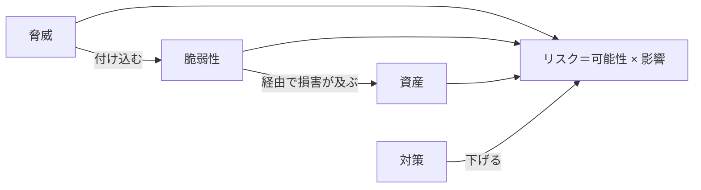

# 01. セキュリティの基本概念

> 次: [02 ソフトウェア脆弱性](./02_software-vulnerabilities.md) ｜ 層: 基礎(Layer 1)

「なんとなく危険」を「どれくらい危険で、何をすれば下がるか」に変換するための語彙を揃える。
対応科目のシラバスも threat（脅威）・countermeasure（対策）・risk（リスク）の定義から始まる。
この語彙が、`02`〜`05` で扱う個別の攻撃・防御をすべて同じ枠組みで整理する土台になる。

**この1ページで分かること**

- 資産・脅威・脆弱性・リスク・対策という5語の連鎖と、実事例（First American Financial）への当てはめ
- CIAトライアド（機密性・完全性・可用性）と Saltzer & Schroeder の設計8原則
- この領域の脅威がどのファイル（`02`〜`05`）に対応するかの地図

---

## 押さえる概念

### 資産・脅威・脆弱性・リスク・対策の関係

ISO/IEC 27000:2018 の定義に沿うと、この5語は次のように連鎖する。

```
資産 (Asset)：          守るべきもの（顧客データ、システムの可用性、企業の評判）
脅威 (Threat)：          資産に害を与えうる潜在的な原因（攻撃者、内部不正、災害）
脆弱性 (Vulnerability)： 脅威が付け込める弱点（認可チェック漏れ、未パッチ、設定ミス）
リスク (Risk)：          脅威が脆弱性を突いて資産に損害を与える可能性とその影響の大きさ
対策 (Countermeasure)： リスクを下げる手段（予防・検知・対応の3種類がある）
```



#### 具体例：2019年 First American Financial社の情報漏洩

- **資産**: 顧客の機微文書（銀行口座番号、SSN＝米国の社会保障番号、運転免許証の写し）
- **脆弱性**: Webポータルの文書URLが連番で、閲覧時に認可チェックが存在しなかった
  （Insecure Direct Object Reference, IDOR。詳しいメカニズムは
  [03](./03_authn-authz-access-control.md) で扱う）
- **脅威**: そのURLパターンに気づいた誰でも（認証すら不要だった）
- **リスク**: 2003年分以降、8億8500万件超の記録が数年間閲覧可能な状態で放置された

このケースは「脆弱性1つ」が「莫大なリスク」に直結した典型例。CVE番号（公開された既知脆弱性に付与される世界共通の識別番号）は付与されていない
（自社Webポータルの設計不備であり、第三者ソフトウェアの既知脆弱性ではないため）。

### CIAトライアド（+ 拡張）

NIST SP 800-12 Rev.1 の定義:

| 要素 | 定義 |
|---|---|
| **機密性 (Confidentiality)** | 権限のない主体に情報を開示しないこと |
| **完全性 (Integrity)** | 情報・プログラムが許可された方法でのみ変更されること |
| **可用性 (Availability)** | 権限を持つ利用者が必要な時にシステム・情報へアクセスできること |

拡張として、**認証 (Authentication)**・**認可 (Authorization)**・**否認防止
(Non-repudiation)** も併せて語られることが多い（[03](./03_authn-authz-access-control.md) で詳述）。

### セキュリティ設計の8原則（Saltzer & Schroeder, 1975）

「どう作れば脆弱性を作り込みにくいか」という設計側の指針。個別の脆弱性を見る前に
知っておくと、`02`〜`04` の防御機構が「原則のどれを実現しているか」で理解できる。

| 原則 | 一言で | 本領域での実例 |
|---|---|---|
| 最小権限 (Least Privilege) | 必要最小限の権限だけ与える | [03](./03_authn-authz-access-control.md) のRBAC |
| フェイルセーフ・デフォルト | デフォルトは「拒否」にする | ファイアウォールの暗黙拒否ルール（[04](./04_infrastructure-security.md)） |
| 完全な仲介 (Complete Mediation) | すべてのアクセスを毎回チェックする | Lampsonマトリックスの参照モニタ概念（[03](./03_authn-authz-access-control.md)） |
| オープンな設計 (Open Design) | 秘密は鍵にだけ置き、設計自体は公開してよい | Kerckhoffsの原理（[`../02_cryptography/`](../02_cryptography/index.md)と同じ発想） |
| 権限の分離 (Separation of Privilege) | 1つの条件でなく複数条件を要求する | MFA（[03](./03_authn-authz-access-control.md)） |
| 最小共通メカニズム | 共有する仕組みを減らす | クラウドのマルチテナント分離（[05](./05_distributed-systems-security.md)） |
| 心理的受容性 | 使いにくい対策は回避される | パスワード運用の失敗例全般 |
| 機構の経済性 (Economy of Mechanism) | 設計をシンプルに保ち検証しやすくする | 小さな信頼できる計算基盤（TCB、[`../04_hardware-security/`](../04_hardware-security/03_security-building-blocks.md)） |

### この領域での脅威の地図

- Web/C系ソフトウェアの脆弱性 → [02](./02_software-vulnerabilities.md)
- 認証・認可の失敗（IDORもここに含まれる） → [03](./03_authn-authz-access-control.md)
- インフラ層への攻撃と対策 → [04](./04_infrastructure-security.md)
- 分散システム特有の脅威（クラウド・ブロックチェーン・車載） → [05](./05_distributed-systems-security.md)
- 物理・サイドチャネル攻撃（別の攻撃者モデル） → [`../04_hardware-security/`](../04_hardware-security/index.md)
- 体系的な脅威モデリング手法（STRIDE等） → [`../05_software-security/02_threat-modeling.md`](../05_software-security/02_threat-modeling.md)

---

## なぜ重要か / コースでの位置づけ

対応科目の講義は必ずこの語彙の定義から始まる。「脆弱性」と「リスク」を混同すると、
例えば「CVSSスコア（脆弱性単体の深刻度を0〜10で採点する共通指標）が高い脆弱性なら即対応すべき」のような誤った優先順位付けをしてしまう
（資産の重要度や実際の攻撃可能性を無視しているため）。この土台の上に `02`〜`05` の
個別技術が積み上がる。

---

## 演習（解答つき）

1. First American Financial の事例で、「脆弱性」と「リスク」をそれぞれ1文で述べよ。
2. フェイルセーフ・デフォルトの原則が、ファイアウォールの「デフォルト拒否」ルールと
   どう対応するか説明せよ。
3. CIAトライアドのうち、DoS攻撃（サービス拒否攻撃）が主に脅かす要素はどれか。

<details><summary>解答</summary>

1. 脆弱性: Webポータルの文書URLが連番かつ認可チェックが存在しなかったこと。
   リスク: 誰でもURLを推測するだけで8億8500万件超の機微文書に数年間アクセス可能だったこと
   （脆弱性が突かれた場合の可能性×影響の大きさ）。
2. フェイルセーフ・デフォルトは「判断できない・想定外の状況ではデフォルトを安全側に倒す」
   という原則。ファイアウォールの「明示的に許可したもの以外はすべて拒否」ルールは、
   ルール漏れがあっても危険な通信を通してしまわない方向にデフォルトを設定している点で
   この原則を体現している。
3. **可用性 (Availability)**。DoS攻撃は情報の中身を漏らしたり改ざんしたりせず、
   正規利用者がサービスにアクセスできない状態を作ることを目的とする。

</details>

---

## 次への接続

語彙が揃ったので、次は具体的な脆弱性——Webアプリケーション（OWASP Top 10）とC言語の
低レベル脆弱性（バッファオーバーフロー）——を見る。
→ [02 ソフトウェア脆弱性](./02_software-vulnerabilities.md)

---

## 参考

- Saltzer, J.H., Schroeder, M.D. (1975). *The Protection of Information in Computer Systems*. Proceedings of the IEEE, 63(9), 1278-1308.
- NIST SP 800-12 Rev.1, *An Introduction to Information Security*: https://csrc.nist.gov/pubs/sp/800/12/r1/final
- ISO/IEC 27000:2018, *Information technology — Security techniques — ISMS — Overview and vocabulary*: https://www.iso.org/standard/73906.html
- Krebs, B. (2019). *First American Financial Corp. Leaked Hundreds of Millions of Title Insurance Records*. KrebsOnSecurity. https://krebsonsecurity.com/2019/05/first-american-financial-corp-leaked-hundreds-of-millions-of-title-insurance-records/
