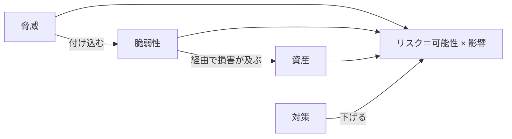

# 01. セキュリティの基本概念

> 次: [02 ソフトウェア脆弱性](./02_software-vulnerabilities.md) ｜ 層: 基礎(Layer 1)

**この1ページで分かること**

- 資産・脅威・脆弱性・リスク・対策という5語の連鎖と、実事例（First American Financial）への当てはめ
- CIAトライアド（機密性・完全性・可用性）と Saltzer & Schroeder の設計8原則
- この領域の脅威がどのファイル（`02`〜`05`）に対応するかの地図

「なんとなく危険」を「どれくらい危険で、何をすれば下がるか」に言い換えるための5つの言葉を揃える。
この5語が `02`〜`05` の個別技術をすべて同じ枠で整理する土台になる。

---

## 最小の例：自宅の玄関

| 5語 | 玄関で言うと |
|---|---|
| 資産 | 家の中の財産 |
| 脅威 | 空き巣 |
| 脆弱性 | 鍵をかけ忘れた窓 |
| リスク | 空き巣が窓から入る見込み × 被害額 |
| 対策 | 窓に鍵をかける（予防）・センサー（検知）・保険（対応） |

この5行を「Webサイト」に置き換えれば、以下の定義はそのまま読める。

## 押さえる概念

### 資産・脅威・脆弱性・リスク・対策の関係

ISO/IEC 27000:2018（情報セキュリティ用語の国際規格）の定義:

| 用語 | 意味 | 例 |
|---|---|---|
| 資産 (Asset) | 守るべきもの | 顧客データ、可用性、評判 |
| 脅威 (Threat) | 害を与えうる原因 | 攻撃者、内部不正、災害 |
| 脆弱性 (Vulnerability) | 脅威が付け込める弱点 | 認可漏れ、未パッチ、設定ミス |
| リスク (Risk) | 損害の可能性 × 影響の大きさ | 下記の事例 |
| 対策 (Countermeasure) | リスクを下げる手段 | 予防・検知・対応の3種 |

#### 具体例：2019年 First American Financial社の情報漏洩

| 5語 | 当てはめ |
|---|---|
| 資産 | 顧客の機微文書（銀行口座番号、SSN＝米国の社会保障番号、免許証の写し） |
| 脆弱性 | 文書URLが連番で、閲覧時の認可チェックがなかった（IDOR。→ [03](./03_authn-authz-access-control.md)） |
| 脅威 | URLの規則に気づいた誰でも（ログインすら不要） |
| リスク | 2003年以降の8億8500万件超が数年間閲覧可能 |

「脆弱性1つ」が「莫大なリスク」に直結した典型例。CVE番号（公開された既知脆弱性の世界共通ID）は付いていない——自社ポータルの設計不備で、第三者ソフトの既知脆弱性ではないため。

### CIAトライアド（+ 拡張）

NIST SP 800-12 Rev.1 の定義:

| 要素 | 一言で | 脅かす攻撃の例 |
|---|---|---|
| **機密性 (Confidentiality)** | 権限のない人に見せない | 盗聴・情報漏洩 |
| **完全性 (Integrity)** | 許可された方法でしか変えられない | 改竄・なりすまし |
| **可用性 (Availability)** | 必要な時に使える | DoS（サービス停止攻撃） |

拡張として**認証**・**認可**・**否認防止**（後で「やっていない」と言えなくすること）も併せて語られる（[03](./03_authn-authz-access-control.md)）。

#### CIAトライアドの限界

CIA は1970年代の枠組みで、語彙としては有効だが**現実の要求を表しきれない**。
例: 「データ集合を分析して得た結論」はCIAのどれにも一意に属さない。元データが機密でも、結論から元データが推定できるなら何を守ったのか（→ [`../03_privacy/02_anonymization-and-dp.md`](../03_privacy/02_anonymization-and-dp.md)）。

**実務上の含意**: CIA を出発点に使うのは妥当。ただし**「CIA に当てはまらないから要件でない」と切り捨てない**。

### セキュリティ設計の8原則（Saltzer & Schroeder, 1975）

「どう作れば脆弱性を作り込みにくいか」の設計指針。`02`〜`04` の防御が「どの原則の実現か」で読める。

| 原則 | 一言で | 本領域での実例 |
|---|---|---|
| 最小権限 (Least Privilege) | 必要最小限の権限だけ | [03](./03_authn-authz-access-control.md) のRBAC |
| フェイルセーフ・デフォルト | 迷ったら「拒否」 | ファイアウォールの暗黙拒否（[04](./04_infrastructure-security.md)） |
| 完全な仲介 (Complete Mediation) | 毎回チェックする | 参照モニタ（[03](./03_authn-authz-access-control.md)） |
| オープンな設計 (Open Design) | 秘密は鍵だけ、設計は公開可 | Kerckhoffsの原理（[`../02_cryptography/`](../02_cryptography/index.md)） |
| 権限の分離 (Separation of Privilege) | 複数条件を要求する | MFA（[03](./03_authn-authz-access-control.md)） |
| 最小共通メカニズム | 共有する仕組みを減らす | クラウドのテナント分離（[05](./05_distributed-systems-security.md)） |
| 心理的受容性 | 使いにくい対策は回避される | パスワード運用の失敗全般 |
| 機構の経済性 (Economy of Mechanism) | 単純に保ち検証しやすく | 小さなTCB（[`../04_hardware-security/`](../04_hardware-security/03_security-building-blocks.md)） |

### この領域での脅威の地図

| 脅威 | 本体 |
|---|---|
| Web/C系ソフトウェアの脆弱性 | [02](./02_software-vulnerabilities.md) |
| 認証・認可の失敗（IDOR含む） | [03](./03_authn-authz-access-control.md) |
| インフラ層への攻撃と対策 | [04](./04_infrastructure-security.md) |
| 分散システム特有の脅威 | [05](./05_distributed-systems-security.md) |
| 物理・サイドチャネル攻撃 | [`../04_hardware-security/`](../04_hardware-security/index.md) |
| 脅威モデリング手法（STRIDE等） | [`../05_software-security/02_threat-modeling.md`](../05_software-security/02_threat-modeling.md) |
| 攻撃者の分類・国家アクター | [`../00_overview/04_threat-landscape.md`](../00_overview/04_threat-landscape.md) |
| セキュリティ問題が成立する条件 | [`../05_software-security/01_secure-sdlc.md`](../05_software-security/01_secure-sdlc.md) |

---

## なぜ重要か / コースでの位置づけ

講義は必ずこの語彙の定義から始まる。「脆弱性」と「リスク」を混同すると「CVSSスコア（脆弱性単体の深刻度を0〜10で採点する指標）が高いから即対応」のような誤った優先順位付けをする——資産の重要度や実際の攻撃可能性を無視しているため。

---

## 演習（解答つき）

1. First American Financial の事例で、「脆弱性」と「リスク」をそれぞれ1文で述べよ。
2. フェイルセーフ・デフォルトの原則が、ファイアウォールの「デフォルト拒否」ルールと
   どう対応するか説明せよ。
3. CIAトライアドのうち、DoS攻撃（サービス拒否攻撃）が主に脅かす要素はどれか。

解答

1. 脆弱性: 文書URLが連番かつ認可チェックがなかったこと。
   リスク: 誰でもURLを推測するだけで8億8500万件超の機微文書に数年間アクセス可能だったこと（可能性×影響）。
2. フェイルセーフ・デフォルトは「想定外の状況では安全側に倒す」原則。「明示的に許可した以外はすべて拒否」は、ルール漏れがあっても危険な通信を通さない方向にデフォルトを置いており、この原則の体現。
3. **可用性 (Availability)**。DoSは中身を漏らしたり改ざんしたりせず、正規利用者が使えない状態を作る。

---

## 次への接続

語彙が揃ったので、次は具体的な脆弱性——Webアプリ（OWASP Top 10）とC言語の低レベル脆弱性（バッファオーバーフロー）——を見る。
→ [02 ソフトウェア脆弱性](./02_software-vulnerabilities.md)

---

## 参考

- Saltzer, J.H., Schroeder, M.D. (1975). *The Protection of Information in Computer Systems*. Proceedings of the IEEE, 63(9), 1278-1308.
- NIST SP 800-12 Rev.1, *An Introduction to Information Security*: https://csrc.nist.gov/pubs/sp/800/12/r1/final
- ISO/IEC 27000:2018, *Information technology — Security techniques — ISMS — Overview and vocabulary*: https://www.iso.org/standard/73906.html
- Krebs, B. (2019). *First American Financial Corp. Leaked Hundreds of Millions of Title Insurance Records*. KrebsOnSecurity. https://krebsonsecurity.com/2019/05/first-american-financial-corp-leaked-hundreds-of-millions-of-title-insurance-records/
