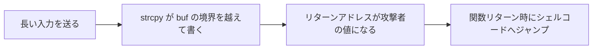

# 02. ソフトウェア脆弱性

> 前: [01 基本概念](./01_security-fundamentals.md) ｜ 次: [03 認証・認可・アクセス制御](./03_authn-authz-access-control.md) ｜ 層: 基礎(Layer 1)

**この1ページで分かること**

- OWASP Top 10 の全体像と、Injection が実際に大事故になった例（Equifax）
- スタックバッファオーバーフロー（境界チェックのない書き込みでリターンアドレスを乗っ取る攻撃）の仕組み
- 各防御機構（カナリア・NX・ASLR等）を攻撃者がどう回避しようとするか

脆弱性とは「プログラムが想定外の入力で想定外の動きをする穴」。Webアプリの**論理の穴**（OWASP Top 10）と、C言語の**メモリの穴**（バッファオーバーフロー）の2系統を見る。
後者は [`../01_prerequisites/02_low-level-c-os/01_c-and-memory.md`](../01_prerequisites/02_low-level-c-os/01_c-and-memory.md) が予告していた本体。

---

## 最小の例：3行で壊れるログイン

```
query = "SELECT * FROM users WHERE name='" + input + "'"   ← 入力を文字列でつなぐ
input = alice                   → WHERE name='alice'                （想定どおり）
input = ' OR '1'='1             → WHERE name='' OR '1'='1'          （常に真＝全員でログイン）
```

入力が**データ**ではなく**命令の一部**として読まれた瞬間に壊れる。これが Injection。以下の全カテゴリはこの「想定外の解釈」の変種。

## Webアプリケーションの脅威：OWASP Top 10 (2021)

OWASP（Webセキュリティの非営利団体）が実データから選ぶ脅威ランキング。正式版は2021年版（次版は策定中）。

| # | カテゴリ | 一言で |
|---|---|---|
| A01 | Broken Access Control | 認可チェックの欠落（[03](./03_authn-authz-access-control.md)） |
| A02 | Cryptographic Failures | 暗号の誤用・平文保存（[`../02_cryptography/`](../02_cryptography/index.md)） |
| A03 | Injection | 入力をコード/クエリとして実行してしまう |
| A04 | Insecure Design | 設計段階の欠陥 |
| A05 | Security Misconfiguration | デフォルト設定放置・不要機能の有効化 |
| A06 | Vulnerable and Outdated Components | 既知脆弱性を持つライブラリの放置 |
| A07 | Identification and Authentication Failures | 認証の不備（[03](./03_authn-authz-access-control.md)） |
| A08 | Software and Data Integrity Failures | 署名検証なしの自動更新等 |
| A09 | Security Logging and Monitoring Failures | 侵害を検知・追跡できない |
| A10 | Server-Side Request Forgery (SSRF) | サーバに任意の宛先へ通信させる |

### 具体例：Injection（A03）— Equifax事件（2017年、CVE-2017-5638）

Apache Struts が `Content-Type` ヘッダの不正な値をエラーメッセージに組み込む際、OGNL（Javaオブジェクトを操作する式言語）として**評価してしまう**欠陥。

```
攻撃者が送るヘッダ:  Content-Type: ${(#cmd='id').(...)}  ← OGNL式として解釈される
本来の想定:          ただの文字列
結果:                サーバ上で任意コマンド実行（RCE＝リモートコード実行）
```

| 時点 | 出来事 |
|---|---|
| 2017年3月 | パッチ公開 |
| 同年7月末 | Equifax が適用 |
| その間 | 攻撃者が悪用、1億4500万人以上の個人情報が流出 |

「公表から対応までの時間」自体がリスク（可能性×影響、[01](./01_security-fundamentals.md)）を左右する典型例。
対策: 入力をコードとして解釈させない（パラメータ化クエリ、オートエスケープ、許可リスト検証）。

---

## C系低レベル脆弱性：スタックバッファオーバーフロー

境界チェックのない配列書き込みが隣の**リターンアドレス**（関数終了後に戻る場所）まで届くと、攻撃者の指定した場所へジャンプさせられる。

```c
void vulnerable(char *input) {
    char buf[16];
    strcpy(buf, input);   // input の長さを一切チェックしない
}
```

```
攻撃前:                              攻撃後（32バイト超の input）:
┌──────────────────────┐             ┌──────────────────────────────┐
│ リターンアドレス 0x4005a3 │           │ リターンアドレス 0x7fff...e120 │ ← 上書き成功
├──────────────────────┤             ├──────────────────────────────┤
│ buf[16]              │             │ buf[16]: シェルコード + パディング │
└──────────────────────┘             └──────────────────────────────┘
```



シェルコード＝攻撃者が実行させたい機械語片（`execve("/bin/sh", ...)` 等）。初めて系統的に解説したのが Aleph One の 1996 年 Phrack 記事 "Smashing the Stack for Fun and Profit"。

### 歴史的実例

| 事例 | 何が起きたか | 教訓 |
|---|---|---|
| **Morris Worm（1988）** | `fingerd` が `gets()` で512バイトのバッファに書き込む欠陥。536バイトで `/bin/sh` 起動。当時のネットの約1割（推定6,000台）に感染 | 実戦投入の最初期例 |
| **CVE-2021-3156「Baron Samedit」（2021）** | `sudo` の引数解析の off-by-one（1つズレ）がヒープオーバーフローに。一般ユーザが認証なしで root | 2011年混入、10年間未発見。**ヒープ**でも起きる |

---

## 防御機構：攻撃者から見た視点

[`02_process-and-os.md`](../01_prerequisites/02_low-level-c-os/02_process-and-os.md) の防御表を、回避の視点で振り返る。

| 防御 | 攻撃者への影響 | 回避の糸口 |
|---|---|---|
| スタックカナリア（リターンアドレス手前の見張り値） | 上書きがリターン直前に露見 | 値のリーク、カナリアを跨がない上書き |
| NX/DEP（データ領域でのコード実行禁止） | `buf` 上のシェルコードが動かない | ROP（既存コード片を連鎖。`03_systems-software.md`） |
| ASLR（メモリ配置を起動ごとにランダム化） | ジャンプ先を予測できない | 情報リークと組み合わせて実アドレス特定 |
| 安全な言語（Rust, Go等） | 境界外アクセスで例外 | バグクラス自体を排除（`unsafe` を除く） |

1つ破られても次が残る「深層防御」は、[01](./01_security-fundamentals.md) の「機構の経済性」と逆に見えるが、どちらも確立した原則。

---

## 演習（解答つき）

1. `char buf[16]` に `strcpy` で32バイトの入力をコピーすると何が起きるか、
   スタックの模式図を使って説明せよ。
2. Equifax事件でOGNL Injectionが成立した根本原因を一言で述べよ。
3. NXビットが有効な環境で、攻撃者が「シェルコードを直接実行する」代わりに
   使う手法の名前を挙げよ。

<details><summary>解答</summary>

1. `buf` の16バイトを超えた分が隣接領域（保存されたベースポインタ、さらにリターンアドレス）を上書きする。攻撃者が狙ったアドレスを仕込めば、関数リターン時にそこへジャンプさせられる。
2. `Content-Type` ヘッダという**外部からの信頼できない入力**を、OGNL式として**評価（実行）してしまった**こと（入力とコードの分離ができていなかった）。
3. **ROP（Return-Oriented Programming）**。既存の実行可能コード片（ガジェット）をリターンアドレスの連鎖でつなぎ、新規コードを注入せずに任意の処理を組む。

</details>

---

## 次への接続

Equifax も Baron Samedit も、最終的には「誰が何にアクセスできるか」＝認可の話に帰着する。次はその理論的枠組み（Lampsonのアクセス制御マトリックス）を見る。
→ [03 認証・認可・アクセス制御](./03_authn-authz-access-control.md)

---

## 参考

- OWASP Top 10:2021: https://owasp.org/Top10/2021/
- Aleph One (1996). "Smashing The Stack For Fun And Profit". *Phrack*, Vol.7, Issue 49. https://phrack.org/issues/49/14.html
- CVE-2017-5638 (Apache Struts / Equifax): https://nvd.nist.gov/vuln/detail/CVE-2017-5638
- CVE-2021-3156 (sudo "Baron Samedit"): Qualys Security Advisory, 2021. https://www.qualys.com/2021/01/26/cve-2021-3156/baron-samedit-heap-based-overflow-sudo.txt
- Computer Archeology, *Morris Internet Worm* (fingerd exploit解説): https://computerarcheology.com/Virus/MorrisWorm/
