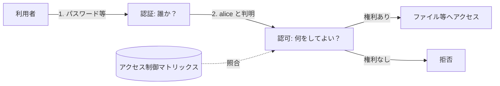

# 03. 認証・認可・アクセス制御

> 前: [02 ソフトウェア脆弱性](./02_software-vulnerabilities.md) ｜ 次: [04 インフラセキュリティ](./04_infrastructure-security.md) ｜ 層: 基礎(Layer 1)

**この1ページで分かること**

- 認証の3要素と MFA、NIST の認証保証レベル（AAL1〜3）
- Lampson のアクセス制御マトリックスと、その2つの保存方法（ACL / Capability）の得手不得手
- 4つのアクセス制御モデル（DAC・MAC・RBAC・ABAC）の違いと代表例

「あなたは誰か」（認証）と「あなたは何をしてよいか」（認可）は別の問題——受付で身分証を見せる（認証）ことと、その人がどの部屋に入れるか（認可）は別。
[01](./01_security-fundamentals.md) の First American 事件は、認可の設計が**存在しなかった**ケースだった。

---

## 最小の例：2人 × 2ファイル

| | report.txt | photo.jpg |
|---|---|---|
| **alice** | read, write | read |
| **bob** | — | read, write |

この4マスの表が**アクセス制御マトリックス**の全部。認証は「今来た人が alice の行を使ってよいか」を確かめる手続き、認可は「その行にその操作があるか」を見る手続き。以下はこの表を大きくし、保存の仕方と決め方を整理するだけ。



---

## 認証：あなたは誰か

| 要素 | 例 |
|---|---|
| Something you know（知識） | パスワード、PIN |
| Something you have（所持） | セキュリティキー、認証アプリ |
| Something you are（生体） | 指紋、顔 |

**多要素認証 (MFA)** は異なる2種類以上の組み合わせ——[01](./01_security-fundamentals.md) の「権限の分離」原則の応用。パスワードの選び方・MFA の実務は [`../../courses/cs50-cybersecurity/01_securing-accounts/README.md`](../../courses/cs50-cybersecurity/01_securing-accounts/README.md) が噛み砕いている。

### NIST SP 800-63B：認証保証レベル(AAL)

| レベル | 要件 |
|---|---|
| AAL1 | 単一要素で可 |
| AAL2 | 異なる2要素（MFA）必須 |
| AAL3 | ハードウェア認証器＋なりすまし耐性が必須 |

パスワード単体なら最低15文字を推奨（SP 800-63B-4, 2025）。2017年版以降、「複雑さ」より「長さ」へシフト。

---

## 認可：Lampson のアクセス制御マトリックス

Butler Lampson (1971, *"Protection"*) が示した、保護状態の最も基本的な形式モデル。

```
主体 (Subject)：  アクセスを要求する側（ユーザー、プロセス）
客体 (Object)：   アクセスされる側（ファイル、デバイス）
権利 (Right)：    許可される操作（read, write, execute, own ...）
マトリックス M：  行=主体、列=客体、セル=権利の集合
```

すべての要求を M と照合してから許可/拒否する仲介機構を**参照モニタ**と呼ぶ（[01](./01_security-fundamentals.md) の「完全な仲介」そのもの）。

### 保存方法：ACL vs Capability

実システムは表全体を持たず、**列ごと**か**行ごと**かで持つ。

| | ACL（アクセス制御リスト） | Capability（ケーパビリティ） |
|---|---|---|
| 保存単位 | 客体ごと（列） | 主体ごと（行） |
| 例 | `report.txt: [(alice, rw), (bob, —)]` | `alice: [(report.txt, rw), (photo.jpg, r)]` |
| 得意 | 「このファイルに誰が触れるか」 | 「この人は何に触れるか」、権限の委譲（トークンを渡す） |
| 不得意 | ある人の権限を全部取り消す（全列を走査） | あるファイルに誰が触れるかの一覧 |
| 弱点 | — | confused deputy（正当な権限を持つ代理プログラムが、権限のない呼び出し元のために権限を行使してしまう） |
| 実例 | UNIX パーミッション、Windows ACL | Linux `capabilities`、OAuth 2.0（Web サービス間の権限委譲標準）のトークン |

---

## アクセス制御モデル：DAC・MAC・RBAC・ABAC

| モデル | 誰が権限を決めるか | 代表例 |
|---|---|---|
| **DAC**（任意アクセス制御） | 客体の所有者。他者に委譲可 | UNIX ファイルパーミッション |
| **MAC**（強制アクセス制御） | システム全体のポリシー。所有者でも変更不可 | Bell-LaPadula、SELinux（Linux に MAC を足すカーネル機構） |
| **RBAC**（ロールベース） | ユーザーにロール、ロールに権限 | 「経理担当」「管理者」 |
| **ABAC**（属性ベース） | 主体・客体・環境の属性でその場で判定 | 「平日9-18時かつ社内からのみ」 |

- DAC/MAC の区別は米国防総省 TCSEC（"Orange Book", 1985）が定義。**Bell-LaPadula**（1973）は MAC の機密性モデルで「no read up, no write down」の2規則で上位区分から下位への漏洩を防ぐ。
- **RBAC** は Sandhu ら（1996）が RBAC0〜3 を体系化。**ABAC** は NIST SP 800-162（2014）が定義し、PEP（実施点）・PDP（決定点）・PIP（情報点）・PAP（管理点）の4機能で構成。

First American の欠陥は、どのモデル以前に**マトリックスの列（ファイル単位の ACL）すら存在しなかった**状態と整理できる。

---

## なぜ重要か / コースでの位置づけ

OWASP Top 10 の A01（Broken Access Control）・A07（認証の不備、[02](./02_software-vulnerabilities.md)）は、ここで見たモデルの欠落・誤実装の結果。setuid バイナリの脆弱性（`../01_prerequisites/02_low-level-c-os/02_process-and-os.md`）も DAC の実行時委譲の一種。

---

## 演習（解答つき）

1. ACLとCapabilityのそれぞれで、「ある主体の権限を即座に全部取り消す」操作はどちらが得意か。
2. Bell-LaPadulaモデルの「no read up, no write down」がなぜMAC（強制アクセス制御）に
   分類されるか、DACとの違いから説明せよ。
3. First American Financial の事例をLampsonのアクセス制御マトリックスの言葉で説明せよ。

<details><summary>解答</summary>

1. **Capability**。主体（行）の capability list を丸ごと無効化すれば全権限を失効できる。ACL では全客体の ACL を走査して該当エントリを削除する必要がある。
2. DAC は**所有者**が権限を自由に決められるが、Bell-LaPadula の規則は所有者の意思に関係なく**システム全体のポリシー**として強制される。「所有者の裁量を超えて強制される」点が MAC の定義そのもの。
3. 本来は「そのファイル（客体）に、認証済みの特定ユーザー（主体）だけが read を持つ」行が必要だったが、その列に対する行自体が定義されておらず、事実上「誰でも read 可能」になっていた。

</details>

---

## 次への接続

認証・認可の理論が揃ったので、次はネットワーク上での実施——ファイアウォールや IDS/IPS——を見る。
→ [04 インフラセキュリティ](./04_infrastructure-security.md)

---

## 参考

- Lampson, B.W. (1971). *Protection*. Proc. 5th Princeton Conf. on Information Sciences and Systems, pp.437-443. (Reprinted in ACM Operating Systems Review 8(1), 1974, pp.18-24.) https://cseweb.ucsd.edu/classes/fa01/cse221/papers/lampson-protection-osr74.pdf
- Bell, D.E., LaPadula, L.J. (1973). *Secure Computer Systems: Mathematical Foundations*. MITRE Technical Report.
- Sandhu, R.S., Coyne, E.J., Feinstein, H.L., Youman, C.E. (1996). *Role-Based Access Control Models*. IEEE Computer, 29(2), 38-47.
- NIST SP 800-162, *Guide to Attribute Based Access Control (ABAC) Definition and Considerations*: https://csrc.nist.gov/pubs/sp/800/162/upd2/final
- NIST SP 800-63B-4, *Digital Identity Guidelines: Authentication and Authenticator Management*: https://csrc.nist.gov/pubs/sp/800/63/b/4/final
- DoD 5200.28-STD (1985), *Trusted Computer System Evaluation Criteria*（通称 "Orange Book"）
