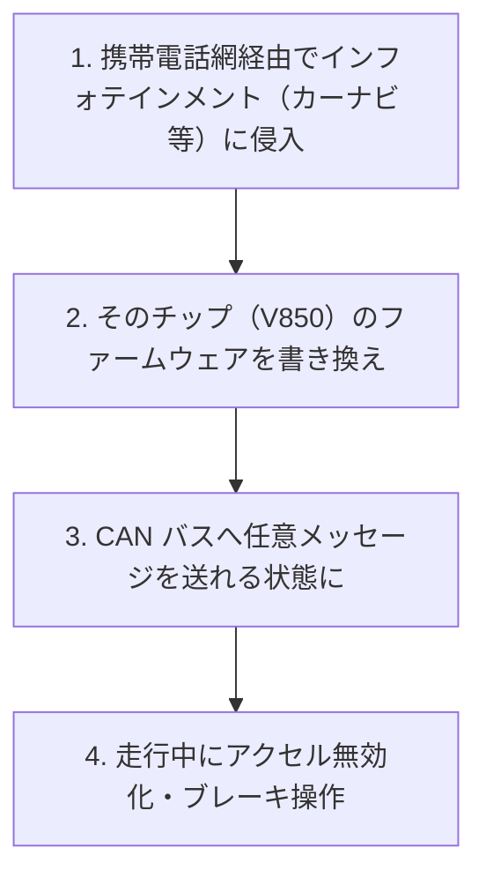

# 05. 分散システムセキュリティ

> 前: [04 インフラセキュリティ](./04_infrastructure-security.md) ｜ 次: [06 無線セキュリティ](./06_wireless-security.md) ｜ 層: 基礎(Layer 1)

**この1ページで分かること**

- クラウドの責任共有モデル（事業者と利用者で守る範囲を分ける考え方）
- ビザンチン耐性——嘘をつくノードがいても合意する方法（PBFT）と PoW との違い
- 車載CANバスの設計上の弱点と、Jeep Cherokee ハックが示した教訓

「全員を管理する1人の管理者がいない」システムの話——クラウド（他社が土台を持つ）、ブロックチェーン（参加者に嘘つきがいる）、車（30年前の設計が今のネットに繋がる）。
[04](./04_infrastructure-security.md) までの「1組織のネットワーク」という前提が崩れる場面。

---

## 最小の例：3台のうち1台が嘘をつく

```
3台のサーバ A・B・C が「今日の送金額」を多数決で決める。C が故障か悪意で嘘を言う。
  A: 100   B: 100   C: 999   → 多数決で 100。1台の嘘なら耐えられる
  A: 100   B: 999   C: 999   → 2台が嘘なら負ける
```

「嘘をつく参加者が全体の 1/3 未満なら合意できる」が、この節全体の骨格（ビザンチン耐性）。クラウドも車載も「誰を・どこまで信頼するか」を決め直す問題として同じ形をしている。

---

## クラウド：責任共有モデル

AWS/Azure/GCP が公式に定義する**責任共有モデル (Shared Responsibility Model)**:

| | 事業者の責任 "Security OF the cloud" | 利用者の責任 "Security IN the cloud" |
|---|---|---|
| 範囲 | 物理DC・ハードウェア・仮想化基盤・ネットワーク | ゲストOSのパッチ、アプリ設定、データ暗号化、IAM（アクセス管理。[03](./03_authn-authz-access-control.md) の RBAC/ABAC）、セキュリティグループ（FWルール） |

境界線はサービス形態で上下する——IaaS（仮想マシン貸し）では利用者側が広く、SaaS（アプリ貸し）では狭い。事故の多くは利用者側の設定ミス（[02](./02_software-vulnerabilities.md) の Security Misconfiguration がクラウドで再現）。

---

## ビザンチン耐性：信頼できない参加者がいる合意形成

### ビザンチン将軍問題（Lamport, Shostak, Pease, 1982）

「クラッシュして止まる」だけでなく「嘘の情報を送る」ノードまで想定するのが**ビザンチン故障**。裏切り者が全体の 1/3 以上いると合意不可能と証明された（正直なノードが 2/3 超必要）。

### PBFT（Castro & Liskov, 1999）vs PoW

| | PBFT (Practical Byzantine Fault Tolerance) | PoW (Proof of Work) |
|---|---|---|
| 参加者 | 既知（permissioned） | 誰でも（permissionless） |
| 条件 | n 台中 f 台まで故障可、`n ≥ 3f+1` | 計算資源の過半 |
| 合意 | 決定的・即座（Pre-prepare → Prepare → Commit の3フェーズ） | 確率的（最長チェーンが勝つ） |
| 採用例 | Hyperledger Fabric 等の許可型 | Bitcoin |

Bitcoin のハッシュチェーン・ECDSA 署名・Merkle 木は [`../02_cryptography/05_protocols/README.md`](../02_cryptography/05_protocols/README.md) が本体。

### なぜ「連鎖」が必要か：二重支払い問題

デジタルのコインは複製できるので、取引の宣言だけでは**同じコインを2度使える**。解くには全参加者が**取引の順序に合意**するしかない。ブロックの内容をハッシュして次のブロックに格納すれば順序が後から変えられなくなる——**連鎖は順序合意の手段**である。

> **よくある誤解**: ブロックチェーンは暗号化を使わない。使うのは**ハッシュと署名**で、台帳は公開されている（プライバシー保護型は [`../03_privacy/03_ppt-cryptographic/README.md`](../03_privacy/03_ppt-cryptographic/README.md)）。

### 投票権を配れないという制約

投票権を配った時点で「誰でも参加できる」性質が失われる。パーミッションレスを保つには**外部の希少資源**で発言力を決めるしかない。

| 方式 | 希少資源 | 代表例 |
|---|---|---|
| PoW | 計算 | Bitcoin |
| PoS (Proof of Stake) | 預けた資産。不正には没収（スラッシング） | Ethereum（2022年移行） |
| 許可制 | 参加資格 | Hyperledger 等（PBFT 系） |

分散性・セキュリティ・スケーラビリティを同時に最大化できない経験則を**トリレンマ**と呼ぶ。実務上の帰結が**軽量クライアント問題**——スマホは全ブロックを持てないので「自分で検証」か「誰かを信頼」かを選ぶ。

---

## 車載システム：CANバスセキュリティ

CAN（Controller Area Network）は車内の ECU（電子制御ユニット）間の通信規格。1980年代設計で**認証・暗号化の概念がない**。

| 特性 | 帰結 |
|---|---|
| ブロードキャスト | 全 ECU が全メッセージを受信できる |
| 送信元認証なし | ID フィールドはあるが「誰が送ったか」を検証できない |
| 暗号化なし | 平文で流れる |

設計当時は「バスに配線をつなぐ攻撃者」を想定していなかった。ネットワーク化された車がその前提を崩した。

### 実例：Jeep Cherokee ハック（Miller & Valasek, 2015）



侵入経路は認証なしで外部公開されていたサービス。別経路として起動時刻から予測できる Wi-Fi パスワードも発見された。Wired 誌で実演され、140万台がリコール。**外部と通信する部分から安全制御系まで到達できた**——[04](./04_infrastructure-security.md) のセグメンテーションの欠如が車1台の中で再現された。

| 対策 | 内容 | 対応する一般原則 |
|---|---|---|
| ゲートウェイ ECU | 情報系と制御系の CAN を分離しフィルタ | DMZ（[04](./04_infrastructure-security.md)） |
| メッセージ認証 | CAN-FD / AUTOSAR SecOC で MAC を付与 | [`../02_cryptography/04_hash-and-mac.md`](../02_cryptography/04_hash-and-mac.md) |
| 車載 IDS | 異常な頻度・パターンを検知 | 異常検知 IDS（[04](./04_infrastructure-security.md)） |

---

## なぜ重要か / コースでの位置づけ

3例に共通するのは「単一の信頼できる管理者を前提にできない」こと。責任共有モデルは**契約**、BFT は**アルゴリズム**、CAN は**脅威モデルの変化**という教訓——分散システムセキュリティは「信頼の前提が崩れた時にどう設計し直すか」の問題群。

---

## 演習（解答つき）

1. IaaSとSaaSで、利用者側の責任範囲がどう異なるか一言で述べよ。
2. PBFTがBitcoinのProof of Workと異なる点を、参加者の性質の違いから説明せよ。
3. Jeep Cherokeeハックにおいて、[04](./04_infrastructure-security.md)のどの概念が
   欠けていたために被害が拡大したか。

<details><summary>解答</summary>

1. IaaS では仮想マシンより上（ゲストOS・ミドルウェア・アプリ・データ）を利用者が広く管理する。SaaS ではアプリ自体は事業者が管理し、利用者はデータやアクセス権限の設定など狭い範囲。
2. PoW は誰でも参加できる（permissionless）前提で確率的な合意しか保証しない。PBFT は参加者が既知（permissioned）である前提で、決定的かつ即座の合意を保証する。
3. **ネットワークセグメンテーション**。低信頼のインフォテインメント系から高信頼の CAN バスへ直接到達でき、DMZ のような境界による分離がなかった。

</details>

---

## 次への接続

次は前提条件が違う媒体——**誰でも受信でき、誰でも送信できる**無線を見る。
→ [06 無線セキュリティ](./06_wireless-security.md)

設計段階から安全に作る手法は [`../05_software-security/`](../05_software-security/index.md)、法制は [`../07_legal/`](../07_legal/index.md) へ。

---

## 参考

- AWS, *Shared Responsibility Model*: https://aws.amazon.com/compliance/shared-responsibility-model/
- Lamport, L., Shostak, R., Pease, M. (1982). *The Byzantine Generals Problem*. ACM Transactions on Programming Languages and Systems, 4(3), 382-401.
- Castro, M., Liskov, B. (1999). *Practical Byzantine Fault Tolerance*. Proc. 3rd USENIX Symposium on Operating Systems Design and Implementation (OSDI).
- Greenberg, A. (2015). *Hackers Remotely Kill a Jeep on the Highway—With Me in It*. Wired. https://www.wired.com/2015/07/hackers-remotely-kill-jeep-highway/
