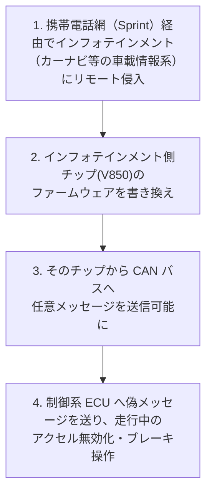

# 05. 分散システムセキュリティ

> 前: [04 インフラセキュリティ](./04_infrastructure-security.md) ｜ 層: 基礎(Layer 1)

Security and Privacy in Contemporary Distributed Software Systems は
クラウドストレージ・ブロックチェーン・車載システムという3つの具体例を軸に、
「単一の管理者がいない/信頼できない participant がいる」システムのセキュリティを扱う。
[04](./04_infrastructure-security.md)までの「1組織のネットワーク」という前提が崩れる場面。

**この1ページで分かること**

- クラウドの責任共有モデル（事業者と利用者で守る範囲を分ける考え方（フレームワーク））
- ビザンチン耐性——嘘をつくノードがいても合意する方法（PBFT）と PoW との違い
- 車載CANバスの設計上の弱点と、Jeep Cherokee ハックが示した教訓

---

## クラウド：責任共有モデル

クラウド利用では「誰が何を守る責任を持つか」が契約上分割される。AWS/Azure/GCP各社が
公式に定義する**責任共有モデル (Shared Responsibility Model)**:

```
クラウド事業者の責任 ＝ "Security OF the cloud"
  物理データセンター、ハードウェア、仮想化基盤、ネットワークインフラ

利用者の責任 ＝ "Security IN the cloud"
  ゲストOSのパッチ適用、アプリケーション設定、データの暗号化、
  IAM（アクセス管理、[03](./03_authn-authz-access-control.md)のRBAC/ABACが実装の中心）、
  セキュリティグループ（ファイアウォールルール）の設定
```

サービス形態（IaaS/PaaS/SaaS）によって境界線は上下する——IaaSでは利用者の責任範囲が広く、
SaaSでは狭い。実務上の事故の多くは「利用者側の責任」の設定ミス
（[02](./02_software-vulnerabilities.md)のSecurity Misconfigurationがクラウドでも
同じ形で起きる）に起因する。

---

## ビザンチン耐性：信頼できない参加者がいる合意形成

### ビザンチン将軍問題（Lamport, Shostak, Pease, 1982年）

```
問題設定: 複数の将軍（ノード）が「攻撃するか撤退するか」で合意したいが、
          一部の将軍が裏切り者（故障・悪意あるノード）で、矛盾した情報を送りうる
結果:     裏切り者が全体の1/3以上いると、口頭メッセージのみでは合意が不可能と証明された
          （2/3を超える正直なノードが必要）
```

分散システムのノードが「クラッシュして止まる」だけでなく「嘘の情報を送る」ことまで
想定するのがビザンチン故障モデル——ブロックチェーンや金融系分散台帳で重要になる前提。

### PBFT（Castro & Liskov, 1999年）

```
Practical Byzantine Fault Tolerance:
  n台のレプリカのうち f台までがビザンチン故障してもよい（n ≥ 3f+1 が必要）
  Pre-prepare → Prepare → Commit の3フェーズでノード間の合意を取る
  非同期ネットワーク上で初めて実用的な性能を達成したBFTプロトコル
```

これは
[`../02_cryptography/05_protocols-overview.md`](../02_cryptography/05_protocols-overview.md)
で見たBitcoinのProof of Work（計算資源の消費で改ざんコストを上げる）とは異なる合意方式——
PoWは「誰でも参加できる（permissionless）」代わりに確率的な合意しか保証しないのに対し、
PBFT系は「参加者が既知（permissioned）」な代わりに決定的かつ即座の合意を保証する。
Hyperledger Fabric等の許可型ブロックチェーンはPBFT系の合意アルゴリズムを採用することが多い。
Bitcoinのハッシュチェーン・ECDSA署名・Merkle木の詳細は上記リンク先に譲り、ここでは
「合意形成の方式が違う」という一点にとどめる。

### なぜ「連鎖」が必要なのか：二重支払い問題

デジタルのコインは複製できるので、「コイン N を Bob に移す」という取引の宣言だけでは
**同じコインを二重に使える**（二重支払い問題）。解くには全参加者が
**取引の順序について合意する**しかない。ブロックの内容をハッシュして次のブロックに
格納すれば順序が後から変えられなくなり、「先に来た方が有効」と決められる。

**連鎖はデータ構造の趣味ではなく、順序合意を実現するための手段**である。

> **よくある誤解**: ブロックチェーンは暗号化を使わない。使うのは**ハッシュと署名**だけで、
> 台帳の中身は公開されている。「暗号通貨」という名前に反して機密性は提供しない
> （プライバシー保護型の派生は [`../03_privacy/03_ppt-cryptographic.md`](../03_privacy/03_ppt-cryptographic.md)）。

### 投票権を配れないという制約

合意を取るなら投票が自然だが、**投票権を配った時点で「誰でも参加できる」性質が失われる**
（誰が権利を持つかを決める主体が必要になる）。パーミッションレスを保つには、
**外部の希少資源**で発言力を決めるしかない。

| 方式 | 希少資源 | 代表例 |
|---|---|---|
| PoW (Proof of Work) | 計算 | Bitcoin。最長チェーン＝最も計算が投入された鎖 |
| PoS (Proof of Stake) | 預けた資産 | Ethereum（2022年に移行）。不正には没収（スラッシング） |
| 許可制 | 参加資格そのもの | Hyperledger 等。上記の PBFT 系が使える |

分散性・セキュリティ・スケーラビリティを同時に最大化できないという経験則を
**ブロックチェーンのトリレンマ**と呼ぶ。実務上の帰結が**軽量クライアント問題**——
スマートフォンは全ブロックを保持できないので、「自分で検証する」か
「誰かを信頼する」かのトレードオフに直面する。

---

## 車載システム：CANバスセキュリティ

### CANバスの設計と弱点

Controller Area Network（CAN）は自動車内のECU（電子制御ユニット）間の通信規格。
1980年代の設計であり、**認証・暗号化の概念がそもそも存在しない**——

```
CANバスの特性:
  ブロードキャスト型: 送信されたメッセージはバス上の全ECUが受信できる
  送信元認証なし:    メッセージにIDフィールドはあるが「誰が送ったか」を検証する仕組みがない
  暗号化なし:        平文でそのまま流れる
```

設計当時は「物理的にバスへ配線をつなげる攻撃者」を脅威モデルに含めていなかった
——ネットワーク化された現代の車がその前提を崩した。

### 実例：Jeep Cherokeeハック（Miller & Valasek, 2015年）



なお同研究では、Wi-Fi パスワードが起動時刻から生成される予測可能な値である別の侵入経路も発見されている（携帯網経由の侵入自体は、認証なしで外部公開されていたサービスが原因）。
Wired誌上で実演され、Fiat Chrysler社は140万台のリコールを実施した。
「インフォテインメント（外部と通信する部分）から安全制御系（CANバス）まで
到達できてしまった」——ネットワークセグメンテーション（[04](./04_infrastructure-security.md)）
の欠如が車1台の中で再現された事例と見ることができる。

### 対策の方向性

- **ゲートウェイECUによるセグメンテーション**: インフォテインメント系とパワートレイン系の
  CANバスを分離し、ゲートウェイでフィルタリングする（[04](./04_infrastructure-security.md)の
  DMZ的な発想の車載版）
- **メッセージ認証**: CAN-FDやAUTOSAR SecOCなどでMAC（メッセージ認証コード、
  [`../02_cryptography/04_hash-and-mac.md`](../02_cryptography/04_hash-and-mac.md)）を
  付与し、送信元のなりすましを検知する拡張が標準化されつつある
- **車載IDS**: バス上の異常なメッセージ頻度・パターンを検知する（[04](./04_infrastructure-security.md)
  の異常検知ベースIDSと同じ発想を車載ネットワークに適用）

---

## なぜ重要か / コースでの位置づけ

ここで見た3例（クラウド・ブロックチェーン・車載）はいずれも「単一の信頼できる管理者を
前提にできない」という共通の課題を持つ。責任共有モデルは契約による解決、BFTは
アルゴリズムによる解決、CANバスの事例は「設計時に想定していなかった脅威モデルの変化」
という教訓を示す——3例を並べて見ることで、分散システムセキュリティが単一の技術ではなく
「信頼の前提が崩れた時にどう設計し直すか」という問題群であることが分かる。

---

## 演習（解答つき）

1. IaaSとSaaSで、利用者側の責任範囲がどう異なるか一言で述べよ。
2. PBFTがBitcoinのProof of Workと異なる点を、参加者の性質の違いから説明せよ。
3. Jeep Cherokeeハックにおいて、[04](./04_infrastructure-security.md)のどの概念が
   欠けていたために被害が拡大したか。

<details><summary>解答</summary>

1. IaaSでは仮想マシンより上のレイヤー（ゲストOS、ミドルウェア、アプリ、データ）を
   利用者が広く管理する責任を持つ。SaaSではアプリケーション自体は事業者が管理し、
   利用者の責任範囲はデータやアクセス権限の設定など狭い範囲に限定される。
2. PoWは参加者が誰でも自由に参加できる（permissionless）前提で、計算資源の消費量に
   基づく確率的な合意しか保証しない。PBFTは参加者があらかじめ既知（permissioned）
   であることを前提に、決定的（確定的）かつ即座の合意を保証する。
3. **ネットワークセグメンテーション**。インフォテインメント系（外部と通信する低信頼領域）
   から安全制御系のCANバス（高信頼領域）へ直接到達できてしまい、DMZのような
   境界による分離が存在しなかった。

</details>

---

## 次への接続

これで `06_systems-security/` の基礎パート（脅威の語彙・ソフトウェア脆弱性・認証認可・
インフラ・分散システム）が一通り揃った。ソフトウェアを設計段階から安全に作る手法
（Secure SDLC・脅威モデリング・セキュアデザインパターン）は
[`../05_software-security/`](../05_software-security/index.md)、
法規制・国際的なサイバーセキュリティ法制は [`../07_legal/`](../07_legal/index.md) へ接続していく。

---

## 参考

- AWS, *Shared Responsibility Model*: https://aws.amazon.com/compliance/shared-responsibility-model/
- Lamport, L., Shostak, R., Pease, M. (1982). *The Byzantine Generals Problem*. ACM Transactions on Programming Languages and Systems, 4(3), 382-401.
- Castro, M., Liskov, B. (1999). *Practical Byzantine Fault Tolerance*. Proc. 3rd USENIX Symposium on Operating Systems Design and Implementation (OSDI).
- Greenberg, A. (2015). *Hackers Remotely Kill a Jeep on the Highway—With Me in It*. Wired. https://www.wired.com/2015/07/hackers-remotely-kill-jeep-highway/
