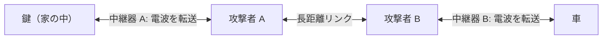

# 06. 無線セキュリティ（Wi-Fi・近距離無線）

> 前: [05 分散システムセキュリティ](./05_distributed-systems-security.md) ｜ 次: [07 PKI とデジタルID](./07_pki-and-identity.md) ｜ 層: 基礎(Layer 1)

**この1ページで分かること**

- 無線特有の受動攻撃（RF フィンガープリンティング）が識別子の匿名化を無効化する仕組み
- チャレンジレスポンスが暗黙に置いている「近接」の仮定と、それを突くリレー攻撃
- WPA2 の鍵階層と、KRACK が示した「形式的に証明された」ことの限界

無線は「部屋の中の会話」ではなく「広場での会話」——**誰でも聞け、誰でも声を出せる**。この一点で、有線では成立しない攻撃が成立する。
Wi-Fi の暗号化の基本は [`../../courses/cs50-cybersecurity/03_securing-systems/01_wifi-and-plaintext-http.md`](../../courses/cs50-cybersecurity/03_securing-systems/01_wifi-and-plaintext-http.md) が入門。

---

## 最小の例：端末1台と AP の 4-way handshake

```
端末とアクセスポイント(AP)は同じパスフレーズから PMK（マスター鍵）を持っている。
  AP  → 端末 : 乱数 ANonce
  端末 → AP  : 乱数 SNonce            ← ここで両者が PTK = f(PMK, ANonce, SNonce, MAC…) を計算
  AP  → 端末 : 「PTK を使え」(鍵インストール指示)
  端末 → AP  : 確認
```

パスフレーズ自体は一度も電波に乗らず、毎回違う乱数から**セッション鍵 PTK**を作る。KRACK は 3 行目を再送させて同じ鍵を再インストールさせる攻撃——本ページの主題はこの 4 行の周りにある。

---

## 攻撃者モデルを先に決める

**セキュリティは常に想定した攻撃者に対して相対的**（[`../02_cryptography/01_goals-and-primitives.md`](../02_cryptography/01_goals-and-primitives.md)）。

| | 有線 | 無線 |
|---|---|---|
| 盗聴 | ケーブルに触る必要 | 電波が届けば可能 |
| 送信 | 物理接続が要る | 電波を出せば誰でも |
| 防御線 | 物理アクセス | **最初から存在しない** |

---

## 受動攻撃：RF フィンガープリンティング

送信機のアナログ回路の**製造ばらつき**が電波の波形に現れ、機器を識別できる。
**帰結**: MAC アドレスをランダム化しても**物理層で追跡されうる**——上位層の対策が下位層の物理特性で回避される。

> 同じ原理を防御側が使うのが **PUF**（[`../04_hardware-security/03_security-building-blocks.md`](../04_hardware-security/03_security-building-blocks.md)）。製造ばらつきを個体の指紋にする技術を、こちらは攻撃側が使う。追跡のプライバシー影響は [`../03_privacy/05_web-privacy-tracking.md`](../03_privacy/05_web-privacy-tracking.md)。

---

## リレー攻撃：距離を測らないプロトコルの盲点

チャレンジレスポンス認証（問いに正しく答えられれば本人とみなす方式）は、**証明者と検証者が物理的に近い**ことを暗黙に仮定している。



攻撃者は暗号を破らない。**正規のメッセージをそのまま中継するだけ**。対策は**距離を測ること**（distance bounding）——往復時間の上限から距離を制約する。光速が上限なので、中継すれば必ず遅延が増える。認証プロトコルの一般論は [`../02_cryptography/05_protocols/README.md`](../02_cryptography/05_protocols/README.md)。

---

## Wi-Fi の鍵階層

2つの運用モードは**マスター鍵の作り方だけが違う**。

| モード | PMK の出どころ |
|---|---|
| パーソナル | 共有パスフレーズから導出 |
| エンタープライズ | 利用者ごとの個別認証（802.1X）を経て取得 |

```
PMK (Pairwise Master Key)  →  4-way handshake（乱数交換）  →  PTK (Pairwise Transient Key)  →  データ暗号化
```

**なぜ階層にするか**: マスター鍵を直接使わないことで、セッションごとに異なる鍵を使える。

---

## KRACK：「証明済み」が破れるとき

WPA2 の 4-way handshake には**形式的な安全性証明**があった。それでも 2017 年に破られた（Vanhoef & Piessens）。

| | 内容 |
|---|---|
| 何が起きたか | メッセージ3を再送させ、既に使った鍵を**再インストール**させる。nonce（1回限りの使い捨て値）とリプレイカウンタがリセットされる |
| なぜ破局的か | 同じ鍵・同じ nonce で暗号化＝キーストリームの再利用。2平文の XOR が漏れる（[`../02_cryptography/02_symmetric-crypto/README.md`](../02_cryptography/02_symmetric-crypto/README.md)） |
| 証明は間違っていたか | **いない**。「1回正しく実行されるなら安全」を証明していた。再送・状態リセットという実装の現実が**仮定の外**にあった |

**証明は「何を仮定したか」とセットでしか意味を持たない**（[`../02_cryptography/06_advanced-topics-map.md`](../02_cryptography/06_advanced-topics-map.md) にも共通）。

---

## WPA3 と現行の推奨

WPA3 はパーソナルモードの鍵確立に **SAE**（Simultaneous Authentication of Equals、通称 Dragonfly）を採用し、オフライン辞書攻撃への耐性を上げた。ただし 2019 年に SAE 実装へのサイドチャネル攻撃（Dragonblood, Vanhoef & Ronen）が報告された——**新世代でも実装側から破られうる**。サイドチャネルは [`../04_hardware-security/04_side-channels/README.md`](../04_hardware-security/04_side-channels/README.md) が本体。

---

## 演習（解答つき）

1. スマートフォンが MAC アドレスをランダム化していても追跡されうる理由を述べよ。
2. リレー攻撃が「暗号を破らずに」成立する理由と、distance bounding がなぜ有効かを述べよ。
3. 「形式的に安全性が証明されたプロトコル」が現実に破られることがあるのはなぜか。
   KRACK の例で説明せよ。

<details><summary>解答</summary>

1. MAC アドレスは上位層の識別子にすぎず、送信機のアナログ回路の製造ばらつきが**物理層の波形**に個体差として現れる。この波形で機器を識別できる（RF フィンガープリンティング）ため、上位層の識別子を変えても下位層で紐づく。
2. リレー攻撃は正規のチャレンジとレスポンスを**そのまま中継**するだけで、解読も鍵の入手も不要。チャレンジレスポンスが「証明者と検証者が近い」ことを暗黙に仮定し、それを検証する手段を持たないため成立する。distance bounding は往復時間から距離を制約する——光速が上限なので、中継を挟めば必ず遅延が増え、検出できる。
3. 証明が誤っていたのではなく、**証明の仮定に入っていない要素が現実に存在した**ため。KRACK では「ハンドシェイクが想定どおり実行される」ことは証明されていたが、再送による鍵の再インストールと nonce のリセットが仮定の外にあった。

</details>

---

## 次への接続

次は、公開鍵が本当に相手のものかを社会規模で保証する仕組み（PKI）と、その上のデジタル ID を見る。
→ [07 PKI とデジタルID](./07_pki-and-identity.md)

物理層のさらに下——回路や電力波形からの漏洩は [`../04_hardware-security/`](../04_hardware-security/index.md) へ。

---

## 参考

- Vanhoef, M., Piessens, F. (2017). *Key Reinstallation Attacks: Forcing Nonce Reuse in WPA2*. ACM CCS 2017: https://www.krackattacks.com/
- Vanhoef, M., Ronen, E. (2019). *Dragonblood: Attacking the Dragonfly Handshake of WPA3*: https://wpa3.mathyvanhoef.com/
- Brands, S., Chaum, D. (1993). *Distance-Bounding Protocols*. EUROCRYPT'93.
- 本ファイルの構成は COSIC Course 2026 のネットワークセキュリティセッション（Dave Singelée, 2026年6月）の整理に基づく。
