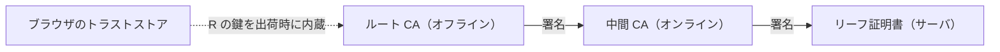

# 07. PKI とデジタルID（証明書のエコシステム）

> 前: [06 無線セキュリティ](./06_wireless-security.md) ｜ 層: 基礎(Layer 1)

**この1ページで分かること**

- 信頼の問題は解決されるのではなく「移動する」だけだということ
- 暗号化鍵と署名鍵でバックアップの是非が逆になる理由
- 失効が機能しないという未解決問題と、それを回避する方向（証明書の短命化）

公開鍵は公開してよい——だが「**その鍵が本当にその相手のものか**」は別問題。名刺は誰でも印刷できる。
PKI（公開鍵基盤）はこれを社会規模で解こうとする仕組みで、暗号ではなく**誰を信頼し、どう失効させ、誰がルールを決めるか**という運用の話になる。TLS での使われ方は [`../../courses/cs50-cybersecurity/03_securing-systems/04_https-tls-and-certificates.md`](../../courses/cs50-cybersecurity/03_securing-systems/04_https-tls-and-certificates.md) が入門。

---

## 最小の例：1枚の証明書と1つの CA

```
証明書 = 「example.com の公開鍵は XXXX である」 + CA の署名
  1. ブラウザは CA の公開鍵を出荷時から持っている（トラストストア）
  2. サーバから証明書を受け取り、CA の公開鍵で署名を検証する
  3. 検証が通れば、XXXX を example.com の鍵として信じる
```

つまり「example.com の鍵は本物か」を「CA の鍵は本物か」に置き換えている。以下は、この置き換えが生む問題（階層・失効・不正発行）の整理。



---

## 信頼の問題は消えず、移動する

| 素朴な案 | 破綻する理由 |
|---|---|
| 名刺に鍵のハッシュを印刷 | 会わないと渡せない |
| 公開鍵の電話帳 | 更新できず、規模で破綻 |
| CA が署名 | 「CA の鍵をどう知るか」に問題が**移る** |

最後の答えは「ブラウザや OS に焼き込む」。PKI は信頼の問題を**出荷時点に固定した**だけで、更新手段がなければ**問題のある CA を後から排除できない**。

---

## 階層と運用

**なぜ分けるか**: ルート CA の秘密鍵が漏れると全システムが崩れるが、日常の発行にはオンラインの応答性が要る。**リスクの高い鍵を隔離し、壊れても交換可能な中間 CA を前線に置く**——[`../04_hardware-security/03_security-building-blocks.md`](../04_hardware-security/03_security-building-blocks.md) の Root of Trust と同じ考え方。

---

## 鍵のバックアップは対称ではない

| 鍵 | バックアップ | 理由 |
|---|---|---|
| **暗号化鍵** | **必要** | 失うとデータが永久に読めない |
| **署名鍵** | **してはいけない** | 複製があると「本人しか署名できない」が崩れ、**否認防止**（後で「やっていない」と言えなくすること）が成立しない |

現代的な方式は鍵を HSM（鍵を外に出さない専用ハードウェア）に置き、利用時の本人確認で制御する。否認防止の一般論は [`../02_cryptography/03_public-key-crypto/04_digital-signatures.md`](../02_cryptography/03_public-key-crypto/04_digital-signatures.md)。

---

## Web PKI というエコシステム

ウェブの PKI は**ブラウザベンダと CA が合意してルールを決める**（CA/Browser Forum の Baseline Requirements）。構造的な弱点——**ブラウザは数百の CA を「等しく」信頼する**ため、1つが不正発行すれば任意のサイトを偽装できる。**全体の強度は最も弱い CA で決まる**（信頼が OR で結合）。

---

## 失効という未解決問題

| 方式 | 仕組み | 問題 |
|---|---|---|
| **CRL** (Certificate Revocation List) | 失効一覧を配布 | 巨大化して配布が重い |
| **OCSP** (Online Certificate Status Protocol) | 検証時に CA へ個別問い合わせ | CA 無応答時に通す（ソフトフェイル）運用になりがち。CA に閲覧先が伝わるプライバシー問題も |

**ソフトフェイルなら、攻撃者は応答を妨害するだけで失効確認を回避できる**——失効が実質機能しない。

### 解決の方向：失効を不要にする

**有効期間を短くして、失効の必要性自体を減らす**。CA/Browser Forum（Ballot SC-081v3, 2025年4月）が決めた公開 TLS 証明書の最大有効期間:

| 開始日 | 最大有効期間 |
|---|---|
| 2026年3月15日 | 200日 |
| 2027年3月15日 | 100日 |
| 2029年3月15日 | 47日 |

47日では手作業更新は事実上不可能——ACME（証明書の取得・更新を自動化するプロトコル）が運用の前提になる。

---

## 証明書透明性 (Certificate Transparency, RFC 9162)

不正発行を**防ぐ**のではなく**隠せなくする**。発行された証明書を追記のみの公開ログに記録し、サイト運営者が自ドメインへの証明書を監視できる。攻撃者——とくに国家機関——が求める**否認可能性**を奪い、「やれば必ずバレる」で実行の動機を下げる。Measured Boot（[`../04_hardware-security/03_security-building-blocks.md`](../04_hardware-security/03_security-building-blocks.md)）と同じ発想。

---

## デジタルID：eIDAS とウォレット

eIDAS 2.0（Regulation (EU) 2024/1183）は **EU デジタル ID ウォレット (EUDI Wallet)** の提供を加盟国に義務づけた。2026年後半までに全加盟国が提供し、2027年後半以降は銀行・医療・通信等の民間事業者にも受け入れ義務。身分証明にとどまらず**属性**（住所・学位・資格）を持ち運ぶ。

| | 内容 |
|---|---|
| 技術的に可能 | 「18歳以上」だけ証明し生年月日を開示しない**選択的開示**（[`../03_privacy/03_ppt-cryptographic/README.md`](../03_privacy/03_ppt-cryptographic/README.md)） |
| 制度が求めること | 「1台の端末にしか入れられない」等の制約 |

**技術者が「できます」と言えることと配備されるものは別**——標準化・制度設計に関与するときの出発点。

---

## 耐量子移行が PKI に突きつけるもの

| | 鍵合意 | 認証（署名・証明書） |
|---|---|---|
| 緊急度 | 高い（今盗聴して将来復号 = harvest now, decrypt later） | 低い（「今」偽造できなければよい） |
| 移行状況 | ハイブリッド方式で広く展開済み | ほとんど進んでいない |

耐量子署名は大幅に大きく、TLS の**証明書チェーン全体**で増加が積み重なり、TCP の初期輻輳ウィンドウを超えると接続確立が遅くなる——**ネットワークの物理が制約**（[`../02_cryptography/06_advanced-topics-map.md`](../02_cryptography/06_advanced-topics-map.md)）。

---

## 演習（解答つき）

1. CA を導入しても「信頼の問題」が消えたわけではない理由を述べよ。
2. 署名鍵をバックアップしてはいけない理由を、暗号化鍵と対比して述べよ。
3. 失効の仕組み（CRL・OCSP）が実務で十分に機能しないのはなぜか。
   それに対して証明書の有効期間短縮がどう効くか述べよ。

<details><summary>解答</summary>

1. 「相手の公開鍵が本物か」が「**CA の公開鍵が本物か**」に移動しただけ。最終的にブラウザや OS に焼き込むが、それは信頼の起点を出荷時点に固定したにすぎず、後から変更・排除しにくいという新たな問題を生む。
2. **暗号化鍵**は失うとデータが永久に読めなくなるためバックアップが必要。**署名鍵**は複製があると「本人しか署名できない」前提が崩れ、**否認防止が成立しなくなる**ためバックアップしてはいけない。
3. CRL は巨大化して配布が重く、OCSP は CA 無応答時に通す運用になりがちで、**攻撃者が応答を妨害するだけで失効確認を回避できる**。有効期間を短くすれば失効させられなくても自然に期限切れになるため、失効への依存を減らせる（更新の自動化が前提）。

</details>

---

## 次への接続

これで `06_systems-security/` の基礎パートが揃った。証明書が支える TLS などのプロトコル本体は [`../02_cryptography/05_protocols/README.md`](../02_cryptography/05_protocols/README.md)、選択的開示は [`../03_privacy/03_ppt-cryptographic/README.md`](../03_privacy/03_ppt-cryptographic/README.md)、規制面は [`../07_legal/03_regulatory-tsunami.md`](../07_legal/03_regulatory-tsunami.md) へ。

---

## 参考

- RFC 9162 — Certificate Transparency Version 2.0: https://www.rfc-editor.org/rfc/rfc9162.html
- CA/Browser Forum — Ballot SC-081v3（証明書有効期間の短縮スケジュール, 2025年4月）: https://cabforum.org/2025/04/11/ballot-sc081v3-introduce-schedule-of-reducing-validity-and-data-reuse-periods/
- Regulation (EU) 2024/1183（eIDAS 2.0 / EUDI Wallet）: https://eur-lex.europa.eu/eli/reg/2024/1183/oj
- 本ファイルの構成は COSIC Course 2026 の PKI セッション（Bart Preneel, 2026年6月）の整理に基づく。
