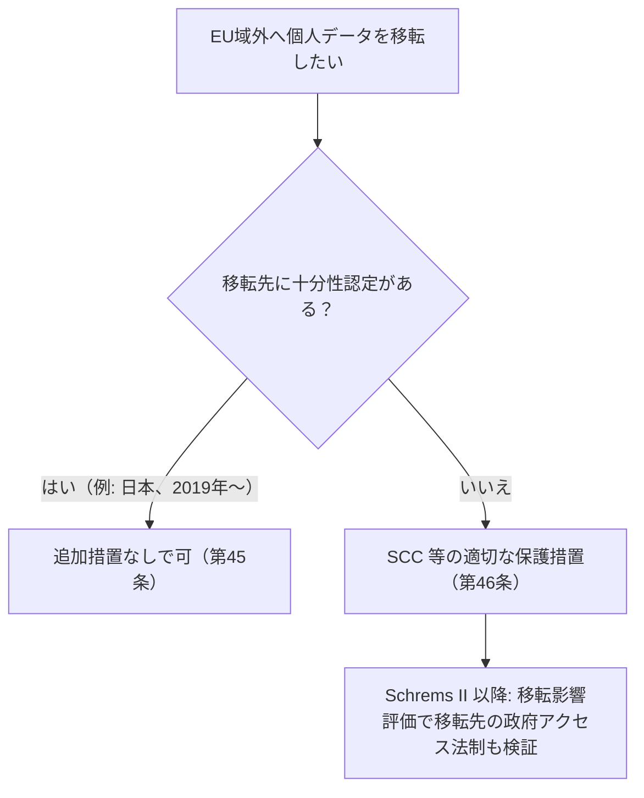

# 01. EU法務の全体地図（NIS2・Cybersecurity Act・GDPR・ePrivacy）

> 次: [02 サイバー犯罪と知的財産](./02_cybercrime-and-ip.md) ｜ 層: 基礎(Layer 1)

**この1ページで分かること**

- NIS2・Cybersecurity Act・GDPR・ePrivacy指令の「規律対象の違い」を1枚の表で掴む
- 十分性認定とSCC——EU域外への個人データ移転の主要な2つのルート（第49条の例外を除く）
- ePrivacy規則案の撤回（2025年）でCookie規制がどうなるか

法律は「誰に・何を・守らせるか」の約束。サイバーセキュリティに関わるEU法令は1つではなく、守らせる**対象が異なる複数の法令が重なって**いる。
GDPR の中身は [`../03_privacy/06_law-and-dpia.md`](../03_privacy/06_law-and-dpia.md) が本体。ここでは全体地図と、GDPR 自身が扱わなかった**国際データ移転**を補う。

---

## 最小の例：1社が1件の漏えいを起こしたら

```
X社（EUの病院向けクラウド、個人データを扱う）が侵入され、患者データが漏れた。
  GDPR 第33条 → 72時間以内に データ保護機関(DPA) へ通知（個人データが漏れたから）
  NIS2 第23条 → 24時間以内に 所轄当局/CSIRT へ早期警告（重要インフラの体制の問題だから）
```

同じ1件でも、**「データの性質」を問う法令**と**「組織の体制」を問う法令**が別々にかかる。どちらか一方を果たしても他方は免除されない。以下の全体地図はこの「軸の違い」で読む。

---

## 全体地図：誰が何を規律するか

| 法令 | 規律対象 | 施行状況 | 監督機関 |
|---|---|---|---|
| **NIS2指令** (2022/2555) | 重要・重要度の高い事業者の**組織のセキュリティ体制** | 2024年10月17日までに国内法化義務（多くが未達） | 各国の所轄当局 |
| **Cybersecurity Act** (2019/881) | ENISA の権限、ICT **製品・サービスの任意認証** | 2019年6月発効、主要条項は2021年6月から | ENISA・各国認証当局 |
| **GDPR** (2016/679) | **個人データの処理**全般 | 2018年5月25日から | 各国データ保護機関 (DPA) |
| **ePrivacy指令** (2002/58/EC, 2009/136/EC改正) | **電子通信の秘密・Cookie** 等 | 加盟国ごとに国内法化 | 各国当局 |

> 用語: **指令 (Directive)** は各国が国内法に置き換えて初めて効く。**規則 (Regulation)** はそのまま EU 全域に直接効く。**ENISA** は EU のサイバーセキュリティ専門機関。**CSIRT** はインシデント対応チーム。

---

## NIS2指令：組織のセキュリティ体制

前身の **NIS1**（2016/1148）は EU 初の包括的サイバーセキュリティ立法だが各国の実装がばらついた。**NIS2**（2022/2555）が置き換え、2024年10月18日付で NIS1 を廃止。

| | 重要事業者 (essential) | 重要度の高い事業者 (important) |
|---|---|---|
| セクター | Annex I（エネルギー・輸送・銀行・医療・デジタルインフラ等） | Annex II（郵便・廃棄物・化学・製造等） |
| 監督 | 事前（能動的に監査） | 事後（疑いがある場合のみ） |
| 主な義務 | リスク管理措置・重大インシデント報告・経営陣の説明責任（共通） | 同左 |

期限までに国内法化したのは4か国のみ。欧州委員会は2024年11月28日に23加盟国へ違反手続きを開始（2026年時点でも進行中）。

---

## Cybersecurity Act：ENISA と認証制度

| 柱 | 内容 |
|---|---|
| 1 | ENISA の権限を恒久化（それまでは期限付き） |
| 2 | ICT 製品・サービス・プロセスの**任意**の EU 共通認証制度。レベルは basic（基本的リスクの最小化）/ substantial（限定的スキルの攻撃者に耐える）/ high（国家レベルに耐える、侵入テスト含む） |

「任意」である点が GDPR のような強制規制と異なる（この選択の意味は [04](./04_how-to-read-regulation.md)）。

---

## GDPR：国際データ移転（第5章、第44〜50条）

7原則・適法根拠・データ主体の権利・DPIA は [`../03_privacy/06_law-and-dpia.md`](../03_privacy/06_law-and-dpia.md)。ここでは移転だけ。



| 条 | 名称 | 意味 |
|---|---|---|
| 第45条 | 十分性認定 (Adequacy Decision) | 欧州委員会が「その国は十分な保護水準」と認定。追加措置なし |
| 第46条 | 適切な保護措置 | 標準契約条項 (SCC) 等の契約で移転可 |

2020年の **Schrems II 判決**（CJEU＝EU 司法裁判所, C-311/18）は EU-US の Privacy Shield を無効化し、SCC でも**移転先の法制度（政府アクセス）を個別に評価する移転影響評価**を要求した。「契約さえ結べば移転できる」わけではない。

---

## ePrivacy指令 vs（幻の）ePrivacy規則

「Cookie 法」として知られる **ePrivacy 指令**は電子通信の秘密と Cookie 等への同意要件を定め、同意の定義は GDPR を参照する。指令なので各国の国内法がばらつく。統一のための **ePrivacy 規則案**（2017）は利害対立で合意できず、**欧州委員会は2025年2月11日に正式撤回**（「合意の見込みがなく、GDPR・DSA・AI 法との整合の観点からも時代遅れ」）。Cookie 規制は今後も**各国国内法のパッチワーク**のまま。

---

## 演習（解答つき）

1. 同じ「個人データを含むシステムへの不正侵入」というインシデントが、NIS2・GDPR
   それぞれで規律される理由をそれぞれ一言で述べよ。
2. 日本企業がEUの顧客データを日本の本社サーバーに移転する際、GDPR第45条の十分性認定を
   使える理由を述べよ。
3. ePrivacy規則案が2025年に撤回されたことで、EUのCookie規制はどうなるか。

<details><summary>解答</summary>

1. NIS2 は「体制が適切だったか」という組織の管理責任を問い、GDPR は「侵害された情報が個人データであったこと」自体を問う。切り口（体制 vs データの性質）が違うため両方に抵触しうる。
2. 日本は2019年に欧州委員会から第45条の十分性認定を取得し「十分な保護水準を持つ第三国」と認められているため、SCC 等の追加措置なしに移転できる。
3. 統一的な EU 規則は当分実現せず、各加盟国が国内法化した ePrivacy 指令のパッチワークが続く。国ごとに Cookie 同意の運用が微妙に異なる状態が解消されない。

</details>

---

## 次への接続

法令の全体像を掴んだので、次は「攻撃・捜査・知財」という実務寄りのテーマ——サイバー犯罪の国際枠組みとソフトウェアの知的財産——を見る。
→ [02 サイバー犯罪と知的財産](./02_cybercrime-and-ip.md)

---

## 参考

- NIS2指令 (Directive (EU) 2022/2555), 2022年12月14日: https://eur-lex.europa.eu/eli/dir/2022/2555/oj
- NIS1指令 (Directive (EU) 2016/1148), 2016年7月6日（2024年10月18日付で廃止）: https://eur-lex.europa.eu/legal-content/EN/ALL/?uri=CELEX:32016L1148
- Cybersecurity Act (Regulation (EU) 2019/881), 2019年4月17日: https://eur-lex.europa.eu/eli/reg/2019/881/oj
- GDPR 第5章（第44〜50条、国際移転）: https://gdpr-info.eu/chapter-5/
- CJEU, Case C-311/18 (Schrems II), 2020年7月16日判決: https://curia.europa.eu/juris/liste.jsf?num=C-311/18
- European Commission — 2025年ワークプログラムによるePrivacy規則案の撤回: https://digital-strategy.ec.europa.eu/en/policies/eprivacy-regulation
- ePrivacy指令 (Directive 2002/58/EC): https://eur-lex.europa.eu/eli/dir/2002/58/oj
