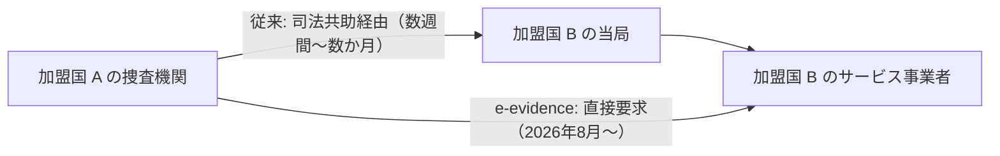

# 02. サイバー犯罪と知的財産

> 前: [01 法務の全体地図](./01_legal-landscape.md) ｜ 次: [03 規制の重なりとデジタル主権](./03_regulatory-tsunami.md) ｜ 層: 基礎(Layer 1)

**この1ページで分かること**

- ブダペスト条約とEU指令2013/40/EUの役割分担（国際協力の基盤 vs EU域内の統一）
- e-evidence規則が越境捜査（従来のMLAT経由）をどう変えるか
- ソフトウェアを守る2つの知財（著作権・特許）とOSSライセンスの2系統

[01](./01_legal-landscape.md) は「事業者が何をすべきか」の規制法。ここでは**攻撃者を裁く刑事法**と、**書いたコードを誰のものとして守るか**という知財を扱う。
どちらも実務に隣接するが、性質の異なる法分野。

---

## 最小の例：1件の攻撃、証拠は隣の国

```
ベルギーの警察が、フランスのクラウド上にある攻撃者のログを押収したい。
  従来: ベルギー当局 → （司法共助＝MLAT/EIO）→ フランス当局 → 事業者   … 数週間〜数か月
  2026年8月以降: ベルギー当局 → 事業者へ直接 European Production Order  … 大幅に短縮
```

「証拠の場所と攻撃者の場所が一致しない」がサイバー犯罪捜査の最大の壁。以下は、その壁をどの法令がどう扱うかの整理。

---

## サイバー犯罪の国際的な枠組み

| | ブダペスト条約（サイバー犯罪条約） | EU 指令 2013/40/EU |
|---|---|---|
| 起草 | Council of Europe（欧州評議会。EU とは別組織） | EU |
| 成立 | 2001年11月採択・署名開放 | 2013年8月12日 |
| 範囲 | 欧州域外も多数締結。事実上のグローバル標準 | EU 加盟国限定 |
| 内容 | 法制度の調和、捜査手法（ネットワーク捜索・通信傍受）、国際協力（証拠保全要請） | 量刑の最低水準統一、24時間365日の緊急連絡網。捜査手続きは持たない |
| 役割 | **国際協力の基盤** | **EU 域内の統一** |

日本・米国・カナダも起草にオブザーバー参加している。

---

## 越境捜査：e-evidence 規則

```
Regulation (EU) 2023/1543 + Directive (EU) 2023/1544（e-evidence パッケージ）
2026年8月18日から全加盟国（デンマークを除く）で適用
```



| 命令 | 内容 |
|---|---|
| European Production Order | 加入者情報・アクセスデータ・通信データ・内容データの**開示**を事業者に直接要求 |
| European Preservation Order | 将来の開示に備えたデータ**保全**を要求 |

EU 域外の事業者も、EU 内で事業を行う限り**法定代理人の指定**が義務（Directive 2023/1544）——GDPR の域外適用と同じ発想が刑事手続きにも及ぶ。

---

## ソフトウェアの知的財産：著作権と特許

| | 著作権 (Copyright) | 特許 (Patent) |
|---|---|---|
| 保護対象 | コードの**表現**（ソースコードそのもの） | **発明**（技術的課題を解く実装方法） |
| 発生 | 創作時に自動（登録不要） | 出願・審査・登録が必要 |
| ソフトでの扱い | 明確に保護（「文学的著作物」に類する） | EU では限定的（下記） |

### 欧州特許条約 (EPC) 第52条

```
(2) 「コンピュータプログラム」は特許の対象となる「発明」に含まれない
(3) ただし除外は「プログラム それ自体 (as such)」に限る
```

**技術的性格 (technical character)** を持つ発明（例: ハードウェア制御に技術的貢献をする）は除外に当たらず特許を取りうる、というのが欧州特許庁 (EPO) の運用。「アイデア自体」と「技術的課題を解く実装」の境界は判例で決まっていく。米国はソフトウェア特許により寛容。

---

## OSS ライセンス：パーミッシブ vs コピーレフト

著作権が自動発生するからこそ、公開する側は**ライセンス**で利用条件を明示する必要がある。

| 系統 | 例 | 再配布時の条件 | 企業実務での注意 |
|---|---|---|---|
| **パーミッシブ** | MIT, Apache 2.0, BSD | 著作権表示の保持など最小限。改変版を非公開で配布可 | ほぼ制約なし |
| **コピーレフト** | GPL, AGPL | 派生物を配布するなら同じライセンス（ソース公開義務含む）を引き継ぐ | 自社製品に混入すると**自社コードの公開義務**が生じうる |

ライセンス監査（どの OSS がどのライセンスで使われているか）はセキュア SDLC（開発工程全体にセキュリティ活動を組み込む手法）の一部としても重要。

---

## 演習（解答つき）

1. ブダペスト条約とEU指令2013/40/EUの役割分担を一言で述べよ。
2. EUのe-evidence規則が「MLAT（相互法的支援条約）経由の捜査」と比べて
   何を変えるか述べよ。
3. 「特定のアルゴリズムのソースコード」と「そのアルゴリズムのアイデア」を
   それぞれ著作権・特許のどちらが保護しうるか、EPC第52条の枠組みで説明せよ。

<details><summary>解答</summary>

1. ブダペスト条約は欧州評議会が起草した国際条約で、捜査手続きの調和と国際協力の基盤（欧州域外にも広がるグローバル枠組み）。2013/40/EU 指令は EU 加盟国限定で、量刑の最低水準統一と24時間緊急連絡網に特化した狭い実装。
2. 提供国の当局を経由する必要がなくなり、捜査機関が別の加盟国の事業者に**直接**開示・保全を要求できる——MLAT で数か月〜数年かかっていた手続きを大幅に短縮する。
3. ソースコード（表現）は著作権で自動的に保護される。アイデア自体は第52条(2)で「プログラムそれ自体」として特許から除外されるが、技術的課題を解く技術的性格を持つ実装として具体化されていれば第52条(3)の限定により特許の対象になりうる。

</details>

---

## 次への接続

「どんな法令があるか」と「攻撃・捜査・知財」を見た。次は**複数の法令が同じ事象に同時にかかる**ことで生じる実務負担と、背景のデジタル主権の政治。
→ [03 規制の重なりとデジタル主権](./03_regulatory-tsunami.md)

インシデント対応と法執行連携は [`../06_systems-security/`](../06_systems-security/index.md)、運用のガバナンス面は [`../08_management-governance/`](../08_management-governance/index.md)。

---

## 参考

- Council of Europe — Convention on Cybercrime (ETS No.185), 2001年11月23日署名開放: https://www.coe.int/en/web/conventions/full-list?module=treaty-detail&treatynum=185
- Directive 2013/40/EU（情報システムに対する攻撃）, 2013年8月12日: https://eur-lex.europa.eu/eli/dir/2013/40/oj
- Regulation (EU) 2023/1543（e-evidence規則）: https://eur-lex.europa.eu/eli/reg/2023/1543/oj
- Directive (EU) 2023/1544（e-evidence指令）: https://eur-lex.europa.eu/eli/dir/2023/1544/oj
- European Patent Convention 第52条: https://www.epo.org/en/legal/epc/2020/a52.html
- Open Source Initiative — ライセンス一覧: https://opensource.org/licenses
