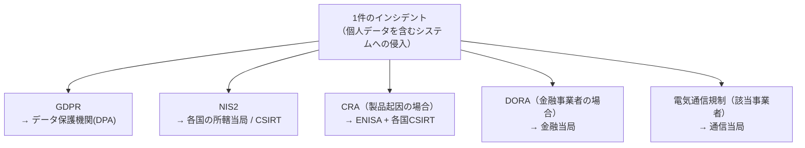

# 03. 規制の重なりとデジタル主権（CRA・DORA・DSA・Data Act・AI Act）

> 前: [02 サイバー犯罪と知的財産](./02_cybercrime-and-ip.md) ｜ 次: [04 規制の読み方](./04_how-to-read-regulation.md) ｜ 層: 基礎(Layer 1)

[01](./01_legal-landscape.md) では法令を1つずつ、規律対象の違いで整理した。
しかし実務で効いてくるのは**複数の法令が同じ事象に同時にかかること**であり、
1件のインシデントで報告先が複数になる。本ファイルはその重なりと、
背景にあるデジタル主権の政治を扱う。

**この1ページで分かること**

- `01` の地図に載っていなかった5つの法令が、それぞれ何を規律するか
- 1件のインシデントで報告先が複数になる仕組み
- Safe Harbor → Privacy Shield → EU-US DPF という「法的カルーセル」が繰り返される理由

---

## 01 の地図に足りていなかった法令

`01` は NIS2・Cybersecurity Act・GDPR・ePrivacy を扱った。実際にはさらに5つが重なる。

| 法令 | 番号 | 規律対象 | 適用時期 |
|---|---|---|---|
| **Cyber Resilience Act (CRA)** | (EU) 2024/2847 | **デジタル要素を持つ製品**のセキュリティ | 2024年12月10日発効。報告義務は**2026年9月11日**、主要義務は**2027年12月11日**から |
| **DORA** | (EU) 2022/2554 | **金融**分野の ICT リスク管理・第三者リスク | 2025年1月17日から適用 |
| **DSA** | (EU) 2022/2065 | オンライン**仲介サービス**（違法コンテンツ・透明性） | 超大規模プラットフォームは2023年8月25日、一般は2024年2月17日から |
| **Data Act** | (EU) 2023/2854 | 接続製品が生成する**データへのアクセスと共有** | 2025年9月12日から（接続製品の設計義務は2026年9月12日から） |
| **AI Act** | (EU) 2024/1689 | **AIシステム**のリスク分類と義務 | 段階適用。禁止行為2025年2月2日、汎用AI 2025年8月2日、高リスク2026年8月2日 |

> **NIS2・Cybersecurity Act・GDPR・ePrivacy は [01](./01_legal-landscape.md) が本体。** 本ファイルでは再説明しない。

⚠️ AI Act の適用スケジュールは Regulation (EU) 2026/1744（2026年7月8日採択）により
一部の義務が簡素化・延期されている。**具体的な期限を実務で使う場合は最新の官報を確認すること。**

---

## CRA：製品セキュリティの一般規制

CRA の核心概念は「**EU 市場で提供されるデジタル要素を持つ製品**」で、これはほぼすべての
ネットワーク接続製品を含む。狙いは明確で、[`../00_overview/04_threat-landscape.md`](../00_overview/04_threat-landscape.md)
で見た **IoT の安全性が市場では改善しない**という問題を、規制で解こうとしている。

```
主な義務:
  設計・開発段階でのセキュリティ要求（本質的要求事項）
  サポート期間中の脆弱性ハンドリング（修正の提供）
  積極的に悪用されている脆弱性・重大インシデントの報告（24時間以内の早期警告）
  CE マーキングによる適合の表明
```

**セキュリティ経済学の観点では、CRA は「市場の失敗に対する規制的介入」**にあたる。
買い手が製品のセキュリティ品質を判別できないためレモン市場になり、
かつ被害が所有者以外に及ぶ外部性があるので、市場は自力で水準を上げられない
（→ [`../08_management-governance/03_certification-economics.md`](../08_management-governance/03_certification-economics.md)）。
Cybersecurity Act の**任意**認証と違い、CRA が**義務**という手段を選んだ背景がここにある。

### 標準が間に合わないという構造問題

規制は施行日を条文で決められるが、「何をすれば適合か」を定める**整合規格**は
標準化団体の作業速度に依存する。CRA でも、施行日までに必要な規格を揃える作業が
短期間に集中している。

**帰結**: 施行日が来ても適合の判断基準が完全には存在しない、という状態が生じうる。
規制の設計と技術標準の生産速度が噛み合っていない、という構造的な問題である
（整合規格の仕組みは [04](./04_how-to-read-regulation.md) で扱う）。

---

## 報告義務の多重化

同一のインシデントが複数の法令に同時に該当する。**規律対象が違うので、どれも免除されない。**



各法令で**報告の期限も、様式も、判断基準も異なる**。
ベルギーのように複数の監督機関が並立する国では、1件の事象で複数の窓口に
異なる形式で報告することになる。

**実務上の含意**: インシデント対応計画には「技術的にどう封じ込めるか」だけでなく
「**誰に、いつまでに、何を報告するか**」の一覧が要る。これは技術ではなく事前の整理の問題。

---

## 国際データ移転の法的カルーセル

EU から米国への個人データ移転をめぐる枠組みは、**同じ構造で3回繰り返されている**。

```
Safe Harbor（2000年〜）      → 欧州司法裁判所が無効化（Schrems I, 2015年）
Privacy Shield（2016年〜）   → 欧州司法裁判所が無効化（Schrems II, 2020年）
EU-US Data Privacy Framework → 現行。同種の争点が提起されている
```

> Schrems II 判決の内容と、十分性認定・SCC の仕組みは
> [01](./01_legal-landscape.md) が本体。ここでは繰り返される**理由**に絞る。

**なぜ同じことが繰り返されるのか**: 争点は合意文書の書き方ではなく、
**移転先の国の政府アクセス法制そのもの**にある。移転の枠組みを新しく作り直しても、
その国の情報機関がデータにアクセスできる法的権限が変わらなければ、
同じ論点が再び提起されうる。

**技術者にとっての含意**: 「契約を結べば移転できる」という理解は誤り。
法的枠組みが将来無効化されうる前提で、**データの所在そのものを設計変数として扱う**必要がある。

---

## デジタル主権とクラウド

クラウドへの集約には強い経済合理性がある。一方で、
**第三国の法律が域外適用される**という問題が残る——サービス提供者が第三国の企業であれば、
その国の法執行がデータへのアクセスを求めうる。

| 論点 | 内容 |
|---|---|
| 経済合理性 | 自前の設備・運用要員を持つより効率的。だから集約は進む |
| 法的リスク | 第三国の政府アクセス法制の対象になる |
| 集約のリスク | 1か所への集約は、1回の侵害の影響を最大化する（→ [`../08_management-governance/01_risk-management.md`](../08_management-governance/01_risk-management.md)） |
| 政策的対応 | EU はデジタル主権を掲げ、オープンソースや域内インフラへの投資を進めている |

技術的な緩和策として、**事業者に鍵を渡さない**構成（クライアント側暗号化・
[`../03_privacy/03_ppt-cryptographic.md`](../03_privacy/03_ppt-cryptographic.md) の秘密計算）があるが、
性能と機能の制約が伴う。クラウドの責任共有モデル自体は
[`../06_systems-security/05_distributed-systems-security.md`](../06_systems-security/05_distributed-systems-security.md) が本体。

---

## 演習（解答つき）

1. ある金融機関で、顧客の個人データを含むシステムへの侵入が発生した。
   [01](./01_legal-landscape.md) で見た GDPR・NIS2 に加えて、どの法令の報告義務が追加でかかりうるか。理由も述べよ。
2. CRA が Cybersecurity Act のような任意認証ではなく、義務的な規制という手段を採った理由を
   セキュリティ経済学の言葉で説明せよ。
3. EU-US Data Privacy Framework についても、Safe Harbor・Privacy Shield と同種の争点が
   提起されうるのはなぜか。

<details><summary>解答</summary>

1. **DORA**。金融事業者の ICT リスク管理とインシデント報告を規律する法令であり、
   分野特化の規制として金融当局への報告義務が別途かかる。
   さらに侵入が自社製品の脆弱性に起因する場合は **CRA** の報告義務（ENISA・CSIRT）も加わりうる。
   規律対象（個人データ／組織の体制／金融分野の耐性／製品の欠陥）が異なるため、
   どれか1つを果たせば他が免除されるという関係にはならない。
2. 買い手が購入前にセキュリティ品質を検証できない（情報の非対称性＝レモン市場）ため、
   高品質な製品に対価が払われず、任意の認証では取得のインセンティブが働きにくい。
   加えて、乗っ取られた機器の被害が所有者以外の第三者に及ぶ（外部性）ため、
   所有者にも品質向上の動機がない。市場が自力で水準を上げられない構造なので、
   市場アクセスの条件として義務化する手段が選ばれた。
3. 無効化の理由が合意文書の記載の不備ではなく、**移転先の政府アクセス法制の存在**にあるため。
   枠組みを新しく作り直しても、その法制と、EU 市民が実効的な救済を受けられるかという
   争点は残る。したがって同じ構造の訴訟が繰り返されうる。

</details>

---

## 次への接続

法令が重なることで生じる負担を見た。次は個々の条文ではなく、
**サイバーセキュリティ法をどう読むか**——規制手法の分類・最善努力義務・
整合規格と適合性評価という道具立てを扱う。
→ [04 規制の読み方](./04_how-to-read-regulation.md)

---

## 参考

- Cyber Resilience Act (Regulation (EU) 2024/2847): https://eur-lex.europa.eu/eli/reg/2024/2847/oj/eng
- European Commission — Cyber Resilience Act（適用日程の解説）: https://digital-strategy.ec.europa.eu/en/policies/cyber-resilience-act
- DORA (Regulation (EU) 2022/2554): https://eur-lex.europa.eu/eli/reg/2022/2554/oj
- Digital Services Act (Regulation (EU) 2022/2065): https://eur-lex.europa.eu/eli/reg/2022/2065/oj
- Data Act (Regulation (EU) 2023/2854): https://eur-lex.europa.eu/eli/reg/2023/2854/oj
- AI Act (Regulation (EU) 2024/1689): https://eur-lex.europa.eu/eli/reg/2024/1689/oj
