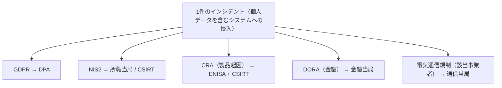

# 03. 規制の重なりとデジタル主権（CRA・DORA・DSA・Data Act・AI Act）

> 前: [02 サイバー犯罪と知的財産](./02_cybercrime-and-ip.md) ｜ 次: [04 規制の読み方](./04_how-to-read-regulation.md) ｜ 層: 基礎(Layer 1)

**この1ページで分かること**

- `01` の地図に載っていなかった5つの法令が、それぞれ何を規律するか
- 1件のインシデントで報告先が複数になる仕組み
- Safe Harbor → Privacy Shield → EU-US DPF という「法的カルーセル」が繰り返される理由

[01](./01_legal-landscape.md) は法令を1つずつ整理した。実務で効くのは**複数の法令が同じ事象に同時にかかること**——1件の事故で報告先が4つになる。
その重なりと、背景のデジタル主権（自国のデータを他国の法律から守る政策）を扱う。

---

## 最小の例：金融機関で1件の侵入

```
EU の銀行 Y 社。顧客データを含むシステムに侵入。原因は自社製アプリの脆弱性。
  GDPR  → データ保護機関(DPA)     … 個人データが漏れた
  NIS2  → 所轄当局 / CSIRT        … 重要インフラの体制
  DORA  → 金融当局                … 金融分野の ICT リスク
  CRA   → ENISA + 各国 CSIRT      … 製品の脆弱性が原因
```

4か所へ、**期限も様式も判断基準も違う**報告を出す。どれか1つを果たしても他は免除されない。

---

## 01 の地図に足りていなかった法令

| 法令 | 番号 | 規律対象 | 適用時期 |
|---|---|---|---|
| **Cyber Resilience Act (CRA)** | (EU) 2024/2847 | **デジタル要素を持つ製品**のセキュリティ | 2024年12月発効。報告義務 **2026年9月11日**、主要義務 **2027年12月11日** |
| **DORA** (Digital Operational Resilience Act) | (EU) 2022/2554 | **金融**分野の ICT リスク・第三者リスク | 2025年1月17日 |
| **DSA** (Digital Services Act) | (EU) 2022/2065 | オンライン**仲介サービス**（違法コンテンツ・透明性） | 超大規模は2023年8月、一般は2024年2月 |
| **Data Act** | (EU) 2023/2854 | 接続製品が生成する**データへのアクセスと共有** | 2025年9月12日（設計義務は2026年9月） |
| **AI Act** | (EU) 2024/1689 | **AI システム**のリスク分類と義務 | 段階適用。禁止行為2025年2月、汎用AI 2025年8月、高リスク2026年8月 |

> NIS2・Cybersecurity Act・GDPR・ePrivacy は [01](./01_legal-landscape.md) が本体。
> ⚠️ AI Act は Regulation (EU) 2026/1744（2026年7月8日採択）で一部の義務が簡素化・延期された。**期限を実務で使うときは最新の官報を確認**。

---

## CRA：製品セキュリティの一般規制

「**EU 市場で提供されるデジタル要素を持つ製品**」＝ほぼすべてのネットワーク接続製品。狙いは [`../00_overview/04_threat-landscape.md`](../00_overview/04_threat-landscape.md) の **IoT の安全性が市場では改善しない**問題を規制で解くこと。

| 義務 | 内容 |
|---|---|
| 設計・開発 | 本質的要求事項（セキュリティ要求）を満たす |
| サポート期間中 | 脆弱性ハンドリング（修正の提供） |
| 報告 | 悪用されている脆弱性・重大インシデントを **24時間以内**に早期警告 |
| 表示 | CE マーキング（EU の安全基準適合を示すマーク）で適合を表明 |

セキュリティ経済学では CRA は「**市場の失敗への規制的介入**」。買い手が品質を判別できない（レモン市場）うえ、被害が所有者以外に及ぶ（外部性）ので市場は自力で水準を上げられない（→ [`../08_management-governance/03_certification-economics.md`](../08_management-governance/03_certification-economics.md)）。Cybersecurity Act の**任意**認証と違い**義務**を選んだ理由がここにある。

### 標準が間に合わないという構造問題

施行日は条文で決まるが、「何をすれば適合か」を定める**整合規格**は標準化団体の作業速度に依存する。**施行日が来ても適合の判断基準が揃っていない**事態が生じうる（整合規格の仕組みは [04](./04_how-to-read-regulation.md)）。

---

## 報告義務の多重化



**実務上の含意**: インシデント対応計画には「技術的にどう封じ込めるか」だけでなく「**誰に・いつまでに・何を報告するか**」の一覧が要る。技術ではなく事前整理の問題。

---

## 国際データ移転の法的カルーセル

| 枠組み | 期間 | 結末 |
|---|---|---|
| Safe Harbor | 2000年〜 | Schrems I（2015）で無効 |
| Privacy Shield | 2016年〜 | Schrems II（2020）で無効 |
| EU-US Data Privacy Framework | 現行 | 同種の争点が提起されている |

> 十分性認定・SCC・Schrems II の内容は [01](./01_legal-landscape.md) が本体。

**なぜ繰り返すか**: 争点は合意文書の書き方ではなく**移転先の政府アクセス法制そのもの**。枠組みを作り直しても、情報機関がデータにアクセスできる法的権限が変わらなければ同じ論点が再提起される。**含意**: 法的枠組みが将来無効化されうる前提で、**データの所在を設計変数として扱う**。

---

## デジタル主権とクラウド

| 論点 | 内容 |
|---|---|
| 経済合理性 | 自前設備より効率的。だから集約は進む |
| 法的リスク | 第三国の政府アクセス法制の対象になる（域外適用） |
| 集約のリスク | 1か所への集約は1回の侵害の影響を最大化（→ [`../08_management-governance/01_risk-management.md`](../08_management-governance/01_risk-management.md)） |
| 政策的対応 | EU はデジタル主権を掲げ、OSS・域内インフラへ投資 |

技術的緩和策は**事業者に鍵を渡さない**構成（クライアント側暗号化・[`../03_privacy/03_ppt-cryptographic/README.md`](../03_privacy/03_ppt-cryptographic/README.md) の秘密計算）だが性能と機能の制約が伴う。責任共有モデル自体は [`../06_systems-security/05_distributed-systems-security.md`](../06_systems-security/05_distributed-systems-security.md)。

---

## 演習（解答つき）

1. ある金融機関で、顧客の個人データを含むシステムへの侵入が発生した。
   [01](./01_legal-landscape.md) で見た GDPR・NIS2 に加えて、どの法令の報告義務が追加でかかりうるか。理由も述べよ。
2. CRA が Cybersecurity Act のような任意認証ではなく、義務的な規制という手段を採った理由を
   セキュリティ経済学の言葉で説明せよ。
3. EU-US Data Privacy Framework についても、Safe Harbor・Privacy Shield と同種の争点が
   提起されうるのはなぜか。

<details><summary>解答</summary>

1. **DORA**。金融事業者の ICT リスク管理とインシデント報告を規律し、金融当局への報告義務が別途かかる。侵入が自社製品の脆弱性に起因すれば **CRA** の報告義務（ENISA・CSIRT）も加わりうる。規律対象が異なるため、1つを果たせば他が免除される関係にならない。
2. 買い手が購入前に品質を検証できない（レモン市場）ため高品質に対価が払われず任意認証の動機が働かない。加えて被害が第三者に及ぶ（外部性）ため所有者にも動機がない。市場が自力で水準を上げられないので、市場アクセスの条件として義務化した。
3. 無効化の理由が合意文書の不備ではなく**移転先の政府アクセス法制の存在**にあるため。枠組みを作り直しても、その法制と EU 市民の実効的救済という争点は残り、同じ構造の訴訟が繰り返されうる。

</details>

---

## 次への接続

次は個々の条文ではなく、**サイバーセキュリティ法をどう読むか**——規制手法の分類・最善努力義務・整合規格と適合性評価。
→ [04 規制の読み方](./04_how-to-read-regulation.md)

---

## 参考

- Cyber Resilience Act (Regulation (EU) 2024/2847): https://eur-lex.europa.eu/eli/reg/2024/2847/oj/eng
- European Commission — Cyber Resilience Act（適用日程の解説）: https://digital-strategy.ec.europa.eu/en/policies/cyber-resilience-act
- DORA (Regulation (EU) 2022/2554): https://eur-lex.europa.eu/eli/reg/2022/2554/oj
- Digital Services Act (Regulation (EU) 2022/2065): https://eur-lex.europa.eu/eli/reg/2022/2065/oj
- Data Act (Regulation (EU) 2023/2854): https://eur-lex.europa.eu/eli/reg/2023/2854/oj
- AI Act (Regulation (EU) 2024/1689): https://eur-lex.europa.eu/eli/reg/2024/1689/oj
