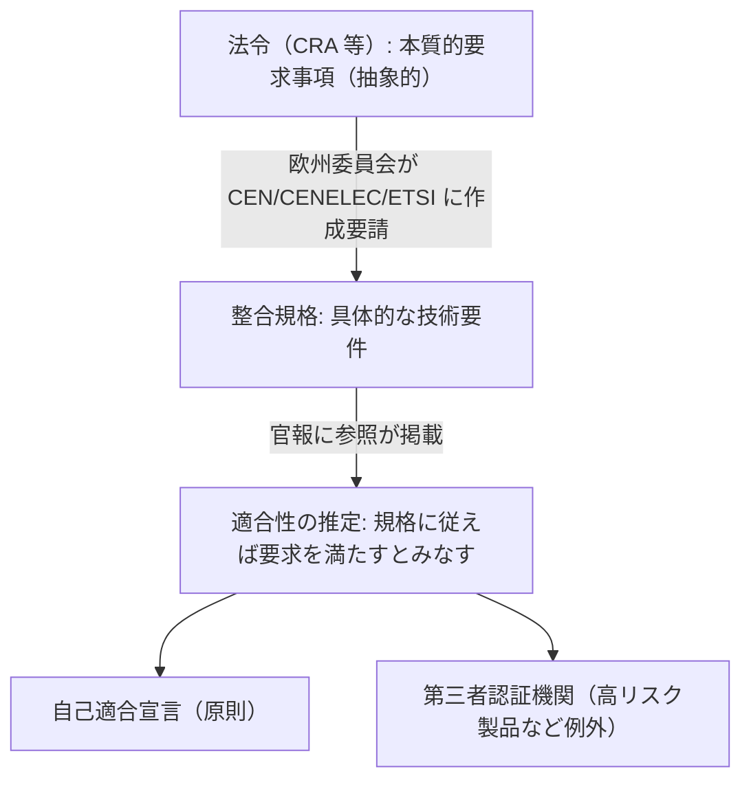

# 04. 規制の読み方（規制手法・最善努力義務・整合規格）

> 前: [03 規制の重なりとデジタル主権](./03_regulatory-tsunami.md) ｜ 層: 基礎(Layer 1)

**この1ページで分かること**

- 「規制」には複数の手法があり、どれを使っているかで事業者への要求が変わること
- サイバーセキュリティ法の義務が「結果」ではなく「努力」を求める形で書かれる理由と、その帰結
- 法令の抽象的な要求と、具体的な技術要件を繋ぐ「整合規格」の仕組み

法令は次々に増えるので、個別に覚えるより**読むための道具**を持つ方が長持ちする。
サイバーセキュリティ法に共通する3つの仕掛け——手法の種類・義務の書き方・技術標準との接続——を扱う。

---

## 最小の例：1条文を読み解く

```
NIS2 第21条(1)（要約）: 「事業者は、ネットワーク・情報システムのリスクを管理するため、
                        適切かつ比例的な技術的・運用的・組織的措置を講じなければならない」
```

| 読み解きの問い | この条文の答え |
|---|---|
| どの手法か | **直接的な行為規制**（「〜しなければならない」） |
| 結果か努力か | **努力**。「侵害されるな」ではなく「適切な措置を講じよ」 |
| 「適切」とは何か | 条文には書いていない → **整合規格・国際標準**が埋める |

この3つの問いが、以下の3節に対応する。

---

## 規制の手法を見分ける

| 手法 | 仕組み | 本領域での例 |
|---|---|---|
| 直接的な行為規制 | 「〜しなければならない」 | NIS2 のリスク管理措置・報告 |
| **市場を通じた規制** | 認証・ラベルを用意し、市場参加者が互いに要求して水準を上げる | Cybersecurity Act の**任意**認証 |
| 市場アクセスの条件化 | 要件を満たさない製品は市場に出せない | CRA（CE マーキングの枠組み） |
| 透明性義務 | 情報開示を義務づけ、評価は市場に委ねる | 脆弱性報告義務、DSA の透明性報告 |

**市場を通じた規制が機能する条件**は「買い手が品質を見分けられること」。見分けられなければレモン市場（品質が分からず低品質品が残る市場）になり認証を取る動機が働かない（→ [`../08_management-governance/03_certification-economics.md`](../08_management-governance/03_certification-economics.md)）。**CRA が任意認証でなく市場アクセスの条件化を選んだ**のは、この条件が満たされないと判断されたからと読める。

---

## 「最善努力」という義務の書き方

```
書かれない: 「侵害されてはならない」
書かれる:   「適切なリスク管理措置を講じなければならない」
```

完全な安全は原理的に達成できない（攻撃者は戦略的に動く。→ [`../05_software-security/01_secure-sdlc.md`](../05_software-security/01_secure-sdlc.md)）ので、これは合理的な設計。**焦点は「努力したことをどう証明するか」に移る。**

| 求められること | 残すもの |
|---|---|
| リスクを評価した | リスクアセスメント文書 |
| 措置を選んだ理由 | 採用した措置と、**採用しなかった措置とその理由** |
| 業界水準に沿う | 整合規格・国際標準への適合の証跡 |
| 継続している | 定期的な見直しの記録 |

**技術的に安全であることと、法的に義務を果たしたことは別**。後者には証跡が要り、証跡は事後には作れない（枠組みは [`../08_management-governance/01_risk-management.md`](../08_management-governance/01_risk-management.md)）。

> 法学ではこの区別を「手段債務」（努力を約束）と「結果債務」（結果を約束）と呼ぶ。サイバーセキュリティ法の義務はほぼ前者。

---

## 整合規格と適合性評価：法と技術標準の接続点



**推定効果が整合規格の価値**。従う義務はないが、従わないと**自力で適合を証明する負担**を負う。

| 適合の判定 | 判定者 | 場面 |
|---|---|---|
| 自己適合宣言 | 製造者自身 | **原則。大半の製品** |
| 第三者認証機関 | 認定を受けた外部機関 | 高リスク製品カテゴリなど例外 |

保証の強さと市場の負担のトレードオフを、製品カテゴリごとに切っている。

| 標準化の層 | 団体の例 |
|---|---|
| 国際 | ISO / IEC |
| 欧州 | CEN / CENELEC / ETSI |
| 各国 | 各国の標準化機関 |

各国機関の会員になれば上位層の作業に参加できる——**技術者が規格の内容に関与する経路は存在する**。規格が施行日までに揃わないと「判断基準がないまま義務が発生する」（→ [03](./03_regulatory-tsunami.md)）。

---

## 演習（解答つき）

1. Cybersecurity Act の認証制度は任意、CRA の要求は義務である。この違いを「規制手法」の
   分類で説明し、CRA が義務を選んだ理由を述べよ。
2. 「適切なリスク管理措置を講じた」ことを当局に示すために、技術的な対策の実施記録以外に
   何を残しておくべきか。1つ挙げて理由を述べよ。
3. ある製品が整合規格に従わずに設計されている。これは違法か。理由を述べよ。

<details><summary>解答</summary>

1. Cybersecurity Act は**市場を通じた規制**（認証というシグナルで市場参加者が互いに要求）。CRA は**市場アクセスの条件化**（満たさない製品は市場に出せない）。前者は買い手が品質を見分けられることが前提だが、IoT では成立せず（レモン市場）、被害が第三者に及ぶ外部性もあるため、任意では水準が上がらないと判断された。
2. **採用しなかった措置とその理由**。「何をしたか」だけでは選択の適切さを示せない。何を優先し何を（コスト・可用性・他リスクとの兼ね合いで）見送ったかの判断過程が残って初めて「適切に判断した」と言える。最善努力義務は**判断の質**を問う。
3. **違法ではない。** 整合規格への適合は義務ではなく、従えば本質的要求を満たすと**推定される**効果を持つにすぎない。ただし従わない場合は製造者が自力で適合を証明する必要があり、立証の負担が重くなる。

</details>

---

## 次への接続

`07_legal/` の基礎パートが一通り揃った。組織として義務をどう回すかは [`../08_management-governance/`](../08_management-governance/index.md)、脅威側のマクロ像は [`../00_overview/04_threat-landscape.md`](../00_overview/04_threat-landscape.md) へ。

---

## 参考

- European Commission — Harmonised standards（整合規格と適合性の推定）: https://single-market-economy.ec.europa.eu/single-market/european-standards/harmonised-standards_en
- Decision No 768/2008/EC（適合性評価モジュールの共通枠組み）: https://eur-lex.europa.eu/legal-content/EN/ALL/?uri=CELEX:32008D0768
- Cyber Resilience Act (Regulation (EU) 2024/2847): https://eur-lex.europa.eu/eli/reg/2024/2847/oj/eng
- 本ファイルの構成は COSIC Course 2026 の法務セッション（Laura Drechsler, CiTiP, 2026年6月）の整理に基づく。
