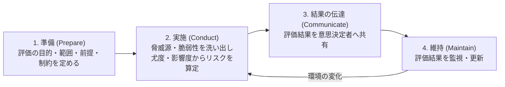

# 01. リスク管理フレームワーク（NIST・ISO 27000）

> 次: [02 運用管理・IAM・BCP/DR](./02_security-operations.md) ｜ 層: 基礎(Layer 1)

ここまでの5本柱（暗号・プライバシー・HW・SW・システム）は「どう守るか」の技術だった。
本領域は「**何をどこまで守るべきか、誰がその判断に責任を持つか**」という組織的な問い——
リスク管理はその共通言語を提供する。NISTとISOという2つの標準体系が事実上の業界標準。

**この1ページで分かること**

- リスク ≈ 尤度×影響度という共通語彙と、リスク対応の4選択肢
- NIST CSF 2.0（6機能の全体地図）と SP 800-30（実施手順）の役割分担
- ISO 27000シリーズ（27001/27002/27005）とNISTの使い分け

---

## リスク管理の基本語彙

```
資産 (Asset):        守るべきもの（データ・システム・信用）
脅威 (Threat):        資産に危害を加えうる主体・事象
脆弱性 (Vulnerability): 脅威が付け込める弱点
尤度 (Likelihood):     脅威が脆弱性を突く確率（「ゆうど」＝起こりやすさ）
影響度 (Impact):       実際に突かれた場合の被害の大きさ

リスク (Risk) ≈ 尤度 × 影響度
```

リスク対応の4選択肢:

| 選択肢 | 内容 |
|---|---|
| **低減** | 対策を打ってリスクを下げる |
| **移転** | 保険・アウトソースで他者に負わせる |
| **受容** | 許容範囲として放置する（受け入れる判断） |
| **回避** | そのリスクを生む活動自体をやめる |

---

## NIST Cybersecurity Framework（CSF）2.0

米国国立標準技術研究所（NIST）が策定する任意（義務ではない）のフレームワーク。
2024年2月26日に**CSF 2.0**がリリースされ、従来の5機能に加えて新たに
**Govern（統治）**機能が追加され、6機能構成になった。

```
Govern（統治）:  リスク管理戦略・役割責任・方針を組織全体で定める（2.0で新設）
Identify（識別）: 資産・リスク・脆弱性を把握する
Protect（防御）:  適切な保護対策を実装する
Detect（検知）:   セキュリティ事象を検知する仕組みを持つ
Respond（対応）:  検知したインシデントに対応する
Recover（復旧）:  影響を受けた機能を復旧させる
```

Govern機能が新設された狙いは、旧CSF 1.1では「技術的な5機能」が並列だったのに対し、
**経営層のガバナンス（意思決定・サプライチェーンリスク管理・方針）を独立した機能として
明示する**こと——本領域が「マネジメント・ガバナンス」と呼ばれる理由そのものが
ここに現れている。

---

## NIST SP 800-30：リスクアセスメントの実施手順

「Guide for Conducting Risk Assessments」（Rev. 1, 2012年9月）は、CSFのIdentify機能を
実務でどう回すかの詳細手順書。4段階のプロセスを定める:



CSFが「何をすべきか（What）」の全体地図なら、SP 800-30は「どうやるか（How）」の
詳細手順という役割分担。

---

## ISO/IEC 27000シリーズ：ISMSの国際標準

ISO（国際標準化機構）とIEC（国際電気標準会議）が共同策定。NISTが米国発の任意フレーム
ワークなのに対し、ISO 27000シリーズは**第三者認証**（審査機関による認証取得）を前提と
した国際規格で、欧州企業では取引要件になることが多い。

| 規格 | 最新版 | 内容 |
|---|---|---|
| **ISO/IEC 27001** | 2022年10月改訂 | ISMS（情報セキュリティマネジメントシステム）の**要求事項**。PDCAサイクルと附属書A管理策で構成、認証取得の対象規格 |
| **ISO/IEC 27002** | 2022年2月改訂 | 附属書Aの管理策（コントロール）の実装ガイダンス集。27001の「何を」に対する「どう実装するか」 |
| **ISO/IEC 27005** | 2022年10月改訂 | 情報セキュリティ**リスクマネジメント**のガイダンス。SP 800-30のISO版に相当する位置づけ |

27001が認証取得の対象（＝審査に合格する規格）で、27002・27005はその実装を助ける
ガイダンス（＝審査対象ではない）という違いを混同しないこと。

---

## NIST vs ISO：どちらを学ぶべきか

| | NIST CSF / SP 800シリーズ | ISO 27000シリーズ |
|---|---|---|
| 入手 | 無料公開 | 有償規格 |
| 性格 | 詳細な実装ガイド | 認証ビジネスと結びつく |
| 主な適用圏 | 米国政府機関で義務化されがち | 欧州企業の取引要件になりがち |

実務では両方が併用されることが多く（ISO 27001認証を取りつつ実装詳細はNIST SP 800シリーズ
を参照する、等）、対立する2つの規格ではなく**相互補完的**と捉えるのが実態に近い。

法的リスク評価（GDPR・NIS2など）に踏み込む場合は
[`../07_legal/01_legal-landscape.md`](../07_legal/01_legal-landscape.md) を参照——本ファイルは
あくまで標準・フレームワークの枠組みに限定する。GDPR文脈でのリスク評価（DPIA）は
既に [`../03_privacy/06_law-and-dpia.md`](../03_privacy/06_law-and-dpia.md) で扱った。

---

## 演習（解答つき）

1. NIST CSF 2.0で新設された機能の名前と、それが必要とされた理由を述べよ。
2. NIST SP 800-30とISO/IEC 27005の役割上の共通点を一言で述べよ。
3. ISO/IEC 27001と27002の違いを、「認証」というキーワードを使って説明せよ。

<details><summary>解答</summary>

1. **Govern（統治）**機能。従来のCSF 1.1は技術的な5機能（識別・防御・検知・対応・復旧）
   が並列だったが、経営層のリスク管理戦略・役割責任・サプライチェーンリスク管理といった
   ガバナンス面を独立した機能として明示する必要があったため2024年2月のCSF 2.0で追加された。
2. どちらも「リスクアセスメントの具体的な実施方法（手順）」を定めるガイダンス文書であり、
   NISTとISOそれぞれの体系における「How」を担う点で対応している。
3. ISO/IEC 27001はISMSの**要求事項**であり、第三者機関の審査に合格すれば「認証」を
   取得できる規格。ISO/IEC 27002は27001の附属書A管理策を実装する際の**ガイダンス**に
   すぎず、それ自体は認証審査の対象ではない。

</details>

---

## 次への接続

リスクを識別・評価する枠組みが揃ったところで、次はその評価結果を実際の**運用**に
落とし込む段階に進む。[02](./02_security-operations.md) では IAM（アクセス制御）・
BCP/DR（事業継続・災害復旧）・サードパーティリスクという、リスク対応の具体的な
「低減・移転」策を見ていく。

---

## 参考

- NIST, "NIST Releases Version 2.0 of Landmark Cybersecurity Framework" (2024-02-26): https://www.nist.gov/news-events/news/2024/02/nist-releases-version-20-landmark-cybersecurity-framework
- NIST CSF 2.0 公式ページ: https://www.nist.gov/cyberframework
- NIST SP 800-30 Rev. 1, "Guide for Conducting Risk Assessments" (2012): https://csrc.nist.gov/pubs/sp/800/30/r1/final
- ISO/IEC 27001:2022: https://www.iso.org/standard/27001
- ISO/IEC 27002:2022 概要: https://en.wikipedia.org/wiki/ISO/IEC_27002
- ISO/IEC 27005:2022 変更点解説（PECB）: https://pecb.com/en/article/iso-iec-270052022-main-changes-and-implications
