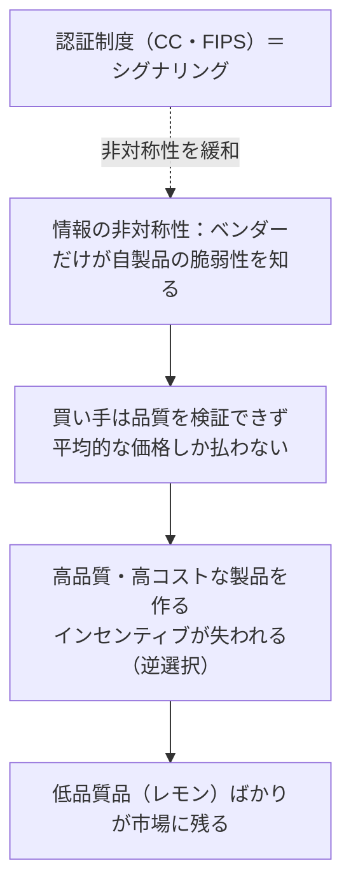

# 03. 認証制度とセキュリティ経済学（Common Criteria・FIPS 140-3）

> 前: [02 運用管理・IAM・BCP/DR](./02_security-operations.md) ｜ 層: 基礎(Layer 1)

[02](./02_security-operations.md) までで「自組織の内側」のリスク対応を見た。最後に、
「そのセキュリティ品質を**外部にどう証明するか**」（認証制度）と、そもそも
「なぜ市場は放っておくとセキュリティ品質を過小評価してしまうのか」（セキュリティ経済学）
という、マネジメント・ガバナンス領域らしい2つの問いを扱う。

**この1ページで分かること**

- Common Criteria（PP/ST/EAL）と FIPS 140-3 のスコープの違い
- 「EALが高い＝安全」ではない理由
- 認証制度が必要になる経済学的な理由（レモン市場・歪んだインセンティブ）

---

## Common Criteria（ISO/IEC 15408）

ITセキュリティ製品の評価基準を国際標準化したもので、正式には **ISO/IEC 15408**。
複数国の認証当局が相互承認するCommon Criteria Recognition Arrangement（CCRA）の
枠組みの下で運用される。評価は3つの要素で構成される:

```
PP（Protection Profile）:  ある製品カテゴリ（例: ファイアウォール）に対する
                            共通のセキュリティ要求仕様
ST（Security Target）:     評価対象となる特定製品が主張するセキュリティ要求仕様
EAL（Evaluation Assurance Level）: 評価の厳密さ・深さを表す7段階の等級
```

### EAL1〜EAL7：評価の「深さ」であって「安全さ」ではない

```
EAL1: 機能テストのみ。設計文書は不要（低リスク環境向け）
EAL2: 基本的な設計文書・ソースコードレビュー・構成管理の証跡を要求
EAL3: 準詳細設計文書・独立テスト・開発プロセスの体系的管理の証跡
EAL4: 一般商用製品で現実的な最高水準（多くの商用OS・ファイアウォールがここまで）
EAL5〜7: 準形式的〜形式的検証を要求。国家安全保障用途等、極めて高リスクな環境向け
```

**重要な誤解**: EALが高い＝製品がより「安全」という意味ではない。EALは
「そのセキュリティ主張がどれだけ厳密に検証されたか」の指標であり、主張の内容自体
（PP/STで何を守ると宣言しているか）が緩ければ、高EALでも実用上の安全性は低いままありうる。
TPM（＝鍵の保管等を担う耐タンパ性のセキュリティチップ）のような部品（[`../04_hardware-security/03_security-building-blocks.md`](../04_hardware-security/03_security-building-blocks.md)）
はCommon Criteria認証を受けることが多く、認証取得済みTPMを選ぶことが調達時の
デューデリジェンスの一部になる。

---

## FIPS 140-3：暗号モジュールの認証

米国NISTが定める暗号モジュール（ハードウェア/ソフトウェア/ファームウェア）のセキュリティ
要求規格。**FIPS 140-3**は2019年3月に承認・同年9月に発効し、旧規格
**FIPS 140-2**を置き換えている。ただし移行には長い重複期間が設けられた
（FIPS 140-2の検証申請受付は2021年9月終了、既存の検証済みモジュールは
2026年9月21日に一律「Historical」リストへ移動予定）。

```
セキュリティレベル1: 最低限。暗号アルゴリズムが正しく実装されていることのみ要求
セキュリティレベル2: 物理的な改ざん検知機構（シール等）とロールベース認証を要求
セキュリティレベル3: 改ざん検知に加え、改ざん試行時に鍵を消去する等の応答機構を要求
セキュリティレベル4: 環境要因（電圧・温度異常）への耐性まで含む、最高水準
```

| | Common Criteria (ISO/IEC 15408) | FIPS 140-3 |
|---|---|---|
| 評価対象 | 製品全体のセキュリティ機能（幅広い） | 暗号モジュールに限定 |
| 等級 | EAL1〜7（評価の深さ） | セキュリティレベル1〜4 |
| 枠組み | CCRAによる国際相互承認 | 米国NISTの規格 |

政府調達要件としてどちらか一方、あるいは両方が要求されることが多い。

---

## セキュリティ経済学：なぜ「良い」製品が市場に出回らないか

ここまでの認証制度は「品質を第三者に証明する仕組み」だったが、そもそも
**なぜそのような仕組みが必要になるのか**を経済学の言葉で説明できる。

### Akerlofのレモン市場（情報の非対称性）

George Akerlof は1970年の論文 "The Market for 'Lemons'" で、売り手が買い手より
商品の品質を多く知っている市場（情報の非対称性）では、買い手が品質を判別できないため
平均的な価格しか払おうとせず、結果として**質の良い売り手が市場から撤退し、
低品質品（レモン）ばかりが残る**逆選択（adverse selection）が起きることを示した。

```
セキュリティ製品市場への適用:
  ベンダーは自社製品の脆弱性を買い手より多く知っている（情報の非対称性）
  買い手はセキュリティ品質を購入前に検証できない
  → 高品質・高コストな製品を作るインセンティブが働きにくい
  → 認証制度（Common Criteria・FIPS）は、この非対称性を埋める「シグナリング」手段
```



### コモンズの悲劇：他人が攻撃されるコストは自分が払わない

レモン市場は「買い手が品質を見分けられない」問題だが、それとは別に、
**安全でない機器の被害が所有者以外に及ぶ**という外部性がある。
乗っ取られた機器が第三者への攻撃に使われても、所有者自身は困らない。
自分が払わないコストのために追加費用を出す動機は働かず、共有資源が劣化する（コモンズの悲劇）。

この2つの失敗——**情報の非対称性**と**外部性**——のうち、認証制度が扱えるのは前者だけである。
後者には**製品への義務づけという規制的介入**が要る。EUのCyber Resilience Actが
その方向の立法にあたる（詳細は [`../07_legal/03_regulatory-tsunami.md`](../07_legal/03_regulatory-tsunami.md)）。

### Ross Andersonのセキュリティ経済学

Ross Anderson は2001年の論文 "Why Information Security Is Hard—An Economic Perspective"
（ACSAC 2001）で、多くのセキュリティ問題の根本原因は技術的欠陥ではなく
**歪んだインセンティブ**（誰が被害を受け、誰が対策コストを負担するかの不一致、
ネットワーク外部性＝利用者が増えるほど価値が増す性質、モラルハザード＝リスクを負わない側が注意を怠る現象、等）にあると論じ、Akerlofの枠組みを情報セキュリティに
応用した。続く Anderson & Moore の "The Economics of Information Security"（Science誌,
2006年, 314巻, 610-613頁）はこの分野を体系立ったサーベイとしてまとめ、
「セキュリティ経済学（Security Economics）」という研究領域を確立させた。

```
インセンティブの歪みの典型例:
  対策を実施するのは組織Aだが、被害を受けるのは組織Aのユーザ（責任の分離）
  ソフトウェアベンダーは「最初に市場に出す」インセンティブが「安全に作る」より強い
  → 技術的に解決不能ではなく、経済的なインセンティブ設計の失敗として捉え直せる
```

この視点は、[01](./01_risk-management.md)で見たリスク管理フレームワークや、
本ファイルの認証制度が「なぜ組織の外側からの検証・規制が必要とされるか」の
理論的な裏付けを与える——技術だけでは市場の失敗（情報の非対称性）を解決できない、
という点で[`../03_privacy/06_law-and-dpia.md`](../03_privacy/06_law-and-dpia.md)で見た
「技術だけでは不十分」という教訓とも通じる。

なお、この分野で流通する「サイバー犯罪の年間被害額」の推計は調査手法の偏りで桁が大きく振れる。
数値の検算の仕方は [`../00_overview/04_threat-landscape.md`](../00_overview/04_threat-landscape.md)
の「損害額の桁を検算する」に置いた。

---

## 演習（解答つき）

1. EALが高い製品ほど「安全」と考えるのが誤解である理由を述べよ。
2. Akerlofのレモン市場理論をセキュリティ製品市場に当てはめて、認証制度が果たす役割を説明せよ。
3. Ross Andersonがセキュリティ問題の根本原因として指摘したものは何か。

<details><summary>解答</summary>

1. EALは「セキュリティ主張がどれだけ厳密に検証されたか」という**評価プロセスの深さ**を
   示す指標であり、その主張自体（PP/STの内容）が緩ければ、高EALでも実際の防御力は
   低いままでありうるため。EALの高さと製品の実用的な安全性は別軸。
2. 買い手は製品の実際のセキュリティ品質を購入前に検証できない（情報の非対称性）ため、
   平均的な価格しか支払う意思がなく、高品質・高コストな製品を作るインセンティブが
   失われ、低品質品が市場に残りやすくなる（逆選択）。認証制度は第三者による検証結果を
   買い手に開示することで、この非対称性を緩和する「シグナリング」の役割を果たす。
3. 技術的な欠陥そのものではなく、**歪んだインセンティブ**——対策コストを負担する主体と
   被害を受ける主体の不一致、ネットワーク外部性、モラルハザードなど——を根本原因として
   指摘した。

</details>

---

## 次への接続

これで `08_management-governance/` の基礎パート（リスク管理・運用・認証と経済学）が
一通り揃った。法制度の詳細は [`../07_legal/`](../07_legal/index.md)、
GDPR・DPIAの詳細は [`../03_privacy/06_law-and-dpia.md`](../03_privacy/06_law-and-dpia.md)
へ接続していく。「軽め」領域のため、深掘り（Layer 2）は
[`index.md`](./index.md) の深掘りキューに必要が生じた時点で追記する。

---

## 参考

- Common Criteria Portal 公式サイト: https://www.commoncriteriaportal.org/
- Evaluation Assurance Level（EAL概説）: https://en.wikipedia.org/wiki/Evaluation_Assurance_Level
- NIST, FIPS 140-3 Transition Effort: https://csrc.nist.gov/projects/fips-140-3-transition-effort
- SafeLogic, "What Happens on September 21, 2026?"（FIPS 140-2失効スケジュール）: https://www.safelogic.com/blog/what-happens-on-september-21-2026
- Akerlof, G. A. (1970). "The Market for 'Lemons': Quality Uncertainty and the Market Mechanism." Quarterly Journal of Economics, 84(3), 488-500.
- Anderson, R. (2001). "Why Information Security Is Hard—An Economic Perspective." ACSAC 2001: https://www.acsac.org/2001/papers/110.pdf
- Anderson, R. & Moore, T. (2006). "The Economics of Information Security." Science, 314(5799), 610-613. DOI: 10.1126/science.1130992
- Florêncio, D. & Herley, C. (2011). *Sex, Lies and Cyber-crime Surveys*. Microsoft Research MSR-TR-2011-75 / WEIS 2011（被害額調査に極端な回答が与えるバイアス）: https://www.microsoft.com/en-us/research/publication/sex-lies-and-cyber-crime-surveys/
