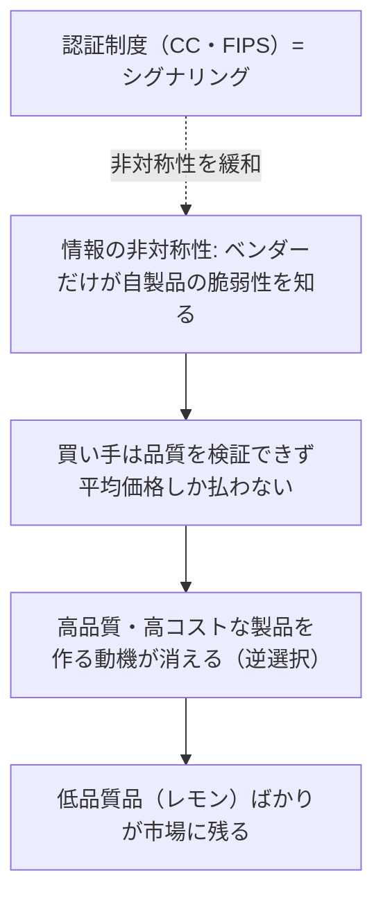

# 03. 認証制度とセキュリティ経済学（Common Criteria・FIPS 140-3）

> 前: [02 運用管理・IAM・BCP/DR](./02_security-operations.md) ｜ 層: 基礎(Layer 1)

**この1ページで分かること**

- Common Criteria（PP/ST/EAL）と FIPS 140-3 のスコープの違い
- 「EAL が高い＝安全」ではない理由
- 認証制度が必要になる経済学的な理由（レモン市場・外部性・歪んだインセンティブ）

自組織のセキュリティ品質を**外部にどう証明するか**（認証制度）と、**なぜ市場は放っておくと品質を過小評価するか**（セキュリティ経済学）。

## 最小の例：1 社が ISO 27001 を取る

```
費用: 審査料 + 文書整備 + 担当者の工数 ≈ 数百万円 / 年
便益: 「セキュリティ品質を証明できない」せいで失っていた取引が取れる
      → 買い手は中身を検査できないので、第三者の印を「品質の代わり」に使う
```

買い手が品質を見分けられない市場では、印がなければ**良い製品も安い製品と同じ値段**にしかならない。この 1 行が本ページの経済学の核心。

---

## Common Criteria（ISO/IEC 15408）

IT セキュリティ製品の評価基準の国際標準。複数国の認証当局が相互承認する CCRA（Common Criteria Recognition Arrangement）の下で運用。

| 要素 | 意味 |
|---|---|
| PP（Protection Profile） | 製品カテゴリ（例: ファイアウォール）共通のセキュリティ要求仕様 |
| ST（Security Target） | 評価対象の特定製品が主張する要求仕様 |
| EAL（Evaluation Assurance Level） | 評価の厳密さ・深さの 7 段階 |

### EAL1〜7：評価の「深さ」であって「安全さ」ではない

| EAL | 要求 | 用途 |
|---|---|---|
| 1 | 機能テストのみ。設計文書不要 | 低リスク環境 |
| 2 | 基本設計文書・ソースコードレビュー・構成管理の証跡 | |
| 3 | 準詳細設計・独立テスト・開発プロセスの体系的管理 | |
| 4 | 商用製品で現実的な最高水準 | 多くの商用 OS・ファイアウォール |
| 5〜7 | 準形式的〜形式的検証（数学的に正しさを示す） | 国家安全保障用途 |

**誤解**: EAL が高い＝安全、ではない。EAL は「主張がどれだけ厳密に検証されたか」。主張の内容（PP/ST で何を守ると宣言したか）が緩ければ、高 EAL でも実用上の安全性は低いままありうる。TPM（鍵の保管を担う耐タンパ＝分解や改ざんに抵抗するチップ）は CC 認証を受けることが多く、認証済み TPM の選択が調達時のデューデリジェンス（事前確認）になる（→ [`../04_hardware-security/03_security-building-blocks.md`](../04_hardware-security/03_security-building-blocks.md)）。

---

## FIPS 140-3：暗号モジュールの認証

NIST が定める暗号モジュール（ハード / ソフト / ファームウェア）の要求規格。2019 年 3 月承認・9 月発効で **FIPS 140-2** を置き換え。移行期間は長い（140-2 の検証申請受付は 2021 年 9 月終了、既存の検証済みモジュールは 2026 年 9 月 21 日に「Historical」へ）。

| レベル | 要求 |
|---|---|
| 1 | 暗号アルゴリズムが正しく実装されている |
| 2 | 物理的な改ざん検知（シール等）とロールベース認証 |
| 3 | 改ざん試行時に鍵を消去する等の応答機構 |
| 4 | 電圧・温度異常など環境要因への耐性まで |

| | Common Criteria (ISO/IEC 15408) | FIPS 140-3 |
|---|---|---|
| 評価対象 | 製品全体のセキュリティ機能 | 暗号モジュールに限定 |
| 等級 | EAL1〜7（評価の深さ） | レベル 1〜4 |
| 枠組み | CCRA による国際相互承認 | 米国 NIST の規格 |

政府調達ではどちらか、または両方が要求されることが多い。

---

## セキュリティ経済学：なぜ「良い」製品が市場に出回らないか

### Akerlof のレモン市場（情報の非対称性）

Akerlof (1970) "The Market for 'Lemons'": 売り手が買い手より品質を知っている市場では、買い手は平均的な価格しか払わず、**質の良い売り手が撤退し低品質品（レモン）ばかり残る**。これが**逆選択** (adverse selection)。



認証制度は第三者の検証結果を買い手に見せる「**シグナリング**」（品質を外から見える形にする手段）。

### コモンズの悲劇：他人が攻撃されるコストは自分が払わない

安全でない機器の被害は所有者以外にも及ぶ（**外部性**）。乗っ取られた機器が第三者への攻撃に使われても所有者は困らないので、追加費用を出す動機がない。

| 市場の失敗 | 中身 | 効く手段 |
|---|---|---|
| 情報の非対称性 | 買い手が品質を見分けられない | 認証制度 |
| 外部性 | 被害が所有者以外に出る | 製品への義務づけ＝規制（EU Cyber Resilience Act → [`../07_legal/03_regulatory-tsunami.md`](../07_legal/03_regulatory-tsunami.md)） |

### Ross Anderson のセキュリティ経済学

Anderson (2001) "Why Information Security Is Hard—An Economic Perspective": 多くの問題の根本原因は技術的欠陥ではなく**歪んだインセンティブ**。Anderson & Moore (2006, Science) がサーベイとして体系化し「セキュリティ経済学」が確立した。

| 歪みの型 | 例 |
|---|---|
| 責任の分離 | 対策するのは組織 A、被害を受けるのは A のユーザ |
| 市場投入の圧力 | 「最初に出す」動機が「安全に作る」より強い |
| ネットワーク外部性 | 利用者が増えるほど価値が増すので、先行者が固定化する |
| モラルハザード | リスクを負わない側が注意を怠る |

技術だけでは市場の失敗を解決できない。これは [01](./01_risk-management.md) の枠組みや本ページの認証制度が「なぜ外側からの検証・規制を要するか」の理論的裏付けで、[`../03_privacy/06_law-and-dpia.md`](../03_privacy/06_law-and-dpia.md) の「技術だけでは不十分」とも通じる。流通する被害額の桁の検算は [`../00_overview/04_threat-landscape.md`](../00_overview/04_threat-landscape.md)。

---

## 演習（解答つき）

1. EAL が高い製品ほど「安全」と考えるのが誤解である理由を述べよ。
2. Akerlof のレモン市場理論をセキュリティ製品市場に当てはめて、認証制度が果たす役割を説明せよ。
3. Ross Anderson がセキュリティ問題の根本原因として指摘したものは何か。

<details><summary>解答</summary>

1. EAL は「主張がどれだけ厳密に検証されたか」という**評価プロセスの深さ**の指標。主張自体（PP/ST）が緩ければ高 EAL でも防御力は低いままありうる。EAL と実用的な安全性は別軸。
2. 買い手は購入前に品質を検証できない（情報の非対称性）ので平均価格しか払わず、高品質品を作る動機が失われて低品質品が残る（逆選択）。認証制度は第三者の検証結果を開示してこの非対称性を緩和する「シグナリング」。
3. 技術的欠陥ではなく**歪んだインセンティブ**——対策コストを負担する主体と被害を受ける主体の不一致、ネットワーク外部性、モラルハザード。

</details>

---

## 次への接続

`08_management-governance/` の基礎パート（リスク管理・運用・認証と経済学）はここまで。法制度は [`../07_legal/`](../07_legal/index.md)、GDPR・DPIA は [`../03_privacy/06_law-and-dpia.md`](../03_privacy/06_law-and-dpia.md) へ。深掘り（Layer 2）は [`index.md`](./index.md) のキューに必要が生じた時点で追記する。

---

## 参考

- Common Criteria Portal: https://www.commoncriteriaportal.org/
- Evaluation Assurance Level: https://en.wikipedia.org/wiki/Evaluation_Assurance_Level
- NIST, FIPS 140-3 Transition Effort: https://csrc.nist.gov/projects/fips-140-3-transition-effort
- SafeLogic, "What Happens on September 21, 2026?": https://www.safelogic.com/blog/what-happens-on-september-21-2026
- Akerlof, G. A. (1970). "The Market for 'Lemons'." Quarterly Journal of Economics, 84(3), 488-500.
- Anderson, R. (2001). "Why Information Security Is Hard—An Economic Perspective." ACSAC 2001: https://www.acsac.org/2001/papers/110.pdf
- Anderson, R. & Moore, T. (2006). "The Economics of Information Security." Science, 314(5799), 610-613. DOI: 10.1126/science.1130992
- Florêncio, D. & Herley, C. (2011). *Sex, Lies and Cyber-crime Surveys*. MSR-TR-2011-75 / WEIS 2011: https://www.microsoft.com/en-us/research/publication/sex-lies-and-cyber-crime-surveys/
